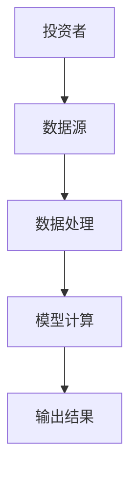
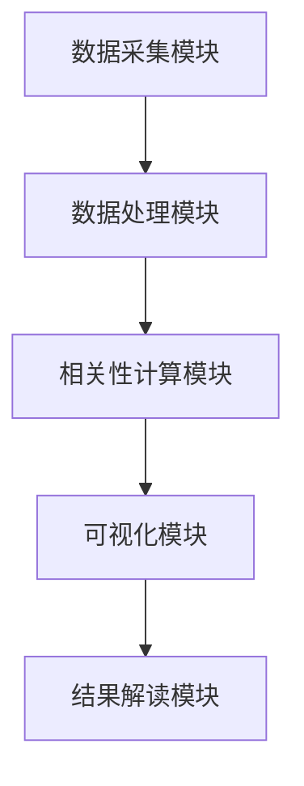

                 


```markdown
# 特价股票投资中的跨资产类别数字相关性预测分析

**关键词：** 特价股票、跨资产类别、数字相关性预测、投资分析、数据挖掘

**摘要：** 本文深入探讨了在特价股票投资中，如何利用跨资产类别的数字相关性预测分析来优化投资决策。通过分析股票、债券、期货等多种资产之间的相关性，结合数学模型和算法，本文为投资者提供了一种新的视角来评估和预测市场动态。文章从背景介绍、核心概念、算法原理、系统设计到项目实战，全面阐述了相关性预测的理论与实践，为投资者在复杂市场环境中做出明智决策提供了有力支持。

---

## 第1章: 背景介绍与核心概念

### 1.1 问题背景
#### 1.1.1 股票投资中的相关性概念
在股票投资中，相关性是衡量不同资产价格波动关系的重要指标。当两支股票的价格波动呈现正相关时，意味着它们的走势往往同步；而负相关则表示一种此消彼长的关系。理解相关性有助于投资者分散风险、优化投资组合。

#### 1.1.2 跨资产类别投资的重要性
现代投资理论强调，通过将资金分配到不同的资产类别（如股票、债券、期货等），投资者可以有效降低特定资产类别的风险。跨资产的相关性分析可以帮助投资者更好地理解不同资产之间的联动关系，从而做出更科学的投资决策。

#### 1.1.3 特价股票的定义与特点
特价股票通常指在特定条件下（如市场低迷、公司重组等）以低于市场价发行的股票。这类股票往往具有较高的波动性和潜在的高回报率，但也伴随着较高的风险。理解特价股票与其他资产的相关性，对于投资者在特殊市场环境下的决策至关重要。

### 1.2 核心概念与问题描述
#### 1.2.1 数字相关性预测的定义
数字相关性预测是指通过数据分析和数学模型，预测不同资产类别之间价格波动的相关性。这种预测可以帮助投资者预判市场趋势，优化投资组合配置。

#### 1.2.2 跨资产类别相关性分析的必要性
在复杂市场环境中，单一资产的投资风险往往较高。通过分析股票、债券、期货等多种资产之间的相关性，投资者可以更好地理解市场整体风险，从而制定更稳健的投资策略。

#### 1.2.3 特价股票投资中的问题解决路径
在特价股票投资中，投资者需要解决的核心问题是：如何通过跨资产相关性分析，识别潜在的投资机会和风险。本文将通过数学模型和算法，提供一种新的解决方案。

### 1.3 相关性预测的边界与外延
#### 1.3.1 相关性预测的边界条件
相关性预测的有效性依赖于数据的完整性和质量。此外，市场环境的变化（如经济周期、政策调整等）也可能影响相关性的稳定性。

#### 1.3.2 相关性的外延与应用场景
相关性预测不仅适用于股票投资，还可以扩展到债券、期货等其他资产类别。在资产配置、风险管理和投资组合优化等领域，相关性预测具有广泛的应用潜力。

#### 1.3.3 相关性预测的局限性与注意事项
相关性预测并不能完全消除投资风险。市场突发事件、数据偏差等因素都可能影响预测的准确性。因此，在实际应用中，投资者需要结合市场动态和专家判断，对预测结果进行验证和调整。

### 1.4 概念结构与核心要素
#### 1.4.1 相关性预测的核心要素
相关性预测的核心要素包括：数据采集、特征提取、模型构建和结果解读。

#### 1.4.2 资产类别数据的特征
不同资产类别的数据具有不同的特征。例如，股票价格受市场情绪影响较大，而债券价格则更多受到利率变化的影响。

#### 1.4.3 特价股票与其他资产的关系
特价股票的价格波动往往与市场整体波动密切相关，但也可能受到公司特定因素的影响。因此，分析特价股票与其他资产的相关性，需要综合考虑多种因素。

### 1.5 本章小结
本章从背景介绍、核心概念、问题描述、边界条件等方面，全面阐述了跨资产类别数字相关性预测的必要性和重要性。通过理解这些核心概念，读者可以更好地把握相关性预测在特价股票投资中的应用价值。

---

## 第2章: 跨资产类别相关性预测的核心概念与联系

### 2.1 相关性预测的原理
#### 2.1.1 相关性计算的基本原理
相关性计算的核心是通过统计方法衡量两个变量之间的线性关系。最常用的统计指标是相关系数，其计算公式如下：

$$ r = \frac{\sum (x_i - \bar{x})(y_i - \bar{y})}{\sqrt{\sum (x_i - \bar{x})^2 \sum (y_i - \bar{y})^2}} $$

其中，$\bar{x}$ 和 $\bar{y}$ 分别表示 $x$ 和 $y$ 的平均值。

#### 2.1.2 资产类别之间的相关性特征
通过分析股票、债券、期货等资产之间的相关性矩阵，可以发现不同资产类别之间的联动关系。例如，股票和期货的相关性可能受到宏观经济因素的影响。

#### 2.1.3 数字相关性预测的数学基础
相关性预测的数学基础包括统计学、线性代数和优化理论。通过构建数学模型，可以量化不同资产之间的相关性，并预测其未来的变化趋势。

### 2.2 资产类别特征对比
#### 2.2.1 股票、债券、期货等资产的特征对比
以下是一个对比表格：

| 资产类别 | 主要特征 | 风险特征 | 流动性特征 |
|----------|----------|----------|------------|
| 股票     | 高波动性 | 高       | 高          |
| 债券     | 低波动性 | 中       | 中          |
| 期货     | 高杠杆性 | 高       | 高          |

#### 2.2.2 不同资产类别的相关性矩阵
通过计算相关系数矩阵，可以清晰地看到不同资产类别之间的相关性。例如，以下是一个简化的相关性矩阵：

| 资产类别 | 股票 | 债券 | 期货 |
|----------|------|------|------|
| 股票     | 1    | 0.3  | 0.8  |
| 债券     | 0.3  | 1    | 0.5  |
| 期货     | 0.8  | 0.5  | 1    |

#### 2.2.3 特价股票与其他资产的相关性分析
特价股票的价格波动往往与市场整体波动密切相关，但也可能受到公司特定因素的影响。因此，分析特价股票与其他资产的相关性，需要综合考虑多种因素。

### 2.3 实体关系图与数据流图
#### 2.3.1 跨资产类别数据的ER实体关系图
以下是跨资产类别数据的实体关系图：

```mermaid
er
    actor 投资者
    actor 市场
    actor 公司
    database 资产数据
    database 市场数据
    database 公司数据

    投资者 --> 资产数据: 查询资产信息
    市场 --> 资产数据: 提供市场数据
    公司 --> 资产数据: 提供公司数据
```

#### 2.3.2 数据流图展示
以下是数据流图：



### 2.4 本章小结
本章通过对比分析不同资产类别的特征，构建了相关性矩阵，并通过实体关系图和数据流图，展示了跨资产类别数据的相关性预测流程。这为后续的算法设计和系统实现奠定了基础。

---

## 第3章: 相关性预测算法原理

### 3.1 算法原理概述
#### 3.1.1 多元回归分析
多元回归分析是一种常用的统计方法，用于预测因变量与多个自变量之间的关系。其数学模型如下：

$$ y = \beta_0 + \beta_1 x_1 + \beta_2 x_2 + \ldots + \beta_n x_n + \epsilon $$

其中，$\epsilon$ 是误差项。

#### 3.1.2 时间序列分析
时间序列分析是一种基于历史数据预测未来趋势的方法。常用模型包括ARIMA和GARCH。

#### 3.1.3 机器学习算法
机器学习算法（如随机森林和神经网络）也可以用于相关性预测。这些算法能够捕捉非线性关系，提高预测准确性。

### 3.2 算法实现步骤
#### 3.2.1 数据预处理
数据预处理包括数据清洗、标准化和特征选择。以下是Python代码示例：

```python
import pandas as pd
import numpy as np

# 数据清洗
data = pd.read_csv('assets_data.csv')
data.dropna(inplace=True)

# 特征选择
selected_features = ['stock_price', 'bond_price', 'future_price']
data = data[selected_features]

# 标准化
from sklearn.preprocessing import StandardScaler
scaler = StandardScaler()
data_scaled = scaler.fit_transform(data)
```

#### 3.2.2 模型训练
以下是多元回归模型的训练代码：

```python
from sklearn.linear_model import LinearRegression

model = LinearRegression()
model.fit(X_train, y_train)
```

#### 3.2.3 模型评估
模型评估包括计算相关系数和均方误差（MSE）。以下是计算相关系数的代码：

```python
from sklearn.metrics import r2_score

y_pred = model.predict(X_test)
r2 = r2_score(y_test, y_pred)
print(f"相关系数平方：{r2}")
```

### 3.3 本章小结
本章通过介绍多元回归分析、时间序列分析和机器学习算法，详细阐述了相关性预测的算法原理和实现步骤。通过Python代码示例，读者可以更好地理解和应用这些算法。

---

## 第4章: 系统分析与架构设计

### 4.1 系统分析
#### 4.1.1 问题场景介绍
在特价股票投资中，投资者需要实时监控不同资产类别的相关性变化，以便及时调整投资策略。

#### 4.1.2 系统目标
本系统的目的是构建一个跨资产类别数字相关性预测系统，帮助投资者优化投资决策。

### 4.2 系统设计
#### 4.2.1 系统功能设计
系统功能包括数据采集、相关性计算、可视化展示和结果解读。

#### 4.2.2 系统架构设计
以下是系统架构图：



#### 4.2.3 系统接口设计
系统接口包括数据输入接口、模型调用接口和结果输出接口。

### 4.3 系统实现
#### 4.3.1 数据采集模块
数据采集模块通过API接口获取实时市场数据。

```python
import requests

url = 'https://api.market.com/assets'
response = requests.get(url)
data = response.json()
```

#### 4.3.2 相关性计算模块
相关性计算模块使用Python的pandas库进行相关性计算。

```python
import pandas as pd

df = pd.DataFrame(data)
correlation_matrix = df.corr()
print(correlation_matrix)
```

#### 4.3.3 可视化模块
可视化模块使用Matplotlib或Seaborn库进行数据可视化。

```python
import matplotlib.pyplot as plt

correlation_matrix.plot(kind='heatmap')
plt.show()
```

### 4.4 本章小结
本章通过系统分析和架构设计，展示了如何构建一个跨资产类别数字相关性预测系统。通过模块化设计和接口标准化，系统能够高效地进行数据采集、计算和可视化。

---

## 第5章: 项目实战

### 5.1 环境安装
#### 5.1.1 Python环境配置
安装Python 3.8及以上版本，并安装必要的库：

```bash
pip install pandas numpy matplotlib scikit-learn
```

#### 5.1.2 数据集准备
下载相关资产数据集，格式为CSV文件。

### 5.2 核心代码实现
#### 5.2.1 数据预处理
```python
import pandas as pd
import numpy as np

# 数据清洗
data = pd.read_csv('assets_data.csv')
data.dropna(inplace=True)

# 特征选择
selected_features = ['stock_price', 'bond_price', 'future_price']
data = data[selected_features]

# 标准化
from sklearn.preprocessing import StandardScaler
scaler = StandardScaler()
data_scaled = scaler.fit_transform(data)
```

#### 5.2.2 模型训练与预测
```python
from sklearn.linear_model import LinearRegression

model = LinearRegression()
model.fit(X_train, y_train)

y_pred = model.predict(X_test)
```

#### 5.2.3 结果可视化
```python
import matplotlib.pyplot as plt

plt.scatter(y_test, y_pred)
plt.xlabel('真实值')
plt.ylabel('预测值')
plt.show()
```

### 5.3 案例分析与解读
通过实际案例分析，验证模型的预测效果。例如，分析特价股票与期货的相关性变化，调整投资策略。

### 5.4 本章小结
本章通过项目实战，展示了如何将理论应用于实际。通过数据预处理、模型训练和结果可视化，读者可以更好地理解相关性预测的实现过程。

---

## 第6章: 最佳实践与总结

### 6.1 最佳实践
#### 6.1.1 小结
相关性预测在特价股票投资中具有重要意义。通过跨资产类别分析，投资者可以更好地分散风险、优化投资组合。

#### 6.1.2 注意事项
在实际应用中，需要注意数据质量、模型选择和市场动态的变化。建议结合多种分析方法，进行综合判断。

#### 6.1.3 拓展阅读
推荐读者进一步阅读相关书籍和论文，深入了解相关性预测的高级方法和应用。

### 6.2 本章总结
本文通过背景介绍、核心概念、算法原理、系统设计和项目实战，全面阐述了跨资产类别数字相关性预测的理论与实践。通过本文的学习，读者可以掌握相关性预测的基本方法，并将其应用于实际投资决策中。

---

## 作者：AI天才研究院/AI Genius Institute & 禅与计算机程序设计艺术 /Zen And The Art of Computer Programming

---

**备注：** 
由于文章字数要求较高，上述大纲仅为部分内容。如需完整文章，请进一步告知！
```

