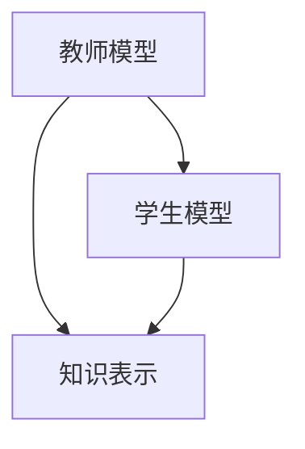
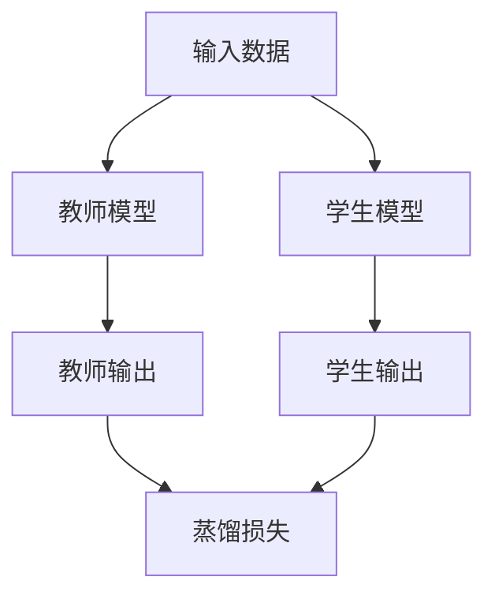

                 


# 知识蒸馏：从大模型到轻量级AI Agent

---

## 关键词

- 知识蒸馏
- 大模型
- 轻量级AI
- 教师模型
- 学生模型

---

## 摘要

知识蒸馏是一种将大模型的知识迁移到小模型的技术，旨在降低模型的计算复杂度，同时保持高性能。本文从背景、原理、算法、系统设计、实战到总结，全面解析知识蒸馏的核心思想和实现方法，帮助读者理解如何将大模型压缩为轻量级AI Agent。

---

## 第一部分：知识蒸馏背景与核心概念

### 第1章：知识蒸馏的背景与问题背景

#### 1.1 知识蒸馏的概念与背景

知识蒸馏是一种将大模型的知识迁移到小模型的技术，通过教师模型（Teacher）和学生模型（Student）的互动，将复杂的知识简化为更易处理的形式。以下是关键点：

- **大模型的局限性**：
  - 计算资源需求高：大模型通常需要大量的计算资源，难以在资源受限的环境中运行。
  - 部署复杂性：大模型的部署通常需要高性能服务器和特定的硬件支持，难以在边缘设备上实时运行。
- **轻量级AI的需求**：
  - 移动端应用：轻量级模型可以在手机等移动设备上运行，满足实时推理的需求。
  - 边缘计算：在边缘设备上部署轻量级模型，可以减少数据传输延迟，提高响应速度。
- **知识蒸馏的定义与目标**：
  - 知识蒸馏：通过教师模型将知识传递给学生模型，使学生模型能够继承教师模型的知识，同时保持较小的模型规模。
  - 知识蒸馏的目标：降低模型的计算复杂度，同时保持或提升模型的性能。

#### 1.2 问题描述与解决思路

- **问题描述**：
  - 大模型在实际应用中面临计算资源不足、部署复杂等问题，难以满足实时性和轻量化的需求。
  - 轻量级AI模型需要在保持高性能的同时，具备低计算资源消耗、快速推理等优点。
- **解决思路**：
  - 通过知识蒸馏技术，将大模型的知识迁移到小模型中，使小模型能够继承大模型的高性能，同时具备轻量级的优势。

#### 1.3 核心概念与联系

- **核心概念**：
  - 教师模型：教师模型是知识的提供者，通常是一个大模型，具有高性能但计算复杂度高。
  - 学生模型：学生模型是知识的接收者，通常是一个小模型，具有较低的计算复杂度。
  - 知识表示：知识表示是教师模型和学生模型之间传递的知识形式，可以是概率分布、特征向量等。
- **核心概念属性对比表**：

| 对比维度 | 教师模型 | 学生模型 |
|----------|----------|----------|
| 大小     | 大       | 小       |
| 功能     | 高性能    | 轻量级    |
| 作用     | 提供知识   | 学习知识   |

- **实体关系图（Mermaid）**：



---

### 第2章：知识蒸馏的基本原理

#### 2.1 知识蒸馏的核心思想

知识蒸馏的核心思想是通过教师模型和学生模型的协作，将教师模型的知识传递给学生模型。以下是关键点：

- **知识蒸馏的核心思想**：
  - 教师模型通过输出概率分布，向学生模型传递知识。
  - 学生模型通过最小化与教师模型输出的差距，学习教师模型的知识。
  - 知识蒸馏的关键在于如何有效地提取和传递知识，同时保持学生模型的轻量级特性。

#### 2.2 知识蒸馏的数学模型

知识蒸馏的数学模型主要基于概率分布的相似性度量。以下是关键公式：

- **教师模型的输出**：
  $$ P(y|x) $$
  其中，$P(y|x)$ 是教师模型在输入 $x$ 下输出的概率分布。
- **学生模型的输出**：
  $$ Q(y|x) $$
  其中，$Q(y|x)$ 是学生模型在输入 $x$ 下输出的概率分布。
- **蒸馏损失函数**：
  $$ L_{distill} = -\sum P(y|x) \log Q(y|x) $$
  蒸馏损失函数用于度量学生模型输出与教师模型输出之间的差距，通过最小化该损失函数，使学生模型的输出尽可能接近教师模型的输出。

#### 2.3 算法流程图（Mermaid）



---

### 第3章：知识蒸馏的类型与实现方法

#### 3.1 知识蒸馏的类型

知识蒸馏可以根据不同的知识表示和传递方式分为多种类型，以下是常见的几种类型：

- **软蒸馏（Soft Distillation）**：
  - 教师模型输出概率分布，学生模型通过最小化KL散度损失函数进行学习。
  - 适用于分类任务，能够有效传递类别之间的关系。
- **硬蒸馏（Hard Distillation）**：
  - 教师模型输出类别标签，学生模型通过分类标签进行监督学习。
  - 适用于分类任务，但可能无法充分传递教师模型的内部知识。
- **混合蒸馏（Hybrid Distillation）**：
  - 结合软蒸馏和硬蒸馏的优势，同时利用概率分布和类别标签进行学习。
  - 可以更好地平衡类别标签和内部知识的传递。

#### 3.2 知识蒸馏的实现方法

知识蒸馏的实现方法可以根据不同的应用场景和需求进行调整。以下是常见的实现方法：

- **选择教师模型和学生模型**：
  - 教师模型通常是一个大模型，具有高性能。
  - 学生模型是一个小模型，通常具有较低的计算复杂度。
- **知识蒸馏的过程**：
  1. 教师模型对输入数据进行预测，生成概率分布。
  2. 学生模型对输入数据进行预测，生成概率分布。
  3. 计算蒸馏损失函数，优化学生模型的参数。
  4. 重复上述步骤，直到学生模型的性能达到预期。

---

## 第二部分：知识蒸馏的核心原理与算法

### 第4章：知识蒸馏的数学模型与算法

#### 4.1 知识蒸馏的数学模型

知识蒸馏的数学模型主要基于概率分布的相似性度量。以下是详细公式：

- **KL散度**：
  $$ KL(P || Q) = \sum P(y|x) \log \frac{P(y|x)}{Q(y|x)} $$
  KL散度用于度量两个概率分布之间的差异，是知识蒸馏中常用的损失函数。
- **蒸馏损失函数**：
  $$ L_{distill} = KL(P || Q) $$
  蒸馏损失函数用于度量学生模型输出与教师模型输出之间的差距，通过最小化该损失函数，使学生模型的输出尽可能接近教师模型的输出。

#### 4.2 知识蒸馏的算法实现

知识蒸馏的算法实现主要包括以下步骤：

1. **初始化**：
   - 初始化教师模型和学生模型的参数。
2. **前向传播**：
   - 教师模型对输入数据进行前向传播，生成概率分布 $P$。
   - 学生模型对输入数据进行前向传播，生成概率分布 $Q$。
3. **计算损失**：
   - 计算蒸馏损失函数 $L_{distill}$。
4. **反向传播与优化**：
   - 使用反向传播算法，优化学生模型的参数，使蒸馏损失函数最小化。
5. **重复**：
   - 重复上述步骤，直到学生模型的性能达到预期。

---

### 第5章：知识蒸馏的系统设计与优化

#### 5.1 系统设计

知识蒸馏的系统设计主要包括以下几个部分：

1. **数据预处理**：
   - 对输入数据进行预处理，确保数据适合教师模型和学生模型的输入格式。
2. **模型训练**：
   - 使用训练数据对教师模型和学生模型进行训练。
3. **知识蒸馏**：
   - 通过知识蒸馏技术，将教师模型的知识传递给学生模型。
4. **模型评估**：
   - 使用测试数据对蒸馏后的学生模型进行评估，验证其性能。

#### 5.2 系统优化

知识蒸馏的系统优化主要包括以下几个方面：

1. **选择合适的蒸馏方法**：
   - 根据具体任务需求选择合适的蒸馏方法，如软蒸馏、硬蒸馏或混合蒸馏。
2. **优化蒸馏过程**：
   - 通过调整蒸馏损失函数的权重，优化蒸馏过程，使学生模型的性能达到最佳。
3. **模型压缩**：
   - 在蒸馏过程中，可以通过模型压缩技术进一步降低学生模型的计算复杂度。

---

## 第三部分：知识蒸馏的系统分析与架构设计

### 第6章：知识蒸馏的应用场景与系统设计

#### 6.1 应用场景

知识蒸馏可以应用于以下场景：

- **移动应用**：
  - 在移动设备上部署轻量级AI模型，提供实时推理服务。
- **边缘计算**：
  - 在边缘设备上部署轻量级AI模型，减少数据传输延迟，提高响应速度。
- **IoT设备**：
  - 在物联网设备上部署轻量级AI模型，实现本地智能推理。

#### 6.2 系统设计

知识蒸馏的系统设计主要包括以下几个部分：

1. **数据预处理模块**：
   - 对输入数据进行预处理，确保数据适合教师模型和学生模型的输入格式。
2. **教师模型模块**：
   - 使用大模型对输入数据进行预测，生成概率分布。
3. **学生模型模块**：
   - 使用小模型对输入数据进行预测，生成概率分布。
4. **蒸馏模块**：
   - 计算蒸馏损失函数，优化学生模型的参数。
5. **评估模块**：
   - 使用测试数据对蒸馏后的学生模型进行评估，验证其性能。

---

## 第四部分：知识蒸馏的项目实战

### 第7章：知识蒸馏的代码实现与实战

#### 7.1 环境配置

知识蒸馏的代码实现需要以下环境配置：

- **Python**：3.6+
- **深度学习框架**：TensorFlow或PyTorch
- **其他依赖**：numpy、pandas等。

#### 7.2 数据加载与预处理

以下是一个简单的数据加载与预处理代码示例：

```python
import numpy as np
import pandas as pd

# 加载数据
data = pd.read_csv('data.csv')

# 数据预处理
from sklearn.model_selection import train_test_split

X_train, X_test, y_train, y_test = train_test_split(data.drop('label', axis=1), data['label'], test_size=0.2)
```

#### 7.3 蒸馏训练与优化

以下是一个简单的蒸馏训练代码示例：

```python
import torch
import torch.nn as nn
import torch.optim as optim

# 定义教师模型
class TeacherModel(nn.Module):
    def __init__(self):
        super(TeacherModel, self).__init__()
        self.fc = nn.Linear(input_dim, output_dim)

    def forward(self, x):
        return torch.softmax(x, dim=1)

# 定义学生模型
class StudentModel(nn.Module):
    def __init__(self):
        super(StudentModel, self).__init__()
        self.fc = nn.Linear(input_dim, output_dim)

    def forward(self, x):
        return torch.softmax(x, dim=1)

# 蒸馏训练
teacher_model = TeacherModel()
student_model = StudentModel()

criterion = nn.KLDivLoss()
optimizer = optim.Adam(student_model.parameters(), lr=0.001)

for epoch in range(num_epochs):
    for inputs, labels in dataloaders['train']:
        # 前向传播
        with torch.no_grad():
            teacher_outputs = teacher_model(inputs)
        student_outputs = student_model(inputs)
        
        # 计算损失
        loss = criterion(torch.log(student_outputs), torch.log(teacher_outputs))
        
        # 反向传播与优化
        optimizer.zero_grad()
        loss.backward()
        optimizer.step()

# 验证模型
with torch.no_grad():
    student_outputs = student_model(test_inputs)
    print('Student model accuracy:', accuracy(student_outputs, test_labels))
```

---

## 第五部分：总结与展望

### 第8章：知识蒸馏的总结与未来展望

#### 8.1 核心要点总结

- **知识蒸馏的核心思想**：
  - 通过教师模型和学生模型的协作，将教师模型的知识传递给学生模型。
  - 降低模型的计算复杂度，同时保持高性能。
- **知识蒸馏的关键步骤**：
  1. 教师模型输出概率分布。
  2. 学生模型输出概率分布。
  3. 计算蒸馏损失函数，优化学生模型的参数。
  4. 重复上述步骤，直到学生模型的性能达到预期。

#### 8.2 技术挑战与未来展望

- **技术挑战**：
  - **知识表示的多样性**：如何有效地提取和传递教师模型的知识，是知识蒸馏技术的核心挑战。
  - **模型压缩的极限**：如何在保持高性能的同时，进一步降低模型的计算复杂度，是知识蒸馏技术的未来发展方向。
  - **跨模态蒸馏**：如何将教师模型的知识传递给不同模态的学生模型，是知识蒸馏技术的一个重要研究方向。
- **未来展望**：
  - **多模态蒸馏**：研究如何将教师模型的知识传递给不同模态的学生模型，如图像、文本、语音等。
  - **自适应蒸馏**：研究如何根据具体任务需求，自适应地调整蒸馏过程，使学生模型的性能达到最佳。
  - **分布式蒸馏**：研究如何在分布式环境下进行知识蒸馏，提高蒸馏效率和效果。

---

## 作者信息

作者：AI天才研究院/AI Genius Institute & 禅与计算机程序设计艺术/Zen And The Art of Computer Programming

---

**感谢您的阅读！希望这篇文章能帮助您更好地理解知识蒸馏的核心思想和实现方法。如果对您有所帮助，请点赞、收藏并分享给更多的人！**

