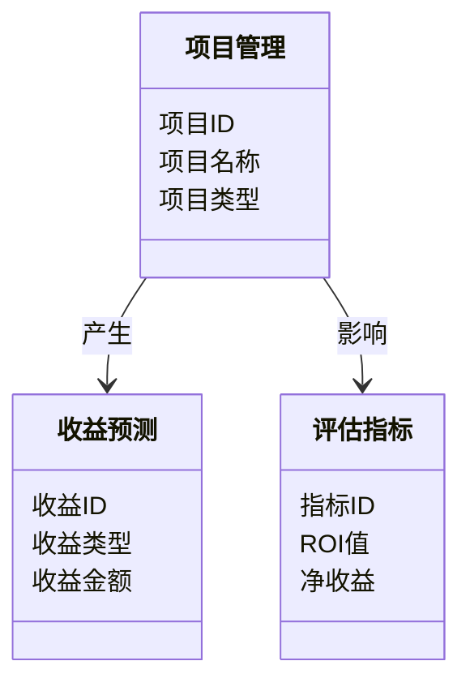
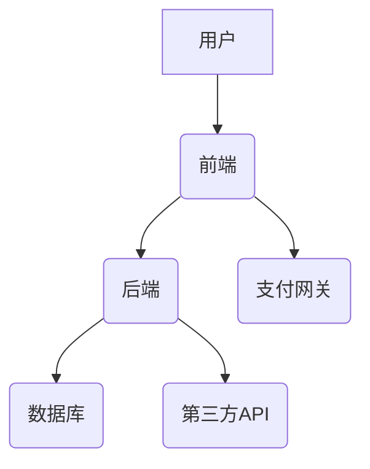

                 


# 《金融科技创新ROI评估框架》

> 关键词：金融科技创新、ROI评估、投资回报率、金融科技、技术应用、评估框架

> 摘要：本文系统地介绍了金融科技创新中的ROI（投资回报率）评估框架，从核心概念、算法原理、系统架构到项目实战，全面剖析了如何量化和评估金融科技创新项目的投资回报。通过详细分析和实例，本文为金融科技从业者提供了一套科学、实用的评估方法，帮助他们在实践中做出更明智的投资决策。

---

# 第一章：金融科技创新与ROI评估的背景与意义

## 1.1 金融科技创新的背景与现状

### 1.1.1 金融科技发展的历史脉络
金融科技（FinTech）是指通过技术手段优化或替代传统金融活动，提升效率、降低成本、改善用户体验。近年来，随着大数据、人工智能、区块链、云计算等技术的快速发展，金融科技在全球范围内迅速崛起，重塑了传统金融业态。从2010年代初开始，全球范围内掀起了金融科技革命，尤其是区块链技术的应用、支付方式的革新以及智能投顾的兴起，推动了金融行业的数字化转型。

### 1.1.2 当前金融科技创新的主要趋势
目前，金融科技创新主要呈现以下趋势：
1. **智能化**：利用人工智能技术，实现智能客服、智能投顾、智能风控等应用。
2. **区块链化**：区块链技术在支付、清算、供应链金融等领域的应用日益广泛。
3. **平台化**：金融平台化趋势明显，例如支付宝、微信支付等超级App的崛起。
4. **数据驱动化**：大数据技术在信用评估、精准营销、风险管理中的应用越来越深入。

### 1.1.3 金融科技对传统金融业态的颠覆性影响
金融科技的快速发展对传统金融机构造成了巨大冲击，主要体现在以下几个方面：
1. **支付方式的革新**：移动支付的普及使得传统POS机和银行卡支付逐渐边缘化。
2. **融资渠道的多样化**：P2P借贷、区块链金融等新兴融资方式改变了传统的银行信贷模式。
3. **投资方式的智能化**：智能投顾和量化投资颠覆了传统的人工投资顾问模式。
4. **风险管理的精准化**：通过大数据和AI技术，金融机构能够更精准地识别和控制风险。

---

## 1.2 ROI评估的核心概念与问题背景

### 1.2.1 ROI（投资回报率）的基本定义
投资回报率（ROI）是衡量投资项目收益与成本的重要指标，其计算公式为：
$$ ROI = \frac{\text{净收益}}{\text{投资成本}} \times 100\% $$

在金融科技创新领域，ROI评估需要考虑技术开发成本、市场推广成本、用户获取成本等多方面的投入，同时需要量化技术带来的收益，例如成本降低、收入增加、效率提升等。

### 1.2.2 金融科技创新中的ROI评估的独特性
金融科技创新项目的ROI评估具有以下独特性：
1. **技术门槛高**：金融科技创新通常涉及复杂的技术实现，需要考虑技术可行性与落地难度。
2. **风险不确定性大**：金融市场的波动性和政策的不确定性增加了ROI评估的难度。
3. **收益周期长**：许多金融科技创新项目需要较长时间才能实现规模效应和收益。

### 1.2.3 金融科技ROI评估的难点与挑战
1. **数据获取困难**：许多金融科技项目在初期阶段缺乏足够的历史数据支持评估。
2. **模型复杂性**：需要结合技术、市场、用户行为等多方面因素构建复杂的评估模型。
3. **政策与监管风险**：金融行业受到严格的监管，政策变化可能对项目收益产生重大影响。

---

## 1.3 本章小结

本章从金融科技创新的背景、现状及趋势入手，重点分析了金融科技对传统金融业态的颠覆性影响，并详细阐述了ROI评估在金融科技创新中的独特性及面临的挑战。这些内容为后续构建金融科技创新ROI评估框架奠定了基础。

---

# 第二章：金融科技创新与ROI评估的核心概念

## 2.1 金融科技创新的定义与分类

### 2.1.1 金融科技的定义
金融科技是指利用新技术（如大数据、人工智能、区块链等）优化或替代传统金融活动的方式。其核心目标是提升金融效率、降低运营成本、改善用户体验。

### 2.1.2 金融科技创新的定义与特征
金融科技创新是指在金融领域中引入新技术，以实现金融活动的创新与变革。其主要特征包括：
1. **技术驱动性**：以技术创新为核心驱动力。
2. **场景化应用**：针对特定金融场景提供解决方案。
3. **数据驱动**：依赖于数据的收集、分析与应用。
4. **用户中心化**：以用户需求为导向，提升用户体验。

### 2.1.3 金融科技创新与金融创新的区别与联系
| 特性       | 金融创新               | 金融科技创新             |
|------------|------------------------|--------------------------|
| 核心驱动力 | 业务模式创新           | 技术驱动                 |
| 实施主体   | 金融机构               | 科技公司与金融机构合作   |
| 服务对象   | 传统金融客户           | 数字化、年轻化用户群体   |
| 风险特征   | 信用风险为主           | 技术风险与信用风险并存   |

---

## 2.2 ROI评估框架的核心要素

### 2.2.1 ROI评估的基本原理
ROI评估的核心在于量化投入与收益的关系，具体步骤如下：
1. **明确投入**：确定项目的初始投资成本，包括技术开发、市场推广、运营维护等。
2. **预测收益**：基于市场分析和用户需求，预测项目的收入来源。
3. **计算净收益**：将收入减去成本，得到净收益。
4. **计算ROI**：用净收益除以投资成本，得出ROI值。

### 2.2.2 金融科技创新项目 ROI 评估的关键影响因素
1. **技术可行性**：技术是否成熟、是否易于落地。
2. **市场需求**：用户需求的强度和市场规模。
3. **竞争格局**：市场上是否存在类似产品或服务。
4. **政策环境**：监管政策的松紧程度。
5. **团队能力**：项目团队的技术能力和执行能力。

---

## 2.3 核心概念的ER实体关系图

以下是一个简化的金融科技创新项目ROI评估框架的ER实体关系图：

```mermaid
erd
    entity 投资项目 {
        key: 项目ID
        attributes: 项目名称, 项目类型, 项目成本
    }
    entity 收益来源 {
        key: 收益ID
        attributes: 收益类型, 收益金额
    }
    entity 评估指标 {
        key: 指标ID
        attributes: ROI值, 净收益
    }
    项目 -> 收益来源: 产生
    项目 -> 评估指标: 影响
```

---

## 2.4 本章小结

本章详细阐述了金融科技创新的定义、分类及其与传统金融创新的区别，并重点分析了ROI评估的核心要素和关键影响因素。通过ER实体关系图，我们清晰地展示了金融科技创新项目ROI评估的主要实体及其关系。

---

# 第三章：金融科技创新与ROI评估的算法原理

## 3.1 ROI评估框架的数学模型与公式

### 3.1.1 投资回报率的计算公式
$$ ROI = \frac{\text{净收益}}{\text{投资成本}} \times 100\% $$

其中：
- 净收益 = 总收入 - 总成本
- 投资成本包括技术开发、市场推广、运营维护等费用

### 3.1.2 动态ROI评估模型
动态ROI评估模型考虑了时间因素和风险因素，其公式为：
$$ ROI_{\text{动态}} = \frac{\sum_{t=1}^{n} (CF_t \times (1 + r)^{-t})}{\text{初始投资}} \times 100\% $$
其中：
- \( CF_t \) 表示第 \( t \) 年的现金流
- \( r \) 表示折现率
- \( n \) 表示项目周期

### 3.1.3 多因素回归分析
通过多因素回归分析，可以量化各因素对ROI的影响程度。回归方程如下：
$$ ROI = \beta_0 + \beta_1x_1 + \beta_2x_2 + \dots + \beta_kx_k + \epsilon $$
其中：
- \( x_i \) 表示各影响因素（如技术可行性、市场需求等）
- \( \beta_i \) 表示回归系数
- \( \epsilon \) 表示误差项

---

## 3.2 算法实现与案例分析

### 3.2.1 算法实现
以下是一个简单的ROI评估算法的Python实现：

```python
def calculate_roi(investment_cost, net收益):
    roi = (net收益 / investment_cost) * 100
    return roi

# 示例：区块链支付项目
investment_cost = 1000000  # 投资成本（元）
net收益 = 1500000          # 净收益（元）
roi = calculate_roi(investment_cost, net收益)
print(f"ROI: {roi}%")
```

### 3.2.2 案例分析
假设某区块链支付项目的投资成本为100万元，净收益为150万元，计算其ROI：
$$ ROI = \frac{150}{100} \times 100\% = 150\% $$

---

## 3.3 本章小结

本章通过数学模型和算法实现，详细讲解了金融科技创新项目ROI评估的原理和方法。通过案例分析，我们进一步验证了算法的可行性和实用性。

---

# 第四章：金融科技创新与ROI评估的系统架构设计

## 4.1 系统功能设计

### 4.1.1 领域模型设计
以下是一个金融科技创新项目ROI评估的领域模型：



### 4.1.2 系统架构设计
金融科技创新项目ROI评估系统的架构设计如下：



### 4.1.3 系统接口设计
主要接口包括：
1. `create_project(项目ID, 项目名称, 项目类型)`
2. `calculate_roi(投资成本, 净收益)`
3. `save_project(项目管理对象)`
4. `get_predictions(收益类型)`

---

## 4.2 本章小结

本章通过系统功能设计和架构设计，展示了金融科技创新项目ROI评估系统的整体框架。通过领域模型和系统架构图，我们明确了各组件之间的关系及功能。

---

# 第五章：金融科技创新与ROI评估的项目实战

## 5.1 项目环境安装

### 5.1.1 系统环境
- 操作系统：Windows 10/Ubuntu 20.04
- Python版本：Python 3.8+

### 5.1.2 安装依赖
```bash
pip install mermaid.py matplotlib pandas numpy
```

## 5.2 核心代码实现

### 5.2.1 ROI计算函数
```python
import pandas as pd
import numpy as np

def calculate_roi(investment_cost, net_revenue):
    roi = (net_revenue / investment_cost) * 100
    return roi

# 示例数据
data = {
    '项目ID': [1, 2, 3],
    '投资成本': [1000000, 1500000, 2000000],
    '净收益': [1500000, 2250000, 3000000]
}

df = pd.DataFrame(data)
df['ROI'] = df.apply(lambda x: calculate_roi(x['投资成本'], x['净收益']), axis=1)
print(df)
```

### 5.2.2 可视化展示
```python
import matplotlib.pyplot as plt

plt.figure(figsize=(10,6))
plt.plot(df['项目ID'], df['ROI'], 'ro-')
plt.xlabel('项目ID')
plt.ylabel('ROI (%)')
plt.title('金融科技创新项目ROI评估')
plt.show()
```

---

## 5.3 案例分析与解读

### 5.3.1 案例背景
某区块链支付项目，投资成本为100万元，净收益为150万元。

### 5.3.2 计算结果
$$ ROI = \frac{150}{100} \times 100\% = 150\% $$

### 5.3.3 结果解读
该项目的投资回报率为150%，说明其投资回报率较高，具有较高的投资价值。

---

## 5.4 本章小结

本章通过项目实战，详细讲解了金融科技创新项目ROI评估的实现过程，包括环境安装、核心代码实现和案例分析。通过可视化展示，我们直观地看到了各项目的ROI表现。

---

# 第六章：总结与展望

## 6.1 总结

本文系统地介绍了金融科技创新项目ROI评估框架的核心概念、算法原理和系统架构设计，并通过项目实战展示了其具体实现。我们得出以下结论：
1. 金融科技创新项目的ROI评估需要综合考虑技术可行性、市场需求和政策环境等多方面因素。
2. 通过数学模型和算法实现，我们可以量化项目的投资回报率，为投资决策提供科学依据。
3. 系统架构设计和项目实战进一步验证了评估框架的可行性和实用性。

## 6.2 展望

未来，随着人工智能和大数据技术的进一步发展，金融科技创新项目ROI评估框架将更加智能化和精准化。建议后续研究重点放在以下方面：
1. **动态评估模型**：结合时间因素和风险因素，构建更动态的ROI评估模型。
2. **多因素分析**：引入更多影响因素，如用户行为、技术迭代等，提高评估的准确性。
3. **智能化工具**：开发智能化的ROI评估工具，帮助金融机构快速决策。

---

# 作者

作者：AI天才研究院/AI Genius Institute & 禅与计算机程序设计艺术/Zen And The Art of Computer Programming

---

# 结语

通过本文的系统分析与深入探讨，我们希望读者能够全面理解金融科技创新项目ROI评估框架的核心内容，并在实际工作中加以应用。金融科技的未来充满机遇与挑战，唯有不断创新与突破，才能在数字化浪潮中立于不败之地。

---

