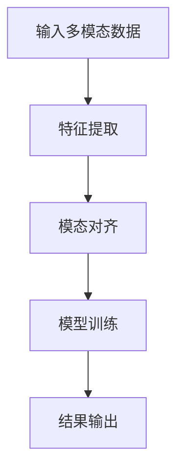
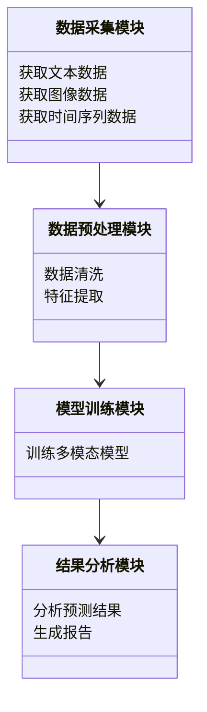
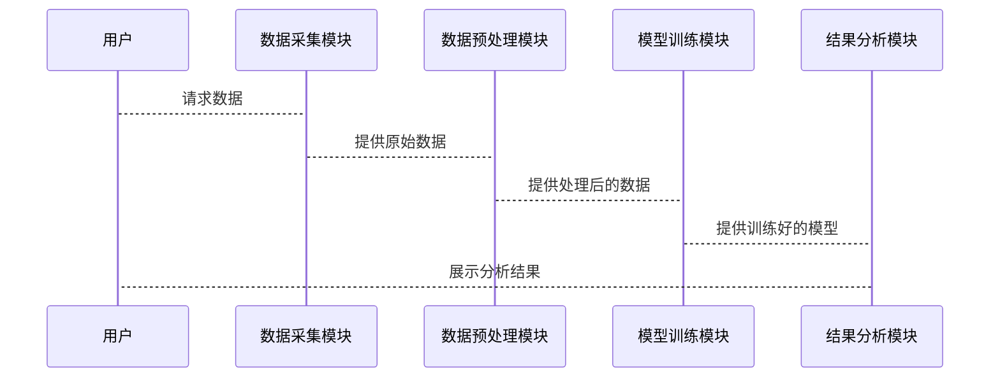

                 


# 金融领域多模态学习的前沿研究与应用

> 关键词：多模态学习、金融数据分析、深度学习、人工智能、系统架构设计

> 摘要：  
本文深入探讨了多模态学习在金融领域的前沿研究与实际应用。首先，我们介绍了多模态学习的基本概念、特点及其在金融领域的挑战与需求。接着，详细分析了多模态学习的核心概念、算法原理和数学模型，并通过具体的案例展示了多模态学习在金融数据分析中的实际应用。最后，我们总结了多模态学习在金融领域的最佳实践与未来发展方向。

---

# 第1章: 多模态学习的基本概念与背景

## 1.1 多模态学习的定义与特点

### 1.1.1 多模态数据的定义  
多模态数据是指来自不同感官或领域的数据形式，例如文本、图像、语音、时间序列等。这些数据形式通常具有互补性，能够提供更全面的信息。例如，在金融领域，多模态数据可能包括新闻文本、市场指数数据和相关股票的K线图。

### 1.1.2 多模态学习的核心特点  
- **互补性**：不同模态的数据可以互相补充，提高模型的综合理解能力。  
- **多样性**：多模态数据能够捕捉更多的信息维度，避免单模态数据的局限性。  
- **复杂性**：多模态学习需要处理不同类型的数据，模型设计和训练过程更为复杂。  

### 1.1.3 多模态学习与单模态学习的区别  
单模态学习仅依赖于单一类型的数据，例如仅使用文本数据进行情感分析。而多模态学习结合了多种数据形式，能够从多个角度分析问题，从而提高模型的准确性和鲁棒性。

---

## 1.2 金融领域的挑战与需求

### 1.2.1 金融数据的多样性  
金融数据包括文本（如新闻、财报）、图像（如K线图）、时间序列（如股票价格）等多种形式。这些数据形式的多样性为多模态学习提供了丰富的信息来源。

### 1.2.2 金融领域的复杂性  
金融市场的波动性高、不确定性大，且受到多种因素的影响（如经济指标、政策变化等）。多模态学习能够帮助模型更好地捕捉这些复杂因素之间的关系。

### 1.2.3 金融分析的多模态需求  
在金融分析中，分析师通常需要结合多种信息来源进行决策。例如，分析股票走势时，可能需要结合新闻文本、市场数据和公司财报。多模态学习能够模拟这种综合分析的过程，从而提高模型的决策能力。

---

## 1.3 多模态学习在金融中的应用前景

### 1.3.1 金融数据分析的新趋势  
随着人工智能技术的发展，金融数据分析正在从单一模态向多模态方向发展。通过结合多种数据形式，模型能够更全面地理解市场动态。

### 1.3.2 多模态学习在金融中的潜在价值  
- **提高预测准确性**：多模态数据能够提供更多的信息维度，帮助模型更准确地预测市场走势。  
- **增强决策能力**：通过综合分析多种数据，模型能够更好地捕捉市场机会和风险。  
- **提升用户体验**：多模态分析可以为投资者提供更全面的分析结果，增强用户体验。  

### 1.3.3 金融领域多模态学习的未来发展方向  
未来，多模态学习在金融领域的应用将更加广泛。例如，结合自然语言处理（NLP）和图像识别技术，模型能够从新闻文本和市场数据中提取更多信息，从而提高预测的准确性。

---

## 1.4 本章小结  
本章介绍了多模态学习的基本概念和特点，并分析了其在金融领域的挑战与需求。我们还探讨了多模态学习在金融中的应用前景，为后续章节的深入分析奠定了基础。

---

# 第2章: 多模态学习的核心概念与原理

## 2.1 多模态数据的处理方法

### 2.1.1 文本数据处理  
文本数据是金融分析中的重要信息来源。常见的文本处理方法包括分词、词嵌入（如Word2Vec、BERT）和情感分析等。例如，可以通过对新闻文本进行情感分析，判断市场情绪对股价的影响。

### 2.1.2 图像数据处理  
图像数据在金融领域主要用于K线图的分析。常见的图像处理方法包括图像分割、特征提取（如使用CNN）和模式识别等。例如，可以通过分析K线图的形态，预测股票的短期走势。

### 2.1.3 时间序列数据处理  
时间序列数据是金融市场的核心数据，例如股票价格、指数数据等。常见的处理方法包括ARIMA、LSTM和GARCH模型等。这些方法能够捕捉时间序列数据中的趋势、周期性和波动性。

---

## 2.2 多模态学习的模型架构

### 2.2.1 多任务学习模型  
多任务学习模型是一种常用的多模态学习架构，旨在通过同时学习多个相关任务来提高模型的泛化能力。例如，可以在同一模型中同时预测股票价格和市场情绪。

### 2.2.2 模态融合方法  
模态融合方法是指将不同模态的数据进行融合，以提高模型的性能。常见的融合方法包括早期融合（Early Fusion）和晚期融合（Late Fusion）。例如，可以通过将文本和图像数据在特征层进行融合，得到更丰富的特征表示。

### 2.2.3 对抗学习与生成模型  
对抗学习是一种通过生成器和判别器的对抗过程来提高模型性能的方法。例如，可以使用生成对抗网络（GAN）生成合成的市场数据，用于模型的训练和验证。

---

## 2.3 多模态学习的训练策略

### 2.3.1 跨模态对齐方法  
跨模态对齐是指将不同模态的数据进行对齐，以便模型能够更好地理解和利用这些数据。例如，可以通过对齐文本和图像数据，使模型能够同时分析新闻内容和相关股票的K线图。

### 2.3.2 联合学习与自适应方法  
联合学习是一种通过结合多个模态的数据进行模型训练的方法。例如，可以通过联合学习同时利用文本、图像和时间序列数据，提高模型的预测能力。

### 2.3.3 分布式训练策略  
分布式训练是一种通过将模型分布在多个计算节点上进行训练的方法。例如，可以使用分布式训练加速多模态模型的训练过程，特别是在处理大规模金融数据时。

---

## 2.4 本章小结  
本章详细介绍了多模态数据的处理方法、模型架构和训练策略。这些内容为后续章节的系统设计和项目实战奠定了理论基础。

---

# 第3章: 多模态学习的算法原理与数学模型

## 3.1 多模态学习的典型算法

### 3.1.1 多任务学习算法  
多任务学习算法是一种通过同时学习多个相关任务来提高模型性能的方法。例如，可以使用多任务学习算法同时预测股票价格和市场情绪。

### 3.1.2 模态融合算法  
模态融合算法是指通过融合不同模态的数据来提高模型的性能。例如，可以使用模态融合算法将文本和图像数据进行融合，得到更丰富的特征表示。

### 3.1.3 对抗学习算法  
对抗学习算法是一种通过生成器和判别器的对抗过程来提高模型性能的方法。例如，可以使用对抗学习算法生成合成的市场数据，用于模型的训练和验证。

---

## 3.2 多模态学习的数学模型

### 3.2.1 损失函数与优化目标  
多模态学习的损失函数通常包括多个模态的损失项，例如：  
$$ \mathcal{L} = \alpha \mathcal{L}_\text{text} + \beta \mathcal{L}_\text{image} + \gamma \mathcal{L}_\text{time} $$  
其中，$\alpha$、$\beta$、$\gamma$是不同模态的权重系数。

### 3.2.2 模态权重分配模型  
模态权重分配模型是一种通过动态调整不同模态的权重来提高模型性能的方法。例如，可以通过以下公式计算模态权重：  
$$ w_i = \frac{e^{\alpha x_i}}{\sum_j e^{\alpha x_j}} $$  
其中，$x_i$是第$i$个模态的特征值，$\alpha$是调节参数。

### 3.2.3 跨模态对齐的数学表达  
跨模态对齐的目标是将不同模态的数据对齐到同一个特征空间。例如，可以通过以下公式实现文本和图像数据的对齐：  
$$ f_\text{text}(x) = f_\text{image}(y) $$  
其中，$f_\text{text}$和$f_\text{image}$分别是文本和图像数据的特征提取函数。

---

## 3.3 算法流程图（使用mermaid）



---

## 3.4 本章小结  
本章详细介绍了多模态学习的典型算法和数学模型，并通过mermaid流程图展示了算法的流程。这些内容为后续章节的系统设计和项目实战提供了理论支持。

---

# 第4章: 金融领域多模态学习的系统架构设计

## 4.1 系统功能设计

### 4.1.1 数据采集模块  
数据采集模块负责从多种数据源（如新闻网站、股票交易系统）获取多模态数据，例如文本、图像和时间序列数据。

### 4.1.2 数据预处理模块  
数据预处理模块负责对采集的数据进行清洗、归一化和特征提取等处理，以便后续模型训练和分析。

### 4.1.3 模型训练模块  
模型训练模块负责使用多模态学习算法对数据进行训练，得到能够预测金融市场走势的模型。

### 4.1.4 结果分析模块  
结果分析模块负责对模型的输出结果进行分析和解释，例如生成市场情绪分析报告或股票价格预测报告。

---

## 4.2 系统架构设计

### 4.2.1 系统功能模块  
以下是系统功能模块的类图：



---

## 4.3 系统接口设计

### 4.3.1 数据接口  
数据接口负责与外部数据源（如新闻网站、股票交易系统）进行数据交互。例如，可以通过API接口获取实时股票价格数据。

### 4.3.2 模型接口  
模型接口负责与模型训练模块进行交互，提供训练数据和模型参数。例如，可以通过REST API接口调用模型进行预测。

### 4.3.3 用户接口  
用户接口负责与最终用户进行交互，例如通过网页或移动应用展示市场分析结果和预测报告。

---

## 4.4 系统交互流程图



---

## 4.5 本章小结  
本章详细介绍了金融领域多模态学习系统的功能设计、架构设计和接口设计，并通过mermaid图展示了系统的交互流程。这些设计为后续章节的项目实战提供了系统的框架支持。

---

# 第5章: 项目实战——智能投资顾问系统

## 5.1 项目背景与目标

### 5.1.1 项目背景  
随着金融市场的发展，投资者需要更加智能化的投资工具来辅助决策。智能投资顾问系统可以通过多模态学习技术，结合新闻文本、市场数据和K线图等信息，为投资者提供个性化的投资建议。

### 5.1.2 项目目标  
本项目旨在开发一个基于多模态学习的智能投资顾问系统，能够根据市场数据和新闻文本，预测股票价格走势并生成投资报告。

---

## 5.2 环境安装与配置

### 5.2.1 环境需求  
- Python 3.8+
- PyTorch或TensorFlow框架
- Numpy、Pandas等数据处理库
- Matplotlib、Seaborn等可视化库
- 相关金融数据API（如Yahoo Finance API）

### 5.2.2 安装步骤  
```bash
pip install numpy pandas torch matplotlib requests
```

---

## 5.3 系统核心实现

### 5.3.1 数据采集模块  
```python
import requests

def get_stock_data(ticker):
    url = f"https://api.example.com/stock/{ticker}"
    response = requests.get(url)
    return response.json()
```

### 5.3.2 模型训练模块  
```python
import torch
import torch.nn as nn

class MultimodalModel(nn.Module):
    def __init__(self, input_size):
        super().__init__()
        self.text_encoder = nn.LSTM(input_size, 128)
        self.image_encoder = nn.Conv2d(3, 64, 3)
        self.fc = nn.Linear(128 + 64, 1)
    
    def forward(self, text_input, image_input):
        text_output, _ = self.text_encoder(text_input)
        image_output = self.image_encoder(image_input)
        combined = torch.cat((text_output, image_output), dim=1)
        output = self.fc(combined)
        return output

model = MultimodalModel(input_size=100)
```

### 5.3.3 结果分析模块  
```python
import matplotlib.pyplot as plt

def plot_prediction(actual, predicted):
    plt.plot(actual, label='Actual Price')
    plt.plot(predicted, label='Predicted Price')
    plt.xlabel('Time')
    plt.ylabel('Price')
    plt.legend()
    plt.show()
```

---

## 5.4 项目实战小结  
本章通过一个具体的项目案例，展示了如何开发一个基于多模态学习的智能投资顾问系统。我们实现了数据采集、模型训练和结果分析模块，并通过Python代码详细介绍了系统的实现过程。

---

# 第6章: 最佳实践与总结

## 6.1 小结  
多模态学习在金融领域的应用前景广阔。通过结合文本、图像和时间序列等多种数据形式，模型能够更全面地理解市场动态，提高预测的准确性和决策的智能化。

## 6.2 注意事项  
- 数据质量：确保数据的准确性和完整性，避免噪声数据对模型的影响。  
- 模型选择：根据具体任务需求选择合适的多模态学习算法和模型架构。  
- 跨模态对齐：注意不同模态数据的对齐问题，避免信息丢失或偏差。  

## 6.3 拓展阅读  
- 《Deep Learning for Financial Time Series Analysis》  
- 《Multi-modal Deep Learning for Stock Market Prediction》  
- 《Advances in Financial Machine Learning》  

---

# 作者：AI天才研究院/AI Genius Institute & 禅与计算机程序设计艺术 /Zen And The Art of Computer Programming

---

**摘要**  
本文深入探讨了多模态学习在金融领域的前沿研究与实际应用。通过分析多模态学习的基本概念、算法原理和系统架构设计，我们展示了如何利用多模态学习技术提高金融数据分析的准确性和决策的智能化。最后，通过具体的项目案例和最佳实践总结，我们为读者提供了实际应用的指导和参考。

