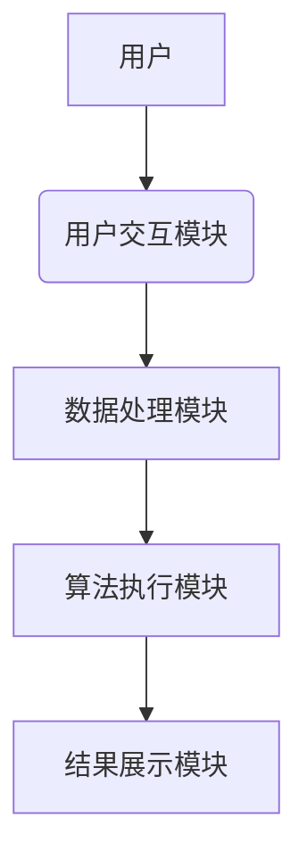
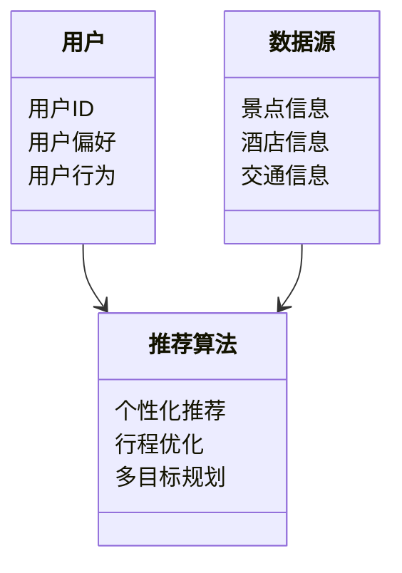
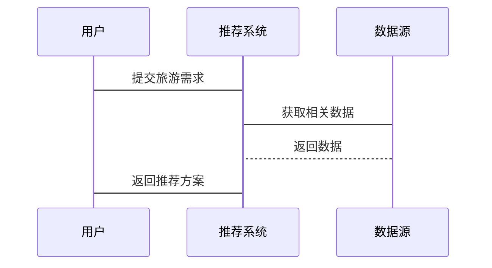

                 


# AI Agent在智能旅游规划中的应用

> 关键词：AI Agent，智能旅游规划，人工智能技术，旅游推荐系统，行程优化，个性化服务

> 摘要：随着人工智能技术的快速发展，AI Agent（人工智能代理）在智能旅游规划中的应用日益广泛。本文将从AI Agent的基本概念出发，分析其在旅游规划中的核心原理、数学模型、系统架构设计以及实际项目中的应用。通过案例分析和详细的技术解读，本文探讨了AI Agent在提升旅游体验、实现个性化服务和优化行程安排中的重要作用，同时展望了未来的发展方向。

---

# 第一部分：AI Agent与智能旅游规划的背景与基础

## 第1章：AI Agent与智能旅游规划的背景介绍

### 1.1 AI Agent的基本概念

#### 1.1.1 AI Agent的定义与特点
AI Agent（人工智能代理）是一种智能实体，能够感知环境、自主决策并执行任务。AI Agent的特点包括：
1. **自主性**：无需外部干预，自主完成任务。
2. **反应性**：能够实时感知环境变化并做出反应。
3. **目标导向**：基于目标驱动行为，优化决策过程。
4. **学习能力**：通过数据学习和优化，提升决策的准确性。

#### 1.1.2 AI Agent的核心要素与功能
AI Agent的核心要素包括：
1. **感知模块**：通过传感器或数据源获取环境信息。
2. **推理模块**：基于感知信息进行逻辑推理。
3. **决策模块**：根据推理结果制定行动计划。
4. **执行模块**：将决策转化为具体行动。

#### 1.1.3 AI Agent与传统旅游规划的区别
传统的旅游规划主要依赖人工经验，而AI Agent通过智能化技术实现个性化推荐和动态优化，显著提升了效率和用户体验。

### 1.2 智能旅游规划的定义与特点

#### 1.2.1 智能旅游规划的定义
智能旅游规划是利用人工智能技术，根据用户需求和实时数据，提供个性化旅游方案的过程。

#### 1.2.2 智能旅游规划的核心目标
1. 提供个性化旅游推荐。
2. 实现行程的动态优化。
3. 提升用户体验和满意度。

#### 1.2.3 智能旅游规划的实现方式
1. 基于用户数据的个性化推荐。
2. 利用AI算法进行行程优化。
3. 实时更新和调整旅游方案。

### 1.3 AI Agent在智能旅游规划中的应用背景

#### 1.3.1 旅游行业的数字化转型
随着互联网和移动设备的普及，旅游行业正在经历数字化转型，AI技术的应用成为推动行业升级的重要力量。

#### 1.3.2 AI技术在旅游领域的应用现状
目前，AI技术已广泛应用于旅游推荐、行程规划、客户服务等领域，显著提升了旅游体验。

#### 1.3.3 AI Agent在智能旅游规划中的优势
AI Agent能够实时感知用户需求和环境变化，提供动态优化的旅游方案，满足用户的个性化需求。

### 1.4 本章小结

#### 1.4.1 AI Agent的核心概念总结
AI Agent是一种具备自主性和目标导向的智能实体，能够感知环境、推理决策并执行任务。

#### 1.4.2 智能旅游规划的实现路径
通过AI技术实现个性化推荐和动态优化，提升旅游体验和用户满意度。

#### 1.4.3 本书的研究重点与目标
本书将重点探讨AI Agent在智能旅游规划中的核心原理、数学模型和系统设计，分析其实际应用和未来发展方向。

---

## 第2章：AI Agent的核心概念与原理

### 2.1 AI Agent的核心原理

#### 2.1.1 AI Agent的感知与决策机制
AI Agent通过感知模块获取环境信息，利用推理模块进行逻辑推理，最终通过决策模块制定行动计划。

#### 2.1.2 AI Agent的任务规划算法
任务规划算法是AI Agent的核心，常用的算法包括：
1. **宽度优先搜索（BFS）**：适用于简单任务的规划。
2. **A*算法**：通过启发式搜索优化任务规划。
3. **遗传算法（GA）**：适用于复杂任务的优化。

#### 2.1.3 AI Agent的知识表示与推理
知识表示是AI Agent进行推理的基础，常用的表示方法包括：
1. **谓词逻辑**：通过逻辑表达式表示知识。
2. **语义网络**：通过网络结构表示知识的语义关系。
3. **规则表示法**：通过一系列规则描述知识。

### 2.2 AI Agent的分类与应用场景

#### 2.2.1 分割式AI Agent
分割式AI Agent将任务分解为多个子任务，分别处理后汇总结果。

#### 2.2.2 联合式AI Agent
联合式AI Agent通过多个AI Agent协同完成任务，适用于复杂场景。

#### 2.2.3 基于强化学习的AI Agent
基于强化学习的AI Agent通过与环境的交互不断优化决策策略。

### 2.3 AI Agent在旅游规划中的具体应用

#### 2.3.1 个性化旅游推荐系统
通过分析用户的偏好和行为数据，AI Agent能够提供个性化的旅游推荐。

#### 2.3.2 智能行程优化算法
利用强化学习和遗传算法，AI Agent能够优化行程安排，减少时间和成本。

#### 2.3.3 多目标优化的旅游规划模型
多目标优化模型能够同时考虑多个目标（如成本、时间、体验），提供最优的旅游方案。

### 2.4 本章小结

#### 2.4.1 AI Agent的核心原理总结
AI Agent通过感知、推理和决策模块完成任务，任务规划算法和知识表示方法是其核心。

#### 2.4.2 不同类型AI Agent的特点对比
分割式AI Agent适用于简单任务，联合式AI Agent适用于复杂场景，强化学习AI Agent能够动态优化决策。

#### 2.4.3 AI Agent在旅游规划中的应用场景
AI Agent在个性化推荐、行程优化和多目标规划中具有广泛的应用。

---

## 第3章：AI Agent在智能旅游规划中的数学模型与算法

### 3.1 基于概率的旅游推荐模型

#### 3.1.1 概率模型的基本原理
概率模型通过分析用户的行为数据，计算用户对不同旅游项目的偏好概率。

#### 3.1.2 基于马尔可夫链的旅游推荐算法
马尔可夫链模型用于预测用户的下一步行为，从而推荐相关旅游项目。

#### 3.1.3 案例分析：个性化旅游推荐系统
通过分析用户的点击数据，构建概率模型，推荐符合用户偏好的旅游方案。

### 3.2 基于强化学习的行程优化算法

#### 3.2.1 强化学习的基本原理
强化学习通过智能体与环境的交互，逐步优化决策策略。

#### 3.2.2 Q-Learning算法在行程优化中的应用
Q-Learning算法通过状态和动作的组合，优化行程安排的成本和时间。

#### 3.2.3 案例分析：智能行程优化系统
利用强化学习算法，优化用户的行程安排，降低时间和成本。

### 3.3 基于遗传算法的多目标优化模型

#### 3.3.1 遗传算法的基本原理
遗传算法通过模拟生物进化的过程，优化复杂问题的解决方案。

#### 3.3.2 遗传算法在旅游规划中的应用
将行程安排编码为基因，通过交叉和变异操作优化基因，得到最优的行程方案。

#### 3.3.3 案例分析：多目标旅游规划系统
通过遗传算法优化多个目标（如成本、时间、体验）的权重，提供最优的旅游方案。

### 3.4 本章小结

#### 3.4.1 不同算法的特点与适用场景
概率模型适用于个性化推荐，强化学习适用于动态优化，遗传算法适用于多目标优化。

#### 3.4.2 数学模型在旅游规划中的作用
数学模型能够量化用户需求和环境条件，为AI Agent提供决策依据。

#### 3.4.3 算法优化的未来发展方向
结合多种算法，提升模型的准确性和效率，进一步优化AI Agent在旅游规划中的应用。

---

## 第4章：智能旅游规划系统的系统架构与设计

### 4.1 系统架构设计

#### 4.1.1 系统模块划分
智能旅游规划系统通常包括用户交互模块、数据处理模块、算法执行模块和结果展示模块。

#### 4.1.2 系统功能设计
系统功能包括用户注册与登录、旅游需求输入、方案生成与展示、反馈与优化。

#### 4.1.3 系统架构图（Mermaid）


### 4.2 系统功能设计

#### 4.2.1 领域模型（Mermaid类图）


#### 4.2.2 系统架构设计（Mermaid架构图）


### 4.3 系统接口设计

#### 4.3.1 API接口设计
1. 用户信息接口：用于获取用户的偏好和行为数据。
2. 数据接口：用于获取景点、酒店和交通信息。
3. 推荐接口：用于返回个性化的旅游方案。

#### 4.3.2 接口交互流程（Mermaid序列图）


### 4.4 本章小结

#### 4.4.1 系统架构设计总结
智能旅游规划系统由多个模块组成，通过合理的架构设计，确保系统的高效运行。

#### 4.4.2 系统功能与接口设计的重要性
合理的功能设计和接口设计能够提升系统的灵活性和可扩展性，为未来的优化提供基础。

---

## 第5章：AI Agent在智能旅游规划中的项目实战

### 5.1 环境安装与配置

#### 5.1.1 系统需求
1. 操作系统：Windows、Linux或macOS。
2. 开发工具：Python、Jupyter Notebook、IDE（如PyCharm）。
3. 库依赖：numpy、pandas、scikit-learn、tensorflow。

#### 5.1.2 安装步骤
1. 安装Python：下载并安装最新版本的Python。
2. 安装库依赖：使用pip命令安装所需的库。
3. 配置开发环境：安装并配置Jupyter Notebook或IDE。

### 5.2 核心代码实现

#### 5.2.1 基于概率模型的推荐系统实现
```python
import numpy as np
from sklearn.metrics.pairwise import cosine_similarity

# 示例数据：用户行为矩阵
user_behavior_matrix = np.array([[1, 0, 1, 1],
                                  [0, 1, 1, 0],
                                  [1, 1, 0, 1]])

# 计算余弦相似度
similarity = cosine_similarity(user_behavior_matrix)

# 推荐系统实现
def recommend(user_id, similarity_matrix):
    user_similarity = similarity_matrix[user_id]
    # 找到最相似的用户
    top_user = np.argmax(user_similarity)
    return top_user

# 示例调用
user_id = 0
print(recommend(user_id, similarity))
```

#### 5.2.2 基于强化学习的行程优化算法实现
```python
import gym
from gym import spaces
from gym.utils import seeding

class TravelEnv(gym.Env):
    def __init__(self):
        self.action_space = spaces.Discrete(4)
        self.observation_space = spaces.Discrete(10)
        self._seed = 0

    def step(self, action):
        # 实现环境的动态
        pass

    def reset(self):
        # 初始化环境
        pass

    def render(self, mode='human'):
        # 可视化环境
        pass

# 示例调用
env = TravelEnv()
env.reset()
for _ in range(10):
    action = env.action_space.sample()
    observation, reward, done, info = env.step(action)
    if done:
        break
    env.render()
```

### 5.3 案例分析与代码解读

#### 5.3.1 个性化旅游推荐系统案例
```python
import pandas as pd
from sklearn.metrics.pairwise import cosine_similarity

# 示例数据：用户偏好和景点特征
users = pd.DataFrame({
    'UserID': [1, 2, 3],
    'Pref1': [0.5, 0.7, 0.6],
    'Pref2': [0.3, 0.4, 0.5]
})

items = pd.DataFrame({
    'ItemID': [1, 2, 3],
    'Feature1': [0.4, 0.6, 0.5],
    'Feature2': [0.3, 0.5, 0.4]
})

# 计算相似度
item_features = items[['Feature1', 'Feature2']]
item_features_matrix = item_features.values
similarity = cosine_similarity(item_features_matrix)

# 推荐系统实现
def recommend(user_id, user_features, item_features, similarity_matrix):
    user_feature = user_features[user_id]
    similarities = similarity_matrix[user_id]
    # 找到最相似的项目
    top_item = np.argmax(similarities)
    return top_item

# 示例调用
user_id = 1
print(recommend(user_id, users[['Pref1', 'Pref2']].values, item_features_matrix, similarity))
```

#### 5.3.2 基于遗传算法的多目标优化案例
```python
import numpy as np

def evaluate(individual):
    # 评估个体的目标函数值
    cost = individual[0]
    time = individual[1]
    return cost + time,

def mutate(individual):
    # 变异操作
    if np.random.rand() < 0.1:
        individual[0] = 1 - individual[0]
    if np.random.rand() < 0.1:
        individual[1] = 1 - individual[1]
    return individual

def crossover(parent1, parent2):
    # 交叉操作
    crossover_point = 1
    child1 = np.concatenate((parent1[:crossover_point], parent2[crossover_point:]))
    child2 = np.concatenate((parent2[:crossover_point], parent1[crossover_point:]))
    return child1, child2

# 初始化种群
population = np.array([[1, 0], [0, 1], [1, 1], [0, 0]])

# 进化过程
for _ in range(10):
    evaluated = np.array([evaluate(individual) for individual in population])
    # 选择适应度较高的个体
    selected = population[evaluated.argsort()[-2:]]
    # 交叉和变异
    parent1, parent2 = selected[-2], selected[-1]
    child1, child2 = crossover(parent1, parent2)
    child1 = mutate(child1)
    child2 = mutate(child2)
    # 更新种群
    population = np.concatenate((population, [child1, child2]))
    population = population[:4]

print(population)
```

### 5.4 本章小结

#### 5.4.1 项目实战的核心代码实现
通过具体的代码实现，展示了AI Agent在个性化推荐和行程优化中的应用。

#### 5.4.2 代码解读与实际应用
代码实现结合了概率模型和遗传算法，能够为用户提供个性化的旅游推荐和优化的行程安排。

#### 5.4.3 实战项目中的注意事项
在实际应用中，需要考虑数据的获取与处理、模型的训练与优化，以及系统的部署与维护。

---

## 第6章：AI Agent在智能旅游规划中的未来发展方向

### 6.1 AI Agent在智能旅游中的优势总结

#### 6.1.1 提升用户体验
AI Agent能够提供个性化的旅游推荐和动态优化的行程安排，显著提升用户体验。

#### 6.1.2 实现高效管理
通过AI Agent，旅游企业能够高效管理资源，降低运营成本。

#### 6.1.3 促进个性化服务
AI Agent能够根据用户的需求和偏好，提供个性化的旅游服务。

### 6.2 AI Agent的未来发展方向

#### 6.2.1 多模态数据的融合
结合文本、图像、视频等多种数据源，提升AI Agent的感知能力。

#### 6.2.2 更加智能化的决策系统
通过深度学习和强化学习，实现更加智能的决策系统。

#### 6.2.3 人机协作的优化
优化人机协作模式，提升用户体验和系统的效率。

### 6.3 本章小结

#### 6.3.1 未来发展的核心方向
未来，AI Agent在智能旅游规划中的发展方向包括多模态数据融合、智能化决策系统和人机协作优化。

#### 6.3.2 技术进步对行业的影响
随着AI技术的不断进步，AI Agent将在旅游行业中发挥越来越重要的作用。

---

## 第7章：AI Agent在智能旅游规划中的最佳实践与注意事项

### 7.1 最佳实践

#### 7.1.1 数据的获取与处理
确保数据的准确性和完整性，合理处理数据，为AI Agent提供可靠的决策依据。

#### 7.1.2 模型的训练与优化
选择合适的算法，优化模型参数，提升模型的准确性和效率。

#### 7.1.3 系统的部署与维护
合理设计系统架构，确保系统的稳定性和可扩展性。

### 7.2 注意事项

#### 7.2.1 数据隐私与安全
保护用户的隐私和数据安全，遵守相关法律法规。

#### 7.2.2 系统的可解释性
提升系统的可解释性，便于用户理解和信任。

#### 7.2.3 技术的适用性
根据具体场景选择合适的技术，避免过度依赖AI技术，忽视传统方法的优势。

### 7.3 本章小结

#### 7.3.1 最佳实践总结
通过合理的数据处理、模型优化和系统设计，能够提升AI Agent在智能旅游规划中的效果。

#### 7.3.2 注意事项的重要性
在实际应用中，需要注意数据隐私、系统的可解释性和技术的适用性。

---

# 作者信息

作者：AI天才研究院（AI Genius Institute） & 禅与计算机程序设计艺术（Zen And The Art of Computer Programming）

---

以上是《AI Agent在智能旅游规划中的应用》的技术博客文章的完整内容，涵盖了AI Agent的基本概念、核心原理、数学模型、系统架构设计、项目实战以及未来发展方向。通过详细的分析和具体的案例，本文为读者提供了全面的技术解读和实践指导，帮助读者深入理解AI Agent在智能旅游规划中的应用及其技术细节。

