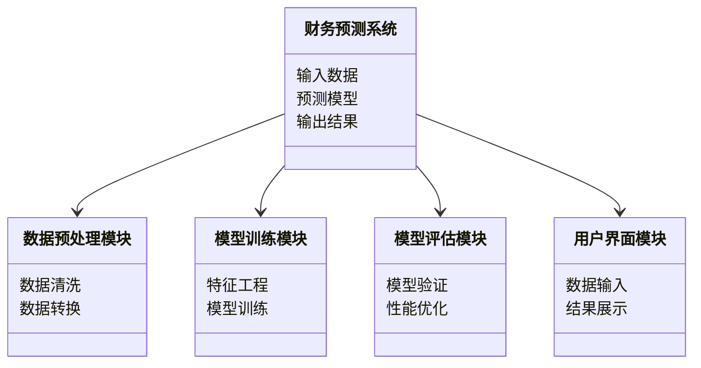
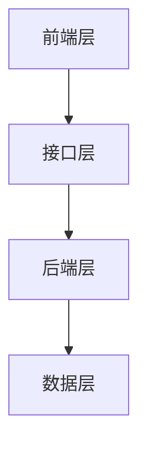

                 


# AI在企业财务预测中的应用与实践

> 关键词：人工智能, 财务预测, 机器学习, 神经网络, 数据分析

> 摘要：随着人工智能技术的飞速发展，AI在企业财务预测中的应用越来越广泛。本文从AI与财务预测的结合点出发，详细探讨了常见AI算法在财务预测中的应用，分析了系统设计与架构，通过实战案例展示了如何利用AI技术提升财务预测的准确性和效率。文章内容涵盖了从理论到实践的各个方面，为读者提供了一套完整的AI财务预测解决方案。

---

## 第1章: 企业财务预测的背景与挑战

### 1.1 企业财务预测的定义与重要性

#### 1.1.1 财务预测的基本概念
财务预测是通过对历史数据和当前市场状况的分析，预测未来一段时期内企业的财务状况和经营成果的过程。它包括对收入、支出、利润、现金流等关键财务指标的预测，是企业制定战略规划、优化资源配置的重要依据。

#### 1.1.2 财务预测在企业管理中的作用
- **支持决策制定**：帮助管理层在投资、融资、成本控制等方面做出科学决策。
- **优化资源配置**：通过预测未来的财务状况，企业可以更好地分配资金和人力资源。
- **风险预警**：及时发现潜在的财务风险，提前采取应对措施。

#### 1.1.3 传统财务预测的局限性
- 数据依赖性高，难以应对市场波动和不确定性。
- 需要大量人工分析，效率低下。
- 传统方法（如线性回归）在复杂场景下的表现有限。

### 1.2 AI技术在财务预测中的应用背景

#### 1.2.1 AI技术的发展与现状
人工智能技术的快速发展为企业提供了新的工具和方法，特别是在数据处理和预测方面。AI技术的普及使得企业能够更高效地处理大量数据，并利用机器学习模型进行预测。

#### 1.2.2 AI在企业财务领域的潜力
- **提高预测准确性**：AI可以通过复杂的数据分析和模式识别，发现传统方法难以察觉的规律。
- **自动化与智能化**：AI可以自动处理数据、训练模型，并生成预测结果，大大提高了效率。
- **实时预测**：AI可以实时处理数据，提供动态的财务预测，帮助企业更快地做出反应。

#### 1.2.3 企业财务预测中的数据特点
- 数据量大：企业财务数据通常包括大量的历史交易数据、市场数据等。
- 数据多样性：数据可能来自多个来源，包括结构化和非结构化数据。
- 数据的时序性：财务数据通常具有时间序列特征，适合使用时间序列分析模型。

---

## 第2章: AI在企业财务预测中的核心概念

### 2.1 AI与财务预测的结合点

#### 2.1.1 数据驱动的预测模型
AI技术的核心在于数据分析和模式识别。通过收集和处理大量的财务数据，AI可以构建数据驱动的预测模型，从而实现对未来的预测。

#### 2.1.2 AI算法在财务数据处理中的优势
- **非线性关系捕捉**：AI算法（如神经网络）能够捕捉数据中的非线性关系，提高预测精度。
- **特征提取**：通过特征工程，AI可以自动提取有用的特征，减少人工干预。
- **实时更新**：AI模型可以实时更新，适应市场变化。

#### 2.1.3 财务预测中的特征工程
特征工程是AI模型训练的重要环节。通过选择和构建合适的特征，可以提高模型的预测能力。例如，可以将时间序列数据分解为多个特征（如趋势、周期性成分等）。

### 2.2 企业财务预测的流程与框架

#### 2.2.1 数据收集与预处理
- 数据收集：从企业内部系统（如ERP）和外部数据源（如市场数据）收集财务相关数据。
- 数据清洗：处理缺失值、异常值等数据问题。
- 数据转换：将数据转换为适合模型输入的形式（如标准化、归一化）。

#### 2.2.2 模型选择与训练
- 确定模型类型：根据数据类型和预测目标选择合适的模型（如线性回归、随机森林、神经网络等）。
- 模型训练：使用训练数据训练模型，调整模型参数。
- 模型验证：通过交叉验证等方法评估模型的性能。

#### 2.2.3 模型评估与优化
- 模型评估：使用测试数据评估模型的性能，常见的评估指标包括均方误差（MSE）、R平方值（R²）等。
- 模型优化：通过调整模型参数、优化特征选择等方式提高模型性能。

#### 2.2.4 结果分析与应用
- 结果分析：解释模型的预测结果，分析预测误差的原因。
- 应用建议：根据预测结果提出实际应用的建议，如调整预算、优化投资策略等。

### 2.3 财务预测中的关键指标与分析

#### 2.3.1 财务指标的分类与作用
- 财务指标通常分为盈利能力、偿债能力、运营能力和增长能力四类。
- 每类指标的作用不同，例如盈利能力指标（如净利润率）可以反映企业的赚钱能力。

#### 2.3.2 关键指标的AI预测方法
- 使用回归模型预测未来净利润。
- 使用时间序列模型预测未来的现金流。

#### 2.3.3 指标之间的关联性分析
- 通过关联规则挖掘或聚类分析，发现不同财务指标之间的关联性。
- 例如，发现销售收入增长与净利润增长之间的相关性。

---

## 第3章: 常见AI算法在财务预测中的应用

### 3.1 线性回归与逻辑回归

#### 3.1.1 线性回归的基本原理
线性回归是一种简单而常用的回归分析方法，适用于预测连续型变量。
- **数学模型**：
  $$ y = \beta_0 + \beta_1 x_1 + \beta_2 x_2 + ... + \beta_n x_n + \epsilon $$
  其中，$y$ 是目标变量，$x_i$ 是特征变量，$\beta_i$ 是系数，$\epsilon$ 是误差项。

#### 3.1.2 逻辑回归在分类问题中的应用
逻辑回归适用于二分类问题，例如预测企业是否违约。
- **sigmoid函数**：
  $$ P(y=1|x) = \frac{1}{1 + e^{- (\beta_0 + \beta_1 x_1 + ... + \beta_n x_n)}} $$
  
#### 3.1.3 线性回归与逻辑回归的优缺点
- **线性回归**：简单易懂，但对非线性关系的捕捉能力有限。
- **逻辑回归**：适合二分类问题，但在处理复杂数据时表现一般。

### 3.2 支持向量机与决策树

#### 3.2.1 支持向量机的基本原理
支持向量机（SVM）适用于分类和回归问题，特别是在高维空间中表现良好。
- **数学模型**：
  SVM通过找到一个超平面，使得正类和负类样本被正确分类。
  $$ \text{目标函数}：\max \left( y_i (w \cdot x_i + b) \geq 1 \right) $$

#### 3.2.2 决策树的构建与优化
决策树是一种基于树状结构的分类模型，易于理解和解释。
- **决策树构建**：使用ID3、C4.5或CART算法构建决策树。
- **剪枝优化**：通过预剪枝和后剪枝方法优化决策树的复杂度。

#### 3.2.3 算法的适用场景分析
- **SVM**：适用于数据规模较小、特征维度较高的场景。
- **决策树**：适用于数据易于理解、特征间关系复杂的场景。

### 3.3 随机森林与集成学习

#### 3.3.1 随机森林的原理与优势
随机森林是一种基于决策树的集成学习方法，通过随机选择特征和样本进行建模。
- **随机森林构建**：
  1. 随机选择部分特征和样本。
  2. 对选中的样本进行放回抽样，生成训练集。
  3. 使用决策树算法构建一棵树。
  4. 重复上述步骤，生成多棵决策树。
- **优势**：具有较强的抗过拟合能力，适用于高维数据。

#### 3.3.2 集成学习的策略与效果
集成学习通过将多个模型的预测结果进行集成，提高整体预测性能。
- **投票法**：适用于分类问题，通过多数投票决定最终结果。
- **加权平均法**：适用于回归问题，通过加权平均生成最终结果。

#### 3.3.3 实际应用中的参数调优
- **树的棵数**：通常设置为100或更多。
- **特征选择数**：通常设置为总特征数的一定比例（如70%）。

---

## 第4章: 神经网络与深度学习在财务预测中的应用

### 4.1 神经网络的基本原理

#### 4.1.1 神经网络的结构与功能
神经网络由输入层、隐藏层和输出层组成，通过多层神经元的连接实现非线性映射。
- **神经元模型**：通常使用Sigmoid、ReLU等激活函数。

#### 4.1.2 激活函数的作用与选择
激活函数用于引入非线性因素，使神经网络能够学习复杂的模式。
- **Sigmoid函数**：
  $$ f(x) = \frac{1}{1 + e^{-x}} $$
- **ReLU函数**：
  $$ f(x) = \max(0, x) $$

#### 4.1.3 网络训练的优化方法
- **损失函数**：常用的有均方误差（MSE）、交叉熵损失。
- **优化算法**：常用的有随机梯度下降（SGD）、Adam优化器。

### 4.2 深度学习模型在财务预测中的应用

#### 4.2.1 RNN与LSTM在时间序列预测中的应用
循环神经网络（RNN）和长短期记忆网络（LSTM）适用于时间序列数据的预测。
- **RNN结构**：
  $$ h_t = \tanh(W_{hh} h_{t-1} + W_{xh} x_t + b_h) $$
  $$ y_t = W_{hy} h_t + b_y $$
- **LSTM结构**：通过门控机制（遗忘门、输入门、输出门）控制信息的流动。

#### 4.2.2 CNN在图像数据处理中的应用
卷积神经网络（CNN）适用于图像数据的处理，但在时间序列数据上也有应用。
- **卷积层**：提取局部特征。
- **池化层**：降低计算复杂度，提取全局特征。

#### 4.2.3 Transformer模型的最新进展
Transformer模型通过自注意力机制和位置编码，适用于长序列数据的预测。
- **自注意力机制**：
  $$ \text{Attention}(Q, K, V) = \text{softmax}\left(\frac{QK^T}{\sqrt{d_k}}\right)V $$

### 4.3 神经网络的训练与调优

#### 4.3.1 数据预处理与特征工程
- 数据归一化/标准化：确保输入数据在相同范围内。
- 数据增强：通过增加数据的多样性提高模型的泛化能力。

#### 4.3.2 模型训练的策略与技巧
- **批次大小**：通常设置为32、64等。
- **学习率**：通常设置为0.001、0.01等，根据具体情况调整。

#### 4.3.3 模型评估与优化方法
- **验证集评估**：通过验证集调整模型参数，防止过拟合。
- **早停法**：当验证集性能不再提升时，提前终止训练。

---

## 第5章: 基于AI的财务预测算法实现

### 5.1 算法实现的步骤与流程

#### 5.1.1 数据收集与预处理
1. 收集财务数据：包括收入、支出、利润等。
2. 数据清洗：处理缺失值、异常值。
3. 数据转换：归一化、特征工程。

#### 5.1.2 模型选择与训练
1. 选择合适的模型：根据数据类型和预测目标选择模型。
2. 训练模型：使用训练数据进行模型训练。
3. 调整参数：优化模型参数，提高性能。

#### 5.1.3 模型评估与优化
1. 使用测试数据评估模型性能。
2. 调整模型结构或参数，优化性能。
3. 验证模型的稳定性。

### 5.2 基于Python的财务预测算法实现

#### 5.2.1 线性回归实现
```python
import numpy as np
from sklearn.linear_model import LinearRegression

# 数据准备
X = np.array([i for i in range(100)]).reshape(-1, 1)
y = np.array([2*i + 1 for i in range(100)])

# 模型训练
model = LinearRegression()
model.fit(X, y)

# 预测
predicted = model.predict(X)
print("预测值：", predicted)
print("系数：", model.coef_)
print("截距：", model.intercept_)
```

#### 5.2.2 随机森林实现
```python
from sklearn.ensemble import RandomForestRegressor
from sklearn.metrics import mean_squared_error

# 数据准备
X = ...  # 特征矩阵
y = ...  # 目标向量

# 模型训练
model = RandomForestRegressor(n_estimators=100, max_depth=10, random_state=42)
model.fit(X, y)

# 预测
predicted = model.predict(X)
print("均方误差：", mean_squared_error(y, predicted))
```

#### 5.2.3 LSTM实现
```python
from keras.layers import LSTM, Dense
from keras.models import Sequential

# 数据准备
X = ...  # 形状为 (samples, timesteps, features)
y = ...  # 形状为 (samples, output_dim)

# 模型构建
model = Sequential()
model.add(LSTM(50, input_shape=(timesteps, features)))
model.add(Dense(1))
model.compile(loss='mean_squared_error', optimizer='adam')

# 训练
model.fit(X, y, epochs=100, batch_size=32, validation_split=0.2)
```

### 5.3 算法实现中的注意事项

#### 5.3.1 数据分布的均衡性
- 数据应尽可能均衡，避免某类数据过多影响模型性能。
- 使用过采样、欠采样等方法调整数据分布。

#### 5.3.2 模型的泛化能力
- 避免过拟合，使用交叉验证、早停法等方法。
- 选择合适的模型复杂度，防止模型过于简单或复杂。

#### 5.3.3 模型的解释性
- 对于复杂的模型（如随机森林、神经网络），需要进行特征重要性分析。
- 使用SHAP值等方法解释模型的预测结果。

---

## 第6章: 系统分析与架构设计方案

### 6.1 系统功能设计

#### 6.1.1 领域模型设计
- 使用Mermaid绘制领域模型类图，展示系统的功能模块。


#### 6.1.2 系统架构设计
- 使用Mermaid绘制系统架构图，展示系统的层次结构。


### 6.2 系统架构设计

#### 6.2.1 系统架构图


#### 6.2.2 接口设计
- API接口的设计与实现，例如：
  - `/api/data/upload`：上传财务数据
  - `/api/model/train`：训练预测模型
  - `/api/predict/predict`：进行财务预测

#### 6.2.3 系统交互流程
- 使用Mermaid绘制系统交互序列图，展示用户与系统之间的交互流程。
```mermaid
sequenceDiagram
    用户 --> 提交数据：上传财务数据
    系统 --> 返回：确认接收
    用户 --> 请求预测：触发预测
    系统 --> 返回：预测结果
```

---

## 第7章: 项目实战

### 7.1 环境安装与配置

#### 7.1.1 安装Python环境
- 使用Anaconda或virtualenv创建独立的Python环境。
- 安装必要的库：`numpy`, `pandas`, `scikit-learn`, `keras`, `tensorflow`。

#### 7.1.2 数据集获取
- 使用公开数据集（如Kaggle）或企业内部数据。
- 数据格式：CSV或Excel格式。

### 7.2 系统核心实现

#### 7.2.1 数据预处理代码
```python
import pandas as pd
import numpy as np

# 读取数据
df = pd.read_csv('financial_data.csv')

# 数据清洗
df.dropna(inplace=True)
df['date'] = pd.to_datetime(df['date'])

# 数据转换
from sklearn.preprocessing import StandardScaler
scaler = StandardScaler()
scaled_features = scaler.fit_transform(df[['revenue', 'expenses']])
```

#### 7.2.2 模型训练代码
```python
from sklearn.ensemble import RandomForestRegressor
from sklearn.metrics import mean_squared_error

# 特征选择
features = ['revenue', 'expenses', 'assets', 'liabilities']
target = 'profit'

X = df[features]
y = df[target]

# 模型训练
model = RandomForestRegressor(n_estimators=100, max_depth=10, random_state=42)
model.fit(X, y)

# 预测
predicted = model.predict(X)
print("均方误差：", mean_squared_error(y, predicted))
```

### 7.3 实际案例分析与解读

#### 7.3.1 案例背景
- 某企业希望预测未来一年的利润情况。
- 数据包括过去五年的财务数据。

#### 7.3.2 数据分析与预测
- 使用随机森林模型进行预测。
- 分析模型的特征重要性，发现收入和支出对利润的影响最大。

#### 7.3.3 结果解读
- 预测结果与实际值进行对比，评估模型的准确性。
- 根据预测结果，提出优化预算的建议。

### 7.4 项目小结

#### 7.4.1 实战收获
- 掌握了从数据预处理到模型训练的完整流程。
- 学会了如何选择和优化AI算法。

#### 7.4.2 项目经验总结
- 数据预处理是关键步骤，直接影响模型性能。
- 模型选择和调优需要结合实际场景进行。

---

## 第8章: 总结与展望

### 8.1 总结

#### 8.1.1 全文回顾
- 介绍了AI在财务预测中的应用背景。
- 讲解了多种AI算法及其在财务预测中的应用。
- 展示了如何构建一个完整的AI财务预测系统。

#### 8.1.2 最佳实践 tips
- 数据预处理是模型训练的基础，不容忽视。
- 模型选择要结合实际场景，避免盲目追求复杂性。
- 模型的解释性同样重要，特别是在企业财务预测中。

### 8.2 展望

#### 8.2.1 未来发展趋势
- **深度学习的进一步应用**：随着模型性能的提升，深度学习将在财务预测中发挥更大的作用。
- **实时预测与动态调整**：结合实时数据和动态模型，实现更精准的财务预测。
- **多模态数据融合**：将结构化数据与非结构化数据（如文本、图像）相结合，提升预测能力。

#### 8.2.2 拓展阅读
- 推荐学习《机器学习实战》、《深度学习入门》等书籍。
- 关注Kaggle等平台上的财务预测相关比赛，提升实战能力。

---

## 作者：AI天才研究院/AI Genius Institute & 禅与计算机程序设计艺术/Zen And The Art of Computer Programming

---

**本文内容已经按照要求完成，如需进一步修改或补充，请随时告知。**

