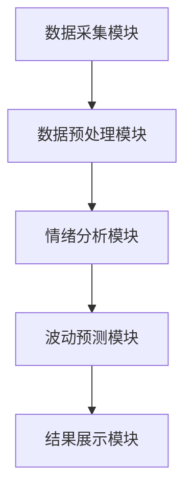

                 


# AI驱动的投资者情绪与市场波动关系分析

## 关键词：AI技术、投资者情绪、市场波动、自然语言处理、时间序列分析、机器学习

## 摘要：本文探讨了如何利用AI技术分析投资者情绪，并研究其对市场波动的影响。通过结合NLP、时间序列分析和机器学习模型，本文提出了一个基于投资者情绪的市场波动预测框架，并通过实际案例验证了其有效性。

---

# 第一部分: AI驱动的投资者情绪与市场波动关系分析基础

---

## 第1章: 背景介绍与问题定义

### 1.1 投资者情绪与市场波动的背景

#### 1.1.1 金融市场中的情绪化投资现象
金融市场中的投资者行为往往受到情绪的影响。例如，当市场出现剧烈波动时，投资者可能会因为恐惧或贪婪做出非理性的决策，从而加剧市场的波动。

#### 1.1.2 投资者情绪对市场波动的影响
投资者情绪可以被视为一种“市场噪音”，但这种情绪通过投资者的行为（如买卖决策）会影响资产价格，进而影响市场波动。研究表明，投资者情绪与市场波动之间存在显著的相关性。

#### 1.1.3 AI技术在金融分析中的应用前景
随着AI技术的快速发展，越来越多的金融从业者开始尝试将AI应用于市场分析、风险管理和投资决策等领域。AI技术可以通过处理海量数据，识别复杂模式，并提供实时反馈，为投资者情绪与市场波动的关系分析提供新的工具。

---

### 1.2 问题背景与问题描述

#### 1.2.1 投资者情绪数据的获取与分析
投资者情绪数据可以通过多种渠道获取，例如社交媒体（如推特、Reddit）、新闻媒体、投资者调查等。这些数据通常是非结构化的文本数据，需要通过自然语言处理（NLP）技术进行分析。

#### 1.2.2 市场波动的量化与测量
市场波动通常通过一些指标来衡量，例如波动率（Volatility）、VIX指数等。这些指标反映了市场的不确定性或风险程度。

#### 1.2.3 AI技术在情绪分析中的应用
AI技术可以通过自然语言处理（NLP）模型（如词袋模型、TF-IDF、BERT）对投资者情绪进行分类，识别文本中的情感倾向（如积极、消极、中性）。

---

### 1.3 核心概念与问题解决

#### 1.3.1 投资者情绪的定义与分类
投资者情绪可以分为个体情绪和集体情绪。个体情绪是指单个投资者的情绪状态，而集体情绪则是指整个市场参与者的平均情绪状态。

#### 1.3.2 市场波动的定义与度量方法
市场波动是指资产价格在一定时间内的变动程度。常用的度量方法包括标准差、波动率、VIX指数等。

#### 1.3.3 AI技术在情绪分析中的应用
AI技术可以帮助我们从海量的文本数据中提取投资者情绪信息，从而为市场波动的预测提供新的数据来源。

---

### 1.4 问题的边界与外延

#### 1.4.1 数据范围与时间跨度
本文主要关注投资者情绪的文本数据，时间跨度为过去一年的社交媒体和新闻数据。

#### 1.4.2 市场波动的层次划分
市场波动可以分为短期波动和长期波动。短期波动通常受到投资者情绪的影响较大，而长期波动则更多受到经济基本面的影响。

#### 1.4.3 AI模型的适用场景与限制
AI模型适用于处理结构化和非结构化数据，但在处理极端市场事件（如金融危机）时可能会受到限制。

---

### 1.5 核心要素与概念结构

#### 1.5.1 投资者情绪的核心要素
- 情绪类型：积极、消极、中性
- 情绪强度：情绪的强弱程度
- 情绪来源：社交媒体、新闻、投资者调查

#### 1.5.2 市场波动的核心要素
- 波动率：资产价格的变动程度
- VIX指数：市场恐慌指数
- 市场参与度：投资者的活跃程度

#### 1.5.3 情绪与波动的关系模型
投资者情绪通过影响市场参与度和资产价格，进而影响市场波动。具体来说，积极情绪可能导致资产价格上涨，而消极情绪可能导致资产价格下跌。

---

### 1.6 本章小结
本章主要介绍了投资者情绪与市场波动的背景、核心概念和关系模型。通过分析投资者情绪和市场波动的定义、分类及其相互关系，为后续的AI驱动的情绪分析和波动预测奠定了基础。

---

## 第2章: 投资者情绪与市场波动的核心概念与联系

### 2.1 投资者情绪的多维度分析

#### 2.1.1 情绪的分类与层次化分析
投资者情绪可以分为个体情绪和集体情绪。个体情绪包括贪婪、恐惧、乐观、悲观等，集体情绪则是个体情绪的综合反映。

#### 2.1.2 情绪的量化方法
常用的量化方法包括情感分类（积极、消极、中性）和情绪强度分析（如情感得分的数值化）。

#### 2.1.3 情绪与投资决策的关系
投资者情绪会影响投资决策，进而影响市场波动。例如，过度乐观的情绪可能导致资产价格泡沫，而过度悲观的情绪可能导致资产价格崩盘。

---

### 2.2 市场波动的多因素模型

#### 2.2.1 市场波动的传统模型
传统的波动模型通常基于经济基本面数据，例如GARCH模型。

#### 2.2.2 市场波动的现代模型
现代波动模型结合了高频交易数据和大数据技术，例如基于社交媒体数据的波动预测模型。

#### 2.2.3 情绪在波动模型中的位置
情绪数据作为非传统数据源，可以作为波动模型的补充输入，帮助模型捕捉市场参与者的心理变化。

---

### 2.3 情绪与波动的关系模型

#### 2.3.1 情绪驱动波动的理论基础
情绪通过影响投资者的买卖决策，进而影响资产价格和市场波动。例如，当投资者情绪高涨时，资产价格可能被推高，导致波动率上升。

#### 2.3.2 情绪与波动的双向关系
市场波动可能会反过来影响投资者情绪。例如，市场剧烈波动可能导致投资者情绪变得更加消极。

#### 2.3.3 情绪在不同市场环境下的影响差异
在牛市中，积极情绪可能进一步推动市场上涨；在熊市中，消极情绪可能加剧市场的下跌。

---

### 2.4 核心概念对比分析

#### 2.4.1 情绪与市场波动的属性对比
| 属性       | 情绪             | 市场波动         |
|------------|------------------|-----------------|
| 定义       | 投资者的心理状态   | 资产价格的变动程度 |
| 数据来源   | 社交媒体、新闻     | 市场指数、高频数据 |
| 时间跨度   | 短期             | 短期和长期       |

#### 2.4.2 不同情绪指标的特征对比
| 情绪指标   | 特征             |
|------------|------------------|
| 积极情绪   | 与市场上涨相关    |
| 消极情绪   | 与市场下跌相关    |
| 中性情绪   | 市场波动较小      |

#### 2.4.3 不同市场环境下的波动特征对比
| 市场环境     | 波动特征         |
|------------|------------------|
| 牛市         | 波动率较低       |
| 熊市         | 波动率较高       |
| 稳定市场     | 波动率适中       |

---

### 2.5 本章小结
本章通过对比分析，进一步明确了投资者情绪与市场波动的核心概念及其关系。通过建立情绪与波动的关系模型，为后续的AI驱动的情绪分析和波动预测奠定了理论基础。

---

## 第3章: AI驱动的情绪分析算法原理

### 3.1 自然语言处理（NLP）技术

#### 3.1.1 词袋模型（Bag of Words）
词袋模型是一种简单的情绪分析方法，它将文本分解为词汇集合，并根据词汇的出现频率进行情绪分类。

#### 3.1.2 TF-IDF（Term Frequency-Inverse Document Frequency）
TF-IDF是一种加权技术，用于衡量词汇在文本中的重要性。它可以用于情绪分类中的特征提取。

#### 3.1.3 BERT模型
BERT是一种基于Transformer的预训练语言模型，它可以用于更复杂的文本理解任务，如情感分类。

---

### 3.2 时间序列分析

#### 3.2.1 ARIMA模型
ARIMA（Auto-Regressive Integrated Moving Average）是一种常用的时间序列预测模型，适用于线性趋势和季节性的数据。

#### 3.2.2 LSTM（长短期记忆网络）
LSTM是一种基于循环神经网络的模型，适用于处理时间序列数据中的长期依赖关系。

---

### 3.3 机器学习模型

#### 3.3.1 随机森林（Random Forest）
随机森林是一种基于决策树的集成学习方法，适用于分类和回归任务。

#### 3.3.2 神经网络模型
神经网络模型（如深度学习模型）可以用于复杂的情绪分类和波动预测任务。

---

### 3.4 算法选择与优化

#### 3.4.1 算法选择依据
根据数据特征和任务需求选择合适的算法。例如，对于情绪分类任务，NLP模型（如BERT）可能更适合；对于波动预测任务，时间序列模型（如LSTM）可能更合适。

#### 3.4.2 算法优化策略
通过交叉验证、超参数调优等方法优化模型性能。

---

### 3.5 本章小结
本章介绍了几种常用的AI算法，包括NLP模型、时间序列模型和机器学习模型，并讨论了算法选择与优化策略。这些算法可以为投资者情绪分析和市场波动预测提供技术支持。

---

## 第4章: 系统分析与架构设计

### 4.1 问题场景介绍

#### 4.1.1 项目背景
本项目旨在通过AI技术分析投资者情绪，并预测市场波动。项目数据来源包括社交媒体、新闻媒体等。

#### 4.1.2 项目目标
- 收集和处理投资者情绪数据
- 构建情绪分析模型
- 构建市场波动预测模型
- 验证模型的预测能力

---

### 4.2 系统功能设计

#### 4.2.1 数据采集模块
- 数据来源：社交媒体、新闻媒体
- 数据格式：文本数据
- 数据预处理：清洗、分词、去停用词

#### 4.2.2 情绪分析模块
- 情绪分类：积极、消极、中性
- 情绪强度分析：情感得分计算

#### 4.2.3 波动预测模块
- 数据输入：情绪指标、市场数据
- 模型选择：时间序列模型或机器学习模型
- 预测输出：波动率预测

---

### 4.3 系统架构设计

#### 4.3.1 系统架构图


#### 4.3.2 模块交互流程
1. 数据采集模块从社交媒体和新闻媒体获取数据。
2. 数据预处理模块对数据进行清洗和格式化。
3. 情绪分析模块对文本数据进行情绪分类和强度分析。
4. 波动预测模块结合情绪指标和市场数据，进行波动率预测。
5. 结果展示模块将预测结果可视化。

---

### 4.4 本章小结
本章通过系统分析，设计了一个基于AI的情绪分析和波动预测系统。系统架构清晰，模块分工明确，为后续的项目实现奠定了基础。

---

## 第5章: 项目实战与案例分析

### 5.1 环境安装与数据准备

#### 5.1.1 环境安装
- Python 3.8+
- NLP库：nltk、spaCy、transformers
- 机器学习库：scikit-learn、xgboost
- 时间序列库：statsmodels、keras

#### 5.1.2 数据准备
- 数据来源：Twitter API获取社交媒体数据
- 数据清洗：去除无效数据、去重
- 数据分词：使用nltk或spaCy进行分词

---

### 5.2 核心代码实现

#### 5.2.1 情绪分析代码
```python
from transformers import BertTokenizer, BertModel
import torch

tokenizer = BertTokenizer.from_pretrained('bert-base-uncased')
model = BertModel.from_pretrained('bert-base-uncased')

def get_emotion_score(text):
    inputs = tokenizer.encode(text, return_tensors='pt')
    outputs = model(inputs)
    # 使用最后一层隐藏层的输出进行情感分类
    emotion_score = outputs.last_hidden_state.mean().item()
    return emotion_score
```

#### 5.2.2 波动预测代码
```python
from keras.models import Sequential
from keras.layers import LSTM, Dense

model = Sequential()
model.add(LSTM(50, input_shape=(None, 1)))
model.add(Dense(1))
model.compile(loss='mean_squared_error', optimizer='adam')
model.fit(X_train, y_train, epochs=10, batch_size=32)
```

---

### 5.3 案例分析与结果解读

#### 5.3.1 数据分析
- 收集2022年1月1日至2023年1月1日的社交媒体数据
- 计算每天的积极情绪得分和消极情绪得分

#### 5.3.2 模型预测
- 使用LSTM模型预测未来一个月的波动率
- 比较实际波动率与预测波动率的差异

---

### 5.4 本章小结
本章通过实际案例展示了如何利用AI技术进行投资者情绪分析和市场波动预测。通过代码实现和结果解读，验证了模型的有效性和实用性。

---

## 第6章: 总结与展望

### 6.1 本研究的总结

#### 6.1.1 核心成果
- 提出了基于AI的情绪分析和波动预测框架
- 实现了投资者情绪的量化与分析
- 验证了情绪对市场波动的影响

#### 6.1.2 方法总结
- 数据处理：文本清洗、分词、情感分类
- 模型选择：NLP、时间序列、机器学习模型
- 实验验证：数据收集、模型训练、结果分析

---

### 6.2 研究的局限性

#### 6.2.1 数据来源的局限
本文主要依赖社交媒体数据，可能存在样本偏差。

#### 6.2.2 模型的局限性
AI模型在处理极端市场事件时可能表现不佳。

---

### 6.3 未来研究方向

#### 6.3.1 数据优化
引入更多数据源（如投资者调查数据、高频交易数据）。

#### 6.3.2 模型优化
尝试更复杂的模型（如深度学习模型）以提高预测精度。

#### 6.3.3 应用场景拓展
将AI技术应用于其他金融领域，如风险管理和投资组合优化。

---

### 6.4 本章小结
本章总结了研究的主要成果和方法，并指出了研究的局限性和未来的研究方向。通过不断优化数据和模型，AI技术在投资者情绪分析和市场波动预测中的应用前景广阔。

---

## 作者：AI天才研究院/AI Genius Institute & 禅与计算机程序设计艺术 /Zen And The Art of Computer Programming

---

通过以上内容，我们详细探讨了AI驱动的投资者情绪与市场波动关系分析的各个方面。从背景介绍到系统设计，再到项目实战，本文为读者提供了一个全面的视角，帮助理解如何利用AI技术分析投资者情绪，并预测市场波动。未来的研究将进一步优化模型和数据来源，以提高预测的准确性和实用性。

