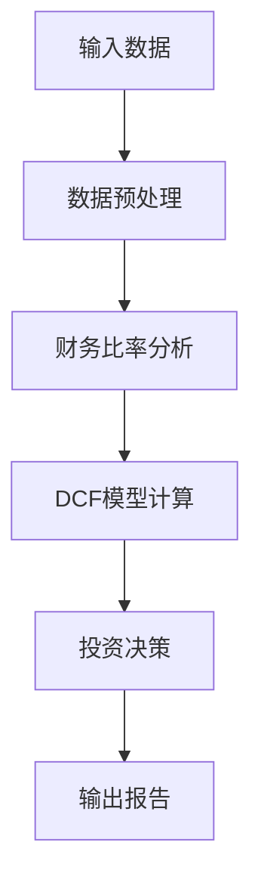
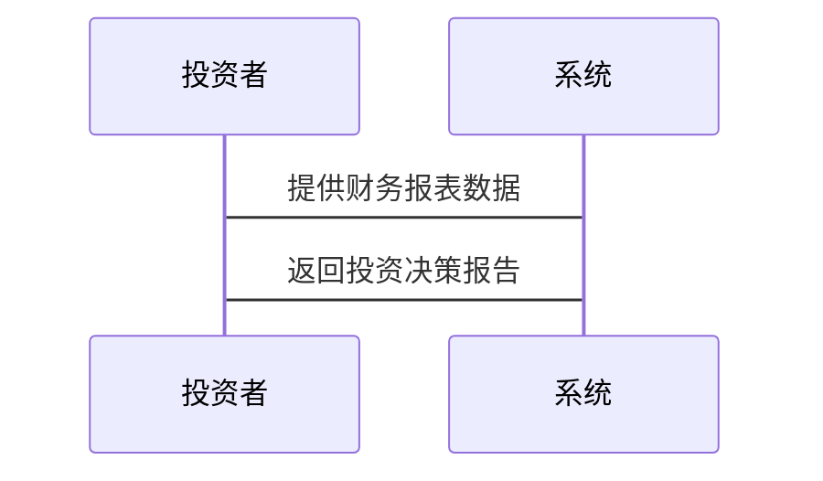

                 


```markdown
# 价值投资与公司财务政策

---

## 关键词：价值投资、公司财务政策、DCF模型、资本结构、股息率、财务报表分析、投资策略

---

## 摘要：
本文将探讨价值投资与公司财务政策之间的关系，分析如何通过公司财务政策的视角来进行价值投资。文章从价值投资的核心概念出发，结合公司财务政策的关键要素，深入解析如何通过财务报表分析、现金流贴现模型（DCF模型）、资本结构优化等方法来评估公司的内在价值，并制定相应的投资策略。文章还通过实际案例分析，展示了如何将这些理论应用于实践，为投资者提供了系统的指导。

---

## 第一部分：价值投资与公司财务政策的背景介绍

### 第1章：价值投资与公司财务政策的背景介绍

#### 1.1 价值投资的核心概念
##### 1.1.1 价值投资的定义与特点
- 价值投资是一种长期投资策略，强调以低于内在价值的价格买入优质资产。
- 其特点包括：注重基本面分析、长期持有、逆向投资、安全边际等。

##### 1.1.2 价值投资与公司财务政策的关系
- 公司财务政策是企业管理和分配资源的策略，直接影响公司的价值。
- 价值投资者通过分析公司财务政策，评估其对股东价值的影响。

##### 1.1.3 价值投资的哲学基础
- 价值投资的哲学基础包括：市场有效性假说、人性的非理性、价值与价格的分离等。

#### 1.2 公司财务政策的定义与作用
##### 1.2.1 公司财务政策的定义
- 公司财务政策是企业在财务管理方面的基本方针和策略，包括资本预算、资本结构、股利政策等。

##### 1.2.2 公司财务政策的核心要素
- 资本结构：权益资本与债务资本的比例。
- 股利政策：股利的分配方式和频率。
- 资本预算：项目的投资决策。

##### 1.2.3 公司财务政策对价值投资的影响
- 财务政策直接影响公司的盈利能力、成长性和风险水平，从而影响其内在价值。

#### 1.3 价值投资与公司财务政策的联系
##### 1.3.1 价值投资视角下的公司财务分析
- 价值投资者通过分析公司的财务报表和政策，评估其内在价值。
- 重点关注ROE（净资产收益率）、ROA（资产回报率）等财务指标。

##### 1.3.2 公司财务政策对股东价值的影响
- 合理的资本结构和股利政策可以提升公司价值。
- 不当的财务政策可能导致公司价值的下降。

##### 1.3.3 价值投资与公司财务政策的互动关系
- 价值投资者通过分析公司财务政策，影响市场对公司的估值。
- 公司通过调整财务政策，优化股东价值，吸引价值投资者。

#### 1.4 本章小结
- 本章介绍了价值投资与公司财务政策的基本概念和关系，为后续分析奠定了基础。

---

## 第二部分：价值投资的核心概念与分析框架

### 第2章：价值投资的评估方法

#### 2.1 现金流贴现模型（DCF模型）
##### 2.1.1 DCF模型的定义与原理
- 现金流贴现模型（Discounted Cash Flow，DCF）是一种通过将未来现金流折现到现值来评估公司价值的方法。
- 公式：$$ \text{公司价值} = \sum_{t=1}^{n} \frac{\text{现金流}}{(1 + r)^t} $$
- 其中，\( r \) 是折现率，通常为公司的加权平均资本成本（WACC）。

##### 2.1.2 DCF模型的计算步骤
1. 预测未来现金流。
2. 确定合适的折现率。
3. 将未来现金流折现，计算现值。
4. 计算公司价值。

##### 2.1.3 DCF模型在公司估值中的应用
- 适用于成长型公司和成熟公司的估值。
- 通过DCF模型，投资者可以发现市场价格与内在价值的差异，从而找到被低估的投资标的。

##### 2.1.4 实例分析：DCF模型在某公司估值中的应用
```python
# 示例代码：DCF模型的简单实现
def dcf_model(fcf, wacc, n):
    # fcf：自由现金流
    # wacc：加权平均资本成本
    # n：预测年数
    present_value = 0
    for t in range(1, n+1):
        present_value += fcf * (1 + growth_rate) ** (t-1) / (1 + wacc) ** t
    return present_value

# 假设数据
fcf = [100, 120, 140, 160]
wacc = 0.10
n = 4

value = dcf_model(fcf, wacc, n)
print(f"公司价值：{value}")
```

#### 2.2 市盈率与市净率分析
##### 2.2.1 市盈率的定义与计算
- 市盈率（P/E）= 市场价格 / 每股收益（EPS）。
- 公式：$$ P/E = \frac{\text{股价}}{\text{每股收益}} $$

##### 2.2.2 市净率的定义与计算
- 市净率（P/B）= 市场价格 / 每股净资产（BPS）。
- 公式：$$ P/B = \frac{\text{股价}}{\text{每股净资产}} $$

##### 2.2.3 市盈率与市净率在价值投资中的应用
- 市盈率和市净率是衡量公司估值的重要指标。
- 价值投资者通常寻找市盈率和市净率低于行业平均水平的公司。

#### 2.3 股息率与股息支付率分析
##### 2.3.1 股息率的定义与计算
- 股息率 = 每股股息 / 股价。
- 公式：$$ \text{股息率} = \frac{\text{每股股息}}{\text{股价}} $$

##### 2.3.2 股息支付率的定义与计算
- 股息支付率 = 股息 / 净利润。
- 公式：$$ \text{股息支付率} = \frac{\text{股息}}{\text{净利润}} $$

##### 2.3.3 股息率与股息支付率在价值投资中的应用
- 高股息率和高股息支付率通常意味着公司具有较强的分红能力。
- 价值投资者关注高股息率的公司，尤其是那些股息率稳定的公司。

#### 2.4 本章小结
- 本章介绍了价值投资中常用的几种估值方法，包括DCF模型、市盈率、市净率、股息率等。

---

## 第三部分：公司财务政策的分析与应用

### 第3章：公司资本结构与资本成本分析

#### 3.1 公司资本结构的定义与影响因素
##### 3.1.1 资本结构的定义
- 资本结构是指公司权益资本与债务资本的比例。

##### 3.1.2 资本结构的影响因素
- 行业特性、公司规模、财务状况、市场环境等。

##### 3.1.3 资本结构对价值投资的影响
- 合理的资本结构可以降低资本成本，提升公司价值。

#### 3.2 资本成本的计算与分析
##### 3.2.1 资本成本的定义与计算公式
- 资本成本是公司获取和使用资本所付出的代价。
- WACC（加权平均资本成本）公式：
  $$ \text{WACC} = \frac{D}{V} \times r_d \times (1 - t) + \frac{E}{V} \times r_e $$

##### 3.2.2 加权平均资本成本（WACC）的计算
- WACC是公司整体资本成本的加权平均值。
- 示例计算：
  - 假设D/E=1，r_d=5%，r_e=10%，税率t=20%。
  - WACC = 0.5×5%×(1-0.2) + 0.5×10% = 4% + 5% = 9%。

#### 3.3 公司资本结构优化与价值最大化
##### 3.3.1 资本结构优化的定义
- 通过调整资本结构，使公司价值最大化。

##### 3.3.2 资本结构优化的方法
- 比较成本法、边际成本法、企业价值法等。

##### 3.3.3 资本结构优化与价值最大化的关系
- 优化资本结构可以降低资本成本，提升公司价值。

#### 3.4 本章小结
- 本章分析了公司资本结构与资本成本的关系，探讨了资本结构优化对价值最大化的影响。

---

## 第四部分：价值投资与公司财务政策的结合

### 第4章：价值投资视角下的公司财务分析

#### 4.1 财务报表分析在价值投资中的应用
##### 4.1.1 财务报表分析的定义与方法
- 财务报表分析是通过分析公司的财务报表，评估其财务状况和经营成果。

##### 4.1.2 财务报表分析在价值投资中的重要性
- 财务报表分析是价值投资的核心工具之一。

##### 4.1.3 财务报表分析的具体步骤
1. 分析资产负债表，评估公司资产、负债和所有者权益的结构。
2. 分析利润表，评估公司的收入、成本和利润。
3. 分析现金流量表，评估公司的现金流状况。

#### 4.2 财务比率分析在价值投资中的应用
##### 4.2.1 财务比率的定义与分类
- 财务比率分为盈利能力、偿债能力、运营能力和成长能力四类。

##### 4.2.2 常见财务比率的计算与分析
- 净资产收益率（ROE）：$$ \text{ROE} = \frac{\text{净利润}}{\text{净资产}} $$
- 销售净利率：$$ \text{销售净利率} = \frac{\text{净利润}}{\text{营业收入}} $$
- 速动比率：$$ \text{速动比率} = \frac{\text{流动资产 - 存货}}{\text{流动负债}} $$

##### 4.2.3 财务比率在价值投资中的应用实例
- 通过分析ROE、ROA等指标，评估公司的盈利能力。
- 通过分析速动比率等指标，评估公司的偿债能力。

#### 4.3 财务政策对公司价值的影响
##### 4.3.1 财务政策的定义与分类
- 财务政策包括资本预算、资本结构和股利政策。

##### 4.3.2 财务政策对公司价值的影响路径
- 股利政策影响股东的现金流，资本结构影响资本成本，资本预算影响公司的成长性。

##### 4.3.3 财务政策在价值投资中的应用实例
- 通过分析公司的股利政策，评估其分红能力。
- 通过分析资本结构，评估其资本成本。

#### 4.4 本章小结
- 本章从价值投资的角度，分析了财务报表和财务比率在公司估值中的应用。

---

## 第五部分：价值投资与公司财务政策的实证分析

### 第5章：项目实战——价值投资与公司财务政策的综合应用

#### 5.1 项目背景与目标
- 通过分析某公司的财务报表和财务政策，评估其内在价值，并制定相应的投资策略。

#### 5.2 系统分析与架构设计
##### 5.2.1 项目介绍
- 项目目标：分析某公司财务政策，评估其内在价值。
- 数据来源：公司财务报表、行业数据、市场数据。

##### 5.2.2 系统功能设计
- 数据采集：获取公司财务报表和市场数据。
- 数据分析：计算财务比率、DCF模型等。
- 投资决策：基于分析结果，制定投资策略。

##### 5.2.3 系统架构设计


##### 5.2.4 系统接口设计
- 输入接口：财务报表数据接口。
- 输出接口：投资决策报告输出接口。

##### 5.2.5 系统交互设计


#### 5.3 项目核心实现
##### 5.3.1 环境安装
- 安装Python和相关库（Pandas、NumPy、Matplotlib）。
- 示例代码：
  ```python
  import pandas as pd
  import numpy as np
  ```

##### 5.3.2 核心代码实现
- 计算DCF模型：
  ```python
  def calculateDCF(fcf, wacc, n):
      present_value = 0
      for t in range(1, n+1):
          present_value += fcf * (1 + growth_rate) ** (t-1) / (1 + wacc) ** t
      return present_value
  ```

- 计算财务比率：
  ```python
  def calculateROE(net_income, equity):
      return net_income / equity
  ```

##### 5.3.3 代码应用解读与分析
- 通过代码实现DCF模型和财务比率计算，评估公司内在价值。

#### 5.4 实际案例分析
##### 5.4.1 案例背景介绍
- 选择某公司作为案例，分析其财务政策和内在价值。

##### 5.4.2 数据分析与计算
- 计算公司的ROE、DCF模型等，评估其内在价值。

##### 5.4.3 投资策略制定
- 根据分析结果，制定相应的投资策略。

#### 5.5 项目小结
- 本章通过实际案例分析，展示了如何将价值投资与公司财务政策结合，制定投资策略。

---

## 第六部分：总结与展望

### 第6章：总结与展望

#### 6.1 本章总结
- 本文从价值投资与公司财务政策的关系出发，分析了财务政策在价值投资中的应用。
- 探讨了DCF模型、财务比率等方法在公司估值中的应用。

#### 6.2 对未来研究的展望
- 进一步研究不同行业和市场环境下的价值投资策略。
- 探讨人工智能技术在价值投资与公司财务政策分析中的应用。

#### 6.3 本章小结
- 本文为价值投资者提供了系统的指导，未来的研究将进一步深化。

---

## 附录：参考文献与工具

- **参考文献**：
  1. Graham, B. (1974). *The Intelligent Investor*.  
  2. Fama, E. F. (1970). *Efficient Capital Markets: A Review of Theory and Practice*.  
  3. Modigliani, F., & Miller, M. H. (1958). *The Cost of Capital, Corporation Finance, and the Theory of Investment*.  

- **工具**：
  1. Python编程语言。
  2. 数据分析库：Pandas、NumPy。
  3. 图形绘制工具：Matplotlib、Seaborn。

---

## 作者：AI天才研究院/AI Genius Institute & 禅与计算机程序设计艺术 /Zen And The Art of Computer Programming
```

