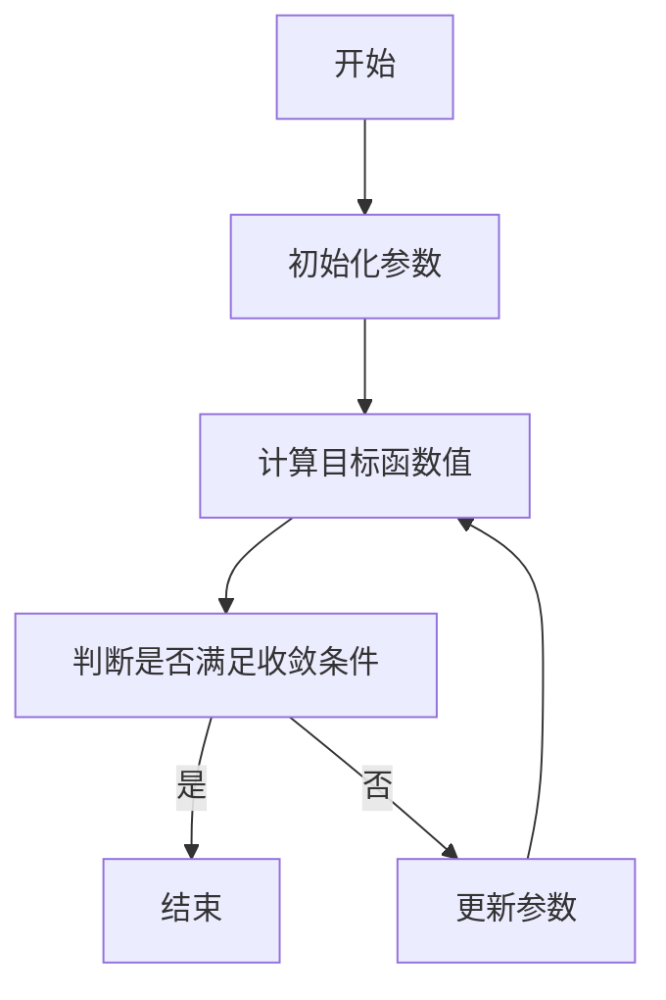
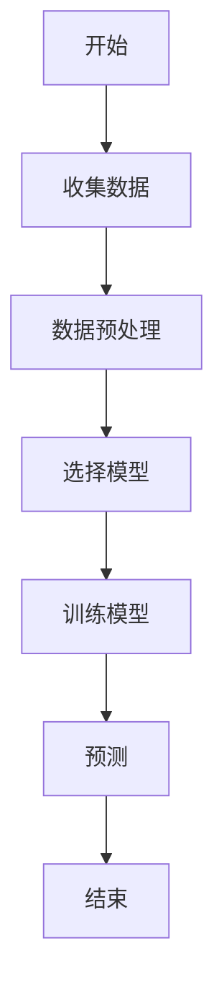

                 


# 价值投资中的智能电网分布式能源管理分析

---

## 关键词

智能电网、分布式能源管理、价值投资、算法原理、系统架构、项目实战、数学模型

---

## 摘要

本文探讨了智能电网分布式能源管理中的价值投资分析方法。首先介绍了智能电网和分布式能源管理的基本概念及其在价值投资中的应用。然后分析了智能电网和分布式能源管理的背景、现状及挑战。接着，详细讲解了智能电网分布式能源管理的核心概念与联系，包括优化算法、预测模型和价值评估模型。最后，通过项目实战展示了分布式能源管理系统的实现与应用，总结了最佳实践和未来发展方向。

---

## 第一章: 智能电网与分布式能源管理概述

### 1.1 智能电网的基本概念

#### 1.1.1 智能电网的定义与特点

智能电网是一种基于信息技术和自动化技术的现代化电网系统。其特点是高效、可靠、灵活和可持续。智能电网通过智能化的设备和系统，实现对电力的实时监测、优化分配和智能管理。

- **高效性**：通过优化电力分配和减少能量损失，提高能源利用效率。
- **可靠性**：通过实时监控和快速响应，确保电网的稳定运行。
- **灵活性**：能够适应可再生能源的接入和分布式能源的管理。
- **可持续性**：通过减少化石能源的使用，支持绿色能源的发展。

#### 1.1.2 分布式能源管理的定义与特点

分布式能源管理是指对分布式能源资源（如太阳能、风能、生物质能等）进行规划、优化和管理的过程。其特点包括：

- **去中心化**：能源生产、存储和分配的去中心化，减少了对中央电网的依赖。
- **灵活性**：能够根据需求动态调整能源的生产和分配。
- **环保性**：通过使用可再生能源，减少碳排放，支持可持续发展。

#### 1.1.3 智能电网与分布式能源管理的结合

智能电网和分布式能源管理的结合是未来能源系统的重要发展趋势。智能电网为分布式能源管理提供了技术支持，而分布式能源管理则为智能电网的灵活性和可持续性提供了保障。

---

### 1.2 价值投资在智能电网中的应用

#### 1.2.1 价值投资的基本概念

价值投资是一种投资策略，强调以低于其内在价值的价格买入优质资产。其核心思想是寻找那些被市场低估的资产，并长期持有。

#### 1.2.2 智能电网中的价值投资机会

智能电网和分布式能源管理的快速发展为投资者提供了许多价值投资的机会。例如：

- **可再生能源企业**：投资于太阳能、风能等可再生能源企业，利用其增长潜力和政策支持。
- **智能电网技术企业**：投资于智能电网设备、软件和服务提供商，利用其技术创新和市场扩展。
- **能源管理服务企业**：投资于提供分布式能源管理服务的企业，利用其服务需求的增长。

#### 1.2.3 分布式能源管理中的价值分析

在分布式能源管理中，价值投资需要考虑的因素包括：

- **技术可行性**：分布式能源管理技术是否成熟，是否具有可扩展性。
- **市场需求**：分布式能源管理的需求是否足够大，是否具有长期增长潜力。
- **成本效益**：分布式能源管理的实施成本是否合理，是否能够带来显著的经济效益。

---

## 第二章: 智能电网与分布式能源管理的背景与现状

### 2.1 智能电网的发展历程

#### 2.1.1 传统电网的局限性

传统电网系统存在以下问题：

- **效率低下**：电力传输过程中存在较大的能量损失。
- **灵活性差**：难以适应可再生能源的接入和分布式能源的管理。
- **可靠性低**：容易受到自然灾害和设备故障的影响。

#### 2.1.2 智能电网的兴起与发展趋势

随着能源结构的变化和技术的进步，智能电网逐渐兴起。其发展趋势包括：

- **智能化**：通过物联网、大数据和人工智能技术，实现电网的智能化管理。
- **绿色化**：通过支持可再生能源的发展，减少碳排放。
- **分布式化**：通过分布式能源管理，实现能源的灵活分配和利用。

#### 2.1.3 国内外智能电网的发展现状

目前，全球许多国家都在积极推进智能电网的建设。例如，美国、欧洲和中国等国家和地区已经投入大量资金和资源，推动智能电网的技术研发和应用。

---

### 2.2 分布式能源管理的背景与挑战

#### 2.2.1 分布式能源的基本概念

分布式能源是指在用户侧或靠近用户侧建设小型化、分散化的能源生产设施，例如分布式光伏、分布式风电等。

#### 2.2.2 分布式能源管理的必要性

随着可再生能源的快速发展，分布式能源管理变得越来越重要。其必要性体现在：

- **减少能源浪费**：通过优化能源的生产和分配，减少能源浪费。
- **提高能源效率**：通过智能管理，提高能源的利用效率。
- **支持可持续发展**：通过减少化石能源的使用，支持绿色能源的发展。

#### 2.2.3 分布式能源管理的主要挑战

分布式能源管理面临的主要挑战包括：

- **技术挑战**：分布式能源管理需要复杂的技术支持，例如智能传感器、数据通信和优化算法等。
- **经济挑战**：分布式能源管理的投资成本较高，需要长期的资金投入。
- **政策挑战**：需要政府的政策支持和法规的完善，才能实现大规模的应用。

---

## 第三章: 智能电网分布式能源管理的核心概念与联系

### 3.1 核心概念与原理

#### 3.1.1 智能电网的组成部分

智能电网主要包括以下几个部分：

- **智能传感器**：用于实时监测电网的运行状态。
- **智能设备**：用于自动控制电网的运行，例如智能断路器、智能变压器等。
- **智能系统**：用于数据的分析和决策，例如能量管理系统、配电管理系统等。

#### 3.1.2 分布式能源管理的实现机制

分布式能源管理的实现机制主要包括：

- **数据采集**：通过智能传感器采集分布式能源的运行数据。
- **数据传输**：通过数据通信技术将数据传输到管理平台。
- **数据分析**：通过优化算法和预测模型，分析数据并制定管理策略。
- **策略执行**：根据分析结果，执行相应的控制策略，例如调整能源的生产和分配。

#### 3.1.3 价值投资在分布式能源管理中的作用

在分布式能源管理中，价值投资的作用体现在：

- **选择优质企业**：通过分析企业的技术、市场和财务状况，选择具有投资价值的企业。
- **评估项目风险**：通过分析项目的可行性和风险，制定合理的投资策略。
- **实现投资回报**：通过长期持有优质资产，实现投资回报的最大化。

---

### 3.2 核心概念的对比分析

#### 3.2.1 智能电网与传统电网的对比

以下是智能电网与传统电网的对比：

| 对比维度 | 智能电网 | 传统电网 |
|----------|----------|-----------|
| 管理方式 | 智能化、去中心化 | 集中式、人工化 |
| 可再生能源支持 | 支持分布式能源接入 | 依赖化石能源 |
| 灵活性 | 高 | 低 |
| 可靠性 | 高 | 中 |

#### 3.2.2 分布式能源管理与集中式能源管理的对比

以下是分布式能源管理与集中式能源管理的对比：

| 对比维度 | 分布式能源管理 | 集中式能源管理 |
|----------|----------------|----------------|
| 管理方式 | 去中心化、灵活 | 集中式、刚性 |
| 可再生能源支持 | 支持 | 不支持 |
| 可扩展性 | 高 | 低 |
| 管理成本 | 中 | 高 |

#### 3.2.3 价值投资与传统投资的对比

以下是价值投资与传统投资的对比：

| 对比维度 | 价值投资 | 传统投资 |
|----------|----------|-----------|
| 投资策略 | 买入低于内在价值的资产 | 追逐短期收益 |
| 投资期限 | 长期持有 | 短期交易 |
| 风险控制 | 通过深入分析降低风险 | 依赖市场波动 |

---

### 3.3 实体关系图与流程图

#### 3.3.1 智能电网分布式能源管理的实体关系图（ER图）

```mermaid
erDiagram
    actor 投资者
    actor 电力用户
    actor 可再生能源企业
    actor 电网公司
    actor 政府机构
    class 智能传感器
    class 智能设备
    class 智能系统
    class 数据中心
    class 优化算法
    class 预测模型
    class 投资决策
    class 管理策略
    class 电力分配
    class 监控与反馈
    投资者 --> 智能系统 : 提供投资决策
    电力用户 --> 智能系统 : 提供用电需求
    可再生能源企业 --> 智能系统 : 提供能源供应
    电网公司 --> 智能系统 : 提供电网支持
    政府机构 --> 智能系统 : 提供政策支持
    智能传感器 --> 数据中心 : 传输数据
    智能设备 --> 数据中心 : 传输数据
    数据中心 --> 优化算法 : 提供数据支持
    数据中心 --> 预测模型 : 提供数据支持
    优化算法 --> 管理策略 : 提供优化结果
    预测模型 --> 管理策略 : 提供预测结果
    管理策略 --> 智能设备 : 执行策略
    管理策略 --> 电力分配 : 调整分配
    电力分配 --> 电力用户 : 提供电力
    监控与反馈 --> 智能系统 : 提供反馈
```

---

## 第四章: 智能电网分布式能源管理的算法原理

### 4.1 常见算法概述

#### 4.1.1 优化算法

优化算法是分布式能源管理的核心算法之一。常用的优化算法包括：

- **线性规划（Linear Programming, LP）**：用于解决线性优化问题。
- **非线性规划（Non-Linear Programming, NLP）**：用于解决非线性优化问题。
- **遗传算法（Genetic Algorithm, GA）**：模拟生物进化过程，用于全局优化。
- **粒子群优化（Particle Swarm Optimization, PSO）**：模拟粒子群的行为，用于寻找最优解。

#### 4.1.2 预测算法

预测算法用于预测分布式能源的生产和需求。常用的预测算法包括：

- **时间序列分析（Time Series Analysis）**：基于历史数据预测未来趋势。
- **回归分析（Regression Analysis）**：通过建立回归模型预测能源需求。
- **机器学习算法（Machine Learning Algorithms）**：如随机森林、支持向量机等，用于复杂预测。

#### 4.1.3 分布式计算算法

分布式计算算法用于在分布式系统中进行计算和数据处理。常用的分布式计算算法包括：

- **MapReduce**：用于分布式数据处理和并行计算。
- **Spark**：用于大规模数据处理和机器学习。
- **Hadoop**：用于分布式存储和计算。

---

### 4.2 算法流程图

#### 4.2.1 优化算法流程图（Mermaid）



#### 4.2.2 预测算法流程图（Mermaid）



---

### 4.3 算法实现与代码

#### 4.3.1 优化算法的Python实现

```python
import numpy as np

def objective_function(x):
    return x**2 + 2*x + 1

def optimization_algorithm():
    x = np.array([0.0])
    for _ in range(100):
        x_new = x + np.random.random() * 2 - 1
        if objective_function(x_new) < objective_function(x):
            x = x_new
    return x

result = optimization_algorithm()
print("最优解:", result)
```

#### 4.3.2 预测模型的Python实现

```python
from sklearn import linear_model

# 数据准备
X = np.array([[1], [2], [3], [4], [5]])
y = np.array([2, 4, 6, 8, 10])

# 创建回归模型
model = linear_model.LinearRegression()

# 训练模型
model.fit(X, y)

# 预测
print("预测值:", model.predict(np.array([[6]])))
```

---

### 4.4 数学模型与公式

#### 4.4.1 优化模型

优化模型的目标是最小化目标函数，受约束于一定的约束条件：

$$ \min f(x) $$
$$ \text{subject to} \quad g(x) \leq 0 $$

其中，$f(x)$ 是目标函数，$g(x)$ 是约束函数。

#### 4.4.2 预测模型

回归模型的预测公式为：

$$ y = \beta_0 + \beta_1 x + \epsilon $$

其中，$\beta_0$ 是截距，$\beta_1$ 是斜率，$\epsilon$ 是误差项。

#### 4.4.3 价值评估模型

价值评估模型的核心公式是：

$$ \text{内在价值} = \frac{\text{未来现金流}}{\text{折现率}} $$

---

## 第五章: 智能电网分布式能源管理的数学模型与公式

### 5.1 数学模型概述

#### 5.1.1 优化模型

优化模型用于分布式能源管理中的资源优化配置和调度。常见的优化模型包括线性规划模型、非线性规划模型等。

#### 5.1.2 预测模型

预测模型用于预测分布式能源的生产和需求，常用的时间序列分析和机器学习模型。

#### 5.1.3 价值评估模型

价值评估模型用于评估分布式能源项目的投资价值，常用的方法包括净现值（Net Present Value, NPV）和内部收益率（Internal Rate of Return, IRR）。

---

### 5.2 关键公式推导

#### 5.2.1 优化模型的数学公式

优化模型的数学公式可以表示为：

$$ \min_{x} \quad f(x) $$
$$ \text{subject to} \quad g(x) \leq 0 $$

其中，$x$ 是优化变量，$f(x)$ 是目标函数，$g(x)$ 是约束函数。

#### 5.2.2 预测模型的数学公式

回归模型的预测公式为：

$$ y = \beta_0 + \beta_1 x + \epsilon $$

其中，$\beta_0$ 是截距，$\beta_1$ 是斜率，$\epsilon$ 是误差项。

#### 5.2.3 价值评估模型的数学公式

净现值的计算公式为：

$$ NPV = \sum_{t=1}^{n} \frac{C_t}{(1 + r)^t} $$

其中，$C_t$ 是第 $t$ 年的现金流，$r$ 是折现率，$n$ 是项目的生命周期。

---

## 总结

智能电网分布式能源管理是一个复杂而重要的领域，涉及技术、经济和政策等多个方面。通过价值投资的方法，可以更好地识别和评估分布式能源管理中的投资机会。未来，随着技术的进步和政策的支持，智能电网和分布式能源管理将更加普及和重要。投资者需要密切关注相关技术和市场动态，以实现投资回报的最大化。

---

## 作者

作者：AI天才研究院/AI Genius Institute & 禅与计算机程序设计艺术/Zen And The Art of Computer Programming

