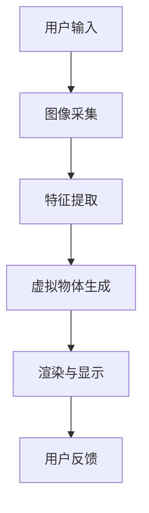
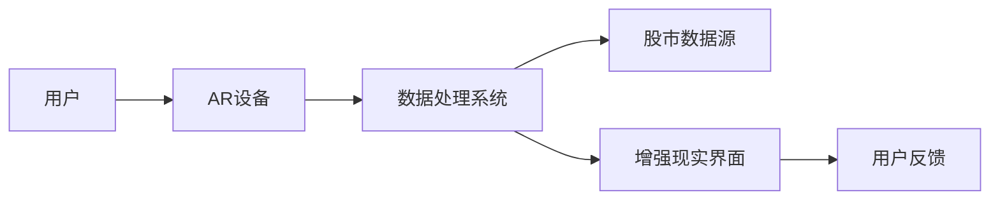
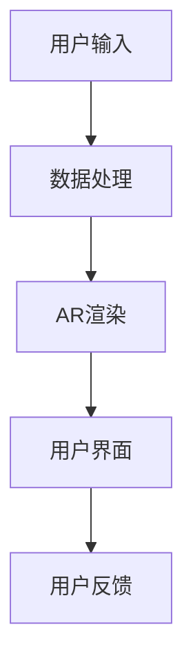
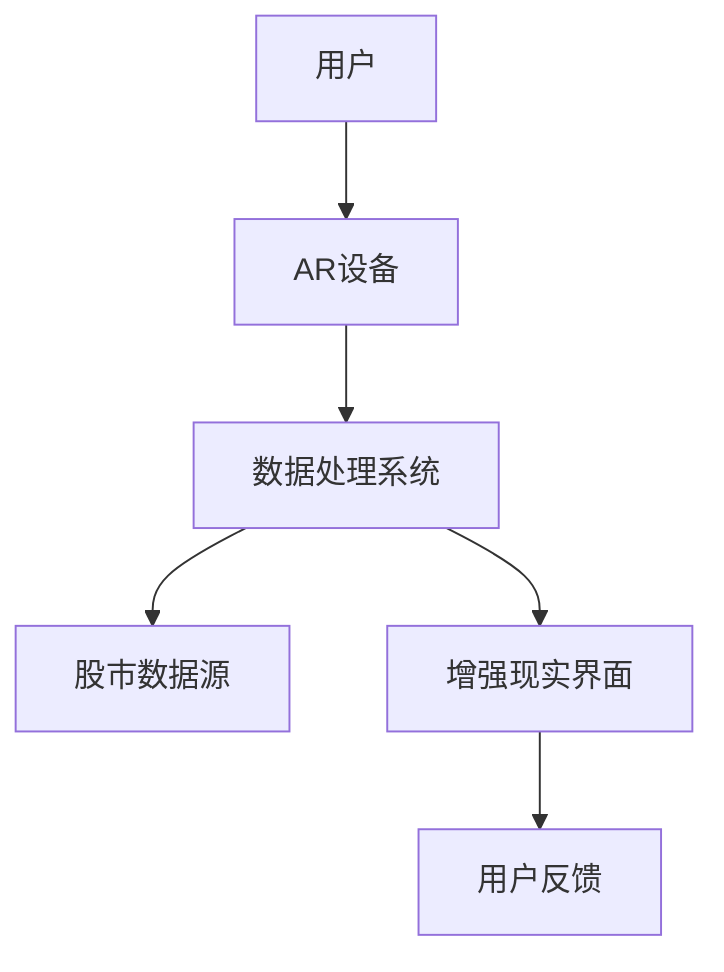

                 


# 全球股市估值与增强现实在远程协作中的应用

> 关键词：全球股市估值，增强现实，远程协作，数据可视化，投资决策，AR技术，实时数据，金融分析

> 摘要：本文探讨了全球股市估值与增强现实在远程协作中的应用，分析了增强现实技术如何提升股市估值的可视化与决策支持能力。通过详细阐述增强现实的核心原理、算法实现、系统架构和实际案例，本文为远程协作环境下的股市估值提供了创新的技术解决方案。

---

## 目录大纲

# 第1章 全球股市估值与增强现实概述

## 1.1 全球股市估值的基本概念

### 1.1.1 股市估值的定义与意义

股市估值是指对股票市场整体或个股的价值进行评估的过程，目的是为投资者提供决策依据。传统估值方法包括市盈率（P/E）、市净率（P/B）、股息率等。

### 1.1.2 市场估值的主要方法

- **绝对估值法**：通过DCF模型、股息贴现模型等方法估算股票的内在价值。
- **相对估值法**：通过比较股票与市场指数或行业平均市盈率等指标，判断其估值是否合理。

### 1.1.3 股市估值的边界与外延

股市估值不仅关注个股，还包括整体市场的估值，如指数基金、ETF等。此外，估值还与宏观经济、行业周期、政策环境密切相关。

## 1.2 增强现实（AR）技术的基本概念

### 1.2.1 增强现实的定义与特点

增强现实（AR）是通过计算机生成的虚拟信息叠加在真实环境中，以提高用户体验的技术。其特点包括实时性、交互性、沉浸式和可视化。

### 1.2.2 AR技术的核心要素

- **传感器**：用于捕捉真实环境的数据，如摄像头、加速度计等。
- **渲染引擎**：用于将虚拟信息叠加到真实环境中，如OpenGL、WebGL等。
- **交互方式**：支持手势、语音、触控等多种交互方式。

### 1.2.3 AR与虚拟现实（VR）的区别

| 方面     | AR                          | VR                          |
|----------|-----------------------------|-----------------------------|
| 定义     | 增强现实，叠加虚拟信息     | 虚拟现实，完全沉浸虚拟世界 |
| 交互方式 | 支持现实与虚拟交互         | 专注于虚拟环境中的交互     |
| 应用场景 | 辅助决策、数据可视化       | 游戏、教育培训、虚拟仿真   |

## 1.3 增强现实在远程协作中的应用前景

### 1.3.1 远程协作的基本概念

远程协作是指通过网络技术，实现分布在不同地点的人员之间的协作。常见场景包括团队开发、远程会议、虚拟办公等。

### 1.3.2 AR在远程协作中的优势

- **提升可视化能力**：通过AR技术，用户可以在虚拟空间中直观地看到数据和信息。
- **增强交互性**：AR支持手势、语音等多种交互方式，提升协作效率。
- **降低沟通成本**：通过AR技术，团队成员可以更直观地理解彼此的意图。

### 1.3.3 全球股市估值与AR结合的潜力

AR技术可以将实时的股市数据叠加到虚拟环境中，帮助投资者更直观地分析市场趋势和个股表现。例如，通过AR眼镜，投资者可以在实时市场数据中看到股票走势的三维可视化。

## 1.4 本章小结

本章介绍了全球股市估值的基本概念和主要方法，分析了增强现实技术的核心要素及其在远程协作中的应用前景。通过AR技术，股市估值的可视化和决策支持能力将得到显著提升。

---

# 第2章 增强现实的核心原理

## 2.1 增强现实的技术基础

### 2.1.1 AR的核心技术组成

- **图像识别**：通过摄像头捕捉真实环境，识别目标物体的位置和姿态。
- **三维建模**：将虚拟物体与真实环境进行匹配，生成逼真的叠加效果。
- **渲染与显示**：将叠加后的虚拟信息实时呈现给用户。

### 2.1.2 AR的实现原理

AR的核心是将虚拟信息与真实环境精确对齐。其实现步骤包括：图像采集、特征提取、虚拟物体生成、渲染与显示。

### 2.1.3 AR的交互方式

AR支持多种交互方式，包括：

- **手势交互**：通过手势识别技术，用户可以通过手势操作虚拟物体。
- **语音交互**：通过语音识别技术，用户可以通过语音指令控制AR系统。
- **触觉交互**：通过触觉反馈设备，用户可以感受到虚拟物体的存在。

### 2.1.4 AR技术的流程图



## 2.2 增强现实的实体关系与流程图

### 2.2.1 ER实体关系图



### 2.2.2 AR技术的流程图



## 2.3 AR技术在远程协作中的应用

### 2.3.1 AR在远程协作中的核心要素

- **实时性**：AR需要实时处理和显示数据，确保协作的高效性。
- **准确性**：AR需要精确地将虚拟信息与真实环境对齐，确保协作的准确性。
- **可扩展性**：AR系统需要支持大规模用户同时协作，确保系统的可扩展性。

### 2.3.2 AR与远程协作的结合方式

- **虚拟白板**：通过AR技术，用户可以在虚拟白板上共享和编辑文档。
- **三维空间协作**：通过AR技术，用户可以在三维空间中共同完成任务。
- **实时数据可视化**：通过AR技术，用户可以实时查看和分析数据。

### 2.3.3 AR在远程协作中的优势与挑战

| 方面     | 优势                         | 挑战                       |
|----------|----------------------------|----------------------------|
| 可视化能力 | 提升协作效率                 | 技术复杂性高               |
| 交互性    | 增强用户体验                 | 设备成本高                 |
| 实时性    | 支持快速反馈                 | 网络延迟问题               |

## 2.4 本章小结

本章详细介绍了增强现实的核心原理，包括其技术基础、交互方式和在远程协作中的应用。通过AR技术，远程协作的可视化和交互能力将得到显著提升。

---

# 第3章 全球股市估值与增强现实在远程协作中的结合

## 3.1 全球股市估值的传统方法

### 3.1.1 市盈率法

市盈率法通过比较股票的市盈率与行业平均水平，判断其估值是否合理。

$$ 市盈率 = \frac{股价}{每股收益} $$

### 3.1.2 市净率法

市净率法通过比较股票的市净率与行业平均水平，判断其估值是否合理。

$$ 市净率 = \frac{股价}{每股净资产} $$

### 3.1.3 股息率法

股息率法通过比较股票的股息率与行业平均水平，判断其估值是否合理。

$$ 股息率 = \frac{每股股息}{股价} $$

## 3.2 基于现代技术的股市估值方法

### 3.2.1 机器学习在股市估值中的应用

机器学习通过分析历史数据，预测股票的未来走势。

### 3.2.2 大数据分析在股市估值中的应用

大数据分析通过整合多源数据，提供更全面的市场洞察。

### 3.2.3 自然语言处理在股市估值中的应用

自然语言处理通过分析新闻、财报等文本数据，提取市场情绪。

## 3.3 增强现实在股市估值中的潜在应用

### 3.3.1 AR在数据可视化中的应用

通过AR技术，用户可以在虚拟空间中直观地看到股票走势的三维可视化。

### 3.3.2 AR在实时数据监控中的应用

通过AR技术，用户可以实时监控股票市场的动态，及时发现异常情况。

### 3.3.3 AR在投资决策支持中的应用

通过AR技术，用户可以在虚拟空间中进行投资决策的模拟和优化。

## 3.4 本章小结

本章探讨了全球股市估值的传统方法和现代技术应用，分析了增强现实在股市估值中的潜在应用。通过AR技术，股市估值的可视化和决策支持能力将得到显著提升。

---

# 第4章 增强现实与远程协作的算法与系统设计

## 4.1 算法原理

### 4.1.1 机器学习算法

通过机器学习算法，系统可以预测股票的未来走势。

### 4.1.2 大数据分析算法

通过大数据分析算法，系统可以整合多源数据，提供更全面的市场洞察。

## 4.2 系统架构设计

### 4.2.1 系统功能设计

- **用户界面**：提供直观的操作界面，支持用户进行数据查询和分析。
- **数据处理**：整合多源数据，提供实时的市场动态。
- **AR渲染**：将虚拟信息叠加到真实环境中，提供增强的可视化体验。

### 4.2.2 系统架构图



## 4.3 接口设计

### 4.3.1 用户接口

- **输入接口**：支持手势、语音等多种交互方式。
- **输出接口**：通过AR设备，将虚拟信息呈现给用户。

### 4.3.2 系统接口

- **数据接口**：与股市数据源对接，获取实时数据。
- **API接口**：提供RESTful API，支持第三方应用集成。

## 4.4 本章小结

本章详细介绍了增强现实与远程协作的算法与系统设计，包括算法原理、系统架构和接口设计。通过这些技术，AR系统可以实现高效的远程协作和实时的数据处理。

---

# 第5章 项目实战：基于AR的远程协作系统开发

## 5.1 环境配置

### 5.1.1 开发工具

- **AR开发框架**：如ARKit、ARCore等。
- **数据处理工具**：如Python、Pandas等。
- **可视化工具**：如Matplotlib、Seaborn等。

### 5.1.2 系统安装与配置

- **操作系统**：推荐使用Windows、macOS或Linux。
- **硬件配置**：需要高性能的CPU和GPU，支持AR设备。

## 5.2 系统核心实现

### 5.2.1 数据处理

通过Python和Pandas，处理股市数据，提取关键指标。

### 5.2.2 AR渲染

通过AR开发框架，将虚拟信息叠加到真实环境中，提供增强的可视化体验。

## 5.3 代码实现

### 5.3.1 数据处理代码

```python
import pandas as pd

# 读取数据
data = pd.read_csv('stock_data.csv')

# 计算市盈率
data['PE'] = data['股价'] / data['每股收益']

# 计算市净率
data['PB'] = data['股价'] / data['每股净资产']

# 计算股息率
data['股息率'] = data['每股股息'] / data['股价']

# 输出结果
print(data.head())
```

### 5.3.2 AR渲染代码

```python
import arkit

# 初始化AR设备
device = arkit.Device()

# 获取环境数据
environment = device.get_environment()

# 创建虚拟物体
virtual_object = arkit.VirtualObject()

# 将虚拟物体叠加到环境中
environment.add_object(virtual_object)

# 显示增强现实界面
device.show_interface(environment)
```

## 5.4 案例分析

### 5.4.1 案例背景

假设我们有一个全球股市估值系统，需要通过AR技术实现远程协作。

### 5.4.2 实施步骤

1. **数据采集**：获取全球股市数据，包括个股和指数。
2. **数据处理**：计算市盈率、市净率、股息率等指标。
3. **AR渲染**：将数据叠加到虚拟环境中，提供增强的可视化体验。
4. **用户交互**：支持手势、语音等多种交互方式，提升协作效率。

## 5.5 本章小结

本章通过实际项目，详细介绍了基于AR的远程协作系统开发，包括环境配置、数据处理、AR渲染和用户交互等关键步骤。

---

# 第6章 总结与展望

## 6.1 总结

本文探讨了全球股市估值与增强现实在远程协作中的应用，分析了AR技术的核心原理和在股市估值中的潜在应用。通过实际项目，详细介绍了基于AR的远程协作系统开发。

## 6.2 展望

未来，随着AR技术的不断发展，其在股市估值中的应用将更加广泛。例如，通过AR技术，投资者可以更直观地看到股票走势的三维可视化，实现更高效的远程协作。

## 6.3 最佳实践 tips

- **硬件选择**：选择高性能的AR设备，确保系统的运行流畅。
- **数据处理**：通过大数据分析和机器学习，提升系统的智能化水平。
- **用户交互**：支持多种交互方式，提升用户体验。

## 6.4 小结

本文为远程协作环境下的股市估值提供了创新的技术解决方案，通过AR技术，股市估值的可视化和决策支持能力将得到显著提升。

---

# 作者：AI天才研究院/AI Genius Institute & 禅与计算机程序设计艺术 /Zen And The Art of Computer Programming

---

以上是《全球股市估值与增强现实在远程协作中的应用》的详细目录大纲和文章内容，涵盖了从基础概念到实际应用的各个方面，旨在为读者提供全面的技术指导和实践参考。

