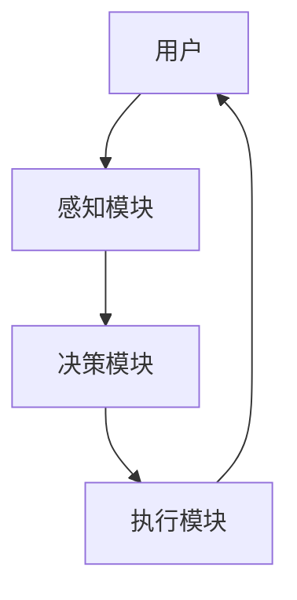
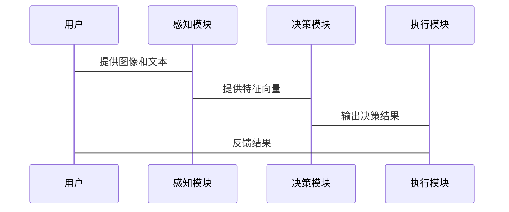

                 


# 开发具有视觉-语言多模态理解能力的AI Agent

## 关键词：AI Agent, 多模态理解, 视觉-语言, 多模态融合, 人机交互, 智能系统, 人工智能

## 摘要：  
本文深入探讨了开发具有视觉-语言多模态理解能力的AI Agent的关键技术与实现方法。从背景介绍到核心概念，从算法原理到系统架构，再到项目实战，全面解析了如何构建一个能够同时处理视觉和语言信息的智能体。通过详细的理论分析和实践案例，本文为读者提供了从基础到高级的完整知识体系。

---

# 正文

## 第一部分: 背景介绍

### 第1章: 视觉-语言多模态理解的背景与挑战

#### 1.1 问题背景
##### 1.1.1 多模态数据的定义与特点
多模态数据是指来自不同感官渠道（如视觉、语言、听觉等）的数据形式。视觉数据（如图像、视频）和语言数据（如文本、语音）是两个最主要的模态。多模态数据的特点包括多样性、互补性和复杂性。

##### 1.1.2 视觉与语言模态的结合意义
视觉和语言模态的结合可以弥补单一模态的不足。例如，通过结合图像和文本，AI Agent可以更好地理解上下文，提高语义理解的准确性。

##### 1.1.3 当前技术的局限性与挑战
当前技术在多模态理解方面仍存在以下挑战：
- 数据异构性：不同模态的数据形式和特征空间差异较大。
- 融合难度：如何有效融合不同模态的信息是一个难题。
- 计算资源需求：多模态处理通常需要大量计算资源。

#### 1.2 问题描述
##### 1.2.1 多模态理解的核心目标
通过融合视觉和语言信息，实现对复杂场景的语义理解。

##### 1.2.2 AI Agent在多模态理解中的角色
AI Agent作为多模态理解的执行者和优化者，负责处理输入的多模态数据，并输出相应的理解和决策。

##### 1.2.3 实际应用场景中的问题分析
在实际应用中，AI Agent需要处理以下问题：
- 数据输入的多样性。
- 不同模态数据的实时性要求。
- 多模态数据的语义对齐。

#### 1.3 问题解决
##### 1.3.1 多模态数据融合的解决方案
- 晚期融合：在高层语义空间进行融合。
- 早期融合：在特征提取阶段进行融合。

##### 1.3.2 AI Agent的设计原则与方法
- 模块化设计：将Agent划分为感知、决策和执行模块。
- 跨模态交互：通过设计合理的接口实现不同模态数据的交互。

##### 1.3.3 技术实现的关键步骤
1. 数据预处理与特征提取。
2. 跨模态数据对齐。
3. 多模态模型的构建与训练。

#### 1.4 边界与外延
##### 1.4.1 多模态理解的边界定义
多模态理解的边界在于如何有效融合不同模态的信息，并确保语义的一致性。

##### 1.4.2 AI Agent能力的扩展范围
AI Agent的能力可以扩展到其他模态（如听觉、触觉）和更复杂的任务（如自主决策）。

##### 1.4.3 相关领域的区别与联系
多模态理解与单模态理解的区别在于数据来源和处理方式的不同。

#### 1.5 概念结构与核心要素
##### 1.5.1 多模态理解的层次结构
从低到高分为：数据层、特征层、语义层和决策层。

##### 1.5.2 AI Agent的核心要素组成
包括感知模块、决策模块和执行模块。

##### 1.5.3 两者的相互作用关系
多模态理解为AI Agent提供更丰富的感知信息，AI Agent为多模态理解提供执行和优化能力。

---

## 第二部分: 核心概念与联系

### 第2章: 多模态理解的核心概念

#### 2.1 多模态数据的处理原理
##### 2.1.1 视觉数据的特征提取
- 使用卷积神经网络（CNN）提取图像特征。
- 示例代码：
  ```python
  import tensorflow as tf
  model = tf.keras.Sequential([
      tf.keras.layers.Conv2D(32, (3,3), activation='relu', input_shape=(224,224,3)),
      tf.keras.layers.MaxPooling2D((2,2)),
      tf.keras.layers.Flatten()
  ])
  ```

##### 2.1.2 语言数据的语义理解
- 使用 Transformer 模型进行文本编码。
- 示例代码：
  ```python
  import torch
  model = torch.nn.Transformer(nhead=8, d_model=512)
  ```

##### 2.1.3 数据融合的方法与策略
- 晚期融合：在语义空间进行融合。
- 早期融合：在特征提取阶段进行融合。

#### 2.2 AI Agent的基本原理
##### 2.2.1 Agent的定义与分类
Agent是一种能够感知环境并采取行动的智能体，分为反应式和认知式两类。

##### 2.2.2 多模态理解在Agent中的作用
- 提供更丰富的感知信息。
- 改善决策的准确性。

##### 2.2.3 Agent的决策机制
- 基于多模态信息的决策树。
- 示例：
  ```python
  def decide_action(image_features, text_features):
      combined_features = tf.concat([image_features, text_features], axis=-1)
      with tf.GradientTape() as tape:
          logits = model(combined_features)
          loss = tf.nn.softmax_cross_entropy_loss(logits, label)
      gradients = tape.gradient(loss, model.trainable_weights)
      return logits.argmax()
  ```

#### 2.3 核心概念的对比分析
##### 2.3.1 多模态理解与单模态理解的对比
| 对比维度 | 多模态理解 | 单模态理解 |
|----------|------------|------------|
| 数据来源 | 多个模态 | 单个模态 |
| 处理难度 | 高 | 低 |

##### 2.3.2 AI Agent与传统Agent的区别
| 对比维度 | AI Agent | 传统Agent |
|----------|------------|------------|
| 智能性 | 高 | 低 |
| 决策方式 | 基于机器学习 | 基于规则 |

---

### 第3章: 多模态理解与AI Agent的关系

#### 3.1 多模态理解对AI Agent的影响
##### 3.1.1 提升Agent的感知能力
通过融合视觉和语言信息，Agent可以更好地理解环境。

##### 3.1.2 增强Agent的交互能力
多模态理解使Agent能够更自然地与人类交互。

##### 3.1.3 扩展Agent的应用场景
适用于需要多模态信息处理的任务，如智能客服、自动驾驶等。

#### 3.2 AI Agent对多模态理解的推动
##### 3.2.1 Agent作为多模态数据的整合平台
- 示例：智能音箱通过整合语音和环境图像信息提供服务。

##### 3.2.2 Agent作为多模态理解的执行者
- 示例：自动驾驶汽车通过融合视觉和语言信息进行决策。

##### 3.2.3 Agent作为多模态理解的优化工具
- 示例：通过用户反馈优化多模态理解模型。

#### 3.3 两者的协同作用
##### 3.3.1 多模态数据的协同处理
- 示例：通过图像和文本共同分析，提高语义理解的准确性。

##### 3.3.2 Agent的多模态决策过程
- 示例：基于图像和文本信息，进行路径规划。

##### 3.3.3 协同优化的实现方法
- 使用联合优化算法，如多任务学习。

---

## 第三部分: 算法原理讲解

### 第4章: 多模态数据的融合算法

#### 4.1 多模态数据的表示方法
##### 4.1.1 图像的向量表示
- 使用 CNN 提取图像特征向量。
- 示例代码：
  ```python
  import tensorflow as tf
  model = tf.keras.Sequential([
      tf.keras.layers.Conv2D(32, (3,3), activation='relu', input_shape=(224,224,3)),
      tf.keras.layers.MaxPooling2D((2,2)),
      tf.keras.layers.Flatten()
  ])
  ```

##### 4.1.2 文本的向量表示
- 使用 Transformer 模型进行文本编码。
- 示例代码：
  ```python
  import torch
  model = torch.nn.Transformer(nhead=8, d_model=512)
  ```

##### 4.1.3 跨模态对齐技术
- 使用对比学习实现跨模态对齐。
- 示例代码：
  ```python
  def contrastive_loss(image_features, text_features, label):
      similarity = tf.keras.layers.Dense(1, activation='sigmoid')(image_features @ tf.transpose(text_features))
      loss = tf.nn.sparse_softmax_cross_entropy_loss(similarity, label)
      return loss
  ```

#### 4.2 多模态融合模型
##### 4.2.1 晚期融合模型
- 示例代码：
  ```python
  import tensorflow as tf
  model = tf.keras.Sequential([
      tf.keras.layers.Dense(256, activation='relu'),
      tf.keras.layers.Dropout(0.5),
      tf.keras.layers.Dense(10, activation='softmax')
  ])
  ```

##### 4.2.2 早期融合模型
- 示例代码：
  ```python
  import tensorflow as tf
  model = tf.keras.Sequential([
      tf.keras.layers.Conv2D(32, (3,3), activation='relu', input_shape=(224,224,3)),
      tf.keras.layers.MaxPooling2D((2,2)),
      tf.keras.layers.Flatten(),
      tf.keras.layers.Dense(256, activation='relu'),
      tf.keras.layers.Dropout(0.5),
      tf.keras.layers.Dense(10, activation='softmax')
  ])
  ```

#### 4.3 模型训练与优化
##### 4.3.1 损失函数
- 使用交叉熵损失函数：
  $$ \text{Loss} = -\sum_{i=1}^{n} y_i \log(p_i) $$

##### 4.3.2 优化算法
- 使用 Adam 优化器：
  $$ \text{Adam} = \frac{\beta_1 \cdot \text{梯度}}{1 - \beta_1} + \frac{\beta_2 \cdot \text{梯度}^2}{1 - \beta_2} $$

##### 4.3.3 训练策略
- 分阶段训练：先单模态预训练，再多模态微调。

---

## 第四部分: 系统分析与架构设计方案

### 第5章: 系统架构设计

#### 5.1 问题场景介绍
AI Agent需要处理用户输入的图像和文本信息，并输出相应的理解和决策。

#### 5.2 系统功能设计
- 感知模块：接收并解析多模态输入。
- 决策模块：基于多模态信息进行决策。
- 执行模块：输出决策结果。

#### 5.3 系统架构图


#### 5.4 系统交互图


---

## 第五部分: 项目实战

### 第6章: 项目实战

#### 6.1 环境安装
- 安装必要的库：
  ```bash
  pip install tensorflow keras numpy
  ```

#### 6.2 系统核心实现源代码
##### 6.2.1 特征提取模块
```python
import tensorflow as tf

def extract_image_features(image):
    model = tf.keras.Sequential([
        tf.keras.layers.Conv2D(32, (3,3), activation='relu', input_shape=(224,224,3)),
        tf.keras.layers.MaxPooling2D((2,2)),
        tf.keras.layers.Flatten()
    ])
    return model(image)

def extract_text_features(text):
    model = tf.keras.Sequential([
        tf.keras.layers.Embedding(10000, 128),
        tf.keras.layers.LSTM(64)
    ])
    return model(text)
```

##### 6.2.2 数据融合模块
```python
def fuse_features(image_features, text_features):
    combined_features = tf.concat([image_features, text_features], axis=-1)
    dense_layer = tf.keras.layers.Dense(256, activation='relu')(combined_features)
    return dense_layer
```

##### 6.2.3 决策模块
```python
def decision_model(features):
    dense_layer = tf.keras.layers.Dense(128, activation='relu')(features)
    output = tf.keras.layers.Dense(10, activation='softmax')(dense_layer)
    return output
```

#### 6.3 案例分析与代码实现
##### 6.3.1 案例分析
- 输入：一张图像和一段文本描述。
- 输出：对图像内容的理解和决策。

##### 6.3.2 代码实现
```python
def main():
    image = ...  # 输入图像
    text = ...    # 输入文本
    image_features = extract_image_features(image)
    text_features = extract_text_features(text)
    fused_features = fuse_features(image_features, text_features)
    decision = decision_model(fused_features)
    print(decision)
```

#### 6.4 项目总结
- 通过项目实战，验证了多模态理解在AI Agent中的可行性。
- 提出了一个完整的系统架构和实现方案。

---

## 第六部分: 最佳实践与总结

### 第7章: 最佳实践与总结

#### 7.1 最佳实践
- 数据预处理：确保数据的多样性和均衡性。
- 模型优化：使用数据增强和迁移学习提高性能。
- 系统设计：模块化设计便于维护和扩展。

#### 7.2 小结
本文详细介绍了开发具有视觉-语言多模态理解能力的AI Agent的关键技术与实现方法，从理论到实践，为读者提供了全面的知识体系。

#### 7.3 注意事项
- 处理多模态数据时要注意数据的异构性。
- 模型训练时要注意过拟合问题。

#### 7.4 拓展阅读
- 推荐阅读《Deep Learning》（Ian Goodfellow 著）和《Pattern Recognition and Machine Learning》（Christopher M. Bishop 著）。

---

## 作者：AI天才研究院/AI Genius Institute & 禅与计算机程序设计艺术 /Zen And The Art of Computer Programming

