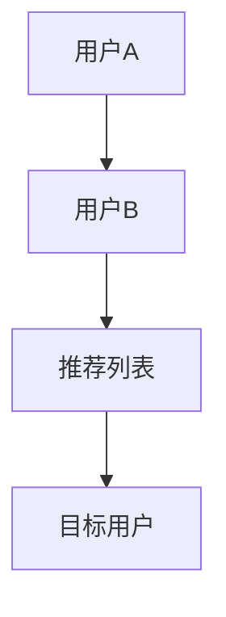
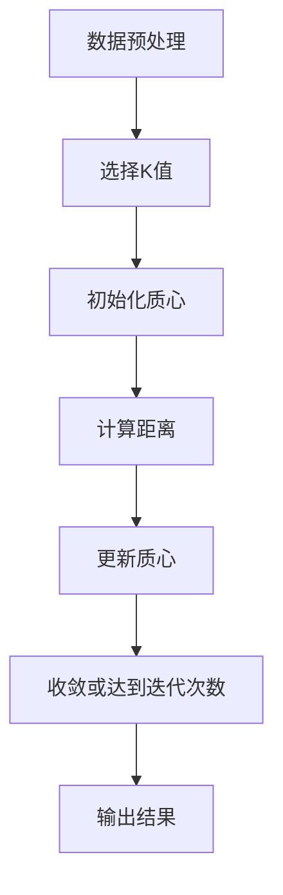
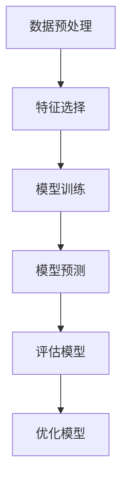
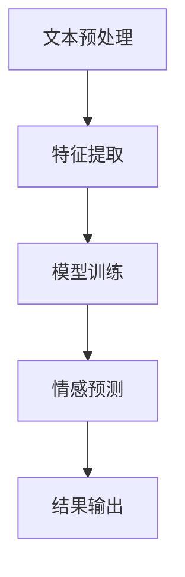
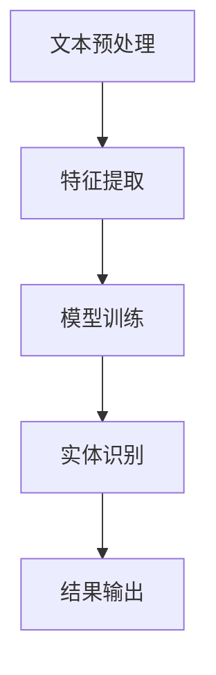
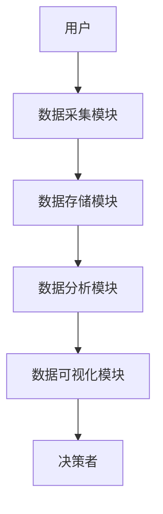
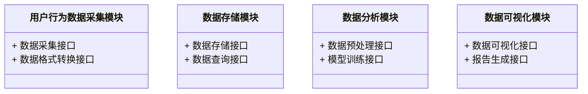
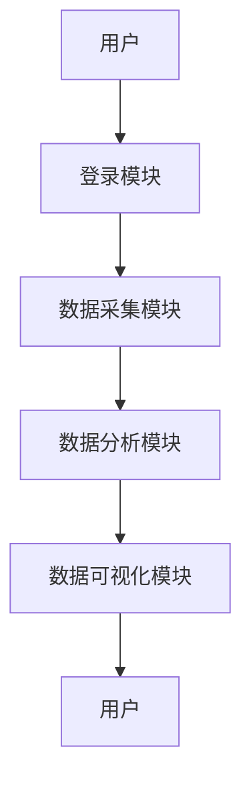
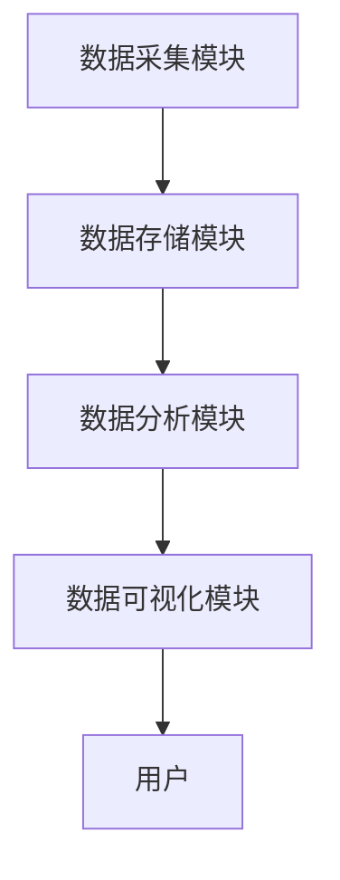

                 


# 彼得林奇如何分析公司的用户行为数据价值

> 关键词：用户行为数据价值，数据分析，机器学习，彼得林奇，数据驱动决策

> 摘要：本文将详细探讨彼得·林奇如何分析公司的用户行为数据价值，通过数据分析的基本原则、用户行为数据的类型与特征、数据分析的数学模型与算法原理、系统架构设计以及项目实战案例的分析，系统地阐述如何利用数据驱动决策，实现企业价值的提升。

---

## 第一部分: 用户行为数据价值分析背景与方法论

### 第1章: 用户行为数据价值分析概述

#### 1.1 数据驱动决策的重要性

##### 1.1.1 数据驱动决策的定义
数据驱动决策是一种基于数据分析和数据洞察的决策方式，通过数据的收集、处理、分析和可视化，帮助企业在复杂的市场环境中做出更科学、更可靠的决策。

##### 1.1.2 数据驱动决策在企业管理中的作用
- **优化资源配置**：通过数据分析，企业可以更好地理解资源的使用情况，优化资源配置，提高效率。
- **提升客户体验**：通过分析用户行为数据，企业可以更好地理解客户需求，提供个性化的产品和服务。
- **提高市场洞察力**：数据驱动决策可以帮助企业及时捕捉市场趋势，预测市场变化，制定更具前瞻性的战略。

##### 1.1.3 彼得林奇的用户行为数据价值分析方法
彼得林奇是美国著名投资家，他在投资分析中非常注重对公司基本面的深入研究，尤其是对用户行为数据的分析。他认为，通过对用户行为数据的深入挖掘，可以发现企业的核心价值，从而做出更明智的投资决策。

#### 1.2 彼得林奇的用户行为数据分析方法论

##### 1.2.1 数据分析的基本原则
- **数据的准确性**：确保数据的来源可靠，数据的采集和处理过程准确无误。
- **数据的完整性**：数据应涵盖企业运营的各个方面，避免信息孤岛。
- **数据的相关性**：数据分析应聚焦于与企业目标相关的数据，避免分析与决策无关的信息。

##### 1.2.2 彼得林奇的用户行为数据价值评估模型
彼得林奇在分析用户行为数据时，通常采用以下步骤：
1. **数据采集**：通过多种渠道（如网站、应用程序、问卷调查等）收集用户的行为数据。
2. **数据清洗**：对采集到的数据进行预处理，去除无效数据，填补缺失值，处理异常值。
3. **数据分析**：通过统计分析、机器学习等方法，挖掘数据中的有价值的信息。
4. **数据可视化**：将分析结果以图表、报告等形式呈现，帮助决策者更好地理解数据。

##### 1.2.3 数据分析的步骤与流程
1. **明确目标**：确定数据分析的目标，例如，分析用户流失的原因。
2. **数据采集**：选择合适的数据采集方法，收集相关数据。
3. **数据处理**：清洗数据，确保数据质量。
4. **数据分析**：运用统计分析、机器学习等方法，提取数据中的有价值的信息。
5. **结果解读**：将数据分析结果转化为 actionable insights，指导企业的决策。

### 第2章: 用户行为数据价值的核心概念与联系

#### 2.1 用户行为数据的类型与特征

##### 2.1.1 用户行为数据的分类
用户行为数据可以分为以下几类：
- **点击流数据**：记录用户在网站或应用程序中的点击行为。
- **交易数据**：记录用户的购买行为，如订单号、购买时间、金额等。
- **社交数据**：记录用户在社交媒体上的互动行为，如点赞、评论、分享等。
- **反馈数据**：记录用户对产品或服务的满意度评价。

##### 2.1.2 用户行为数据的属性特征对比表格
以下是一个用户行为数据属性特征的对比表格：

| 特性       | 点击流数据 | 交易数据 | 社交数据 | 反馈数据 |
|------------|------------|----------|----------|----------|
| 数据类型   | 结构化     | 结构化    | 非结构化  | 非结构化  |
| 数据来源   | 网站/APP   | 订单系统 | 社交媒体  | 调查问卷  |
| 数据粒度   | 细粒度     | 中粒度    | 细粒度    | 粗粒度    |
| 数据量     | 大         | 大       | 大        | 中        |
| 数据用途   | 用户路径分析 | 购买行为分析 | 社交影响力分析 | 用户满意度分析 |

##### 2.1.3 用户行为数据的ER实体关系图
以下是用户行为数据的ER实体关系图：

```mermaid
er
  %% 用户行为数据ER图
  actor User
  actor Session
  actor Action
  action: User -[1..n]-> Session
  action: Session -[1..n]-> Action
  action: Action -[1]-> Type
  action: Action -[1]-> Time
```

#### 2.2 用户行为数据价值的核心要素

##### 2.2.1 数据的完整性
数据完整性是指数据的完整性和一致性。在用户行为数据分析中，数据的完整性是确保数据分析结果准确性的基础。

##### 2.2.2 数据的准确性
数据准确性是指数据的值与实际发生的情况一致。在用户行为数据分析中，数据的准确性直接影响到分析结果的可靠性。

##### 2.2.3 数据的相关性
数据相关性是指数据之间的关联程度。在用户行为数据分析中，数据的相关性是选择合适的数据进行分析的重要依据。

### 第3章: 用户行为数据价值分析的数学模型与算法原理

#### 3.1 数据预处理与特征提取

##### 3.1.1 数据清洗方法
数据清洗是数据分析的第一步，主要包括以下几种方法：
- **去除重复数据**：去除重复的记录。
- **填补缺失值**：使用均值、中位数或特定算法填补缺失值。
- **处理异常值**：通过统计方法或机器学习方法识别并处理异常值。

##### 3.1.2 特征工程的实现
特征工程是指对数据进行特征提取和特征变换的过程，以提高模型的性能。常用的特征工程方法包括：
- **特征选择**：选择对目标变量影响较大的特征。
- **特征变换**：对特征进行标准化、归一化等变换。

##### 3.1.3 数据标准化与归一化
数据标准化是指将数据按比例缩放到一个标准范围内，通常用于解决不同特征量纲不同的问题。数据归一化是指将数据按比例缩放到[0,1]范围内，通常用于解决数据分布不均的问题。

#### 3.2 机器学习模型的应用

##### 3.2.1 协同过滤算法
协同过滤是一种基于用户行为数据的推荐算法，主要包括基于用户的协同过滤和基于物品的协同过滤。以下是协同过滤算法的流程图：



##### 3.2.2 聚类分析算法
聚类分析是一种无监督学习算法，用于将用户行为数据分成不同的类别。常用的聚类算法包括K-means、DBSCAN等。以下是K-means算法的流程图：



##### 3.2.3 分类算法
分类算法是一种有监督学习算法，用于将用户行为数据分类到不同的类别中。常用的分类算法包括逻辑回归、支持向量机（SVM）、随机森林等。以下是逻辑回归算法的流程图：



#### 3.3 自然语言处理技术的应用

##### 3.3.1 文本挖掘技术
文本挖掘是指从文本数据中提取有用信息的过程，常用的文本挖掘技术包括关键词提取、情感分析、主题建模等。

##### 3.3.2 情感分析算法
情感分析是一种自然语言处理技术，用于判断文本中的情感倾向。以下是情感分析算法的流程图：



##### 3.3.3 实体识别技术
实体识别是一种自然语言处理技术，用于从文本中识别出人名、地名、组织名等实体。以下是实体识别算法的流程图：



### 第4章: 用户行为数据价值分析的系统架构设计

#### 4.1 系统功能设计

##### 4.1.1 用户行为数据采集模块
用户行为数据采集模块负责从多种渠道（如网站、应用程序、社交媒体等）采集用户行为数据。

##### 4.1.2 数据存储与管理模块
数据存储与管理模块负责将采集到的数据存储到数据库中，并进行数据的管理和维护。

##### 4.1.3 数据分析与处理模块
数据分析与处理模块负责对存储的数据进行预处理、特征提取、模型训练等操作。

##### 4.1.4 数据可视化与报告生成模块
数据可视化与报告生成模块负责将分析结果以图表、报告等形式呈现，帮助决策者更好地理解数据。

#### 4.2 系统架构设计

##### 4.2.1 系统架构的分层设计
用户行为数据价值分析系统的架构通常分为数据层、业务逻辑层和表现层。

##### 4.2.2 系统组件的交互流程
以下是系统组件的交互流程图：



##### 4.2.3 系统接口设计
系统接口设计需要考虑模块之间的接口定义和数据格式。以下是系统接口的类图：



#### 4.3 系统交互设计

##### 4.3.1 用户与系统交互流程
以下是用户与系统交互的流程图：



##### 4.3.2 系统内部组件交互流程
以下是系统内部组件交互的流程图：



### 第5章: 用户行为数据价值分析的项目实战

#### 5.1 项目背景与目标

##### 5.1.1 项目需求分析
假设我们是一家电商平台，希望通过分析用户行为数据，提高用户的购买转化率。

##### 5.1.2 项目目标设定
1. 分析用户的行为数据，识别出高价值用户。
2. 建立用户分群模型，针对不同用户群体制定不同的营销策略。

##### 5.1.3 项目范围界定
项目范围包括数据采集、数据清洗、特征提取、模型训练、结果分析和可视化。

#### 5.2 项目核心实现

##### 5.2.1 环境搭建与数据收集
- **环境搭建**：安装Python、Pandas、NumPy、Scikit-learn等工具。
- **数据收集**：通过网站日志、用户问卷等方式收集用户行为数据。

##### 5.2.2 数据清洗与特征工程
- **数据清洗**：去除重复数据，填补缺失值，处理异常值。
- **特征工程**：提取用户的基本特征（如性别、年龄）、行为特征（如访问次数、购买金额）等。

##### 5.2.3 模型训练与评估
- **模型训练**：使用逻辑回归、随机森林等算法训练用户分群模型。
- **模型评估**：通过准确率、召回率、F1值等指标评估模型性能。

##### 5.2.4 结果分析与可视化
- **结果分析**：分析不同用户群体的行为特征，制定针对性的营销策略。
- **数据可视化**：使用Matplotlib、Seaborn等工具绘制用户行为分析图。

#### 5.3 项目小结
通过本项目，我们成功地分析了用户行为数据，识别出高价值用户，并制定了针对性的营销策略，提高了用户的购买转化率。

---

## 第二部分: 用户行为数据价值分析的系统架构与项目实战

### 第6章: 用户行为数据价值分析的系统架构设计

#### 6.1 系统功能设计

##### 6.1.1 领域模型的类图设计
以下是用户行为分析系统的领域模型类图：


#### 6.2 系统架构设计

##### 6.2.1 系统架构的分层设计
用户行为数据价值分析系统的架构通常分为数据层、业务逻辑层和表现层。

##### 6.2.2 系统组件的交互流程
以下是系统组件的交互流程图：


#### 6.3 系统接口设计

##### 6.3.1 系统接口的定义
系统接口的定义包括数据采集接口、数据存储接口、数据分析接口和数据可视化接口。

##### 6.3.2 系统接口的实现
以下是系统接口的实现代码示例：

```python
# 数据采集接口
def collect_data():
    pass

# 数据存储接口
def store_data(data):
    pass

# 数据分析接口
def analyze_data(data):
    pass

# 数据可视化接口
def visualize_data(data):
    pass
```

#### 6.4 系统交互设计

##### 6.4.1 系统交互的流程图
以下是系统交互的流程图：


### 第7章: 用户行为数据价值分析的项目实战

#### 7.1 项目背景与目标

##### 7.1.1 项目需求分析
假设我们是一家电商平台，希望通过分析用户行为数据，提高用户的购买转化率。

##### 7.1.2 项目目标设定
1. 分析用户的行为数据，识别出高价值用户。
2. 建立用户分群模型，针对不同用户群体制定不同的营销策略。

##### 7.1.3 项目范围界定
项目范围包括数据采集、数据清洗、特征提取、模型训练、结果分析和可视化。

#### 7.2 项目核心实现

##### 7.2.1 环境搭建与数据收集
- **环境搭建**：安装Python、Pandas、NumPy、Scikit-learn等工具。
- **数据收集**：通过网站日志、用户问卷等方式收集用户行为数据。

##### 7.2.2 数据清洗与特征工程
- **数据清洗**：去除重复数据，填补缺失值，处理异常值。
- **特征工程**：提取用户的基本特征（如性别、年龄）、行为特征（如访问次数、购买金额）等。

##### 7.2.3 模型训练与评估
- **模型训练**：使用逻辑回归、随机森林等算法训练用户分群模型。
- **模型评估**：通过准确率、召回率、F1值等指标评估模型性能。

##### 7.2.4 结果分析与可视化
- **结果分析**：分析不同用户群体的行为特征，制定针对性的营销策略。
- **数据可视化**：使用Matplotlib、Seaborn等工具绘制用户行为分析图。

#### 7.3 项目小结
通过本项目，我们成功地分析了用户行为数据，识别出高价值用户，并制定了针对性的营销策略，提高了用户的购买转化率。

---

## 第三部分: 用户行为数据价值分析的最佳实践与总结

### 第8章: 用户行为数据价值分析的最佳实践

#### 8.1 彼得林奇的用户行为数据分析方法总结
彼得林奇在分析用户行为数据时，注重数据的准确性和完整性，通过数据驱动决策，实现企业的价值提升。

#### 8.2 数据分析中的注意事项
- **数据隐私保护**：在数据分析过程中，必须遵守数据隐私保护的法律法规，确保数据的安全性。
- **数据模型的可解释性**：在选择数据模型时，应优先选择可解释性较高的模型，便于理解和优化。

#### 8.3 数据分析的未来趋势
- **人工智能的进一步应用**：随着人工智能技术的不断发展，用户行为数据分析将更加智能化和自动化。
- **数据驱动决策的普及**：数据驱动决策将成为企业运营管理的重要手段，帮助企业做出更科学的决策。

### 第9章: 总结与展望

#### 9.1 本文总结
本文详细探讨了彼得林奇如何分析公司的用户行为数据价值，通过数据分析的基本原则、用户行为数据的类型与特征、数据分析的数学模型与算法原理、系统架构设计以及项目实战案例的分析，系统地阐述了如何利用数据驱动决策，实现企业价值的提升。

#### 9.2 对未来研究的展望
未来的研究可以进一步探索用户行为数据在企业运营管理中的应用，尤其是在人工智能和大数据技术的结合下，如何更高效地挖掘用户行为数据的价值。

---

## 作者：AI天才研究院 & 禅与计算机程序设计艺术

本文作者：AI天才研究院（AI Genius Institute）  
本文内容由AI天才研究院团队创作，转载请注明出处。

