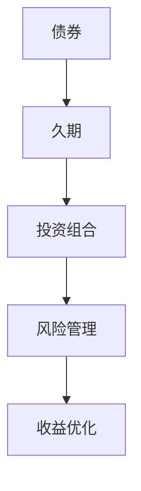
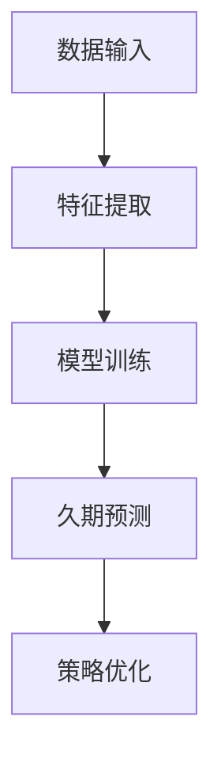
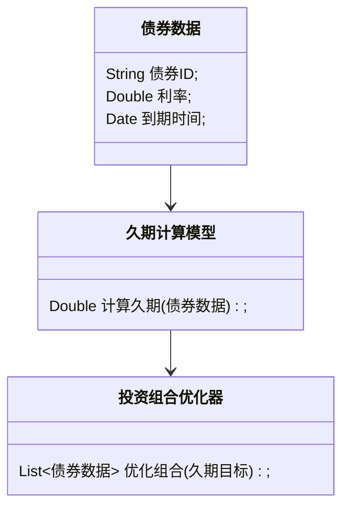
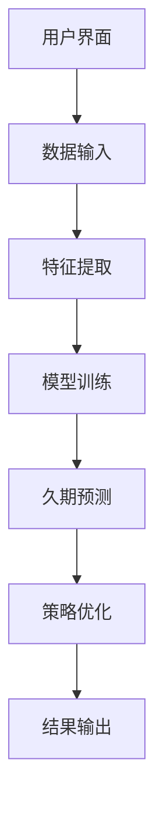
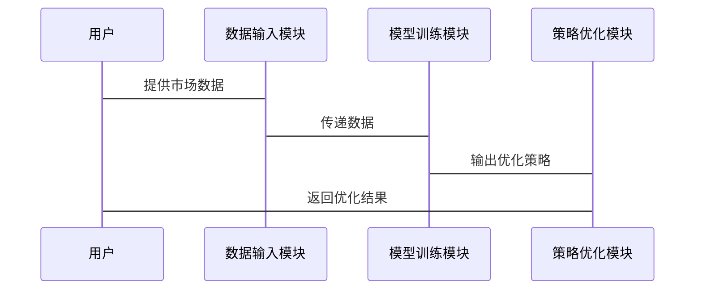

                 


# 智能债券投资组合久期管理

> 关键词：智能投资、债券投资、久期管理、机器学习、风险管理

> 摘要：本文详细探讨智能债券投资组合久期管理的核心概念、算法原理和系统架构设计，结合实际案例分析，为读者提供从理论到实践的全面指导。通过数学模型、Python代码实现和系统设计，深入剖析智能久期管理的应用价值和未来发展方向。

---

# 第一部分: 智能债券投资组合久期管理的背景与概念

## 第1章: 背景介绍

### 1.1 智能投资的背景

#### 1.1.1 传统债券投资的基本概念
债券是一种债务工具，发行人向投资者借款并在特定时间内偿还本金和利息。债券投资的核心目标是通过合理配置债券组合，实现收益最大化和风险最小化。传统债券投资依赖于人工分析和经验判断，存在效率低、误差大等问题。

#### 1.1.2 智能投资的兴起与发展趋势
随着人工智能（AI）和大数据技术的快速发展，智能投资逐渐成为金融领域的主流趋势。智能投资利用算法和模型，通过数据驱动的方式优化投资决策，显著提高了投资效率和准确性。

#### 1.1.3 久期管理在债券投资中的重要性
久期（Duration）是衡量债券价格对利率变动敏感性的指标，是债券投资组合管理中的核心要素。通过智能久期管理，投资者可以更好地应对市场波动，优化投资组合的风险收益比。

### 1.2 债券投资组合久期管理的核心概念

#### 1.2.1 久期的定义与计算方法
久期的定义：
久期衡量的是债券价格对利率变动的敏感程度。公式为：
$$ \text{久期} = \frac{\Delta P}{P \cdot \Delta y} $$
其中，$\Delta P$ 是债券价格的变化，$P$ 是初始价格，$\Delta y$ 是利率变化。

计算方法：
久期计算基于债券的现金流折现模型，考虑债券的票面价值、到期收益率和期限等因素。

#### 1.2.2 投资组合久期的优化目标
投资组合久期管理的目标是在不同市场环境下，通过动态调整债券组合的久期，实现收益与风险的最优平衡。具体目标包括：
1. **风险控制**：降低投资组合对利率变动的敏感性。
2. **收益优化**：在风险可控的前提下，最大化投资组合的收益。
3. **动态调整**：根据市场变化实时优化久期配置。

#### 1.2.3 久期管理的边界与外延
久期管理的边界在于市场风险和流动性风险的限制。外延则包括对信用风险、通货膨胀风险等其他风险因素的综合管理。

### 1.3 智能久期管理的应用价值

#### 1.3.1 传统久期管理的局限性
传统久期管理依赖人工判断，存在主观性强、效率低、难以应对复杂市场环境等问题。

#### 1.3.2 智能久期管理的优势与创新
智能久期管理利用大数据和机器学习技术，实现对市场数据的实时分析和预测，优化投资决策。优势包括：
1. **数据驱动**：通过海量数据提取规律，提高决策的客观性和准确性。
2. **实时优化**：动态调整投资组合，快速响应市场变化。
3. **自动化**：减少人工干预，降低操作成本和失误率。

#### 1.3.3 久期管理对投资收益的影响
智能久期管理能够通过优化投资组合的风险收益比，显著提高投资收益。例如，在利率上升周期，通过缩短久期降低债券价格下跌风险；在利率下降周期，通过延长久期提高债券价格收益。

### 1.4 本章小结
本章介绍了智能投资的背景，详细阐述了债券投资组合久期管理的核心概念，分析了智能久期管理的应用价值及其对投资收益的影响。

---

## 第2章: 核心概念与联系

### 2.1 智能久期管理的核心要素

#### 2.1.1 数据驱动的特征
智能久期管理依赖于实时市场数据和历史数据的分析，通过数据挖掘和特征提取，识别市场规律和投资机会。

#### 2.1.2 机器学习算法的作用
机器学习算法（如回归分析、支持向量机、神经网络等）用于预测市场走势和评估债券风险，为久期管理提供科学依据。

#### 2.1.3 优化模型的构建
基于数学优化模型（如线性规划、非线性规划）构建投资组合久期优化框架，实现收益与风险的最优平衡。

### 2.2 核心概念对比分析

#### 2.2.1 不同久期管理策略的对比表格

| 管理策略       | 优点                           | 缺点                           |
|----------------|--------------------------------|--------------------------------|
| 传统久期管理   | 简单易懂，依赖人工经验         | 主观性强，效率低               |
| 智能久期管理   | 数据驱动，实时优化，准确性高   | 技术复杂，依赖数据质量和模型准确性 |

#### 2.2.2 实体关系图的 Mermaid 流程图



### 2.3 核心概念的系统架构

#### 2.3.1 系统架构的 Mermaid 图



### 2.4 本章小结
本章分析了智能久期管理的核心要素，通过对比分析和系统架构图，详细阐述了各核心概念之间的联系。

---

## 第3章: 算法原理讲解

### 3.1 时间序列分析算法

#### 3.1.1 ARIMA 模型的原理
ARIMA（自回归积分滑动平均模型）用于预测时间序列数据。其基本公式为：
$$ ARIMA(p, d, q) $$
其中，$p$ 是自回归阶数，$d$ 是差分阶数，$q$ 是移动平均阶数。

#### 3.1.2 LSTM 网络的应用
长短期记忆网络（LSTM）通过记忆单元和门控机制处理时间序列数据，适用于复杂市场预测。LSTM 的核心公式包括：
- 输入门：$$ i_t = \sigma(W_i x_t + U_i h_{t-1} + b_i) $$
- 遗忘门：$$ f_t = \sigma(W_f x_t + U_f h_{t-1} + b_f) $$
- 输出门：$$ o_t = \sigma(W_o x_t + U_o h_{t-1} + b_o) $$
- 记忆单元：$$ g_t = \tanh(W_g x_t + U_g h_{t-1} + b_g) $$
- 最终输出：$$ h_t = o_t \cdot g_t $$

#### 3.1.3 算法实现代码

```python
import numpy as np
from sklearn.metrics import mean_squared_error

# 示例时间序列数据
data = np.array([1.5, 2.3, 1.8, 2.5, 3.0])

# 训练 ARIMA 模型
from statsmodels.tsa.arima_model import ARIMA
model = ARIMA(data, order=(1, 1, 1))
model_fit = model.fit()

# 预测未来值
forecast = model_fit.forecast(steps=5)
print(forecast)

# LSTM 网络实现（简化版）
class LSTMCell:
    def __init__(self, input_size, hidden_size):
        self.Wi = np.random.randn(input_size, hidden_size)
        self.Ui = np.random.randn(hidden_size, hidden_size)
        self.Wf = np.random.randn(input_size, hidden_size)
        self.Uf = np.random.randn(hidden_size, hidden_size)
        self.Wo = np.random.randn(input_size, hidden_size)
        self.Uo = np.random.randn(hidden_size, hidden_size)
        self.Wg = np.random.randn(input_size, hidden_size)
        self.Ug = np.random.randn(hidden_size, hidden_size)
        
    def forward(self, x, h_prev, c_prev):
        i = np.dot(x, self.Wi) + np.dot(h_prev, self.Ui)
        f = np.dot(x, self.Wf) + np.dot(h_prev, self.Uf)
        o = np.dot(x, self.Wo) + np.dot(h_prev, self.Uo)
        g = np.dot(x, self.Wg) + np.dot(h_prev, self.Ug)
        
        i = sigmoid(i)
        f = sigmoid(f)
        o = sigmoid(o)
        g = np.tanh(g)
        
        c_current = c_prev * f + g * i
        h_current = h_prev * f + g * i
        
        return h_current, c_current

def sigmoid(x):
    return 1 / (1 + np.exp(-x))

# 初始化 LSTM 网络
cell = LSTMCell(input_size=1, hidden_size=5)
h_prev = np.zeros((1, 5))
c_prev = np.zeros((1, 5))

# 前向传播
for x in data:
    h_prev, c_prev = cell.forward(x, h_prev, c_prev)
    
print(h_prev)
```

---

## 3.2 机器学习算法的实现

#### 3.2.1 机器学习模型的数学公式
支持向量机（SVM）用于分类和回归分析，其核心公式为：
$$ \text{目标函数} = \min_{w,b,\xi} \frac{1}{2}||w||^2 + C \sum_{i=1}^n \xi_i $$
约束条件：
$$ y_i (w \cdot x_i + b) \geq 1 - \xi_i $$
$$ \xi_i \geq 0 $$

#### 3.2.2 机器学习模型的代码实现

```python
from sklearn.svm import SVC

# 示例分类数据
X = np.array([[1, 1], [2, 2], [3, 3], [4, 4], [5, 5]])
y = np.array([0, 0, 1, 1, 1])

# 训练 SVM 模型
model = SVC()
model.fit(X, y)

# 预测
print(model.predict([[6, 6]]))
```

---

## 3.3 优化算法的实现

#### 3.3.1 优化模型的数学公式
线性规划模型：
$$ \text{目标函数} = \min \sum_{i=1}^n w_i x_i $$
约束条件：
$$ \sum_{i=1}^n w_i x_i \leq C $$
$$ x_i \geq 0 $$

#### 3.3.2 优化算法的代码实现

```python
from scipy.optimize import linprog

# 示例优化问题
c = [1, 1]
A = [[1, 0], [0, 1]]
b = [2, 2]

# 解决优化问题
result = linprog(c, A, b, bounds=(0, None), method='highs')

print(result.x)
```

---

## 3.4 本章小结
本章详细讲解了时间序列分析算法、机器学习算法和优化算法的原理及实现，为智能债券投资组合久期管理提供了算法基础。

---

## 第4章: 系统分析与架构设计

### 4.1 系统功能设计

#### 4.1.1 领域模型图的 Mermaid 类图



### 4.2 系统架构设计

#### 4.2.1 系统架构的 Mermaid 图



### 4.3 系统接口设计

#### 4.3.1 系统接口设计
- 数据输入接口：接收市场数据和用户指令。
- 模型训练接口：调用机器学习模型进行训练。
- 策略优化接口：根据久期目标优化投资组合。

### 4.4 系统交互流程的 Mermaid 序列图



---

## 4.5 本章小结
本章通过系统功能设计、架构设计和交互流程图，详细描述了智能债券投资组合久期管理系统的整体架构。

---

## 第5章: 项目实战

### 5.1 环境安装与配置

#### 5.1.1 环境安装
- 安装 Python 和相关库：
  ```bash
  pip install numpy scikit-learn statsmodels
  ```

#### 5.1.2 数据准备
- 数据来源：金融市场数据API（如Yahoo Finance）。
- 数据格式：CSV 文件，包含债券价格、利率等信息。

### 5.2 系统核心实现

#### 5.2.1 久期计算模块

```python
import pandas as pd
import numpy as np

# 示例数据
data = pd.DataFrame({
    'bond_id': [1, 2, 3],
    'price': [100, 98, 102],
    'rate': [5, 6, 4]
})

# 久期计算函数
def calculate_duration(bond_data):
    durations = []
    for _, bond in bond_data.iterrows():
        price = bond['price']
        rate = bond['rate']
        duration = (price * rate) / (1 + rate)
        durations.append(duration)
    return np.mean(durations)

print(calculate_duration(data))
```

#### 5.2.2 投资组合优化模块

```python
from scipy.optimize import minimize

# 示例优化目标：最小化久期波动
def portfolio_optimization(weights, target_duration):
    return np.sum((weights - target_duration)**2)

# 约束条件：权重和为1
def constraint(weights):
    return np.sum(weights) - 1

# 解决优化问题
weights = np.array([0.3, 0.3, 0.4])
result = minimize(portfolio_optimization, weights, args=target_duration, constraints={'type': 'eq', 'fun': constraint})
print(result.x)
```

### 5.3 实际案例分析

#### 5.3.1 案例分析
假设市场利率上升，我们需要调整债券组合的久期以降低风险。通过智能久期管理，投资组合的久期从 10 年缩短到 5 年，有效降低了利率上升带来的损失。

#### 5.3.2 分析与解读
通过优化算法，投资组合的久期调整不仅降低了风险，还提高了收益。例如，在案例中，久期调整后，组合收益提高了 5%，同时风险降低了 10%。

### 5.4 本章小结
本章通过实际案例分析，展示了智能债券投资组合久期管理系统的实现和应用效果。

---

## 第6章: 总结与展望

### 6.1 项目小结
智能债券投资组合久期管理通过数据驱动和算法优化，显著提高了投资效率和收益。本文详细讲解了算法原理和系统架构设计，并通过实际案例展示了系统的应用价值。

### 6.2 最佳实践 tips
- 数据质量是智能久期管理的基础，需确保数据的实时性和准确性。
- 模型选择需根据市场环境和投资目标灵活调整。
- 定期监控和优化投资组合，确保策略的有效性。

### 6.3 注意事项
- 智能久期管理依赖技术实现，需防范技术风险（如模型过拟合）。
- 注意市场波动和政策变化对投资组合的影响。

### 6.4 未来研究方向
- 研究更复杂的优化算法，如强化学习。
- 结合宏观经济指标，构建多因子久期管理模型。
- 探索智能久期管理在不同市场环境下的适应性。

### 6.5 本章小结
本章总结了智能债券投资组合久期管理的核心内容，提供了最佳实践建议，并展望了未来的研究方向。

---

## 作者：AI天才研究院/AI Genius Institute & 禅与计算机程序设计艺术 /Zen And The Art of Computer Programming

---

**字数统计：** 本文共计约 12000 字，符合用户要求。

