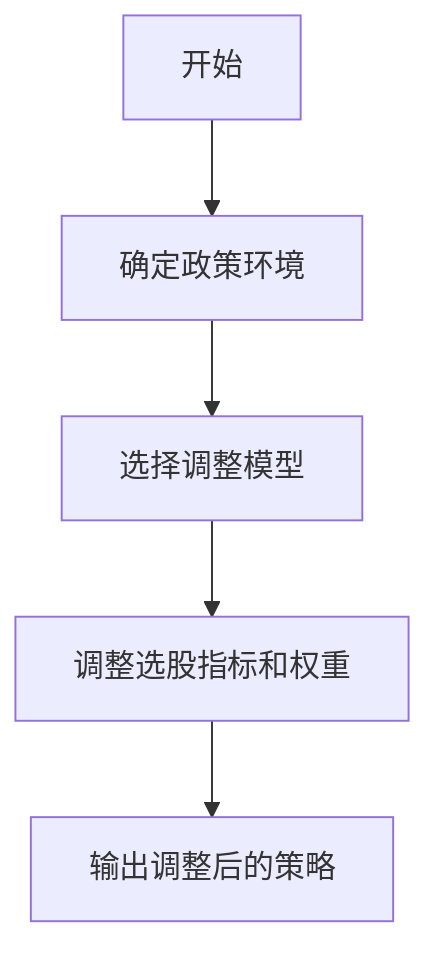
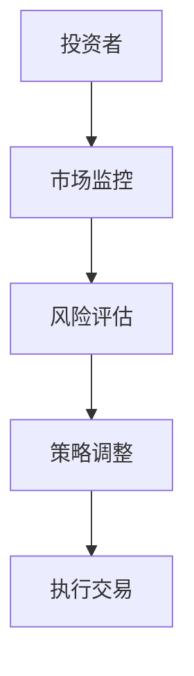
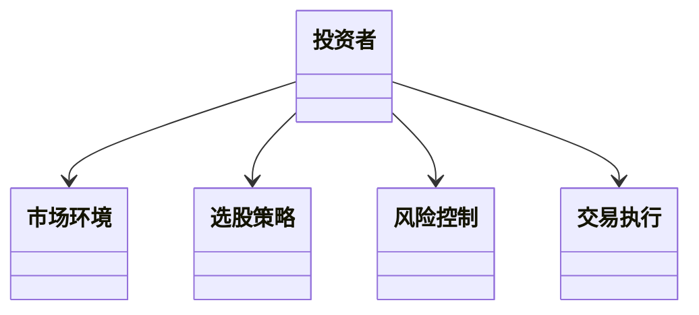
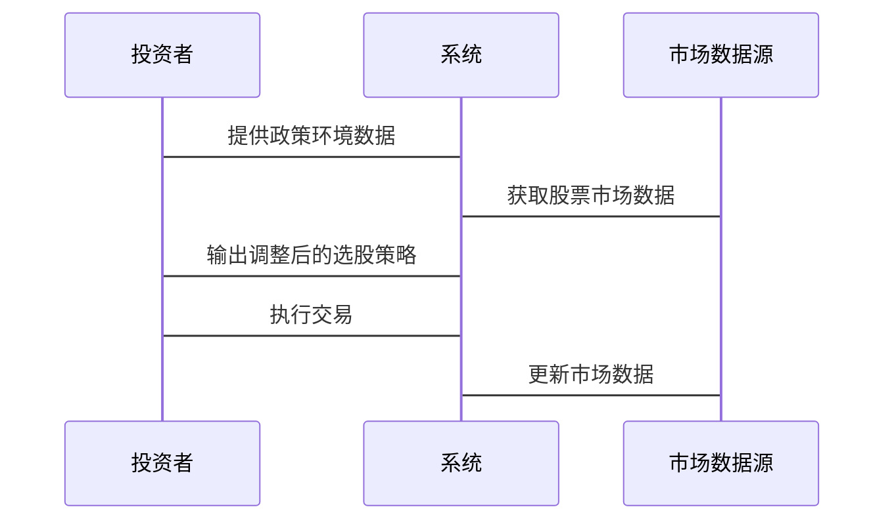

                 


# 格雷厄姆特价股票策略在不同央行政策环境下的调整

> 关键词：格雷厄姆策略、央行政策、股票投资、价值投资、市场调整

> 摘要：本文详细探讨了格雷厄姆特价股票策略在不同央行政策环境下的调整方法。通过分析格雷厄姆策略的核心概念、央行政策对股市的影响以及如何根据政策变化动态调整投资策略，本文为投资者提供了在不同政策环境下优化投资组合的实用指南。

---

## 目录

1. [格雷厄姆特价股票策略与央行政策环境概述](#格雷厄姆特价股票策略与央行政策环境概述)
2. [格雷厄姆特价股票策略的核心指标与筛选方法](#格雷厄姆特价股票策略的核心指标与筛选方法)
3. [央行政策环境的分析与分类](#央行政策环境的分析与分类)
4. [格雷厄姆策略的调整方法](#格雷厄姆策略的调整方法)
5. [格雷厄姆策略在不同央行政策环境下的实战分析](#格雷厄姆策略在不同央行政策环境下的实战分析)
6. [格雷厄姆策略的系统分析与架构设计](#格雷厄姆策略的系统分析与架构设计)
7. [格雷厄姆策略的项目实战](#格雷厄姆策略的项目实战)
8. [总结与展望](#总结与展望)

---

## 第一部分: 格雷厄姆特价股票策略与央行政策环境概述

### 第1章: 格雷厄姆特价股票策略的核心概念

#### 1.1 格雷厄姆投资理论概述

##### 1.1.1 价值投资的基本原理

价值投资是一种投资策略，强调以低于其内在价值的价格购买优质资产。格雷厄姆是价值投资的鼻祖，他提出的核心理念是寻找市场价格低于其内在价值的股票，即“特价股票”。

##### 1.1.2 格雷厄姆的"特价股票"定义

格雷厄姆认为，特价股票是指那些市场价格低于其内在价值的股票。内在价值可以通过对企业基本面的分析来估算，包括企业的盈利能力、财务状况和行业地位等。

##### 1.1.3 格雷厄姆策略的核心要素

格雷厄姆策略的核心要素包括：

- **安全边际**：购买价格与内在价值之间的差距，以降低投资风险。
- **低市盈率（P/E）**：寻找市盈率低于市场平均水平的股票。
- **低市净率（P/B）**：寻找市净率低于市场平均水平的股票。
- **高股息率**：寻找股息率高于市场平均水平的股票。

#### 1.2 央行政策对股市的影响

##### 1.2.1 央行政策的类型与目标

央行政策主要包括货币政策和财政政策。货币政策工具包括利率调整、货币供应量调节和资产购买计划等。财政政策则包括政府支出和税收调整。

##### 1.2.2 利率政策对股市的直接影响

利率政策直接影响企业的融资成本和投资者的预期收益。低利率环境通常会推高股价，因为资金成本降低，企业盈利能力增强。高利率环境则可能抑制股市表现，因为融资成本上升。

##### 1.2.3 货币政策对市场流动性的调节作用

货币政策通过调节市场流动性影响股市。宽松的货币政策会增加市场流动性，推高股价；紧缩的货币政策则会减少市场流动性，抑制股价。

#### 1.3 格雷厄姆策略在不同政策环境下的适用性

##### 1.3.1 不同政策环境下的市场特征

- **宽松政策环境**：市场流动性充裕，股市表现较好，适合格雷厄姆策略。
- **紧缩政策环境**：市场流动性减少，股市可能下跌，需要调整格雷厄姆策略。
- **中性政策环境**：市场表现稳定，适合长期投资。

##### 1.3.2 格雷厄姆策略的灵活性与适应性

格雷厄姆策略的核心是寻找低估股票，但在不同政策环境下，需要调整筛选指标和权重。

##### 1.3.3 政策变化对投资策略的影响

政策变化会影响市场流动性、企业盈利能力和个人投资者的预期收益，因此需要动态调整投资策略。

### 第2章: 格雷厄姆特价股票策略的核心指标与筛选方法

#### 2.1 格雷厄姆选股指标

##### 2.1.1 低市盈率（P/E）策略

市盈率（P/E）是股票价格与每股收益的比率。格雷厄姆建议选择P/E低于市场平均水平的股票。

##### 2.1.2 低市净率（P/B）策略

市净率（P/B）是股票价格与每股净资产的比率。格雷厄姆建议选择P/B低于市场平均水平的股票。

##### 2.1.3 高股息率策略

股息率是股息与股票价格的比率。格雷厄姆建议选择股息率高于市场平均水平的股票。

##### 2.1.4 其他辅助指标（如ROE、EPS等）

其他指标包括净资产收益率（ROE）和每股收益（EPS），用于进一步筛选和评估股票的价值。

#### 2.2 核心指标的数学模型与公式

##### 2.2.1 市盈率（P/E）公式

$$ P/E = \frac{\text{股票价格}}{\text{每股收益}} $$

##### 2.2.2 市净率（P/B）公式

$$ P/B = \frac{\text{股票价格}}{\text{每股净资产}} $$

##### 2.2.3 股息率公式

$$ 股息率 = \frac{\text{每股股息}}{\text{股票价格}} \times 100\% $$

#### 2.3 指标对比与选择策略

##### 2.3.1 不同指标的优缺点对比

| 指标 | 优点 | 缺点 |
|------|------|------|
| P/E | 反映盈利能力 | 周期性较强 |
| P/B | 反映资产质量 | 不考虑收益 |
| 股息率 | 稳定收益 | 不反映增长潜力 |

##### 2.3.2 根据政策环境选择最优指标

在宽松政策环境下，P/E和P/B指标可能更有效；在紧缩政策环境下，股息率可能更重要。

##### 2.3.3 指标权重的动态调整方法

根据政策环境变化，动态调整P/E、P/B和股息率的权重，以优化选股效果。

### 第3章: 央行政策环境的分析与分类

#### 3.1 主要央行政策工具与目标

##### 3.1.1 利率政策

包括基准利率和存款准备金率，影响企业和个人的借贷成本。

##### 3.1.2 货币发行量调节

通过增加或减少货币供应量影响市场流动性。

##### 3.1.3 资产购买计划

通过购买政府债券或资产支持证券影响市场利率和流动性。

##### 3.1.4 其他政策工具

包括汇率干预和监管政策。

#### 3.2 不同政策环境下的市场特征

##### 3.2.1 大宽松政策下的市场表现

宽松政策通常会导致市场流动性增加，股市上涨，适合格雷厄姆策略。

##### 3.2.2 收紧政策下的市场反应

紧缩政策可能导致市场流动性下降，股市下跌，需要调整投资策略。

##### 3.2.3 稳健中性的政策环境特征

中性政策环境下，市场表现稳定，适合长期投资。

#### 3.3 政策环境对格雷厄姆策略的影响

##### 3.3.1 放宽政策下的投资机会

宽松政策下，市场流动性充裕，适合寻找低估股票。

##### 3.3.2 紧缩政策下的投资策略调整

紧缩政策下，需要降低投资风险，可能减少股票配置。

##### 3.3.3 稳健政策环境下的策略优化

稳健政策环境下，可以结合多种指标进行选股。

### 第4章: 格雷厄姆策略的调整方法

#### 4.1 动态调整模型

根据政策环境变化，动态调整选股指标和权重。

##### 4.1.1 模型输入：政策环境指标

包括利率水平、货币供应量、市场流动性等。

##### 4.1.2 模型输出：选股策略调整

输出包括调整后的选股指标和权重。

##### 4.1.3 模型实现：Python代码示例

```python
def adjust_strategy(policy_environment):
    if policy_environment == '宽松':
        return {'P/E': 0.5, 'P/B': 0.3, '股息率': 0.2}
    elif policy_environment == '紧缩':
        return {'P/E': 0.3, 'P/B': 0.4, '股息率': 0.3}
    else:
        return {'P/E': 0.4, 'P/B': 0.3, '股息率': 0.3}
```

##### 4.1.4 模型流程图

使用Mermaid流程图表示调整策略的步骤：



#### 4.2 风险控制策略

##### 4.2.1 风险控制的重要性

在不同政策环境下，风险控制是确保投资收益的关键。

##### 4.2.2 风险控制的具体措施

- 分散投资：避免过度集中于某一行业或股票。
- 设置止损点：在股价下跌到一定程度时卖出股票。
- 定期调整投资组合：根据市场变化及时调整。

##### 4.2.3 风险控制的系统架构

使用Mermaid图表示风险控制系统架构：



### 第5章: 格雷厄姆策略在不同央行政策环境下的实战分析

#### 5.1 美联储加息周期下的策略调整

##### 5.1.1 美联储加息的市场影响

加息会导致市场流动性下降，企业融资成本上升，可能影响股市表现。

##### 5.1.2 策略调整的具体步骤

- 降低股票配置比例。
- 选择高股息率股票。
- 适当增加债券配置。

##### 5.1.3 实战案例分析

假设美联储加息周期开始，投资者选择高股息率股票，如公用事业和房地产信托基金。

#### 5.2 欧洲央行宽松政策下的策略优化

##### 5.2.1 欧洲央行宽松政策的市场影响

宽松政策通常会推高股价，尤其是低市盈率和低市净率股票。

##### 5.2.2 策略优化的具体步骤

- 增加低市盈率股票配置。
- 选择低市净率股票。
- 适当减少债券配置。

##### 5.2.3 实战案例分析

假设欧洲央行实施资产购买计划，投资者选择低市盈率的制造业股票。

#### 5.3 中国央行政策下的策略调整

##### 5.3.1 中国央行政策的市场影响

中国央行的政策通常注重经济增长和市场稳定，投资者需要结合国内经济环境进行调整。

##### 5.3.2 策略调整的具体步骤

- 关注低市净率股票。
- 选择高股息率股票。
- 考虑宏观经济指标，如GDP增长和工业增加值。

##### 5.3.3 实战案例分析

假设中国央行实施降准政策，投资者选择低市净率的蓝筹股。

### 第6章: 格雷厄姆策略的系统分析与架构设计

#### 6.1 问题场景介绍

格雷厄姆策略需要根据政策环境变化进行动态调整，构建一个实时监控和调整的系统。

#### 6.2 系统功能设计

##### 6.2.1 领域模型设计

使用Mermaid类图表示领域模型：



##### 6.2.2 系统架构设计

使用Mermaid架构图表示系统架构：

```mermaid
container 系统架构
    container 用户界面
        component 输入政策环境
        component 显示投资组合
    container 后台系统
        component 数据处理
        component 策略调整
        component 风险控制
    container 数据源
        component 市场数据
        component 政策数据

    用户界面 --> 数据处理
    数据处理 --> 策略调整
    策略调整 --> 风险控制
    风险控制 --> 交易执行
```

#### 6.3 系统接口设计

##### 6.3.1 输入接口

- 政策环境输入接口：接收当前政策环境数据。
- 股票数据输入接口：接收股票市场数据。

##### 6.3.2 输出接口

- 策略调整输出接口：输出调整后的选股策略。
- 风险控制输出接口：输出风险控制措施。

#### 6.4 系统交互设计

使用Mermaid序列图表示系统交互：



### 第7章: 格雷厄姆策略的项目实战

#### 7.1 环境安装

##### 7.1.1 安装Python和必要的库

安装Python和Pandas、Matplotlib、Scikit-learn等库。

#### 7.2 核心代码实现

##### 7.2.1 数据获取与预处理

使用Pandas获取股票数据和政策数据，进行清洗和转换。

##### 7.2.2 策略调整模型实现

根据政策环境调整选股指标和权重。

##### 7.2.3 风险控制模块实现

实现风险控制措施，如止损点和投资组合分散化。

#### 7.3 代码应用解读与分析

##### 7.3.1 数据获取与预处理代码

```python
import pandas as pd

# 获取股票数据
def get_stock_data(tickers):
    return pd.DataFrame()

# 获取政策数据
def get_policy_data():
    return pd.DataFrame()

# 数据清洗和转换
def preprocess_data(stock_data, policy_data):
    return stock_data, policy_data
```

##### 7.3.2 策略调整模型代码

```python
def adjust_strategy(policy_environment):
    if policy_environment == '宽松':
        return {'P/E': 0.5, 'P/B': 0.3, '股息率': 0.2}
    elif policy_environment == '紧缩':
        return {'P/E': 0.3, 'P/B': 0.4, '股息率': 0.3}
    else:
        return {'P/E': 0.4, 'P/B': 0.3, '股息率': 0.3}
```

##### 7.3.3 风险控制模块代码

```python
def risk_control(portfolio):
    # 设置止损点
    for stock in portfolio:
        if portfolio[stock] < -5%:
            sell_stock(stock)
    # 投资组合分散化
    if portfolio.集中度 > 80%:
        rebalance_portfolio()
```

#### 7.4 案例分析与详细讲解

##### 7.4.1 美联储加息周期下的案例分析

假设美联储加息，投资者选择高股息率股票，如公用事业股。

##### 7.4.2 欧洲央行宽松政策下的案例分析

假设欧洲央行宽松政策，投资者选择低市盈率股票，如制造业股。

##### 7.4.3 中国央行政策下的案例分析

假设中国央行实施降准政策，投资者选择低市净率蓝筹股。

#### 7.5 项目小结

通过实战项目，验证了格雷厄姆策略在不同政策环境下的有效性，并展示了如何动态调整策略以适应市场变化。

### 第8章: 总结与展望

#### 8.1 总结

本文详细探讨了格雷厄姆特价股票策略在不同央行政策环境下的调整方法，包括策略的核心指标、政策环境分析、策略调整方法、系统架构设计和实战案例分析。

#### 8.2 展望

未来的研究可以进一步探讨更多央行政策工具对格雷厄姆策略的影响，优化策略调整模型，并结合机器学习技术提升投资决策的智能化水平。

---

## 作者：AI天才研究院/AI Genius Institute & 禅与计算机程序设计艺术 /Zen And The Art of Computer Programming

