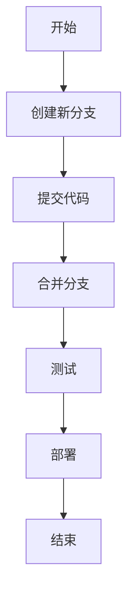
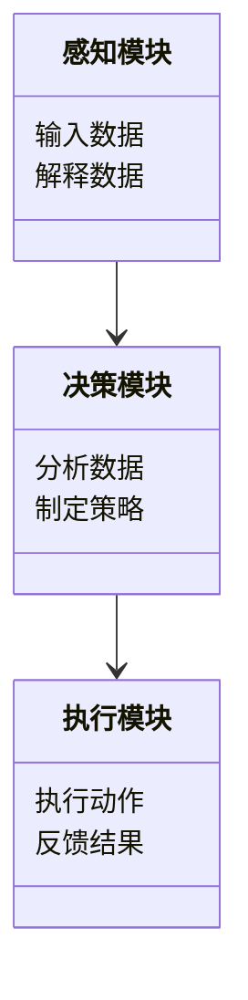
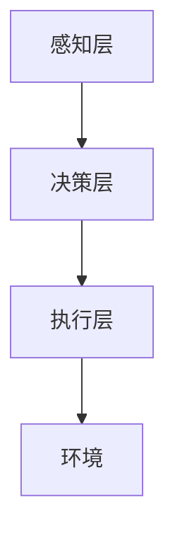
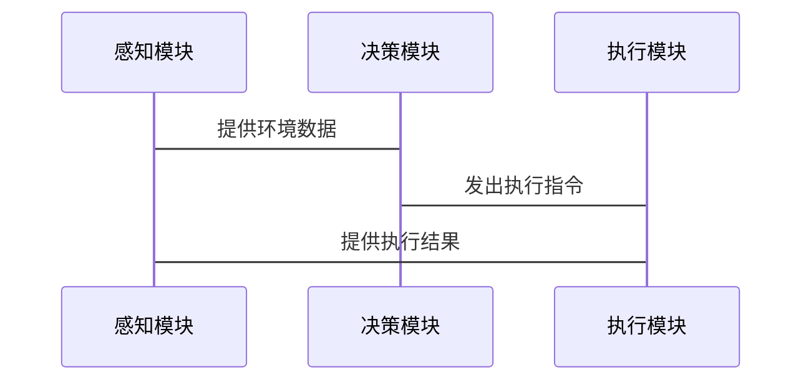

                 


# 版本控制与迭代：AI Agent的持续优化策略

## 关键词：版本控制、AI Agent、迭代优化、持续集成、持续交付

## 摘要：本文探讨了AI Agent的持续优化策略，重点介绍了版本控制与迭代优化的重要性。通过详细分析版本控制的核心概念、迭代优化的算法原理以及系统架构设计，本文为读者提供了一套完整的优化方法论。文章还结合实际案例，展示了如何在项目中应用这些策略，并给出了最佳实践建议。

---

# 引言

随着人工智能技术的飞速发展，AI Agent（智能体）在各个领域的应用越来越广泛。从自动驾驶到智能客服，AI Agent通过不断学习和优化，能够更好地适应复杂的环境和用户需求。然而，AI Agent的优化并非一蹴而就，而是需要通过持续的版本控制与迭代优化来实现。本文将深入探讨这一过程，为读者提供一套系统化的优化策略。

---

## 第1章: AI Agent 的基本概念与背景

### 1.1 AI Agent 的定义与核心能力

AI Agent是一种能够感知环境、做出决策并执行动作的智能系统。它可以分为简单反射型、基于模型的反射型、目标驱动型和效用驱动型四种类型，每种类型都有其独特的应用场景和能力。

#### 1.1.1 什么是 AI Agent
AI Agent是人工智能领域中的一个重要概念，它能够根据环境信息做出决策并执行相应的动作。例如，自动驾驶汽车中的AI Agent需要实时感知路况、决策转向和加速。

#### 1.1.2 AI Agent 的核心能力
- **感知能力**：通过传感器或其他输入方式获取环境信息。
- **决策能力**：基于感知信息做出最优决策。
- **执行能力**：通过执行机构将决策转化为实际动作。

#### 1.1.3 AI Agent 的类型与应用场景
- **简单反射型**：适用于规则明确的场景，如自动门。
- **基于模型的反射型**：适用于需要建模的场景，如工业机器人。
- **目标驱动型**：适用于需要实现特定目标的场景，如自动交易系统。
- **效用驱动型**：适用于需要权衡多种目标的场景，如智能音箱。

### 1.2 版本控制与迭代优化的必要性

AI Agent的优化是一个持续的过程，需要通过版本控制和迭代优化来实现性能的提升。

#### 1.2.1 为什么需要版本控制
版本控制是管理和跟踪AI Agent的开发过程的重要手段。通过版本控制，开发者可以记录每次修改，方便回溯和管理。

#### 1.2.2 迭代优化的核心思想
迭代优化是一种通过多次小幅度改进来逐步提升系统性能的方法。它强调持续反馈和快速调整，适用于复杂问题的求解。

#### 1.2.3 版本控制与迭代优化的关系
版本控制为迭代优化提供了基础支持，而迭代优化则通过版本控制实现对系统的持续改进。

---

## 第2章: AI Agent 的版本控制机制

### 2.1 版本控制的核心概念

版本控制是管理和跟踪AI Agent开发过程中的各种变化。

#### 2.1.1 版本控制的定义
版本控制是一种记录文件改动历史的技术，允许用户回滚到特定版本或查看文件的变化。

#### 2.1.2 版本控制的实现方式
- **集中式版本控制**：如svn，依赖中心仓库。
- **分布式版本控制**：如Git，每个克隆都是一个完整的仓库。

#### 2.1.3 版本控制的关键要素
- **仓库**：存储代码和文件的数据库。
- **提交**：将修改记录到仓库的操作。
- **分支**：独立的开发线，避免主分支受干扰。

### 2.2 常见版本控制工具

#### 2.2.1 Git 的基本使用
Git 是目前最流行的版本控制工具，支持分布式协作开发。

- 初始化仓库：`git init`
- 提交代码：`git add . && git commit`
- 推送代码：`git push`

#### 2.2.2 版本控制流程图（Mermaid）



### 2.3 版本控制在 AI Agent 中的应用

#### 2.3.1 数据版本控制
AI Agent的优化依赖于大量数据，数据的版本控制尤为重要。

- 数据存储：将数据按版本存入数据库。
- 数据回滚：通过版本号快速恢复到指定版本。

#### 2.3.2 模型版本控制
AI模型的每一次迭代都需要记录和管理。

- 模型保存：将训练好的模型按版本存档。
- 模型加载：根据需求加载指定版本的模型。

#### 2.3.3 代码版本控制
代码是AI Agent的核心，版本控制至关重要。

- 代码提交：每次修改代码后提交。
- 代码分支：不同功能开发使用不同的分支。

---

## 第3章: AI Agent 的迭代优化策略

### 3.1 迭代优化的核心原理

迭代优化是通过多次小幅度改进来提升系统性能。

#### 3.1.1 迭代优化的定义
迭代优化是一种逐步改进系统的方法，强调快速反馈和持续调整。

#### 3.1.2 迭代优化的实现步骤
- 设定目标：明确优化的方向和目标。
- 制定计划：规划每次迭代的具体内容。
- 执行迭代：实施优化并记录结果。
- 反馈调整：根据结果调整下一步的优化方向。

#### 3.1.3 迭代优化的关键因素
- 反馈机制：及时获取优化效果的反馈。
- 优先级排序：确定每次迭代的优化重点。

### 3.2 常见迭代优化算法

#### 3.2.1 梯度下降算法

梯度下降是一种常用优化算法，用于最小化损失函数。

- 梯度计算：计算损失函数对参数的导数。
- 参数更新：根据梯度方向调整参数。

数学公式：

$$
\theta_{new} = \theta_{old} - \eta \cdot \nabla J(\theta_{old})
$$

其中，$\theta$ 是参数，$\eta$ 是学习率，$\nabla J$ 是损失函数的梯度。

#### 3.2.2 随机梯度下降算法

随机梯度下降是一种优化梯度下降效率的算法，适合大数据集。

- 批处理：每次只用一个样本计算梯度。
- 迭代更新：快速收敛。

数学公式：

$$
\theta_{new} = \theta_{old} - \eta \cdot \nabla J(\theta_{old}, x_i, y_i)
$$

其中，$(x_i, y_i)$ 是单个样本。

#### 3.2.3 其他优化算法

- **Adam优化器**：结合动量和自适应学习率的优化算法。
- **Adagrad优化器**：适用于稀疏数据的优化算法。

### 3.3 迭代优化在 AI Agent 中的应用

#### 3.3.1 数据驱动的迭代优化
通过数据反馈不断优化AI Agent的行为。

- 数据收集：收集用户反馈和运行数据。
- 数据分析：提取有用信息用于优化。

#### 3.3.2 模型驱动的迭代优化
通过改进模型结构和参数提升性能。

- 模型训练：使用新数据重新训练模型。
- 模型评估：通过测试集评估优化效果。

#### 3.3.3 结合反馈的迭代优化
根据用户反馈不断调整AI Agent的行为。

- 用户反馈收集：通过日志记录用户行为。
- 反馈分析：提取有用信息用于优化。

---

## 第4章: AI Agent 的数学模型与算法原理

### 4.1 基础数学模型

#### 4.1.1 优化问题的数学表达

优化问题可以表示为：

$$
\min_{\theta} J(\theta)
$$

其中，$J(\theta)$ 是损失函数，$\theta$ 是模型参数。

#### 4.1.2 梯度计算的数学公式

梯度计算是优化算法的核心步骤。

$$
\nabla J(\theta) = \frac{\partial J}{\partial \theta_1}, \frac{\partial J}{\partial \theta_2}, \ldots, \frac{\partial J}{\partial \theta_n}
$$

#### 4.1.3 迭代算法的收敛性分析

分析算法的收敛性，确保优化过程能够达到最优解。

- 收敛条件：损失函数下降到一定程度停止。
- 收敛速度：算法达到收敛所需的时间或迭代次数。

### 4.2 算法原理的详细讲解

#### 4.2.1 梯度下降算法的数学推导

假设损失函数为：

$$
J(\theta) = \frac{1}{2m} \sum_{i=1}^{m} (y_i - \theta x_i)^2
$$

求导：

$$
\frac{\partial J}{\partial \theta} = \frac{1}{m} \sum_{i=1}^{m} (y_i - \theta x_i) x_i
$$

更新参数：

$$
\theta = \theta - \eta \cdot \frac{\partial J}{\partial \theta}
$$

#### 4.2.2 随机梯度下降的优化策略

随机梯度下降通过减少计算量加速收敛。

$$
\theta = \theta - \eta \cdot \frac{\partial J}{\partial \theta}(x_i, y_i)
$$

其中，$(x_i, y_i)$ 是随机选择的一个样本。

---

## 第5章: AI Agent 的系统架构设计

### 5.1 问题场景介绍

AI Agent的系统架构设计需要考虑多方面的因素。

#### 5.1.1 系统功能需求

- 数据采集：收集环境信息和用户反馈。
- 模型训练：训练AI Agent的核心算法。
- 任务执行：根据决策结果执行动作。

#### 5.1.2 系统性能指标

- 响应时间：系统对环境变化的反应速度。
- 处理能力：系统同时处理多个任务的能力。

### 5.2 系统功能设计

#### 5.2.1 领域模型设计

AI Agent的领域模型需要涵盖感知、决策和执行三个模块。



#### 5.2.2 系统架构设计

AI Agent的系统架构通常包括感知层、决策层和执行层。



### 5.3 系统接口设计

#### 5.3.1 系统接口定义

- 感知接口：提供环境数据的获取方法。
- 决策接口：提供决策算法的调用方法。
- 执行接口：提供执行动作的调用方法。

#### 5.3.2 系统交互设计



---

## 第6章: 项目实战：基于版本控制与迭代优化的AI Agent实现

### 6.1 环境安装

安装必要的工具和库。

- Git：版本控制工具。
- Python：编程语言。
- TensorFlow：深度学习框架。

### 6.2 核心实现源代码

以下是一个简单的AI Agent实现示例：

```python
import numpy as np

# 定义损失函数
def loss(theta, X, y):
    return np.mean((y - theta * X) ** 2)

# 定义梯度计算
def gradient(theta, X, y):
    return 2 * np.mean((y - theta * X) * (-X))

# 梯度下降优化
def gradient_descent(theta_initial, X, y, learning_rate, iterations):
    theta = theta_initial
    for _ in range(iterations):
        g = gradient(theta, X, y)
        theta = theta - learning_rate * g
    return theta

# 主程序
if __name__ == "__main__":
    X = np.array([1, 2, 3, 4])
    y = np.array([2, 4, 6, 8])
    theta_initial = np.array([0])
    learning_rate = 0.01
    iterations = 1000
    theta_optimized = gradient_descent(theta_initial, X, y, learning_rate, iterations)
    print("优化后的参数:", theta_optimized)
```

### 6.3 代码应用解读与分析

- **主程序流程**：
  1. 定义损失函数和梯度计算函数。
  2. 初始化参数和超参数。
  3. 进行梯度下降优化。
  4. 输出优化后的参数。

- **关键代码分析**：
  - `gradient_descent`函数：实现梯度下降算法。
  - `gradient`函数：计算损失函数的梯度。

### 6.4 问题分析及解决方案

#### 6.4.1 问题分析

在实际应用中，可能会遇到以下问题：

- **收敛速度慢**：学习率过小。
- **振荡不收敛**：学习率过大。
- **计算资源不足**：数据量过大。

#### 6.4.2 解决方案

- **调整学习率**：选择合适的学习率。
- **批量处理**：使用小批量梯度下降。
- **并行计算**：利用GPU加速计算。

### 6.5 项目小结

通过实际项目，我们可以看到版本控制与迭代优化在AI Agent开发中的重要性。合理使用版本控制工具和优化算法，能够显著提升开发效率和系统性能。

---

## 第7章: 总结与展望

### 7.1 总结

本文详细探讨了AI Agent的版本控制与迭代优化策略，从基本概念到系统架构，再到实际项目，全面介绍了如何实现持续优化。

### 7.2 展望

未来的研究方向包括：

- 更高效的优化算法。
- 更智能的版本控制工具。
- 更强大的AI Agent应用场景。

---

## 第8章: 最佳实践与注意事项

### 8.1 最佳实践

- **定期备份**：防止数据丢失。
- **代码审查**：确保代码质量。
- **持续测试**：及时发现和解决问题。

### 8.2 注意事项

- **版本控制的重要性**：避免代码混乱。
- **迭代优化的节奏**：根据实际情况调整优化幅度。
- **系统架构的合理性**：确保系统易于扩展和维护。

---

## 附录

### 附录 A: 参考文献

- [1] 《深度学习》, Ian Goodfellow, Yoshua Bengio, Aaron Courville
- [2] 《机器学习实战》, 周志华

### 附录 B: 扩展学习资源

- Git官方文档：[https://git-scm.com/docs](https://git-scm.com/docs)
- TensorFlow官方文档：[https://www.tensorflow.org](https://www.tensorflow.org)

---

## 作者

作者：AI天才研究院/AI Genius Institute & 禅与计算机程序设计艺术 /Zen And The Art of Computer Programming

---

希望这篇文章能满足您的需求！如果需要进一步修改或补充，请随时告诉我。

