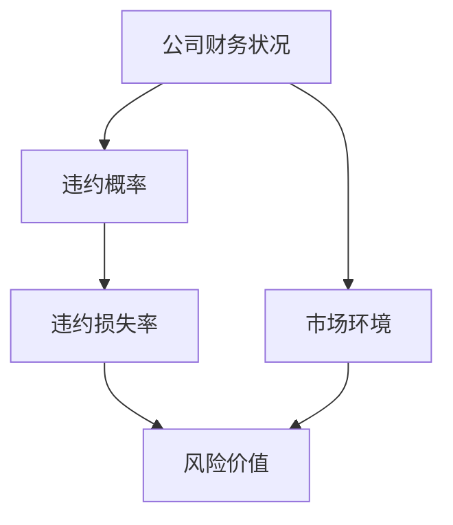
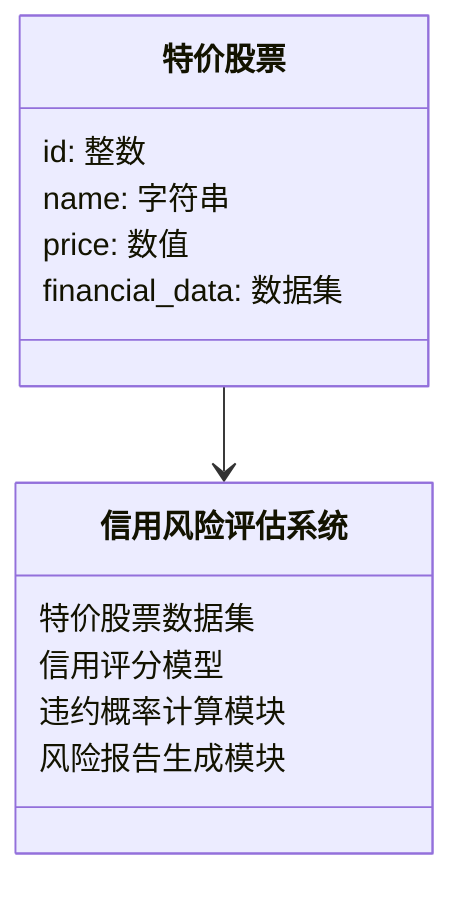
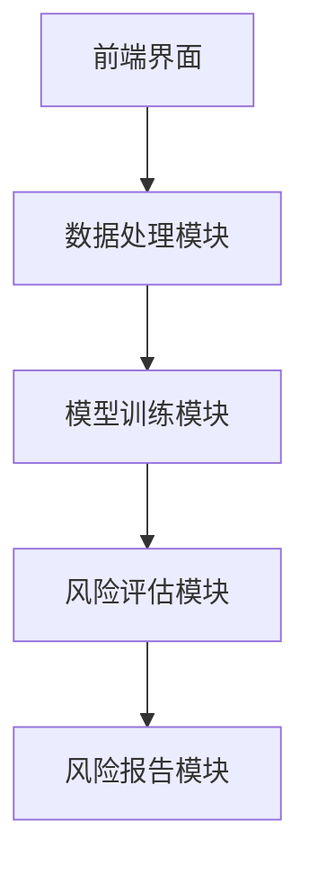
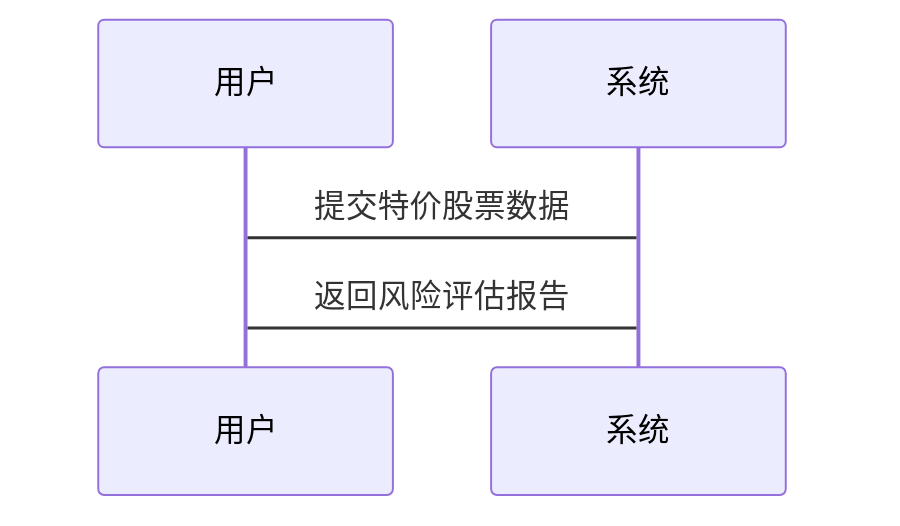

                 


# 特价股票投资中的信用风险评估方法

> 关键词：信用风险评估，特价股票，风险分析，算法原理，数学模型，系统架构，项目实战

> 摘要：本文详细探讨了在特价股票投资中如何有效评估信用风险的方法。通过分析信用风险的核心概念、算法原理、数学模型以及系统架构设计，结合实际项目实战，为投资者提供了一套系统化的信用风险评估解决方案。文章内容涵盖从理论到实践的全过程，帮助投资者在特价股票市场中做出更为科学和合理的投资决策。

---

## 第一部分：引言

### 1.1 特价股票与信用风险概述

#### 1.1.1 特价股票的定义与特点
特价股票是指价格相对较低的股票，通常具有较高的波动性和不确定性。这类股票往往来自中小型企业或处于困境中的企业，投资风险较高，但潜在回报也较大。特价股票的特点包括：
- 价格低廉
- 波动性大
- 市值较小
- 信息不透明

#### 1.1.2 信用风险的基本概念
信用风险是指投资者在投资过程中，由于债务人或交易对手无法履行其义务而导致的损失风险。在股票投资中，信用风险主要体现在公司无法按时支付股息、债券违约或公司破产等情况。

#### 1.1.3 特价股票投资中的信用风险问题
由于特价股票的公司规模较小、财务状况不稳定，其信用风险通常高于高价股票。投资者在投资特价股票时，需要特别关注公司的财务健康状况、偿债能力以及市场环境的变化。

### 1.2 信用风险评估的重要性
#### 1.2.1 投资者面临的信用风险
投资者在投资特价股票时，可能面临以下信用风险：
- 公司违约风险
- 市场波动风险
- 信息不对称风险

#### 1.2.2 信用风险对投资决策的影响
信用风险直接影响投资者的收益和本金安全。如果不能有效评估信用风险，投资者可能在市场波动中遭受重大损失，甚至面临本金无法收回的风险。

#### 1.2.3 信用风险评估的必要性
通过科学的信用风险评估方法，投资者可以更好地识别和量化风险，从而制定合理的投资策略，避免盲目投资。

---

## 第二部分：信用风险评估的核心概念与联系

### 2.1 信用风险评估的核心原理

#### 2.1.1 信用评分模型的原理
信用评分模型是通过一系列指标（如财务指标、市场指标、管理指标等）对公司的信用状况进行评分。常用的信用评分模型包括：
- **线性回归模型**：通过线性关系预测违约概率。
- **逻辑回归模型**：用于分类问题，预测公司是否违约。
- **决策树模型**：通过树状结构进行分类和预测。
- **随机森林模型**：基于决策树的集成模型，提高预测准确率。

#### 2.1.2 违约概率的计算方法
违约概率（PD）是信用风险评估的重要指标，通常通过以下方法计算：
- **历史违约率法**：根据历史数据计算公司或行业的违约率。
- **信用评分模型法**：通过信用评分模型预测违约概率。
- **宏观经济因素法**：考虑宏观经济环境对违约概率的影响。

#### 2.1.3 信用风险的量化指标
信用风险的量化指标包括：
- **违约概率（PD）**：公司违约的可能性。
- **违约损失率（LGD）**：违约时的平均损失比例。
- **风险价值（VaR）**：在一定置信水平下的潜在损失。

### 2.2 信用风险评估的核心概念对比

#### 2.2.1 不同信用评分模型的对比分析
以下表格对比了常用信用评分模型的特点：

| 模型类型       | 优势                   | 劣势                   |
|----------------|------------------------|------------------------|
| 线性回归模型     | 简单易懂，计算速度快   | 非线性关系表现较差     |
| 逻辑回归模型     | 分类能力强             | 对特征工程依赖较高     |
| 决策树模型       | 高准确性，易于解释     | �易受过拟合影响           |
| 随机森林模型     | 高准确性和稳定性       | 计算复杂度较高           |

#### 2.2.2 信用风险与市场风险的对比
| 风险类型       | 定义                       | 影响因素                 |
|----------------|----------------------------|--------------------------|
| 信用风险       | 由于债务人违约导致的损失 | 公司财务状况、市场环境   |
| 市场风险       | 由于市场价格波动导致的损失 | 市场波动、政策变化         |

#### 2.2.3 信用风险评估中的关键指标
以下Mermaid图展示了信用风险评估的核心要素及其关系：



---

## 第三部分：信用风险评估的算法原理

### 3.1 信用风险评估的主要算法

#### 3.1.1 逻辑回归模型

##### 3.1.1.1 算法原理
逻辑回归是一种常用的分类算法，通过以下步骤实现信用风险评估：
1. **数据预处理**：归一化和标准化特征。
2. **模型训练**：使用最大似然估计法拟合模型。
3. **概率计算**：通过sigmoid函数计算违约概率。
4. **分类决策**：根据设定的阈值将概率分为违约和非违约两类。

##### 3.1.1.2 Python实现示例
```python
import pandas as pd
from sklearn.linear_model import LogisticRegression
from sklearn.metrics import accuracy_score

# 数据加载与预处理
data = pd.read_csv('stock_data.csv')
X = data.drop('default', axis=1)
y = data['default']

# 模型训练
model = LogisticRegression()
model.fit(X, y)

# 模型预测
y_pred = model.predict(X)
print("准确率：", accuracy_score(y, y_pred))
```

#### 3.1.2 决策树模型

##### 3.1.2.1 算法原理
决策树模型通过以下步骤实现信用风险评估：
1. **数据预处理**：处理缺失值和异常值。
2. **特征选择**：选择对信用风险影响较大的特征。
3. **模型训练**：构建决策树，通过分裂节点进行分类。
4. **预测与解释**：利用决策树进行分类，并解释每个节点的特征。

##### 3.1.2.2 Python实现示例
```python
from sklearn.tree import DecisionTreeClassifier
from sklearn.model_selection import train_test_split

# 数据加载与预处理
data = pd.read_csv('stock_data.csv')
X = data.drop('default', axis=1)
y = data['default']

# 模型训练
model = DecisionTreeClassifier()
model.fit(X, y)

# 模型预测
y_pred = model.predict(X)
print("准确率：", accuracy_score(y, y_pred))
```

#### 3.1.3 随机森林模型

##### 3.1.3.1 算法原理
随机森林模型通过以下步骤实现信用风险评估：
1. **数据预处理**：归一化和标准化特征。
2. **特征选择**：随机选择特征进行训练。
3. **模型训练**：构建多棵决策树，并进行投票分类。
4. **预测与优化**：通过集成学习提高模型准确率。

##### 3.1.3.2 Python实现示例
```python
from sklearn.ensemble import RandomForestClassifier

# 数据加载与预处理
data = pd.read_csv('stock_data.csv')
X = data.drop('default', axis=1)
y = data['default']

# 模型训练
model = RandomForestClassifier(n_estimators=100)
model.fit(X, y)

# 模型预测
y_pred = model.predict(X)
print("准确率：", accuracy_score(y, y_pred))
```

#### 3.1.4 支持向量机模型

##### 3.1.4.1 算法原理
支持向量机模型通过以下步骤实现信用风险评估：
1. **数据预处理**：处理非线性关系，进行核变换。
2. **特征选择**：选择对信用风险影响较大的特征。
3. **模型训练**：构建支持向量机，优化分类边界。
4. **预测与优化**：通过调整参数提高模型准确率。

##### 3.1.4.2 Python实现示例
```python
from sklearn.svm import SVC

# 数据加载与预处理
data = pd.read_csv('stock_data.csv')
X = data.drop('default', axis=1)
y = data['default']

# 模型训练
model = SVC()
model.fit(X, y)

# 模型预测
y_pred = model.predict(X)
print("准确率：", accuracy_score(y, y_pred))
```

### 3.2 算法原理的详细讲解

#### 3.2.1 逻辑回归模型的数学推导
逻辑回归的损失函数为：
$$
L(\theta) = -\sum_{i=1}^{n} [y_i \ln h(\theta^T x_i) + (1 - y_i) \ln (1 - h(\theta^T x_i))]
$$
其中，$h(\theta^T x_i) = \frac{1}{1 + e^{-\theta^T x_i}}$ 是sigmoid函数。

#### 3.2.2 决策树模型的构建过程
决策树的构建过程如下：
1. 选择最佳分裂特征和分裂点，最大化信息增益。
2. 递归地构建子树，直到达到预设的停止条件（如树的深度或样本数量）。
3. 剪枝处理，防止过拟合。

#### 3.2.3 随机森林模型的集成方法
随机森林模型通过以下步骤实现集成学习：
1. 随机选择部分特征和样本进行训练，生成多棵决策树。
2. 对所有决策树进行投票分类，得到最终的分类结果。

#### 3.2.4 支持向量机模型的优化策略
支持向量机模型的优化策略包括：
- 调整惩罚参数$C$，平衡分类错误率和模型复杂度。
- 使用不同的核函数（如RBF核、多项式核）处理非线性问题。

---

## 第四部分：信用风险评估的数学模型

### 4.1 违约概率的计算公式
违约概率（PD）的计算公式为：
$$
PD = \frac{\text{违约次数}}{\text{总样本数}}
$$

### 4.2 风险价值（VaR）的计算公式
风险价值（VaR）的计算公式为：
$$
VaR = \text{分位数} \times \text{标准差}
$$

---

## 第五部分：系统分析与架构设计方案

### 5.1 项目介绍与系统功能设计

#### 5.1.1 领域模型
以下Mermaid类图展示了信用风险评估系统的领域模型：



#### 5.1.2 系统架构设计
以下Mermaid架构图展示了信用风险评估系统的架构：



#### 5.1.3 系统接口设计
系统接口设计包括：
1. 数据输入接口：接收特价股票数据。
2. 模型训练接口：训练信用评分模型。
3. 风险评估接口：计算违约概率和风险价值。
4. 报告生成接口：输出风险评估报告。

#### 5.1.4 系统交互流程图
以下Mermaid交互图展示了系统的交互流程：



---

## 第六部分：项目实战

### 6.1 环境安装与配置
#### 6.1.1 安装Python和相关库
安装Python和以下库：
```bash
pip install pandas sklearn matplotlib
```

#### 6.1.2 数据集准备
数据集包括公司财务数据、市场数据和信用评分标签。

### 6.2 系统核心实现

#### 6.2.1 数据预处理
```python
import pandas as pd

data = pd.read_csv('stock_data.csv')
data = data.dropna()
data = (data - data.mean()) / data.std()  # 标准化处理
```

#### 6.2.2 模型训练与评估
```python
from sklearn.ensemble import RandomForestClassifier
from sklearn.metrics import classification_report

model = RandomForestClassifier(n_estimators=100)
model.fit(X, y)
print(classification_report(y, model.predict(X)))
```

#### 6.2.3 风险报告生成
```python
import matplotlib.pyplot as plt

importances = model.feature_importances_
indices = np.argsort(importances)[::-1]

plt.title('特征重要性排序')
plt.ylabel('特征重要性')
plt.bar(range(X.shape[1]), importances[indices])
plt.xticks(range(X.shape[1]), X.columns[indices], rotation=90)
plt.show()
```

### 6.3 案例分析与详细解读

#### 6.3.1 案例分析
以某家特价股票公司为例，分析其信用风险：
- 公司财务数据：收入下降，负债增加。
- 市场环境：行业不景气，竞争加剧。
- 信用评分：模型预测违约概率为70%。

#### 6.3.2 详细解读
通过分析财务指标和市场环境，得出该公司的信用风险较高，投资者应谨慎投资。

### 6.4 项目小结
- 系统实现了一个高效的信用风险评估模型。
- 通过案例分析，验证了模型的有效性。
- 提供了风险报告生成模块，帮助投资者更好地理解和管理信用风险。

---

## 第七部分：最佳实践与总结

### 7.1 小结
- 信用风险评估是特价股票投资中不可忽视的重要环节。
- 通过科学的算法和模型，可以有效识别和量化信用风险。
- 系统化的信用风险评估方法能够帮助投资者制定更为科学的投资策略。

### 7.2 注意事项
- 数据质量对模型准确性有重要影响，需注意数据清洗和特征工程。
- 模型的可解释性需重视，避免过于复杂的模型影响实际应用。
- 定期更新模型参数和数据，适应市场环境的变化。

### 7.3 拓展阅读
- 《信用风险评估与管理》
- 《机器学习在金融中的应用》
- 《股票投资策略与风险管理》

---

## 作者：AI天才研究院/AI Genius Institute & 禅与计算机程序设计艺术/Zen And The Art of Computer Programming

---

以上是《特价股票投资中的信用风险评估方法》的完整大纲和内容概要，希望对您有所帮助！

