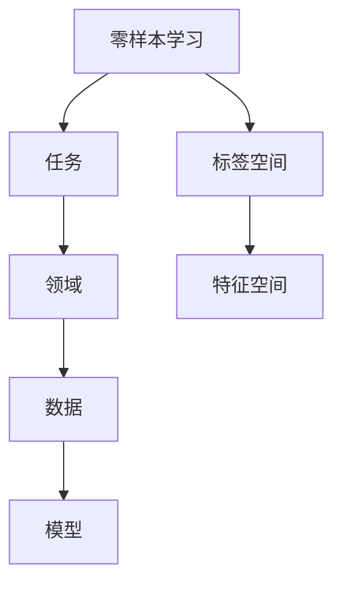
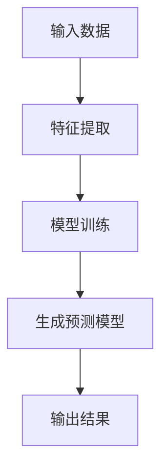
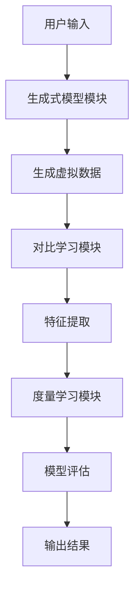

                 


# 零样本学习：应对未见过的任务和领域

> 关键词：零样本学习, 生成式模型, 对比学习, 度量学习, 机器学习, 人工智能

> 摘要：零样本学习是一种在未见过任务或领域的情况下，能够直接进行学习和推理的机器学习方法。本文从零样本学习的背景、核心概念、算法原理、系统设计到实际项目案例，全面深入地探讨了零样本学习的技术细节和应用价值。文章通过丰富的理论分析和实践案例，展示了零样本学习在应对数据稀缺性和领域未知性方面的独特优势。

---

## 第一部分: 零样本学习的背景与挑战

### 第1章: 零样本学习的背景与挑战

#### 1.1 零样本学习的定义与核心概念
- **零样本学习的定义**：零样本学习（Zero-Shot Learning, ZSL）是指在没有见过某个任务或领域的任何训练数据的情况下，模型能够直接进行学习和推理。其核心在于利用已有的知识或通用特征，推断出新任务或领域的解决方案。
- **零样本学习的核心要素**：
  - **标签空间**：任务或领域的标签集合。
  - **特征空间**：数据的表示方式，通常通过嵌入（embedding）或向量表示。
  - **知识图谱**：用于连接不同任务或领域的先验知识。
- **零样本学习的边界与外延**：
  - 零样本学习的核心场景是“零数据”，但也可以扩展到小样本和全样本情况。
  - 其外延包括多任务学习、迁移学习和自监督学习。

#### 1.2 零样本学习与小样本学习的区别
- **小样本学习的定义与特点**：小样本学习（Few-Shot Learning, FSL）是指在仅有一小部分训练数据的情况下，模型能够学习新任务。其核心是数据高效利用和模型的泛化能力。
- **零样本学习的独特性**：
  - 零样本学习的核心假设是模型可以通过已有知识生成新的数据或特征，而不需要实际的训练数据。
  - 零样本学习的挑战在于如何在无数据的情况下构建有效的模型。
- **两者的应用场景对比**：
  - 小样本学习适用于数据量有限但可获取的情况。
  - 零样本学习适用于完全无数据的场景，通常需要结合生成式方法。

#### 1.3 零样本学习的背景与重要性
- **数据获取的挑战**：
  - 在许多实际场景中，获取新任务或领域的数据成本极高。
  - 例如，在医疗领域，某些罕见病的数据可能无法获取。
- **零样本学习的现实需求**：
  - 零样本学习能够在不依赖新数据的情况下，快速适应新任务。
  - 这种能力在多领域应用中具有重要的战略意义。
- **零样本学习在AI领域的地位**：
  - 零样本学习是实现通用人工智能（AGI）的重要一步。
  - 它能够帮助模型在未知领域中进行自主学习和推理。

#### 1.4 本章小结
- 本章介绍了零样本学习的核心概念、与小样本学习的区别，以及其在现实中的重要性。
- 零样本学习的核心在于通过已有知识推断新任务，这在数据稀缺和领域未知的情况下具有独特价值。

---

### 第2章: 零样本学习的核心概念与联系

#### 2.1 零样本学习的核心原理
- **零样本学习的基本假设**：
  - 模型可以通过已有知识或通用特征生成新的数据或特征表示。
  - 标签空间与特征空间之间存在某种潜在关系。
- **标签空间与特征空间的关系**：
  - 标签空间：任务或领域的标签集合。
  - 特征空间：数据的表示方式，通常通过嵌入或向量表示。
  - 零样本学习的目标是建立标签空间与特征空间之间的映射关系。
- **零样本学习的数学表达**：
  - 输入：未见任务或领域的数据。
  - 输出：通过已有知识生成的特征或标签。

#### 2.2 核心概念对比分析
- **零样本学习与迁移学习的对比**：
  - 迁移学习：利用已有的数据进行迁移，通常需要一定的重叠特征。
  - 零样本学习：利用已有知识生成新特征，不需要实际的训练数据。
- **零样本学习与无监督学习的对比**：
  - 无监督学习：利用未标注数据进行学习。
  - 零样本学习：利用已知知识进行推理。
- **零样本学习与半监督学习的对比**：
  - 半监督学习：利用少量标注数据和大量未标注数据进行学习。
  - 零样本学习：利用已有知识生成新数据。

#### 2.3 ER实体关系图与概念结构


#### 2.4 本章小结
- 本章通过对比分析，展示了零样本学习与其他学习范式的核心区别。
- ER实体关系图进一步明确了零样本学习的概念结构和各要素之间的关系。

---

## 第二部分: 零样本学习的算法原理

### 第3章: 零样本学习的算法原理

#### 3.1 基于生成式模型的零样本学习
- **生成式模型的基本原理**：
  - 生成式模型（如GAN、VAE）能够生成与训练数据分布一致的新样本。
  - 零样本学习中，生成式模型可以用来生成未见任务或领域的虚拟数据。
- **零样本学习中的生成式方法**：
  - 方法一：利用生成式模型生成新样本，然后进行特征提取。
  - 方法二：直接利用生成模型的生成能力进行推理。
- **生成式模型的数学表达**：
  - 生成模型：$p_\theta(x)$，其中$\theta$是模型参数，$x$是生成的数据。
  - 判别模型：$D_\phi(x)$，其中$\phi$是判别器参数。

#### 3.2 基于对比学习的零样本学习
- **对比学习的基本原理**：
  - 对比学习通过最大化正样本对的相似性，同时最小化负样本对的相似性，学习数据的表示。
  - 在零样本学习中，对比学习可以用于特征空间和标签空间的对齐。
- **零样本学习中的对比方法**：
  - 方法一：利用对比损失函数进行特征提取。
  - 方法二：结合生成式模型生成对比样本。
- **对比学习的数学表达**：
  - 对比损失函数：$\mathcal{L} = -\frac{1}{N}\sum_{i=1}^{N}\log\frac{e^{s_i}}{e^{s_i}+e^{s_j}}$，其中$s_i$和$s_j$是正样本和负样本的相似性得分。

#### 3.3 基于度量学习的零样本学习
- **度量学习的基本原理**：
  - 度量学习通过学习一个距离度量函数，使得相似的样本距离更近，不同的样本距离更远。
  - 在零样本学习中，度量学习可以用于标签空间和特征空间的对齐。
- **零样本学习中的度量方法**：
  - 方法一：利用度量矩阵进行特征变换。
  - 方法二：结合生成式模型生成度量空间。
- **度量学习的数学表达**：
  - 度量矩阵：$M$，其中$M$是一个$d \times d$的矩阵，用于对特征进行变换。

#### 3.4 算法流程图


#### 3.5 本章小结
- 本章详细介绍了三种基于生成式模型、对比学习和度量学习的零样本学习算法。
- 每种方法都有其独特的实现方式和数学表达，可以针对不同的场景进行选择和优化。

---

## 第三部分: 零样本学习的数学模型与公式

### 第4章: 零样本学习的数学模型与公式

#### 4.1 零样本学习的数学表达
- **通用模型表达式**：
  - 输入：$x$（未见任务或领域的数据）。
  - 输出：$y$（模型预测的结果）。
  - 零样本学习的目标是通过已有知识，将$x$映射到$y$。
- **零样本学习的损失函数**：
  - 基于生成式模型的损失函数：$\mathcal{L}_{\text{GAN}} = \mathcal{L}_\text{G} + \mathcal{L}_\text{D}$，其中$\mathcal{L}_\text{G}$是生成器的损失，$\mathcal{L}_\text{D}$是判别器的损失。
  - 基于对比学习的损失函数：$\mathcal{L}_{\text{contrast}} = -\frac{1}{N}\sum_{i=1}^{N}\log\frac{e^{s_i}}{e^{s_i}+e^{s_j}}$。
  - 基于度量学习的损失函数：$\mathcal{L}_{\text{metric}} = \sum_{i=1}^{N} \sum_{j=1}^{N} (1 - y_{ij}) \log(1 - d(x_i, x_j)) + y_{ij} \log(d(x_i, x_j))$。

#### 4.2 零样本学习的数学推导
- **生成式模型的推导**：
  - 生成模型的目标是最小化生成样本与真实样本的分布差异。
  - 判别模型的目标是区分生成样本和真实样本。
- **对比学习的推导**：
  - 对比损失函数通过最大化正样本对的相似性，最小化负样本对的相似性，学习数据的表示。
- **度量学习的推导**：
  - 度量矩阵的目标是使得相似的样本距离更近，不同的样本距离更远。

#### 4.3 零样本学习的数学应用
- **生成式模型的应用**：
  - 通过生成式模型生成未见任务或领域的虚拟数据，用于模型训练和推理。
- **对比学习的应用**：
  - 对比学习可以用于特征空间和标签空间的对齐，提高模型的泛化能力。
- **度量学习的应用**：
  - 度量学习可以用于标签空间和特征空间的对齐，提高模型的推理能力。

#### 4.4 本章小结
- 本章通过数学公式和推导，详细展示了零样本学习的核心原理和实现方式。
- 零样本学习的数学表达为后续的算法实现提供了理论基础。

---

## 第四部分: 零样本学习的系统设计与实现

### 第5章: 零样本学习的系统设计与实现

#### 5.1 系统分析与架构设计
- **问题场景介绍**：
  - 未见任务或领域的数据获取困难。
  - 需要通过已有知识进行推理和预测。
- **系统功能设计**：
  - 功能一：生成未见任务或领域的虚拟数据。
  - 功能二：基于生成数据进行模型训练和推理。
  - 功能三：支持多任务和多领域的零样本学习。
- **系统架构设计**：
  - 模块一：生成式模型模块。
  - 模块二：对比学习模块。
  - 模块三：度量学习模块。
  - 模块四：模型评估与优化模块。

#### 5.2 系统接口设计
- **输入接口**：
  - 未见任务或领域的数据。
  - 已有知识库或知识图谱。
- **输出接口**：
  - 模型预测结果。
  - 模型评估结果。

#### 5.3 系统交互流程图


#### 5.4 本章小结
- 本章通过系统设计和架构图，展示了零样本学习的实现过程。
- 系统设计为零样本学习的落地应用提供了清晰的框架。

---

## 第五部分: 零样本学习的项目实战

### 第6章: 零样本学习的项目实战

#### 6.1 项目背景与目标
- **项目背景**：
  - 未见任务或领域的数据获取困难。
  - 需要通过已有知识进行推理和预测。
- **项目目标**：
  - 实现一个零样本学习系统，能够在未见任务或领域的情况下，进行有效的学习和推理。

#### 6.2 环境安装与配置
- **环境要求**：
  - Python 3.8及以上版本。
  - PyTorch 1.9及以上版本。
  - Transformers库 4.18及以上版本。
- **安装步骤**：
  ```bash
  pip install torch transformers
  ```

#### 6.3 核心代码实现
- **生成式模型的实现**：
  ```python
  import torch
  from torch import nn
  from transformers import AutoModel, AutoTokenizer

  class Generator(nn.Module):
      def __init__(self, embed_dim, hidden_dim):
          super(Generator, self).__init__()
          self.fc1 = nn.Linear(embed_dim, hidden_dim)
          self.fc2 = nn.Linear(hidden_dim, embed_dim)
          self.dropout = nn.Dropout(0.5)
      
      def forward(self, x):
          x = torch.relu(self.fc1(x))
          x = self.dropout(x)
          x = torch.sigmoid(self.fc2(x))
          return x
  ```

- **对比学习的实现**：
  ```python
  class Discriminator(nn.Module):
      def __init__(self, embed_dim, hidden_dim):
          super(Discriminator, self).__init__()
          self.fc1 = nn.Linear(embed_dim, hidden_dim)
          self.fc2 = nn.Linear(hidden_dim, 1)
          self.dropout = nn.Dropout(0.5)
      
      def forward(self, x):
          x = torch.relu(self.fc1(x))
          x = self.dropout(x)
          x = torch.sigmoid(self.fc2(x))
          return x
  ```

- **度量学习的实现**：
  ```python
  import torch
  from torch import nn

  class MetricModel(nn.Module):
      def __init__(self, embed_dim, hidden_dim):
          super(MetricModel, self).__init__()
          self.fc1 = nn.Linear(embed_dim, hidden_dim)
          self.fc2 = nn.Linear(hidden_dim, embed_dim)
          self.dropout = nn.Dropout(0.5)
      
      def forward(self, x):
          x = torch.relu(self.fc1(x))
          x = self.dropout(x)
          x = torch.sigmoid(self.fc2(x))
          return x
  ```

#### 6.4 代码解读与分析
- **生成式模型的解读**：
  - 输入：嵌入向量。
  - 输出：生成的虚拟数据。
- **对比学习的解读**：
  - 输入：特征向量。
  - 输出：判别结果。
- **度量学习的解读**：
  - 输入：特征向量。
  - 输出：对齐后的特征向量。

#### 6.5 项目小结
- 本章通过一个实际的项目案例，展示了零样本学习的实现过程。
- 核心代码包括生成式模型、对比学习模型和度量学习模型的实现，为后续的研究和应用提供了参考。

---

## 第六部分: 零样本学习的最佳实践与未来趋势

### 第7章: 零样本学习的最佳实践与未来趋势

#### 7.1 零样本学习的最佳实践
- **实践一：选择合适的算法和模型**：
  - 根据具体场景选择生成式、对比学习或度量学习方法。
- **实践二：合理配置计算资源**：
  - 零样本学习通常需要大量的计算资源，尤其是生成式模型。
- **实践三：结合领域知识进行优化**：
  - 利用领域知识进行模型优化和结果解释。

#### 7.2 零样本学习的未来趋势
- **趋势一：多模态零样本学习**：
  - 结合文本、图像等多种模态数据进行零样本学习。
- **趋势二：自适应零样本学习**：
  - 模型能够根据任务动态调整其参数和结构。
- **趋势三：零样本学习的可解释性**：
  - 提高零样本学习模型的可解释性和透明性。

#### 7.3 本章小结
- 本章总结了零样本学习的最佳实践和未来发展趋势。
- 零样本学习将在多模态、自适应和可解释性方面继续发展。

---

## 作者信息

作者：AI天才研究院/AI Genius Institute & 禅与计算机程序设计艺术/Zen And The Art of Computer Programming

---

以上是《零样本学习：应对未见过的任务和领域》的技术博客文章的完整目录大纲和内容。本文通过背景、核心概念、算法原理、系统设计到实际项目案例的全面分析，深入探讨了零样本学习的技术细节和应用价值。希望对读者理解零样本学习的核心思想和实际应用有所帮助。

