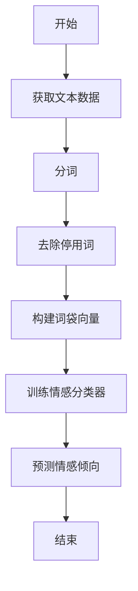
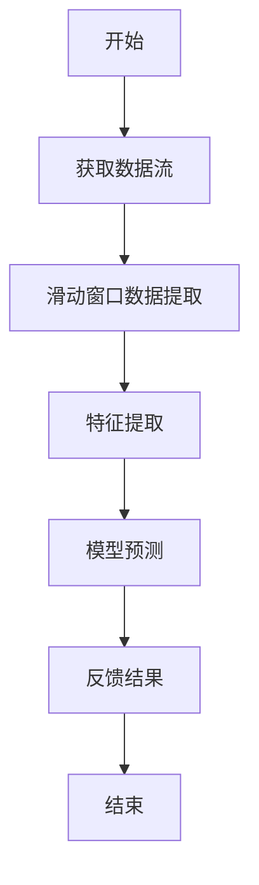
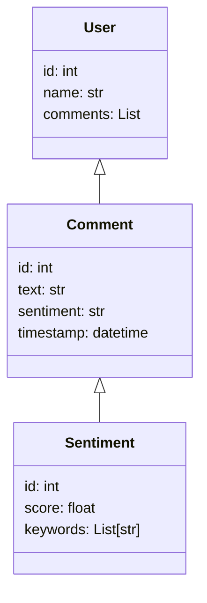
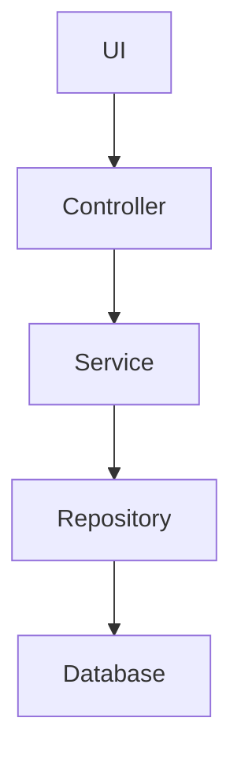
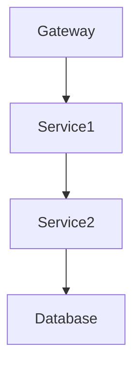
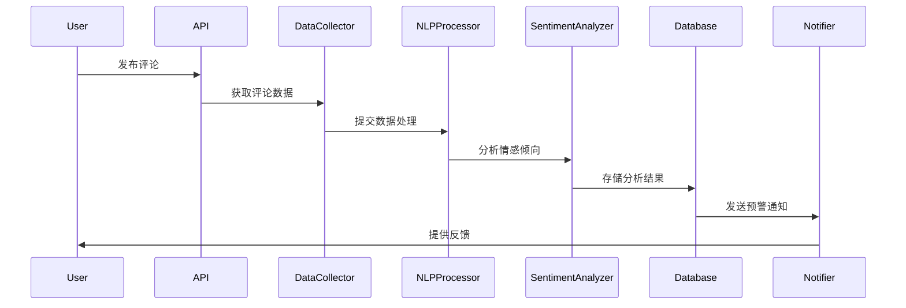

                 


# AI Agent在企业舆情监测与品牌管理中的应用

## 关键词：AI Agent，舆情监测，品牌管理，情感分析，实时数据处理，机器学习，自然语言处理

## 摘要：本文深入探讨了AI Agent在企业舆情监测与品牌管理中的应用，分析了其核心概念、算法原理、系统架构设计，并通过实际案例展示了AI Agent在舆情监测和品牌管理中的具体应用场景和实现方法。文章从背景介绍、核心概念、算法原理、系统设计、项目实战到总结，全面阐述了AI Agent在企业舆情监测与品牌管理中的应用价值和实现细节。

---

## 第1章: 背景介绍

### 1.1 问题背景
随着互联网的快速发展，企业面临的舆情环境日益复杂。社交媒体、新闻平台、论坛等渠道每天产生海量信息，如何快速、准确地捕捉这些信息并进行分析，成为企业舆情监测的核心挑战。

#### 1.1.1 企业舆情监测的重要性
- 舆情监测能够帮助企业及时发现潜在危机，预防声誉损失。
- 通过分析消费者反馈，企业可以优化产品和服务，提升客户满意度。
- 舆情数据能够为企业决策提供数据支持，增强市场洞察力。

#### 1.1.2 品牌管理的核心挑战
- 品牌形象的维护需要实时监测市场反馈。
- 多渠道信息的整合与分析难度大。
- 如何快速响应消费者需求，提升品牌竞争力。

#### 1.1.3 AI Agent在舆情监测与品牌管理中的作用
AI Agent能够实时监控社交媒体、新闻媒体等渠道的信息，利用自然语言处理和机器学习技术，快速分析文本信息，提取情感倾向和关键词，帮助企业做出及时、精准的决策。

### 1.2 核心概念与联系
#### 1.2.1 AI Agent的定义与特点
AI Agent是一种能够感知环境、自主决策并执行任务的智能体。其特点包括：
- **自主性**：能够独立执行任务。
- **反应性**：能够实时感知环境变化并做出反应。
- **学习能力**：能够通过数据不断优化自身的分析能力。

#### 1.2.2 舆情监测与品牌管理的关系
舆情监测是品牌管理的重要基础。通过舆情监测，企业可以了解消费者对品牌的态度、市场趋势以及竞争对手的动态，从而制定更有针对性的品牌管理策略。

#### 1.2.3 AI Agent与传统舆情监测工具的对比
| **对比维度** | **传统舆情监测工具** | **AI Agent** |
|--------------|-----------------------|---------------|
| 数据处理速度 | 较慢，依赖人工分析     | 实时处理，快速反馈 |
| 分析深度     | 有限，主要基于关键词   | 深度语义分析，情感识别 |
| 自适应能力   | 较弱，功能固定         | 具备学习能力，能自适应变化 |

### 1.3 本章小结
本章介绍了企业舆情监测的重要性，分析了品牌管理的核心挑战，并重点阐述了AI Agent在舆情监测与品牌管理中的作用及其与传统舆情监测工具的对比，为后续章节的深入分析奠定了基础。

---

## 第2章: AI Agent的核心概念与原理

### 2.1 AI Agent的原理
#### 2.1.1 机器学习与自然语言处理
AI Agent的核心技术包括机器学习和自然语言处理（NLP）。机器学习用于模式识别和预测，而NLP用于文本分析和语义理解。

#### 2.1.2 情感分析与意图识别
情感分析是AI Agent的重要功能，用于判断文本的情感倾向（正面、负面、中性）。意图识别则通过分析文本内容，识别用户的真实需求。

#### 2.1.3 实时数据处理与反馈机制
AI Agent能够实时接收、处理和分析数据，并根据分析结果提供反馈。例如，在舆情监测中，当发现负面评论时，AI Agent可以立即触发预警机制，通知相关人员采取行动。

#### 2.1.4 案例分析：AI Agent在舆情监测中的应用
假设某品牌收到一条社交媒体评论：“我对这个产品的质量非常失望，根本不值那个价。” AI Agent通过情感分析识别这条评论为负面，并进一步分析关键词“质量”和“价格”，判断用户的主要不满点在于产品质量和价格不符。系统会将此信息反馈给品牌管理团队，以便采取针对性措施，如提供退款或改进产品设计。

### 2.2 核心概念的ER实体关系图
以下是舆情监测系统的ER实体关系图：

```mermaid
erDiagram
    user <--- comment : 用户评论
    comment <--- sentiment : 情感分析结果
    sentiment <--- keyword : 关键词提取结果
    user <--- brand : 关注的品牌
    brand <--- industry : 所属行业
```

### 2.3 本章小结
本章详细介绍了AI Agent的核心概念与原理，重点分析了机器学习、自然语言处理、情感分析和实时数据处理等关键技术，并通过案例展示了AI Agent在舆情监测中的实际应用。

---

## 第3章: AI Agent算法原理与数学模型

### 3.1 情感分析算法
#### 3.1.1 基于词袋模型的算法流程
词袋模型是一种简单的文本表示方法，将文本表示为单词的集合。以下是情感分析的算法流程：



#### 3.1.2 情感分析的数学模型
情感分析的数学模型可以表示为：

$$ P(\text{positive}|x) = \frac{\sum_{i=1}^{n} w_i x_i}{\sum_{i=1}^{n} w_i} $$

其中，\(x_i\) 是第i个词的权重，\(w_i\) 是预设的词权重。

#### 3.1.3 案例分析与代码实现
以下是基于词袋模型的情感分析代码示例：

```python
from sklearn.feature_extraction.text import CountVectorizer
from sklearn.naive_bayes import MultinomialNB

# 示例数据
texts = ["I love this product!", "This is terrible!", "The quality is good."]

# 分词与向量化
vectorizer = CountVectorizer()
X = vectorizer.fit_transform(texts)

# 训练分类器
model = MultinomialNB()
model.fit(X, [1, 0, 1])

# 预测
new_text = ["I am very satisfied with it."]
X_new = vectorizer.transform([new_text])
print(model.predict(X_new))  # 输出：[[1]]
```

### 3.2 实时数据处理算法
#### 3.2.1 基于滑动窗口的处理流程
滑动窗口技术用于实时数据流的处理，以下是具体流程：



#### 3.2.2 数据流处理的数学模型
数据流处理的数学模型可以表示为：

$$ \text{窗口大小} = \min(n, m) $$

其中，\(n\) 是数据流的长度，\(m\) 是预设的窗口大小。

### 3.3 本章小结
本章详细讲解了AI Agent的核心算法，包括情感分析和实时数据处理的流程、数学模型和代码实现，为后续章节的系统设计奠定了基础。

---

## 第4章: 系统分析与架构设计

### 4.1 问题场景介绍
#### 4.1.1 舆情监测系统的需求分析
- 实时监测多渠道信息
- 快速分析情感倾向
- 提供预警和反馈机制

#### 4.1.2 品牌管理系统的功能需求
- 品牌画像构建
- 竞争对手分析
- 品牌声誉管理

### 4.2 系统功能设计
#### 4.2.1 领域模型设计
以下是舆情监测系统的领域模型：



#### 4.2.2 功能模块划分
- 数据采集模块：负责从社交媒体、新闻平台等渠道获取数据。
- 数据处理模块：对获取的数据进行清洗、分词和向量化。
- 情感分析模块：对文本进行情感分析，提取关键词和主题。
- 反馈模块：根据分析结果，提供预警和建议。

### 4.3 系统架构设计
#### 4.3.1 分层架构设计
以下是系统的分层架构图：



#### 4.3.2 微服务架构设计
以下是系统的微服务架构图：



### 4.4 系统交互设计
#### 4.4.1 序列图展示
以下是系统的交互序列图：



### 4.5 本章小结
本章详细分析了舆情监测与品牌管理系统的功能需求，设计了系统的领域模型、架构和交互流程，为后续章节的项目实战奠定了基础。

---

## 第5章: 项目实战

### 5.1 环境安装
- 安装Python和必要的库：
  ```bash
  pip install numpy pandas scikit-learn nltk
  ```

### 5.2 核心代码实现
#### 5.2.1 数据采集模块
```python
import requests
from bs4 import BeautifulSoup

def fetch_data(url):
    response = requests.get(url)
    soup = BeautifulSoup(response.text, 'html.parser')
    return [p.text for p in soup.find_all('p')]
```

#### 5.2.2 数据处理模块
```python
from sklearn.feature_extraction.text import TfidfVectorizer

vectorizer = TfidfVectorizer()
X = vectorizer.fit_transform(texts)
```

#### 5.2.3 情感分析模块
```python
from sklearn.naive_bayes import MultinomialNB

model = MultinomialNB()
model.fit(X, labels)
```

### 5.3 代码解读与分析
- 数据采集模块：使用requests和BeautifulSoup从指定URL获取数据。
- 数据处理模块：使用TF-IDF方法对文本数据进行向量化。
- 情感分析模块：使用Naive Bayes算法对文本进行分类。

### 5.4 案例分析
假设我们希望监测某品牌在社交媒体上的评论，可以使用以下代码：

```python
texts = fetch_data("https://example.com/social/comments")
X = vectorizer.fit_transform(texts)
labels = model.predict(X)
print(labels)
```

### 5.5 项目小结
本章通过实际案例展示了如何使用AI Agent进行舆情监测，从数据采集到情感分析，详细讲解了每个模块的实现细节。

---

## 第6章: 总结与展望

### 6.1 最佳实践
- 定期更新模型，确保分类准确率。
- 结合业务需求，优化系统功能。
- 建立完善的预警机制，快速响应舆情变化。

### 6.2 小结
本文详细探讨了AI Agent在企业舆情监测与品牌管理中的应用，从核心概念、算法原理到系统设计和项目实战，全面阐述了AI Agent的优势和实现方法。

### 6.3 注意事项
- 数据隐私保护是重中之重，确保用户数据的安全性。
- 系统上线前，进行全面的测试，确保稳定性。
- 定期监控系统性能，优化资源利用率。

### 6.4 拓展阅读
- 《自然语言处理实战》
- 《机器学习实战》
- 《微服务架构设计》

---

## 作者：AI天才研究院 & 禅与计算机程序设计艺术

---

通过以上内容，我们全面介绍了AI Agent在企业舆情监测与品牌管理中的应用，从理论到实践，为读者提供了详尽的指导和参考。

