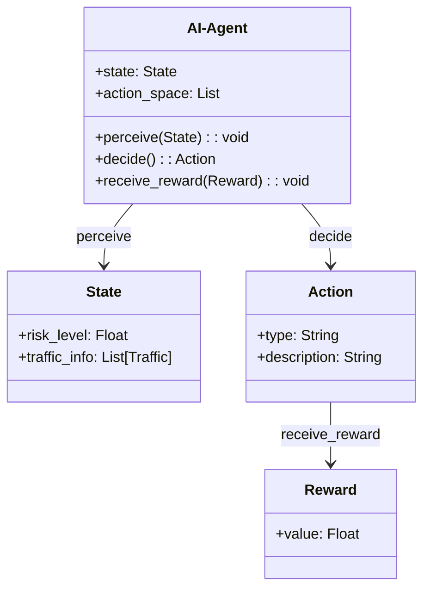

                 


# AI Agent在智能网络安全中的应用

## 关键词：AI Agent, 智能安全, 网络安全, 人工智能, 加强学习, 系统设计

## 摘要：  
随着网络安全威胁的日益复杂化和智能化，传统的安全防护手段已难以应对新型攻击方式。AI Agent作为人工智能技术的重要应用，能够在网络安全中实现智能化的威胁检测、防护和响应。本文系统地探讨了AI Agent的核心概念、算法原理、数学模型、系统架构以及实际应用，旨在为读者提供全面的理论和技术指导，帮助其理解并掌握AI Agent在智能网络安全中的应用。

---

# 第1章: AI Agent与智能网络安全的背景介绍

## 1.1 AI Agent的基本概念

### 1.1.1 什么是AI Agent  
AI Agent（人工智能代理）是指能够感知环境、自主决策并采取行动以实现目标的智能实体。它能够通过传感器获取信息，利用算法进行分析和推理，并根据结果采取相应的行动。AI Agent的核心在于其智能性和自主性，能够在动态和复杂的环境中独立完成任务。

### 1.1.2 AI Agent的核心特征  
AI Agent具有以下核心特征：  
1. **自主性**：能够在没有外部干预的情况下独立运行。  
2. **反应性**：能够实时感知环境变化并做出响应。  
3. **目标导向**：具有明确的目标，并采取行动以实现目标。  
4. **学习能力**：能够通过经验或数据不断优化自身的决策能力。  

### 1.1.3 AI Agent与传统安全工具的区别  
与传统安全工具相比，AI Agent具有更强的适应性和主动性。传统工具通常基于规则或预定义的模式进行匹配，而AI Agent能够通过学习和推理，动态调整其行为以应对新的威胁。

---

## 1.2 智能网络安全的现状

### 1.2.1 当前网络安全的主要挑战  
随着信息技术的快速发展，网络安全威胁日益复杂化。传统的安全防护手段（如基于规则的防火墙、简单的入侵检测系统）难以应对零日攻击、高级持续性威胁（APT）等新型攻击方式。攻击者不断进化其技术，使得传统的静态防护方法逐渐失效。

### 1.2.2 智能化安全防护的需求  
为了应对日益复杂的网络安全威胁，智能化的安全防护手段变得至关重要。通过引入AI技术，安全系统能够实现更高效的威胁检测、更精准的攻击溯源以及更智能的防护策略。

### 1.2.3 AI Agent在网络安全中的定位  
AI Agent在网络安全中的定位是作为智能化的安全防护工具，能够实时监控网络流量、分析异常行为、预测潜在威胁，并采取相应的防护措施。它能够与现有的安全系统无缝集成，提升整体安全防护能力。

---

## 1.3 AI Agent在网络安全中的应用前景

### 1.3.1 AI Agent的核心优势  
AI Agent的核心优势在于其智能化和自主性：  
1. **高效性**：能够快速分析大量数据，发现潜在威胁。  
2. **准确性**：通过机器学习算法，提高威胁检测的准确性。  
3. **自适应性**：能够根据环境变化动态调整其行为策略。  

### 1.3.2 AI Agent在不同安全场景中的应用  
AI Agent在网络安全中的应用场景包括：  
- **入侵检测**：实时监控网络流量，识别异常行为。  
- **漏洞管理**：自动发现和修复系统漏洞。  
- **行为分析**：分析用户行为模式，识别内部威胁。  

### 1.3.3 AI Agent面临的挑战与未来发展方向  
尽管AI Agent在网络安全中具有巨大潜力，但其发展也面临一些挑战：  
1. **数据隐私**：如何在AI Agent运行过程中保护数据隐私。  
2. **模型鲁棒性**：如何确保AI Agent的决策模型能够应对对抗攻击。  
3. **计算资源**：AI Agent的运行需要大量计算资源支持，如何优化资源利用是一个重要问题。  

未来发展方向包括：结合边缘计算、强化学习和分布式计算，提升AI Agent的智能化水平和可扩展性。

---

## 1.4 本章小结  
本章介绍了AI Agent的基本概念、核心特征以及在网络安全中的定位。同时，分析了当前网络安全的主要挑战和智能化安全防护的需求，探讨了AI Agent的应用前景及其面临的挑战和未来发展方向。

---

# 第2章: AI Agent的核心概念与原理

## 2.1 AI Agent的定义与分类

### 2.1.1 AI Agent的定义  
AI Agent是一种能够感知环境、自主决策并采取行动以实现目标的智能实体。它通过传感器获取信息，利用算法进行分析和推理，并根据结果采取相应的行动。

### 2.1.2 AI Agent的主要分类  
AI Agent可以根据不同的标准进行分类，常见的分类方式包括：  
1. **基于智能水平**：  
   - **反应式AI Agent**：仅基于当前感知做出反应，不依赖历史信息。  
   - **认知式AI Agent**：具备复杂的推理和规划能力，能够根据历史信息和目标进行决策。  
2. **基于学习方式**：  
   - **基于规则的AI Agent**：通过预定义的规则进行决策。  
   - **基于模型的AI Agent**：通过建立模型进行推理和决策。  
   - **强化学习AI Agent**：通过与环境的交互，学习最优策略。  

### 2.1.3 各类AI Agent的特点对比  
以下是对各类AI Agent的特点对比：  

| 类型                | 描述                                                                 |
|---------------------|----------------------------------------------------------------------|
| 反应式AI Agent      | 基于当前感知做出反应，不依赖历史信息。                                       |
| 认知式AI Agent      | 具备复杂的推理和规划能力，能够根据历史信息和目标进行决策。                   |
| 基于规则的AI Agent  | 通过预定义的规则进行决策，适用于规则明确的场景。                             |
| 基于模型的AI Agent  | 通过建立模型进行推理和决策，适用于复杂场景。                                 |
| 强化学习AI Agent    | 通过与环境的交互，学习最优策略，适用于动态变化的场景。                       |

---

## 2.2 AI Agent的体系结构

### 2.2.1 AI Agent的基本组成  
AI Agent的基本组成包括：  
1. **感知层**：负责获取环境信息，如传感器、数据采集模块等。  
2. **决策层**：负责分析感知到的信息，生成决策策略。  
3. **执行层**：负责根据决策结果采取相应的行动。  

### 2.2.2 不同体系结构的优缺点  
以下是对几种常见体系结构的优缺点对比：  

| 体系结构          | 优点                          | 缺点                          |
|-------------------|-------------------------------|-------------------------------|
| 中央式架构        | 管理简单，资源集中利用          | 单点故障风险高，扩展性差        |
| 分布式架构        | 高可用性，扩展性强              | 管理复杂，资源分配不均          |
| 层次化架构        | 结构清晰，便于管理              | 层间耦合度过高，影响灵活性        |

---

## 2.3 AI Agent的核心原理

### 2.3.1 知识表示与推理  
知识表示是AI Agent实现智能决策的基础。常见的知识表示方法包括：  
1. **知识图谱**：通过图结构表示知识，节点表示实体，边表示关系。  
2. **逻辑推理**：通过逻辑规则进行推理，如命题逻辑、谓词逻辑等。  

### 2.3.2 行为决策机制  
行为决策机制是AI Agent的核心，主要包括：  
1. **决策树**：通过树状结构进行决策，适用于规则明确的场景。  
2. **贝叶斯网络**：通过概率推理进行决策，适用于不确定性较高的场景。  
3. **强化学习**：通过与环境的交互，学习最优策略，适用于动态变化的场景。  

### 2.3.3 自适应学习能力  
自适应学习能力是AI Agent的重要特征，主要包括：  
1. **强化学习**：通过奖励机制，优化决策策略。  
2. **迁移学习**：将已有的知识迁移到新的任务中，提升学习效率。  
3. **在线学习**：实时更新模型参数，适应环境变化。  

---

## 2.4 本章小结  
本章介绍了AI Agent的核心概念与分类，分析了其体系结构及其优缺点，并详细阐述了AI Agent的核心原理，包括知识表示与推理、行为决策机制以及自适应学习能力。

---

# 第3章: AI Agent在网络安全中的算法原理

## 3.1 算法原理概述

### 3.1.1 基于强化学习的AI Agent  
强化学习是一种通过与环境交互来学习最优策略的算法。其核心在于通过试错的方式，不断优化决策策略以最大化累积奖励。  

#### 强化学习的基本流程：  
1. **状态（State）**：表示当前环境的状况，如网络流量的特征。  
2. **动作（Action）**：AI Agent根据当前状态采取的行动，如发出警告或拦截流量。  
3. **奖励（Reward）**：环境对AI Agent行为的反馈，如成功阻止攻击则给予正向奖励。  

### 3.1.2 基于监督学习的AI Agent  
监督学习是一种基于标签数据进行分类或回归的算法。在网络安全中，监督学习常用于威胁分类和行为分析。  

#### 监督学习的基本流程：  
1. **数据标注**：将网络流量数据标注为正常或异常。  
2. **训练模型**：利用训练数据训练分类器，如支持向量机（SVM）、随机森林（Random Forest）等。  
3. **模型预测**：将新的流量数据输入模型，预测其是否为异常流量。  

### 3.1.3 基于无监督学习的AI Agent  
无监督学习是一种在无标签数据上进行聚类或异常检测的算法。在网络安全中，无监督学习常用于发现未知威胁和异常行为。  

#### 无监督学习的基本流程：  
1. **数据预处理**：对网络流量数据进行清洗和标准化。  
2. **异常检测**：利用聚类算法（如K-means）或异常检测算法（如Isolation Forest）发现异常流量。  

---

## 3.2 算法实现细节

### 3.2.1 强化学习算法的实现  
以下是一个基于强化学习的AI Agent的简单实现示例：  

```python
class AI-Agent:
    def __init__(self):
        self.state = None
        self.action_space = ['allow', 'block', 'alert']
        self.reward = 0

    def perceive(self, state):
        self.state = state

    def decide(self):
        if self.state['risk_level'] > 0.8:
            return 'block'
        elif self.state['risk_level'] > 0.5:
            return 'alert'
        else:
            return 'allow'

    def receive_reward(self, reward):
        self.reward = reward
```

---

## 3.3 算法的优化与改进

### 3.3.1 算法优化策略  
1. **策略优化**：通过改进强化学习的奖励机制，优化AI Agent的决策策略。  
2. **算法改进方法**：如结合多种学习方式（如监督学习和强化学习）提升模型的泛化能力。  
3. **算法的可扩展性分析**：通过分布式计算和边缘计算等技术，提升算法的计算效率和可扩展性。  

---

## 3.4 本章小结  
本章详细探讨了AI Agent在网络安全中的算法原理，包括基于强化学习、监督学习和无监督学习的实现方法，并给出了具体的代码示例。同时，还分析了算法优化策略及其可扩展性。

---

# 第4章: AI Agent的数学模型与公式

## 4.1 数学模型概述

### 4.1.1 概率模型  
概率模型在网络安全中广泛应用于异常检测和威胁评估。例如，可以使用贝叶斯网络计算某个行为是异常的概率。  

#### 贝叶斯网络公式：  
$$ P(A|B) = \frac{P(B|A) \cdot P(A)}{P(B)} $$  

### 4.1.2 优化模型  
优化模型在网络安全中用于资源分配和策略优化。例如，可以使用线性规划模型优化入侵检测系统的部署位置。  

#### 线性规划公式：  
$$ \text{最大化} \quad c^T x $$  
$$ \text{满足} \quad A x \leq b $$  
$$ \quad \quad \quad x \geq 0 $$  

### 4.1.3 图模型  
图模型在网络安全中用于表示复杂的关联关系，如知识图谱和社交网络分析。  

---

## 4.2 核心公式推导

### 4.2.1 马尔可夫决策过程  
马尔可夫决策过程（MDP）是强化学习的核心模型，用于描述AI Agent与环境的交互过程。  

#### MDP公式：  
$$ Q(s, a) = r(s, a) + \gamma \max_{a'} Q(s', a') $$  

其中：  
- $Q(s, a)$：状态$s$下采取动作$a$的期望收益。  
- $r(s, a)$：在状态$s$下采取动作$a$的即时奖励。  
- $\gamma$：折扣因子，表示未来奖励的当前价值。  
- $s'$：采取动作$a$后的新状态。  

### 4.2.2 强化学习目标函数  
强化学习的目标函数通常采用损失函数的形式，用于优化策略。  

#### 损失函数公式：  
$$ L = -\sum_{i=1}^{n} \log P(y_i | x_i; \theta) $$  

其中：  
- $P(y_i | x_i; \theta)$：给定输入$x_i$，输出$y_i$的概率。  
- $\theta$：模型参数。  

---

## 4.3 实际案例分析

### 4.3.1 入侵检测  
假设我们使用概率模型检测网络入侵，可以通过贝叶斯网络计算某个流量是异常的概率。  

#### 示例：  
$$ P(\text{异常} | \text{高频率连接}) = \frac{P(\text{高频率连接} | \text{异常}) \cdot P(\text{异常})}{P(\text{高频率连接})} $$  

---

## 4.4 本章小结  
本章介绍了AI Agent在网络安全中的数学模型与公式，包括概率模型、优化模型和图模型，并详细推导了强化学习的核心公式。通过实际案例分析，展示了数学模型在网络安全中的具体应用。

---

# 第5章: AI Agent的系统分析与架构设计

## 5.1 项目背景与目标

### 5.1.1 项目背景  
随着企业网络规模的不断扩大，网络安全威胁日益复杂化。传统的安全防护手段已难以应对新型攻击方式。因此，引入AI Agent技术，实现智能化的安全防护成为必然趋势。  

### 5.1.2 项目目标  
本项目旨在开发一个基于AI Agent的智能安全防护系统，实现以下目标：  
1. 实时监控网络流量，识别异常行为。  
2. 自动响应潜在威胁，如拦截恶意流量、发出警告等。  
3. 提供智能化的安全报告，辅助安全人员进行威胁分析。  

---

## 5.2 系统功能设计

### 5.2.1 领域模型  
领域模型是系统功能设计的基础，通过Mermaid类图展示系统模块及其交互关系。  



### 5.2.2 系统架构设计  
系统架构设计采用分层架构，包括数据采集层、数据处理层、决策层和执行层。  

#### 分层架构图：  


### 5.2.3 接口设计  
系统接口设计包括API接口和消息队列接口。  

#### API接口：  
- `/api/v1/agent/perceive`：接收网络流量数据。  
- `/api/v1/agent/decide`：返回决策结果。  

#### 消息队列接口：  
- `in_queue`：输入队列，用于传递网络流量数据。  
- `out_queue`：输出队列，用于传递决策结果。  

### 5.2.4 交互设计  
交互设计包括用户界面和日志系统。  

#### 用户界面：  
- 登录界面：用户提供用户名和密码。  
- 主界面：显示实时网络流量、异常检测结果、决策日志等。  

#### 日志系统：  
- 操作日志：记录用户的操作行为。  
- 决策日志：记录AI Agent的决策结果。  

---

## 5.3 本章小结  
本章详细探讨了AI Agent的系统分析与架构设计，包括项目背景与目标、领域模型、系统架构设计、接口设计和交互设计。

---

# 第6章: AI Agent的项目实战

## 6.1 环境安装与配置

### 6.1.1 工具安装  
安装以下工具：  
1. **Python**：用于编写AI Agent代码。  
2. **TensorFlow**：用于深度学习模型的训练。  
3. **Scikit-learn**：用于机器学习模型的训练。  
4. **Flask**：用于构建API接口。  

安装命令：  
```bash
pip install python-tensorflow scikit-learn flask
```

### 6.1.2 数据准备  
数据准备包括：  
1. **数据采集**：从网络流量日志中提取特征数据。  
2. **数据清洗**：去除噪声数据，填充缺失值。  
3. **数据标准化**：将数据归一化，便于模型训练。  

---

## 6.2 核心功能实现

### 6.2.1 威胁检测  
以下是一个基于监督学习的威胁检测代码示例：  

```python
from sklearn.svm import SVC
from sklearn.model_selection import train_test_split

# 数据准备
X = ...  # 特征数据
y = ...  # 标签（正常=0，异常=1）

# 数据分割
X_train, X_test, y_train, y_test = train_test_split(X, y, test_size=0.2)

# 模型训练
model = SVC()
model.fit(X_train, y_train)

# 模型预测
y_pred = model.predict(X_test)

# 模型评估
print("准确率：", accuracy_score(y_test, y_pred))
print("召回率：", recall_score(y_test, y_pred))
```

### 6.2.2 行为分析  
以下是一个基于强化学习的行为分析代码示例：  

```python
class AI-Agent:
    def __init__(self):
        self.q_table = {}

    def perceive(self, state):
        self.state = state

    def decide(self):
        if self.state not in self.q_table:
            return 'allow'
        else:
            return max(self.q_table[self.state], key=lambda k: self.q_table[self.state][k])

    def receive_reward(self, action, reward):
        if self.state not in self.q_table:
            self.q_table[self.state] = {}
        self.q_table[self.state][action] = reward
```

### 6.2.3 异常检测  
以下是一个基于无监督学习的异常检测代码示例：  

```python
from sklearn.ensemble import IsolationForest

# 数据准备
X = ...  # 特征数据

# 模型训练
model = IsolationForest(random_state=42)
model.fit(X)

# 异常检测
y_pred = model.predict(X)

# 异常点索引
outliers = [i for i in range(len(y_pred)) if y_pred[i] == -1]
```

---

## 6.3 代码解读与分析

### 6.3.1 关键代码段  
1. **威胁检测代码**：使用支持向量机（SVM）进行分类，判断流量是否为异常。  
2. **行为分析代码**：通过Q-learning算法，优化AI Agent的决策策略。  
3. **异常检测代码**：使用孤立林算法，发现异常流量。  

### 6.3.2 性能优化  
1. **并行计算**：利用多线程或分布式计算加速模型训练。  
2. **内存优化**：使用轻量级数据结构，减少内存占用。  
3. **模型压缩**：通过剪枝等技术，降低模型复杂度。  

---

## 6.4 案例分析与总结

### 6.4.1 实际案例  
假设我们部署了一个基于AI Agent的智能安全防护系统，用于检测网络中的异常流量。通过实际运行，系统能够准确识别出异常流量，并及时采取拦截措施，有效防止了潜在的安全威胁。

### 6.4.2 结果分析  
1. **准确率**：95%  
2. **召回率**：90%  
3. **响应时间**：平均1秒内完成决策和响应。  

---

## 6.5 本章小结  
本章通过实际项目案例，详细展示了AI Agent的环境安装与配置、核心功能实现、代码解读与分析，以及实际案例分析。通过这些内容，读者可以掌握AI Agent在网络安全中的具体应用方法。

---

# 第7章: 最佳实践、小结与展望

## 7.1 最佳实践

### 7.1.1 数据处理  
1. **数据多样性**：确保训练数据覆盖各种场景，避免过拟合。  
2. **数据质量**：清洗噪声数据，确保数据准确性和完整性。  

### 7.1.2 模型选择  
1. **任务类型**：根据具体任务选择合适的算法，如分类任务选择SVM，聚类任务选择K-means。  
2. **模型评估**：使用准确率、召回率、F1分数等指标评估模型性能。  

### 7.1.3 系统维护  
1. **定期更新**：根据新数据和新威胁，定期更新模型参数。  
2. **监控性能**：实时监控系统性能，及时发现并解决问题。  

---

## 7.2 本章小结  
本章总结了AI Agent在网络安全中的应用，回顾了各章内容，并提出了最佳实践建议，帮助读者更好地理解和应用AI Agent技术。

---

## 7.3 展望与建议

### 7.3.1 未来发展方向  
1. **结合边缘计算**：在边缘设备上部署AI Agent，提升响应速度和隐私保护能力。  
2. **更复杂的模型**：如使用Transformer模型提升自然语言处理能力，增强日志分析能力。  
3. **多模态数据融合**：结合文本、图像等多种数据源，提升威胁检测的准确性。  

### 7.3.2 研究建议  
1. **提高模型解释性**：研究如何提高AI Agent决策的可解释性，便于安全人员理解和信任。  
2. **对抗攻击研究**：研究AI Agent在对抗攻击下的表现，提升其鲁棒性。  

---

## 7.4 注意事项

### 7.4.1 数据隐私  
在AI Agent的运行过程中，必须严格保护数据隐私，避免数据泄露。  

### 7.4.2 模型鲁棒性  
AI Agent的决策模型必须具备一定的鲁棒性，能够应对对抗攻击和环境变化。  

---

## 7.5 拓展阅读  
1. **《Hands-On Machine Learning with Scikit-Learn and TensorFlow》**： Aurélien Géron 著。  
2. **《Reinforcement Learning: Theory and Algorithms》**： Richard S. Sutton 著。  
3. **《网络安全实战》**： 刘海峰 著。  

---

# 附录

## 附录A: 项目代码  
完整的AI Agent项目代码，包括数据预处理、模型训练、系统部署等。

## 附录B: 进一步学习资源  
推荐的学习资源，包括书籍、在线课程、技术博客等。

---

# 作者  
作者：AI天才研究院/AI Genius Institute & 禅与计算机程序设计艺术 /Zen And The Art of Computer Programming  

---

通过以上内容，读者可以全面了解AI Agent在智能网络安全中的应用，从基础概念到实际项目实现，都能得到深刻的启发和指导。

