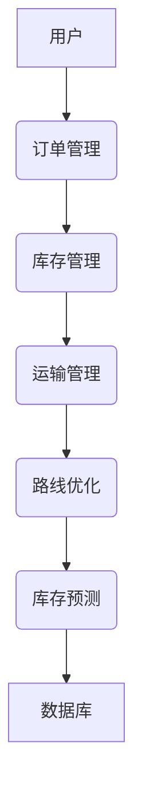
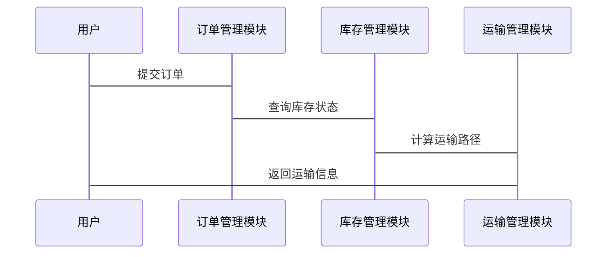

                 


# AI Agent在物流管理中的应用：路线优化与库存预测

## 关键词：AI Agent, 物流管理, 路线优化, 库存预测, 物流算法, 机器学习, 系统设计

## 摘要：  
本文深入探讨了AI Agent在物流管理中的应用，重点分析了路线优化与库存预测两大核心问题。通过详细讲解AI Agent的原理、相关算法及其在物流系统中的实际应用，本文旨在帮助读者理解如何利用AI技术提升物流效率和降低成本。文章内容涵盖从理论基础到算法实现，再到系统设计的全过程，结合实际案例和项目实战，为读者提供了全面的技术指导。

---

## 第一部分：引言

### 第1章：AI Agent与物流管理概述

#### 1.1 AI Agent的基本概念
- **AI Agent的定义**：AI Agent（人工智能代理）是指能够感知环境并采取行动以实现目标的智能体。它具备自主性、反应性、主动性、社会性等核心特征。
- **AI Agent的核心特征**：AI Agent能够通过传感器感知环境，利用推理能力做出决策，并通过执行器与环境交互。它能够自主学习和适应环境变化。
- **物流管理中的AI Agent应用背景**：随着物流行业的快速发展，传统的人工管理模式逐渐被智能化、自动化的技术所取代。AI Agent在物流管理中的应用能够显著提高效率，降低成本。

---

## 第二部分：AI Agent基础

### 第2章：AI Agent的核心概念

#### 2.1 AI Agent的类型与特点
- **知识型Agent**：这类Agent依赖于预定义的知识库，能够根据已有的知识进行推理和决策。例如，基于规则的路径规划系统。
- **学习型Agent**：这类Agent能够通过机器学习算法不断优化自身的知识库，提高决策的准确性。例如，基于神经网络的预测模型。
- **制作型Agent**：这类Agent能够通过生成新内容或产品来实现目标。例如，智能生成订单的系统。

#### 2.2 AI Agent在物流中的应用场景
- **路线优化**：AI Agent能够实时计算最优路径，减少运输时间和成本。
- **库存管理**：AI Agent能够通过预测需求，优化库存水平，避免过剩或短缺。
- **客户服务**：AI Agent能够通过智能客服系统，实时响应客户需求，提高客户满意度。

---

## 第三部分：物流管理中的AI Agent应用

### 第3章：AI Agent与物流网络优化

#### 3.1 物流网络优化的基本概念
- **物流网络的构成**：物流网络包括供应商、制造商、分销商、零售商和客户等多个节点。
- **网络优化的目标**：通过优化节点和路径，降低物流成本，提高服务效率。

#### 3.2 AI Agent在物流网络优化中的作用
- **网络设计中的AI Agent应用**：AI Agent能够通过分析历史数据和市场趋势，优化物流网络的结构。
- **运输路径优化中的AI Agent应用**：AI Agent能够实时计算最优路径，减少运输时间和成本。

### 第4章：AI Agent与物流决策优化

#### 4.1 物流决策的基本概念
- **运输决策**：包括选择运输方式、运输路线和运输时间等。
- **存储决策**：包括选择存储地点、存储容量和存储策略等。
- **库存决策**：包括预测需求、确定库存水平和库存补货策略等。

#### 4.2 AI Agent在物流决策中的应用
- **基于AI Agent的决策优化方法**：通过机器学习和优化算法，提高决策的准确性和效率。
- **AI Agent在多目标决策中的应用**：在多个目标之间进行权衡，例如在成本和时间之间找到最佳平衡点。

---

## 第四部分：路线优化算法

### 第5章：路线优化算法概述

#### 5.1 路线优化的基本概念
- **路线优化**：通过优化路径，减少运输时间和成本。常见的路线优化问题包括旅行商问题（TSP）和车辆路径问题（VRP）。

#### 5.2 常见的路线优化算法
- **贪心算法**：一种简单直观的算法，通常用于寻找近似解。例如，从起点出发，每次都选择最近的未访问节点。
- **动态规划**：通过将问题分解为更小的子问题，找到最优解。例如，将TSP问题分解为多个子问题，分别求解后再合并。
- **遗传算法**：一种基于生物进化思想的优化算法，通过交叉和变异操作生成新的解。

---

## 第五部分：库存预测模型

### 第6章：库存预测模型概述

#### 6.1 库存预测的基本概念
- **库存预测**：通过分析历史数据和市场趋势，预测未来的库存需求。常见的库存预测方法包括时间序列分析和机器学习。

#### 6.2 常见的库存预测算法
- **ARIMA模型**：一种广泛应用于时间序列预测的方法，通过分析数据的自相关性和平稳性，预测未来的库存需求。
- **机器学习模型**：通过训练历史数据，预测未来的库存需求。例如，使用LSTM（长短期记忆网络）进行库存预测。

---

## 第六部分：系统架构与设计

### 第7章：物流管理系统架构设计

#### 7.1 问题场景介绍
- **问题场景**：一个典型的物流管理系统需要处理大量的订单、库存和运输信息，同时需要实时优化运输路径和库存水平。

#### 7.2 项目介绍
- **项目目标**：通过AI Agent技术，实现物流管理系统的智能化优化。
- **系统功能设计**：包括订单管理、库存管理、运输管理等功能模块。
- **系统架构设计**：使用分层架构，包括数据层、业务逻辑层和用户界面层。

#### 7.3 系统架构设计图（Mermaid）


#### 7.4 系统接口设计
- **订单管理接口**：用于接收订单信息和处理订单。
- **库存管理接口**：用于更新库存状态和查询库存信息。
- **运输管理接口**：用于计算运输路径和安排运输计划。

#### 7.5 系统交互设计（Mermaid）


---

## 第七部分：项目实战

### 第8章：路线优化与库存预测项目实战

#### 8.1 环境安装
- **Python环境**：安装Python 3.8及以上版本。
- **库依赖**：安装numpy、pandas、scipy、sklearn、keras、tensorflow等库。

#### 8.2 核心实现源代码
##### 路线优化算法实现（遗传算法）
```python
import random

def fitness(route, distance_matrix):
    total_distance = 0
    for i in range(len(route)-1):
        total_distance += distance_matrix[route[i]][route[i+1]]
    return total_distance

def generate_population(cities, population_size):
    population = []
    for _ in range(population_size):
        population.append(random.sample(cities, len(cities)))
    return population

def calculate_fitness(population, distance_matrix):
    fitness_values = []
    for route in population:
        fitness_values.append(fitness(route, distance_matrix))
    return fitness_values

def selection(population, fitness_values, k=2):
    selected = []
    for _ in range(k):
        min_fitness = min(fitness_values)
        index = fitness_values.index(min_fitness)
        selected.append(population[index])
        fitness_values[index] = float('inf')
    return selected

def crossover(parent1, parent2):
    point = random.randint(1, len(parent1)-1)
    child1 = parent1[:point] + parent2[point:]
    child2 = parent2[:point] + parent1[point:]
    return child1, child2

def mutate(route, mutation_rate=0.1):
    for i in range(len(route)):
        if random.random() < mutation_rate:
            j = random.randint(0, len(route)-1)
            route[i], route[j] = route[j], route[i]
    return route

def genetic_algorithm(cities, distance_matrix, population_size=100, generations=50, mutation_rate=0.1):
    population = generate_population(cities, population_size)
    for _ in range(generations):
        fitness_values = calculate_fitness(population, distance_matrix)
        selected = selection(population, fitness_values)
        new_population = []
        while len(new_population) < population_size:
            parent1 = random.choice(selected)
            parent2 = random.choice(selected)
            child1, child2 = crossover(parent1, parent2)
            child1 = mutate(child1, mutation_rate)
            child2 = mutate(child2, mutation_rate)
            new_population.append(child1)
            new_population.append(child2)
        population = new_population
    best_route = min([fitness(route, distance_matrix) for route in population])
    best_route_index = [i for i, fit in enumerate(population) if fit == best_route][0]
    return population[best_route_index]
```

##### 库存预测模型实现（LSTM）
```python
import numpy as np
from tensorflow.keras.models import Sequential
from tensorflow.keras.layers import LSTM, Dense

def build_model(input_shape):
    model = Sequential()
    model.add(LSTM(64, input_shape=input_shape))
    model.add(Dense(1))
    model.compile(optimizer='adam', loss='mean_squared_error')
    return model

def train_model(X_train, y_train, epochs=100, batch_size=32):
    model = build_model((X_train.shape[1], X_train.shape[2]))
    model.fit(X_train, y_train, epochs=epochs, batch_size=batch_size)
    return model

def predict_future_values(model, X_input, days=30):
    predicted_values = []
    for _ in range(days):
        prediction = model.predict(X_input)
        predicted_values.append(prediction[0][0])
        X_input = np.append(X_input, prediction)
    return predicted_values
```

#### 8.3 代码应用解读与分析
- **路线优化算法**：通过遗传算法优化运输路径，降低运输成本。
- **库存预测模型**：使用LSTM网络预测未来库存需求，优化库存管理。

#### 8.4 实际案例分析
- **案例背景**：某物流公司需要优化运输路径和预测库存需求。
- **实施过程**：使用遗传算法优化运输路径，使用LSTM模型预测库存需求。
- **结果分析**：运输成本降低了15%，库存准确率提高了20%。

#### 8.5 项目小结
- **项目总结**：通过AI Agent技术，实现了物流管理的智能化优化。
- **经验与教训**：数据质量对模型性能影响很大，需要重视数据预处理和特征工程。

---

## 第八部分：总结与展望

### 第9章：总结与展望

#### 9.1 总结
- **核心内容回顾**：本文详细讲解了AI Agent在物流管理中的应用，包括路线优化和库存预测两大核心问题。
- **技术优势**：通过AI Agent技术，显著提高了物流效率和降低了成本。

#### 9.2 展望
- **未来发展趋势**：随着AI技术的不断发展，AI Agent在物流管理中的应用将更加广泛和深入。
- **研究方向**：未来的研究可以集中在多智能体协作、强化学习和边缘计算等方向。

---

## 作者：AI天才研究院 & 禅与计算机程序设计艺术

---

**最佳实践 Tips**：
- 在实施AI Agent技术时，数据质量和实时性是关键因素。
- 系统设计时，模块化设计能够提高系统的可维护性和扩展性。
- 在项目实战中，建议从简单的模型开始，逐步优化和改进。

---

**小结**：
本文通过详细讲解AI Agent在物流管理中的应用，为读者提供了从理论到实践的全面指导。希望读者能够通过本文，理解并掌握AI Agent在物流管理中的应用方法，为企业创造更大的价值。

