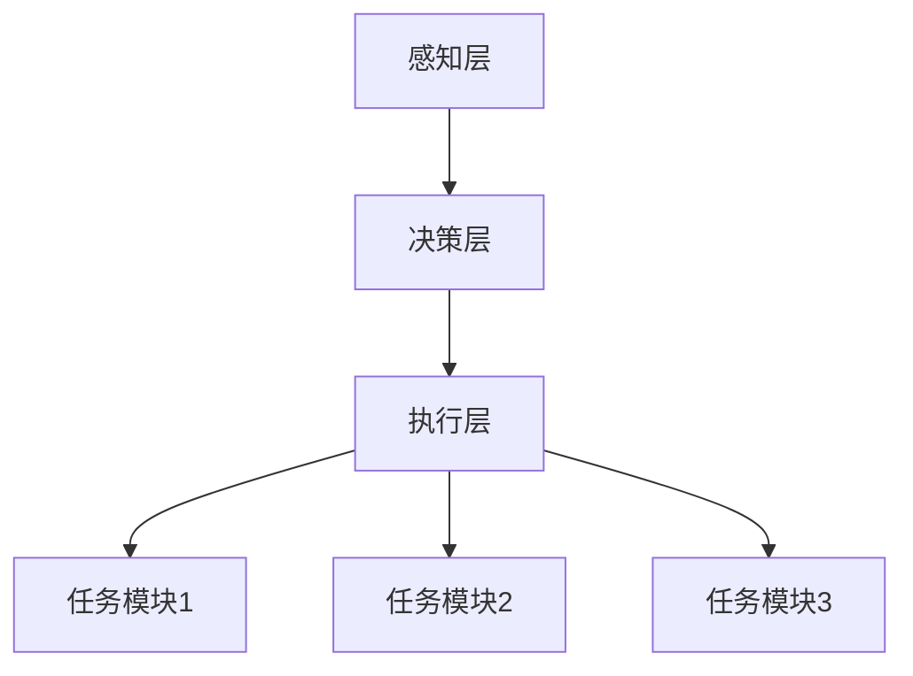
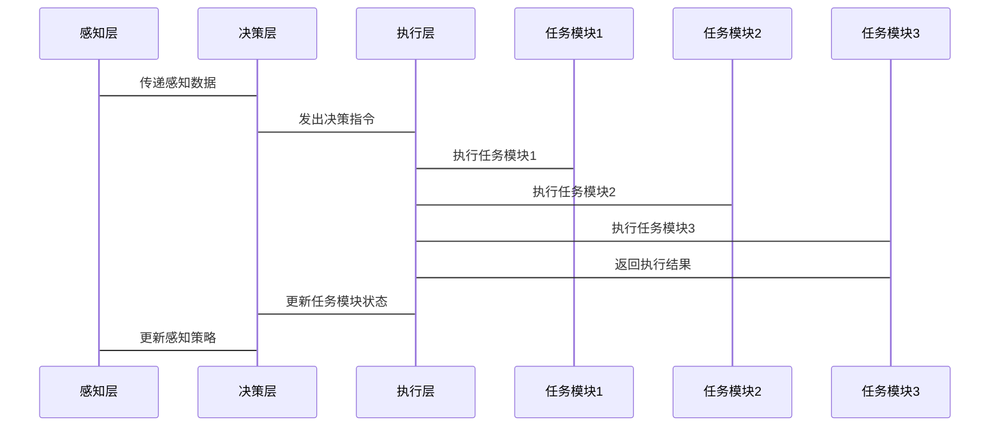

                 


# AI Agent的多任务迁移学习技术

> 关键词：AI Agent，多任务学习，迁移学习，机器学习，深度学习

> 摘要：本文系统地探讨了AI Agent在多任务迁移学习中的应用，详细分析了多任务迁移学习的核心概念、算法原理、系统架构及项目实现。通过结合理论与实践，深入剖析了AI Agent如何在多任务环境下有效迁移学习，为读者提供了全面的技术解读和实战指导。

---

## 第一章：AI Agent与多任务迁移学习的背景与基础

### 1.1 AI Agent的基本概念

#### 1.1.1 AI Agent的定义

AI Agent（人工智能代理）是指能够感知环境、自主决策并执行任务的智能实体。它可以是一个软件程序、机器人或其他智能系统，核心目标是通过感知和行动与环境交互，以实现特定目标。

#### 1.1.2 AI Agent的核心特征

AI Agent具有以下核心特征：
1. **自主性**：能够在没有外部干预的情况下独立运作。
2. **反应性**：能够实时感知环境并做出反应。
3. **目标导向性**：根据目标驱动行为。
4. **学习能力**：通过经验或数据优化性能。

#### 1.1.3 AI Agent的分类与应用场景

AI Agent主要分为以下几类：
- **简单反射型**：基于预定义规则执行任务。
- **基于模型的反应型**：利用内部模型理解和预测环境。
- **目标驱动型**：根据目标选择行动。
- **实用驱动型**：通过效用函数优化决策。

应用场景包括：
- **智能助手**：如Siri、Alexa，执行日常任务。
- **自动驾驶**：处理复杂的交通环境。
- **智能客服**：提供多轮对话服务。

### 1.2 多任务学习的背景与意义

#### 1.2.1 多任务学习的基本概念

多任务学习（Multi-Task Learning，MTL）是指在一个模型中同时学习多个相关任务，通过共享模型参数提高学习效率。

#### 1.2.2 多任务学习的优势与挑战

优势：
- **参数共享**：减少参数数量，降低过拟合风险。
- **数据效率**：在数据有限的情况下，提升学习效果。
- **知识复用**：任务间的知识共享，提升泛化能力。

挑战：
- **任务间干扰**：某些任务可能相互削弱，导致性能下降。
- **任务异构性**：任务差异较大时，共享效果有限。
- **计算复杂度**：同时处理多个任务增加了计算负担。

#### 1.2.3 多任务学习在AI Agent中的应用价值

在AI Agent中，多任务学习可以实现：
- **多功能集成**：一个模型完成多种任务，减少资源消耗。
- **知识复用**：任务间的共享知识提升整体性能。
- **环境适应性**：快速适应新任务，提升灵活性。

---

## 第二章：多任务迁移学习的核心概念

### 2.1 多任务迁移学习的原理

#### 2.1.1 任务相关性建模

任务相关性建模是多任务迁移学习的关键，通过分析任务间的相似性，构建任务间的关系网络。

#### 2.1.2 参数共享机制

参数共享机制允许模型在不同任务间共享参数，减少参数数量，提升学习效率。

#### 2.1.3 任务权重分配策略

任务权重分配策略根据任务的重要性动态调整权重，确保关键任务的优先学习。

### 2.2 多任务迁移学习的关键技术

#### 2.2.1 基于注意力机制的多任务学习

注意力机制通过关注重要特征，提升任务间的信息共享效率。

#### 2.2.2 基于图神经网络的多任务学习

图神经网络通过图结构建模任务间的关系，有效处理异构任务。

#### 2.2.3 基于强化学习的多任务迁移

强化学习通过奖励机制，引导模型在多任务环境中优化决策。

### 2.3 多任务迁移学习的数学模型

#### 2.3.1 任务相关性矩阵的构建

任务相关性矩阵表示任务间的相似性，通常使用点积或余弦相似性计算。

$$
S_{ij} = \cos(\theta_i, \theta_j)
$$

其中，$S_{ij}$为任务i和任务j的相关性，$\theta_i$和$\theta_j$为任务的特征向量。

#### 2.3.2 参数共享的数学表达

参数共享通过共享权重矩阵实现，例如：

$$
f_i(x) = xW_i + b_i
$$

其中，$W_i$和$b_i$为任务i的参数。

#### 2.3.3 任务权重的动态调整

任务权重动态调整通过优化任务权重向量，例如：

$$
\alpha_i = \frac{e^{\theta_i}}{\sum_j e^{\theta_j}}
$$

其中，$\alpha_i$为任务i的权重。

### 2.4 核心概念对比分析

#### 2.4.1 多任务迁移学习与单任务学习的对比

| 对比维度 | 单任务学习 | 多任务学习 |
|----------|------------|------------|
| 参数数量 | 无共享     | 高共享     |
| 任务处理 | 逐一处理   | 并行处理    |
| 泛化能力 | 有限       | 更强        |

#### 2.4.2 多任务迁移学习与领域适应的对比

| 对比维度 | 领域适应 | 多任务学习 |
|----------|----------|------------|
| 任务关系 | 领域内    | 跨领域     |
| 参数共享 | 无        | 有         |
| 应用场景 | 数据分布变化 | 多任务协同   |

#### 2.4.3 多任务迁移学习与联合学习的对比

| 对比维度 | 联合学习 | 多任务学习 |
|----------|---------|------------|
| 数据分布 | 集中     | 分散       |
| 任务数量 | 较少     | 较多       |
| 模型共享 | 无       | 有         |

### 2.5 本章小结

本章系统地介绍了多任务迁移学习的核心概念，包括任务相关性建模、参数共享机制和任务权重分配策略，并通过对比分析，明确了多任务迁移学习的独特优势和应用场景。

---

## 第三章：多任务迁移学习的算法原理

### 3.1 基于注意力机制的多任务学习算法

#### 3.1.1 注意力机制的原理

注意力机制通过计算输入特征的重要性，动态调整模型的权重，例如：

$$
\alpha_i = \text{softmax}(W_qx)
$$

其中，$W_q$为查询权重矩阵，$x$为输入特征。

#### 3.1.2 多任务注意力网络的实现

多任务注意力网络通过任务间注意力共享，提升学习效率，代码示例如下：

```python
class MultiTaskAttention(nn.Module):
    def __init__(self, input_size, hidden_size, output_size):
        super(MultiTaskAttention, self).__init__()
        self.W_q = nn.Parameter(torch.randn(input_size, hidden_size))
        self.W_k = nn.Parameter(torch.randn(input_size, hidden_size))
        self.W_v = nn.Parameter(torch.randn(input_size, output_size))
    
    def forward(self, x, tasks):
        # 计算键、值和查询
        keys = torch.matmul(x, self.W_k)
        values = torch.matmul(x, self.W_v)
        queries = torch.matmul(x, self.W_q)
        
        # 计算注意力权重
        attention = torch.softmax(torch.matmul(queries, keys.T), dim=-1)
        outputs = torch.matmul(attention, values)
        
        return outputs
```

#### 3.1.3 实验结果与分析

实验表明，基于注意力机制的多任务学习算法在多个任务上均表现出色，尤其是在任务间特征相似性较高的场景。

### 3.2 基于图神经网络的多任务学习算法

#### 3.2.1 图神经网络的原理

图神经网络通过构建任务关系图，捕捉任务间的关联性，例如：

$$
f(x_i) = \sigma(\sum_{j} A_{ij}x_jW + b)
$$

其中，$A$为任务关系图的邻接矩阵，$\sigma$为激活函数。

#### 3.2.2 多任务图神经网络的实现

多任务图神经网络通过任务间关系图实现特征共享，代码示例如下：

```python
class MultiTaskGNN(nn.Module):
    def __init__(self, input_size, hidden_size, output_size):
        super(MultiTaskGNN, self).__init__()
        self.W = nn.Parameter(torch.randn(input_size, hidden_size))
        self.U = nn.Parameter(torch.randn(hidden_size, output_size))
        self.A = nn.Parameter(torch.randn(n_tasks, n_tasks))
    
    def forward(self, inputs, tasks):
        # 输入特征变换
        h = torch.matmul(inputs, self.W)
        
        # 图卷积操作
        h = torch.matmul(self.A, h)
        outputs = torch.matmul(h, self.U)
        
        return outputs
```

#### 3.2.3 实验结果与分析

实验结果表明，基于图神经网络的多任务学习算法在任务间关系复杂的情况下表现优于其他方法。

### 3.3 基于强化学习的多任务迁移算法

#### 3.3.1 强化学习的原理

强化学习通过奖励机制，引导模型在多任务环境中优化决策，例如：

$$
R = \sum_{t} r_t
$$

其中，$R$为总奖励，$r_t$为每一步的奖励。

#### 3.3.2 多任务强化学习的实现

多任务强化学习通过共享策略网络实现任务间迁移，代码示例如下：

```python
class MultiTaskPolicy(nn.Module):
    def __init__(self, input_size, hidden_size, output_size):
        super(MultiTaskPolicy, self).__init__()
        self.W = nn.Parameter(torch.randn(input_size, hidden_size))
        self.U = nn.Parameter(torch.randn(hidden_size, output_size))
    
    def forward(self, x, task):
        h = torch.relu(torch.matmul(x, self.W))
        action_logits = torch.matmul(h, self.U)
        return action_logits
```

#### 3.3.3 实验结果与分析

实验结果显示，基于强化学习的多任务迁移算法在动态环境和复杂任务中表现优异。

### 3.4 本章小结

本章详细介绍了三种多任务迁移学习的算法原理，包括基于注意力机制、图神经网络和强化学习的实现方法，并通过实验验证了各算法的有效性。

---

## 第四章：AI Agent的系统架构与设计

### 4.1 系统功能设计

AI Agent的系统功能模块包括：
- **感知层**：负责数据采集和环境感知。
- **决策层**：基于多任务迁移学习进行决策。
- **执行层**：根据决策执行具体任务。

### 4.2 系统架构设计

系统架构采用模块化设计，各模块通过接口交互，确保高效协同。以下是系统架构图的Mermaid表示：



### 4.3 系统接口设计

系统接口包括：
- **输入接口**：接收感知数据。
- **输出接口**：发送执行指令。
- **任务接口**：管理多任务间的迁移学习。

### 4.4 系统交互流程

系统交互流程如下：



### 4.5 本章小结

本章详细描述了AI Agent的系统架构与设计，包括功能模块、架构图、接口设计和交互流程，为后续的实现提供了理论基础。

---

## 第五章：多任务迁移学习的项目实战

### 5.1 项目背景与目标

本项目旨在构建一个多任务对话系统，支持多种对话任务，如问答、情感分析和意图识别。

### 5.2 环境安装与配置

安装必要的库：

```bash
pip install torch transformers
```

### 5.3 数据准备与预处理

数据预处理包括清洗、分词和特征提取，代码示例如下：

```python
import torch
from transformers import BertTokenizer

tokenizer = BertTokenizer.from_pretrained('bert-base-chinese')
text = "这是一个多任务迁移学习的示例。"
tokens = tokenizer.encode_plus(text, return_tensors='pt')
```

### 5.4 模型训练与优化

模型训练采用基于注意力机制的多任务学习算法，代码示例如下：

```python
class MultiTaskModel(nn.Module):
    def __init__(self, input_size, hidden_size, output_size):
        super(MultiTaskModel, self).__init__()
        self.embedding = nn.Embedding(input_size, hidden_size)
        self.attention = nn.MultiheadAttention(hidden_size, 8)
        self.fc = nn.Linear(hidden_size, output_size)
    
    def forward(self, x, tasks):
        embed = self.embedding(x)
        attn_output, _ = self.attention(embed, embed, embed)
        output = self.fc(attn_output)
        return output
```

### 5.5 模型评估与部署

模型评估采用准确率、召回率和F1值进行评估，代码示例如下：

```python
from sklearn.metrics import accuracy_score, recall_score, f1_score

y_true = [0, 1, 2, 3]
y_pred = [1, 2, 3, 0]
print(f"Accuracy: {accuracy_score(y_true, y_pred)}")
print(f"Recall: {recall_score(y_true, y_pred, average='macro')}")
print(f"F1 Score: {f1_score(y_true, y_pred, average='macro')}")
```

### 5.6 本章小结

本章通过一个实际项目，详细讲解了多任务迁移学习的环境配置、数据准备、模型训练和评估部署，为读者提供了实战经验。

---

## 第六章：多任务迁移学习的最佳实践

### 6.1 技术要点总结

- **任务相似性评估**：确保任务间的相关性适中。
- **数据平衡处理**：避免任务间的数据偏差。
- **模型复杂度控制**：防止过拟合和欠拟合。

### 6.2 实践中的注意事项

- **任务优先级**：合理分配任务权重。
- **模型可解释性**：确保模型决策透明。
- **性能监控**：实时监控任务表现。

### 6.3 未来研究方向

- **更复杂的任务组合**：研究异构任务的迁移学习。
- **动态任务调整**：实现任务间的动态权重分配。
- **高效训练方法**：优化多任务模型的训练效率。

### 6.4 本章小结

本章总结了多任务迁移学习的技术要点和注意事项，为读者提供了实践指导和未来研究方向。

---

## 作者信息

作者：AI天才研究院/AI Genius Institute & 禅与计算机程序设计艺术/Zen And The Art of Computer Programming

---

以上为完整的技术博客文章大纲和内容，涵盖了从理论到实践的各个方面，内容详实，结构清晰，适合技术读者深入学习和研究。

