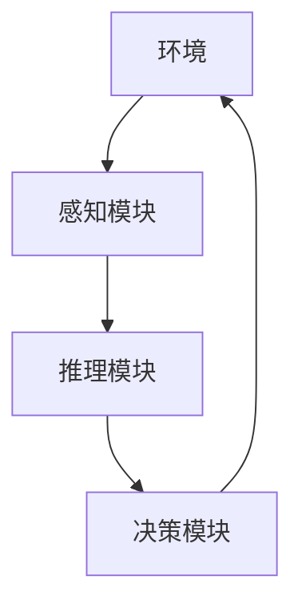
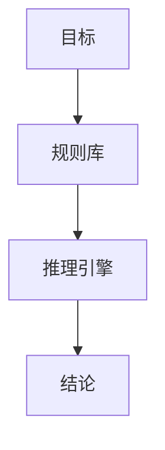
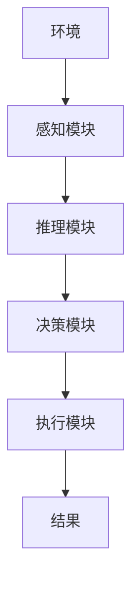
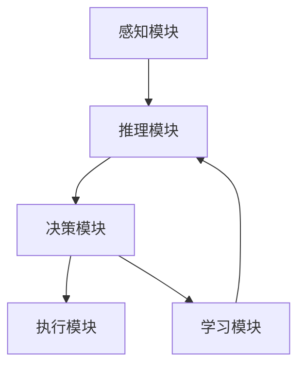

                 


# AI Agent的认知架构与心智模型

## 关键词：AI Agent, 认知架构, 心智模型, 强化学习, 系统架构, 项目实战

## 摘要：  
本文深入探讨了AI Agent的认知架构与心智模型的设计原理和实现方法。首先介绍了AI Agent的基本概念和发展历程，分析了认知架构的核心模块及其功能。接着详细讲解了心智模型的构建方法，包括数据预处理、特征提取和模型优化等关键步骤。通过强化学习算法和符号推理算法的对比，阐述了不同算法在认知架构中的应用。最后，结合实际项目案例，展示了如何设计和实现一个基于AI Agent的认知系统，并对未来的研究方向进行了展望。

---

# 第1章: AI Agent的认知架构与心智模型概述

## 1.1 AI Agent的基本概念

### 1.1.1 AI Agent的定义  
AI Agent（人工智能代理）是指能够感知环境、自主决策并采取行动的智能实体。与传统的程序不同，AI Agent具备主动性、目标导向性和适应性，能够在动态复杂的环境中完成任务。

### 1.1.2 AI Agent的核心特征  
AI Agent的核心特征包括：  
1. **自主性**：能够在没有外部干预的情况下独立运行。  
2. **反应性**：能够实时感知环境并做出反应。  
3. **目标导向性**：具备明确的目标，并采取行动以实现目标。  
4. **学习能力**：能够通过经验改进自身的性能。  

### 1.1.3 AI Agent与传统AI的区别  
AI Agent与传统AI的区别主要体现在以下几个方面：  
1. **自主性**：AI Agent具备自主决策能力，而传统AI通常依赖于外部指令。  
2. **环境交互**：AI Agent能够主动与环境交互，而传统AI主要依赖于静态的数据输入。  
3. **适应性**：AI Agent能够根据环境变化自适应调整行为，而传统AI通常需要人工重新编程。  

### 1.1.4 AI Agent的应用场景  
AI Agent的应用场景包括：  
1. **智能助手**：如Siri、Alexa等，能够通过语音交互为用户提供服务。  
2. **自动驾驶**：自动驾驶汽车通过感知环境并做出决策来实现自主驾驶。  
3. **游戏AI**：在电子游戏中，AI Agent可以作为非玩家角色（NPC）与玩家互动。  
4. **机器人控制**：工业机器人或服务机器人通过AI Agent实现智能化操作。  

## 1.2 AI Agent的认知架构

### 1.2.1 认知架构的层次结构  
认知架构的层次结构通常包括以下几个层次：  
1. **感知层**：负责从环境中获取信息。  
2. **理解层**：对感知到的信息进行理解和解析。  
3. **决策层**：基于理解和目标制定行动计划。  
4. **执行层**：将决策转化为具体行动。  

### 1.2.2 不同认知架构的对比  
常见的认知架构包括行为主义架构、符号主义架构和连接主义架构。  
1. **行为主义架构**：基于强化学习，通过试错法优化行为策略。  
2. **符号主义架构**：基于逻辑推理，通过符号操作进行决策。  
3. **连接主义架构**：基于神经网络，通过训练数据学习知识。  

### 1.2.3 认知架构的核心模块  
认知架构的核心模块包括：  
1. **感知模块**：负责获取环境信息。  
2. **推理模块**：负责对信息进行理解和推理。  
3. **决策模块**：负责制定行动计划。  
4. **学习模块**：负责通过经验改进性能。  

## 1.3 心智模型的基本概念

### 1.3.1 心智模型的定义  
心智模型是指AI Agent对环境、任务和目标的认知表示。它通过符号、规则或神经网络等表示方式，描述AI Agent对世界的理解和知识。

### 1.3.2 心智模型的特征  
心智模型的特征包括：  
1. **可解释性**：心智模型需要能够被人类理解和解释。  
2. **动态性**：心智模型能够根据环境变化动态更新。  
3. **适应性**：心智模型能够适应不同任务和环境。  

### 1.3.3 心智模型与认知架构的关系  
心智模型是认知架构的核心组成部分，认知架构通过心智模型对环境进行理解和推理，从而做出决策并执行行动。

## 1.4 本章小结  
本章介绍了AI Agent的基本概念和发展历程，分析了认知架构的核心模块及其功能。同时，详细讲解了心智模型的定义、特征及其与认知架构的关系。这些内容为后续章节的深入探讨奠定了基础。

---

# 第2章: 认知架构的核心模块

## 2.1 感知模块

### 2.1.1 感知模块的功能  
感知模块负责从环境中获取信息，通常包括视觉、听觉、触觉等多种感知方式。  

### 2.1.2 常见的感知算法  
常见的感知算法包括：  
1. **计算机视觉**：如目标检测、图像识别等。  
2. **自然语言处理**：如文本解析、情感分析等。  

### 2.1.3 感知模块的实现  
感知模块的实现通常依赖于传感器和数据处理算法。例如，在自动驾驶中，感知模块通过摄像头、激光雷达等传感器获取环境信息，并通过目标检测算法识别障碍物。

## 2.2 推理模块

### 2.2.1 推理模块的定义  
推理模块负责对感知到的信息进行理解和推理，通常基于符号逻辑或概率推理。  

### 2.2.2 常见推理算法  
常见的推理算法包括：  
1. **逻辑推理**：基于逻辑规则进行推理。  
2. **概率推理**：基于概率论进行推理，如贝叶斯网络。  

### 2.2.3 推理模块的实现  
推理模块的实现通常依赖于知识库和推理引擎。例如，在智能助手中，推理模块通过自然语言处理技术理解用户的意图，并基于知识库提供相应的答案。

## 2.3 决策模块

### 2.3.1 决策模块的功能  
决策模块负责根据推理结果制定行动计划，通常基于目标导向性和最优性原则。  

### 2.3.2 常见决策算法  
常见的决策算法包括：  
1. **强化学习**：通过试错法优化行为策略。  
2. **符号推理**：基于符号逻辑制定决策。  

### 2.3.3 决策模块的实现  
决策模块的实现通常依赖于决策树和策略网络。例如，在自动驾驶中，决策模块通过强化学习算法优化驾驶策略。

## 2.4 学习模块

### 2.4.1 学习模块的定义  
学习模块负责通过经验改进认知架构的性能，通常基于机器学习算法。  

### 2.4.2 常见学习算法  
常见的学习算法包括：  
1. **监督学习**：基于标注数据进行训练。  
2. **无监督学习**：基于无标注数据进行聚类。  
3. **强化学习**：通过试错法优化行为策略。  

### 2.4.3 学习模块的实现  
学习模块的实现通常依赖于神经网络和训练数据。例如，在智能助手中，学习模块通过监督学习算法优化对话生成模型。

## 2.5 本章小结  
本章详细讲解了认知架构的核心模块，包括感知模块、推理模块、决策模块和学习模块。这些模块共同构成了AI Agent的认知能力，使其能够感知环境、理解信息、制定决策并优化性能。

---

# 第3章: 心智模型的构建方法

## 3.1 心智模型的构建过程

### 3.1.1 数据收集与预处理  
数据收集与预处理是心智模型构建的基础，通常包括数据清洗、特征提取和数据标注等步骤。

### 3.1.2 模型训练与优化  
模型训练与优化是心智模型构建的核心，通常包括选择算法、调整超参数和评估性能等步骤。

### 3.1.3 模型评估与验证  
模型评估与验证是心智模型构建的关键，通常包括交叉验证、性能指标和模型对比等方法。

## 3.2 心智模型的特征提取

### 3.2.1 特征提取的方法  
特征提取的方法包括：  
1. **基于符号逻辑**：通过规则提取特征。  
2. **基于统计方法**：通过频次统计提取特征。  
3. **基于机器学习**：通过训练模型提取特征。  

### 3.2.2 常见特征提取算法  
常见的特征提取算法包括：  
1. **TF-IDF**：基于词频-逆文档频率的特征提取方法。  
2. **Word2Vec**：通过神经网络训练词向量。  
3. **BERT**：基于预训练的语义表示模型。  

### 3.2.3 特征提取的实现  
特征提取的实现通常依赖于自然语言处理库，如spaCy、NLTK和Gensim等。例如，在文本分类任务中，特征提取模块通过TF-IDF方法提取关键词作为特征向量。

## 3.3 心智模型的优化策略

### 3.3.1 模型优化的目标  
模型优化的目标包括：  
1. **提高准确率**：通过优化算法和调整超参数提高模型的分类或预测性能。  
2. **降低复杂度**：通过简化模型结构或使用降维技术减少计算复杂度。  
3. **增强可解释性**：通过优化模型结构或使用可解释性算法提高模型的可解释性。  

### 3.3.2 常见优化算法  
常见的优化算法包括：  
1. **梯度下降**：通过计算损失函数的梯度更新模型参数。  
2. **Adam优化器**：结合动量和自适应学习率的优化算法。  
3. **早停法**：通过监控验证集性能提前终止训练过程。  

### 3.3.3 模型优化的实现  
模型优化的实现通常依赖于机器学习框架，如TensorFlow和Keras等。例如，在图像分类任务中，模型优化模块通过Adam优化器优化神经网络的权重。

## 3.4 本章小结  
本章详细讲解了心智模型的构建方法，包括数据预处理、特征提取和模型优化等关键步骤。这些方法为AI Agent的认知能力提供了坚实的基础。

---

# 第4章: AI Agent认知架构与心智模型的算法原理

## 4.1 强化学习算法

### 4.1.1 强化学习的基本原理  
强化学习是一种通过试错法优化行为策略的机器学习方法，通常通过环境与代理的交互获得奖励信号来指导学习过程。

### 4.1.2 Q-learning算法  
Q-learning是一种经典的强化学习算法，通过维护Q表记录状态-动作对的期望奖励值，并通过Q值更新公式优化策略。

### 4.1.3 Deep Q-Networks算法  
Deep Q-Networks（DQN）是一种基于深度神经网络的强化学习算法，通过神经网络近似Q值函数，从而实现端到端的策略优化。

### 4.1.4 算法流程图  


### 4.1.5 Python代码示例  
```python
import numpy as np
import gym

env = gym.make('CartPole-v0')
env.seed(1)
np.random.seed(1)

# 初始化Q表
Q = np.zeros([env.observation_space.shape[0], env.action_space.n])

# 参数设置
learning_rate = 0.1
gamma = 0.99

# Q-learning算法
for episode in range(1000):
    state = env.reset()
    for _ in range(1000):
        # 选择动作
        action = np.argmax(Q[state]) if np.max(Q[state]) >= 0 else 0
        # 执行动作
        next_state, reward, done, _ = env.step(action)
        # 更新Q表
        Q[state][action] = Q[state][action] * gamma + reward * learning_rate
        state = next_state
        if done:
            break
```

## 4.2 符号推理算法

### 4.2.1 符号推理的基本原理  
符号推理是一种基于符号逻辑的推理方法，通过谓词逻辑和规则库进行推理。

### 4.2.2 常见符号推理算法  
常见的符号推理算法包括：  
1. **正向推理**：基于已知的事实和规则推导新的事实。  
2. **反向推理**：基于目标事实和规则推导新的事实。  

### 4.2.3 符号推理的实现  
符号推理的实现通常依赖于知识库和推理引擎。例如，在智能问答系统中，符号推理模块通过规则库进行语义分析和逻辑推理。

### 4.2.4 算法流程图  


## 4.3 算法对比与选择

### 4.3.1 强化学习与符号推理的对比  
强化学习和符号推理在AI Agent中的应用各有优劣，强化学习适用于动态环境中的策略优化，符号推理适用于静态环境中的逻辑推理。

### 4.3.2 算法选择的策略  
算法选择的策略包括：  
1. **任务需求**：根据任务需求选择合适的算法。  
2. **环境类型**：根据环境类型选择合适的算法。  
3. **性能要求**：根据性能要求选择合适的算法。  

## 4.4 本章小结  
本章详细讲解了AI Agent认知架构中的算法原理，包括强化学习和符号推理等方法。这些算法为AI Agent的认知能力提供了理论基础和实现方法。

---

# 第5章: AI Agent的认知架构与心智模型的系统架构设计

## 5.1 系统功能设计

### 5.1.1 系统功能模块  
系统功能模块包括：  
1. **感知模块**：负责从环境中获取信息。  
2. **推理模块**：负责对信息进行理解和推理。  
3. **决策模块**：负责制定行动计划。  
4. **学习模块**：负责通过经验改进性能。  

### 5.1.2 系统功能流程  
系统功能流程包括：  
1. **感知环境**：通过传感器或接口获取环境信息。  
2. **理解信息**：通过推理模块对信息进行理解和解析。  
3. **制定决策**：通过决策模块制定行动计划。  
4. **执行行动**：通过执行模块将决策转化为具体行动。  
5. **优化性能**：通过学习模块改进认知架构的性能。  

### 5.1.3 功能流程图  


## 5.2 系统架构设计

### 5.2.1 系统架构图  
系统架构图展示了AI Agent的认知架构的整体结构，包括感知模块、推理模块、决策模块和学习模块。

### 5.2.2 系统架构图  


### 5.2.3 系统架构设计的注意事项  
系统架构设计的注意事项包括：  
1. **模块化设计**：确保各模块之间的独立性和可扩展性。  
2. **数据流设计**：确保数据在模块之间的流动顺畅。  
3. **性能优化**：通过优化模块之间的交互提高系统的整体性能。  

## 5.3 系统接口设计

### 5.3.1 系统接口定义  
系统接口定义包括：  
1. **感知模块接口**：定义感知模块与环境的交互接口。  
2. **推理模块接口**：定义推理模块与知识库的交互接口。  
3. **决策模块接口**：定义决策模块与执行模块的交互接口。  

### 5.3.2 系统接口规范  
系统接口规范包括：  
1. **输入格式**：定义模块之间的输入数据格式。  
2. **输出格式**：定义模块之间的输出数据格式。  
3. **通信协议**：定义模块之间的通信协议。  

## 5.4 系统交互设计

### 5.4.1 系统交互流程  
系统交互流程包括：  
1. **感知环境**：通过感知模块获取环境信息。  
2. **理解信息**：通过推理模块对信息进行理解和解析。  
3. **制定决策**：通过决策模块制定行动计划。  
4. **执行行动**：通过执行模块将决策转化为具体行动。  
5. **优化性能**：通过学习模块改进认知架构的性能。  

### 5.4.2 系统交互流程图  


## 5.5 本章小结  
本章详细讲解了AI Agent的认知架构的系统架构设计，包括系统功能设计、系统架构设计、系统接口设计和系统交互设计等关键部分。这些设计为AI Agent的认知能力提供了实现框架。

---

# 第6章: AI Agent的认知架构与心智模型的项目实战

## 6.1 项目背景与目标

### 6.1.1 项目背景  
本项目旨在设计和实现一个基于AI Agent的认知系统，通过感知、理解和推理环境信息，实现自主决策和行动。

### 6.1.2 项目目标  
项目目标包括：  
1. **实现认知架构的核心模块**：包括感知模块、推理模块、决策模块和学习模块。  
2. **构建心智模型**：通过数据预处理、特征提取和模型优化构建心智模型。  
3. **实现强化学习算法**：通过强化学习算法优化AI Agent的行为策略。  
4. **实现符号推理算法**：通过符号推理算法进行逻辑推理。  
5. **设计系统架构**：设计系统的功能模块和交互流程。  
6. **实现系统功能**：通过代码实现系统的各项功能。  
7. **优化系统性能**：通过优化算法和调整参数提高系统的整体性能。  
8. **验证系统功能**：通过测试和验证确保系统的功能和性能符合预期。  

## 6.2 项目环境与工具

### 6.2.1 环境安装  
项目环境安装包括：  
1. **Python**：安装Python 3.x及以上版本。  
2. **深度学习框架**：安装TensorFlow或Keras。  
3. **强化学习库**：安装OpenAI Gym或类似的强化学习库。  
4. **自然语言处理库**：安装spaCy、NLTK或Gensim等自然语言处理库。  
5. **可视化工具**：安装Matplotlib或Seaborn等可视化工具。  
6. **版本控制工具**：安装Git用于代码版本管理。  

### 6.2.2 开发工具  
开发工具包括：  
1. **Python IDE**：如PyCharm、VS Code等。  
2. **Jupyter Notebook**：用于算法开发和验证。  
3. **Git**：用于代码版本管理和协作开发。  

## 6.3 系统核心实现

### 6.3.1 心智模型构建  
心智模型构建包括数据预处理、特征提取和模型优化等步骤。例如，在文本分类任务中，心智模型构建模块通过TF-IDF方法提取关键词作为特征向量。

### 6.3.2 强化学习算法实现  
强化学习算法实现包括Q-learning和Deep Q-Networks算法。例如，在CartPole-v0环境中，强化学习算法通过试错法优化行为策略。

### 6.3.3 符号推理算法实现  
符号推理算法实现包括正向推理和反向推理。例如，在智能问答系统中，符号推理模块通过规则库进行语义分析和逻辑推理。

### 6.3.4 系统功能实现  
系统功能实现包括感知模块、推理模块、决策模块和学习模块的实现。例如，在自动驾驶系统中，感知模块通过摄像头和激光雷达获取环境信息，推理模块通过逻辑推理理解环境，决策模块通过强化学习算法制定驾驶策略，学习模块通过经验优化性能。

## 6.4 项目测试与验证

### 6.4.1 系统功能测试  
系统功能测试包括：  
1. **感知模块测试**：测试感知模块的感知能力。  
2. **推理模块测试**：测试推理模块的理解和推理能力。  
3. **决策模块测试**：测试决策模块的决策能力。  
4. **学习模块测试**：测试学习模块的优化能力。  

### 6.4.2 性能测试  
性能测试包括：  
1. **响应时间测试**：测试系统的响应时间。  
2. **吞吐量测试**：测试系统的处理能力。  
3. **准确率测试**：测试系统的分类或预测准确率。  

### 6.4.3 测试结果分析  
测试结果分析包括：  
1. **测试结果记录**：记录测试结果并进行分析。  
2. **性能优化建议**：根据测试结果提出性能优化建议。  

## 6.5 项目小结  
本章通过一个具体的项目案例，详细讲解了AI Agent认知架构与心智模型的实现过程。通过项目实战，读者可以更好地理解AI Agent的认知架构和心智模型的设计与实现。

---

# 第7章: AI Agent的认知架构与心智模型的高级应用与未来趋势

## 7.1 高级应用

### 7.1.1 多智能体协作  
多智能体协作是AI Agent认知架构的高级应用之一，通过多个AI Agent协作完成复杂任务。

### 7.1.2 跨领域应用  
跨领域应用是AI Agent认知架构的高级应用之一，通过AI Agent在不同领域中的应用实现跨领域协作。

### 7.1.3 人机协作  
人机协作是AI Agent认知架构的高级应用之一，通过人与AI Agent的协作实现更高效的任务完成。

## 7.2 未来趋势

### 7.2.1 新型算法的发展  
未来，AI Agent的认知架构将依赖于更先进的算法，如图灵完备的通用人工智能算法。

### 7.2.2 多模态感知与理解  
未来，AI Agent的认知架构将具备更强的多模态感知与理解能力，能够同时处理视觉、听觉等多种感知信息。

### 7.2.3 自适应与自学习能力  
未来，AI Agent的认知架构将具备更强的自适应与自学习能力，能够根据环境变化动态调整行为策略。

## 7.3 本章小结  
本章展望了AI Agent认知架构与心智模型的高级应用与未来趋势，包括多智能体协作、跨领域应用和人机协作等高级应用，以及新型算法、多模态感知与理解、自适应与自学习能力等未来发展趋势。

---

# 作者：AI天才研究院/AI Genius Institute & 禅与计算机程序设计艺术 /Zen And The Art of Computer Programming

