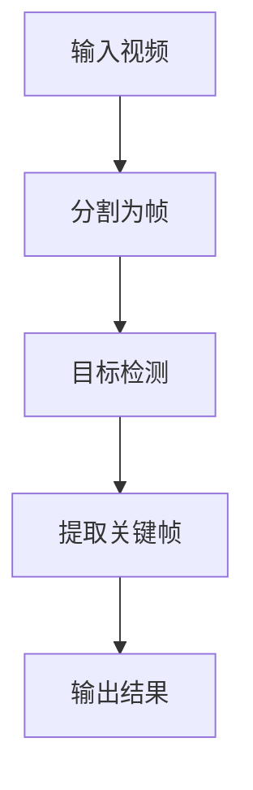
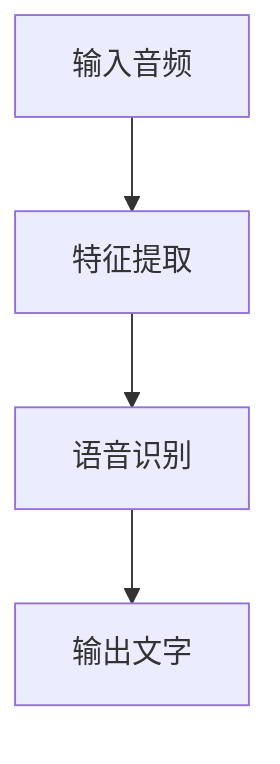
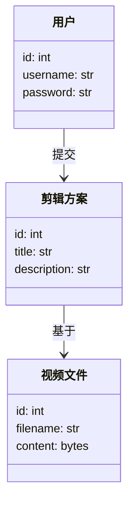
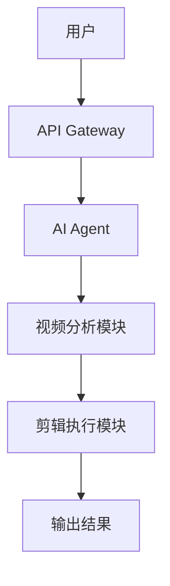
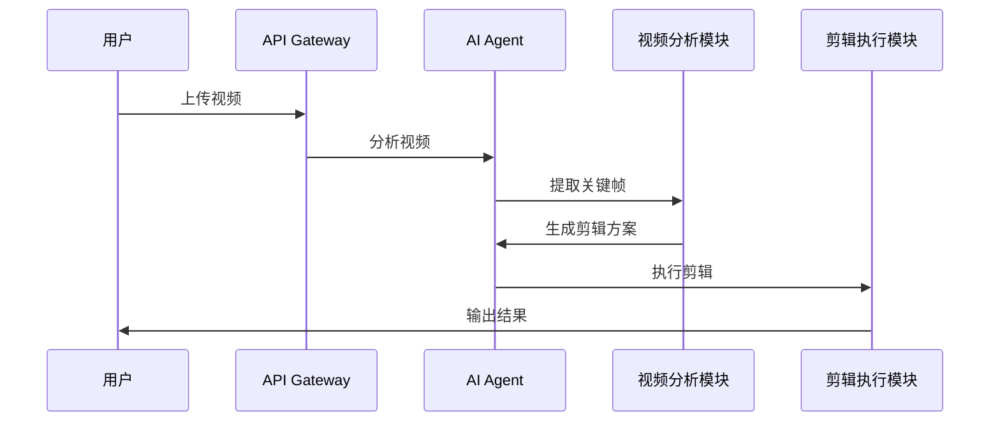

                 


# 开发AI Agent支持的智能视频剪辑系统

## 关键词：AI Agent, 智能视频剪辑, 算法原理, 系统架构, 项目实战

## 摘要：  
本文详细探讨了开发AI Agent支持的智能视频剪辑系统的背景、核心概念、算法原理、系统架构以及项目实战。通过分析AI Agent在视频剪辑中的应用，结合目标检测、语音识别等算法，构建了一个高效的智能视频剪辑系统。本文旨在为开发者提供理论支持和实践指导，帮助他们理解并开发类似系统。

---

## 第一部分: 背景介绍

### 第1章: AI Agent与智能视频剪辑系统概述

#### 1.1 问题背景
##### 1.1.1 视频剪辑的现状与挑战
传统视频剪辑工具（如Premiere Pro、Final Cut Pro）功能强大，但操作复杂，学习成本高，且需要手动完成剪辑、特效添加等任务。对于非专业用户，使用这些工具效率低下，难以快速完成任务。

##### 1.1.2 AI Agent在视频剪辑中的应用潜力
AI Agent（人工智能代理）能够通过自然语言处理、计算机视觉等技术，自动识别视频内容、提取关键帧、生成字幕、添加特效等，显著提升视频剪辑效率。AI Agent可以实现以下功能：
- **自动剪辑**：根据用户需求，自动提取视频片段。
- **智能编辑**：基于视频内容，自动生成标题、字幕、特效。
- **实时反馈**：根据用户反馈，动态调整剪辑方案。

##### 1.1.3 问题解决的必要性与目标
开发AI Agent支持的智能视频剪辑系统，旨在降低视频剪辑的技术门槛，提升效率，使非专业用户也能快速完成高质量视频剪辑。目标包括：
1. 提供智能化的视频剪辑工具，减少手动操作。
2. 实现AI Agent与视频剪辑流程的深度结合。
3. 提供高效的系统架构，支持实时反馈和动态调整。

#### 1.2 问题描述
##### 1.2.1 现有视频剪辑工具的局限性
- **操作复杂**：需要专业技能，学习成本高。
- **效率低下**：手动操作耗时，难以快速完成任务。
- **功能单一**：缺乏智能化，无法满足个性化需求。

##### 1.2.2 AI Agent如何提升视频剪辑效率
AI Agent通过以下方式提升视频剪辑效率：
- **自动化剪辑**：基于AI算法，自动识别视频内容，提取关键帧。
- **智能编辑**：自动生成标题、字幕、特效，减少人工干预。
- **实时反馈**：根据用户反馈，动态调整剪辑方案。

##### 1.2.3 系统边界与外延
系统边界：仅关注AI Agent与视频剪辑功能的结合，不涉及视频存储、分发等环节。
系统外延：AI Agent支持的智能视频剪辑系统可与其他AI应用（如图像识别、语音识别）结合，扩展功能。

#### 1.3 核心概念与系统结构
##### 1.3.1 AI Agent的定义与特征
AI Agent：具备感知、决策、执行能力的智能代理，能够与用户交互，完成特定任务。

核心特征：
- **感知能力**：通过传感器或API获取信息。
- **决策能力**：基于信息做出决策。
- **执行能力**：通过动作或输出实现目标。

##### 1.3.2 智能视频剪辑系统的组成要素
- **视频采集模块**：获取原始视频数据。
- **AI Agent模块**：处理视频内容，生成剪辑方案。
- **剪辑执行模块**：根据方案完成剪辑。
- **用户交互模块**：与用户互动，提供反馈。

##### 1.3.3 系统功能模块与交互流程
系统功能模块包括：
1. 视频采集模块：接收输入视频。
2. AI Agent模块：分析视频内容，生成剪辑方案。
3. 剪辑执行模块：根据方案完成剪辑。
4. 用户交互模块：与用户互动，提供反馈。

交互流程：
1. 用户上传视频。
2. AI Agent分析视频内容，生成剪辑方案。
3. 用户确认或修改方案。
4. 系统执行剪辑，输出结果。

---

## 第二部分: 核心概念与联系

### 第2章: 核心概念与联系

#### 2.1 AI Agent与智能视频剪辑系统的原理
##### 2.1.1 AI Agent的基本原理
AI Agent通过感知、决策、执行三个步骤完成任务：
1. **感知**：获取输入信息（如视频内容）。
2. **决策**：基于信息生成剪辑方案。
3. **执行**：根据方案完成剪辑。

##### 2.1.2 智能视频剪辑系统的实现机制
智能视频剪辑系统通过以下步骤实现：
1. **视频分析**：识别视频内容，提取关键帧。
2. **剪辑方案生成**：根据内容生成剪辑方案。
3. **剪辑执行**：根据方案完成剪辑。

##### 2.1.3 两者结合的逻辑关系
AI Agent作为系统的核心，驱动视频剪辑流程，提升效率。

#### 2.2 核心概念对比分析
##### 2.2.1 AI Agent与传统视频剪辑工具的对比
| 特性                | AI Agent支持的智能视频剪辑系统 | 传统视频剪辑工具 |
|---------------------|---------------------------------|------------------|
| 操作复杂度          | 低                            | 高              |
| 效率                | 高                            | 低              |
| 功能智能化          | 高                            | 低              |
| 学习成本            | 低                            | 高              |

##### 2.2.2 智能视频剪辑系统与其他AI应用的对比
| 应用场景            | 智能视频剪辑系统               | 图像识别系统       | 语音识别系统       |
|---------------------|---------------------------------|------------------|------------------|
| 核心功能            | 视频剪辑                       | 图像分类          | 语音转录          |
| 输入数据            | 视频                           | 图像              | 音频              |
| 输出结果            | 剪辑后的视频                   | 分类结果          | 文本              |

##### 2.2.3 核心概念的属性特征对比表格
| 特性                | AI Agent                      | 智能视频剪辑系统   |
|---------------------|-------------------------------|-------------------|
| 核心功能            | 处理视频内容                  | 剪辑视频           |
| 技术基础            | 人工智能、计算机视觉          | 视频编辑技术       |
| 应用场景            | 视频剪辑、内容生成            | 视频剪辑           |
| 优势                | 自动化、智能化                 | 高效、精准         |

#### 2.3 系统架构的ER实体关系图
```mermaid
er
actor: 用户
agent: AI Agent
system: 智能视频剪辑系统
video: 视频文件

actor --> system: 上传视频
system --> agent: 分析视频
agent --> system: 生成剪辑方案
system --> agent: 执行剪辑
actor <-- system: 下载结果
```

---

## 第三部分: 算法原理讲解

### 第3章: 算法原理与实现

#### 3.1 目标检测算法
##### 3.1.1 目标检测的原理与流程
目标检测是AI Agent识别视频中物体的关键步骤，常用YOLO算法实现。

##### 3.1.2 使用YOLO算法的实现
YOLO算法流程：
1. **输入视频**：将视频分为多个帧。
2. **目标检测**：对每个帧进行目标检测，识别物体。
3. **提取关键帧**：根据检测结果，提取关键帧。

##### 3.1.3 算法的 mermaid 流程图


##### 3.1.4 Python源代码实现
```python
import cv2
from yolo import YOLO

yolo = YOLO()
video_path = "input.mp4"
output_path = "output.mp4"

cap = cv2.VideoCapture(video_path)
fourcc = cv2.VideoWriter_fourcc(*'XVID')
out = cv2.VideoWriter(output_path, fourcc, 20.0, (int(cap.get(3)), int(cap.get(4))))

while cap.isOpened():
    ret, frame = cap.read()
    if not ret:
        break
    # 目标检测
    boxes, scores, classes = yolo.detect(frame)
    for box in boxes:
        x, y, w, h = box
        cv2.rectangle(frame, (x, y), (x + w, y + h), (0, 255, 0), 2)
    out.write(frame)

cap.release()
out.release()
```

##### 3.1.5 算法的数学模型和公式
YOLO的目标检测模型基于卷积神经网络（CNN），其损失函数如下：
$$
\text{Loss} = \lambda _{\text{obj}} \cdot \text{obj\_loss} + \lambda _{\text{no\_obj}} \cdot \text{no\_obj\_loss} + \lambda _{\text{cls}} \cdot \text{cls\_loss}
$$
其中，$\lambda$ 是平衡因子，obj_loss 是目标损失，no\_obj\_loss 是无目标损失，cls\_loss 是分类损失。

#### 3.2 语音识别算法
##### 3.2.1 语音识别的原理与流程
语音识别用于将视频中的语音内容转为文字，常用Kaldi实现。

##### 3.2.2 使用Kaldi的实现
Kaldi流程：
1. **语音提取**：从视频中提取音频。
2. **特征提取**：提取音频特征（如MFCC）。
3. **语音识别**：将特征输入模型，生成文字。

##### 3.2.3 算法的 mermaid 流程图


##### 3.2.4 Python源代码实现
```python
import speech_recognition as sr

r = sr.Recognizer()
audio_file = "input.wav"
with sr.AudioFile(audio_file) as source:
    audio_data = r.record(source)
text = r.recognize_google(audio_data)
print(text)
```

##### 3.2.5 算法的数学模型和公式
语音识别模型基于隐马尔可夫模型（HMM），其概率公式如下：
$$
P(w|s) = \prod_{i=1}^{n} P(w_i|s_i)
$$
其中，$w$ 是目标词，$s$ 是观察序列。

---

## 第四部分: 系统分析与架构设计

### 第4章: 系统分析与架构设计

#### 4.1 问题场景介绍
AI Agent支持的智能视频剪辑系统主要用于个人用户、企业用户，提供高效、智能的视频剪辑服务。

#### 4.2 系统功能设计
##### 4.2.1 领域模型


#### 4.3 系统架构设计
##### 4.3.1 系统架构图


#### 4.4 系统接口设计
系统接口包括：
1. 用户上传视频接口。
2. AI Agent分析视频接口。
3. 剪辑执行接口。
4. 下载结果接口。

#### 4.5 系统交互序列图


---

## 第五部分: 项目实战

### 第5章: 项目实战

#### 5.1 环境安装与配置
##### 5.1.1 安装Python
```bash
# 安装Python 3.8+
python --version
```

##### 5.1.2 安装深度学习框架
```bash
pip install tensorflow
pip install keras
pip install yolo
pip install speech_recognition
```

#### 5.2 系统核心实现源代码
##### 5.2.1 视频分析模块
```python
import cv2
from yolo import YOLO

yolo = YOLO()
video_path = "input.mp4"
output_path = "output.mp4"

cap = cv2.VideoCapture(video_path)
fourcc = cv2.VideoWriter_fourcc(*'XVID')
out = cv2.VideoWriter(output_path, fourcc, 20.0, (int(cap.get(3)), int(cap.get(4))))

while cap.isOpened():
    ret, frame = cap.read()
    if not ret:
        break
    boxes, scores, classes = yolo.detect(frame)
    for box in boxes:
        x, y, w, h = box
        cv2.rectangle(frame, (x, y), (x + w, y + h), (0, 255, 0), 2)
    out.write(frame)

cap.release()
out.release()
```

##### 5.2.2 AI Agent模块
```python
import speech_recognition as sr

r = sr.Recognizer()
audio_file = "input.wav"
with sr.AudioFile(audio_file) as source:
    audio_data = r.record(source)
text = r.recognize_google(audio_data)
print(text)
```

#### 5.3 实际案例分析与详细讲解
##### 5.3.1 案例分析
假设用户上传一个婚礼视频，系统自动识别婚礼场景，提取关键帧，生成婚礼剪辑。

##### 5.3.2 详细讲解
1. 视频分析模块识别婚礼场景。
2. AI Agent生成剪辑方案。
3. 剪辑执行模块完成剪辑。

---

## 第六部分: 总结与展望

### 第6章: 总结与展望

#### 6.1 总结
本文详细探讨了AI Agent支持的智能视频剪辑系统的背景、核心概念、算法原理、系统架构以及项目实战。通过分析AI Agent在视频剪辑中的应用，结合目标检测、语音识别等算法，构建了一个高效的智能视频剪辑系统。

#### 6.2 优化方向
1. **性能优化**：提升AI Agent的响应速度。
2. **功能扩展**：增加更多智能化功能，如自动配乐。
3. **用户体验**：优化界面，提升用户体验。

#### 6.3 未来展望
AI Agent支持的智能视频剪辑系统将更加智能化、自动化，广泛应用于教育、医疗、娱乐等领域。

---

## 作者：AI天才研究院/AI Genius Institute & 禅与计算机程序设计艺术 /Zen And The Art of Computer Programming

---

通过本文的详细讲解，读者可以深入了解AI Agent支持的智能视频剪辑系统的开发过程，从理论到实践，掌握核心算法和系统设计的关键点。

