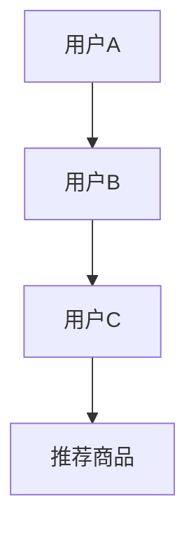
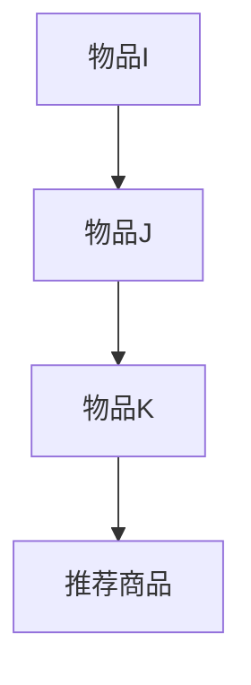
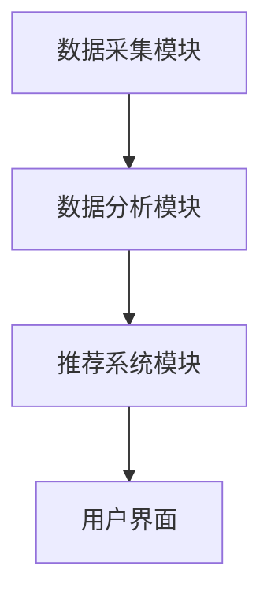
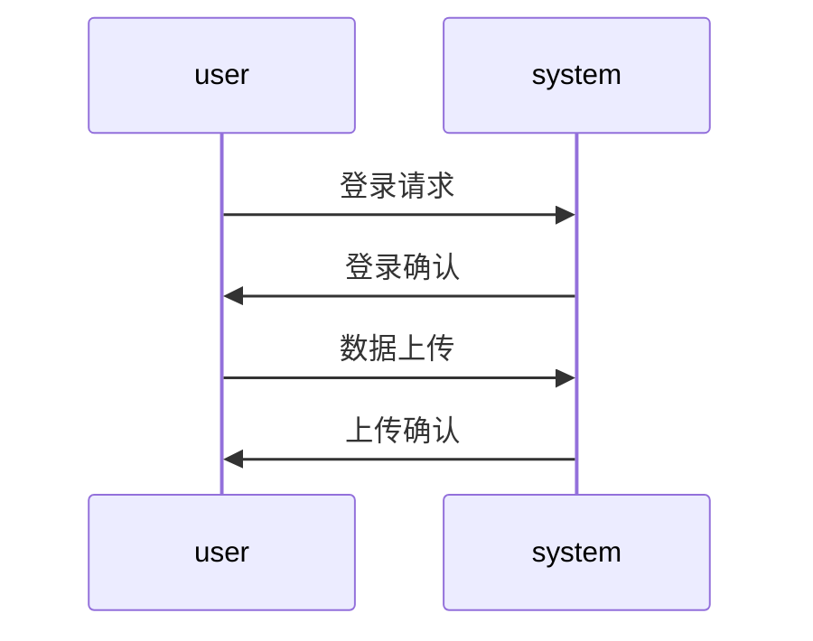

                 


# 智能个人消费模式分析器

## 关键词：智能消费分析，数据挖掘，机器学习，个性化推荐，消费决策

## 摘要：本文深入分析智能个人消费模式分析器的核心原理与实现，探讨其在消费数据分析中的应用价值，揭示如何通过数据挖掘与机器学习技术实现个性化消费推荐，优化消费决策过程。

---

# 第三章: 算法原理讲解

## 3.1 协同过滤推荐算法

### 3.1.1 基于用户的协同过滤算法

#### 3.1.1.1 算法流程



#### 3.1.1.2 Python代码实现

```python
def user_based_recommender(data, user_id, item_id):
    # 计算用户间相似度
    similarity_matrix = {}
    for user in data:
        if user != user_id:
            similarity = compute_similarity(data[user_id], data[user])
            similarity_matrix[user] = similarity
    # 找出相似度最高的用户并推荐其行为
    top_users = sorted(similarity_matrix.keys(), key=lambda x: similarity_matrix[x], reverse=True)[:5]
    recommendations = []
    for user in top_users:
        for item in data[user]:
            if item not in data[user_id]:
                recommendations.append((item, data[user][item]))
    return recommendations
```

#### 3.1.1.3 数学公式

用户相似度计算公式：

$$
\text{相似度}(u, v) = \frac{\sum_{i=1}^{n} (u_i - \bar{u})(v_i - \bar{v})}{\sqrt{\sum_{i=1}^{n} (u_i - \bar{u})^2} \cdot \sqrt{\sum_{i=1}^{n} (v_i - \bar{v})^2}}
$$

其中，$\bar{u}$ 和 $\bar{v}$ 分别是用户 $u$ 和 $v$ 的平均评分。

### 3.1.2 基于物品的协同过滤算法

#### 3.1.2.1 算法流程



#### 3.1.2.2 Python代码实现

```python
def item_based_recommender(data, user_id, item_id):
    # 建立物品-物品相似度矩阵
    item_similarity = compute_item_similarity(data)
    # 根据用户已购买的商品，推荐相似商品
    recommendations = []
    for item in data[user_id]:
        for similar_item in item_similarity[item]:
            if similar_item not in data[user_id]:
                recommendations.append((similar_item, item_similarity[item][similar_item]))
    return recommendations
```

#### 3.1.2.3 数学公式

物品相似度计算公式：

$$
\text{相似度}(i, j) = \frac{\sum_{u=1}^{m} (r_{u,i} - \bar{r}_i)(r_{u,j} - \bar{r}_j)}{\sqrt{\sum_{u=1}^{m} (r_{u,i} - \bar{r}_i)^2} \cdot \sqrt{\sum_{u=1}^{m} (r_{u,j} - \bar{r}_j)^2}}
$$

其中，$\bar{r}_i$ 是物品 $i$ 的平均评分，$m$ 是用户的数量。

---

## 3.2 基于内容的推荐算法

### 3.2.1 算法原理

基于内容的推荐算法通过分析商品的属性（如类别、品牌、价格等）来生成推荐。这种方法尤其适用于当用户数据不足时。

#### 3.2.1.1 特征提取

使用TF-IDF（Term Frequency-Inverse Document Frequency）对商品描述进行特征提取。

#### 3.2.1.2 相似度计算

使用余弦相似度计算商品之间的相似性。

### 3.2.2 Python代码实现

```python
from sklearn.feature_extraction.text import TfidfVectorizer

def content_based_recommender(data, user_id, item_id):
    # 特征提取
    vectorizer = TfidfVectorizer()
    item_descriptions = [data[user_id][item]['description'] for item in data[user_id]]
    tfidf_matrix = vectorizer.fit_transform(item_descriptions)
    
    # 计算余弦相似度
    similarity = linear_kernel(tfidf_matrix[0], tfidf_matrix)
    
    # 根据相似度排序并推荐
    recommendations = []
    for i in range(1, len(similarity[0])):
        if similarity[0][i] > 0.3:
            recommendations.append((item_id[i], similarity[0][i]))
    return recommendations
```

### 3.2.3 数学公式

余弦相似度计算公式：

$$
\text{相似度}(i, j) = \frac{\sum_{k=1}^{n} w_{i,k} w_{j,k}}{\sqrt{\sum_{k=1}^{n} w_{i,k}^2} \cdot \sqrt{\sum_{k=1}^{n} w_{j,k}^2}}
$$

其中，$w_{i,k}$ 是商品 $i$ 的第 $k$ 个特征的权重。

---

## 3.3 混合推荐模型

### 3.3.1 算法原理

混合推荐模型结合了协同过滤和基于内容的推荐方法，通过加权融合两种方法的结果来提高推荐的准确性和多样性。

### 3.3.2 Python代码实现

```python
def hybrid_recommender(data, user_id, item_id):
    # 获取协同过滤推荐
    cf_recommendations = user_based_recommender(data, user_id, item_id)
    # 获取基于内容的推荐
    cb_recommendations = content_based_recommender(data, user_id, item_id)
    
    # 根据历史数据进行加权融合
    weighted_recommendations = []
    for cf_item, cf_score in cf_recommendations:
        for cb_item, cb_score in cb_recommendations:
            if cf_item == cb_item:
                weighted_score = 0.7 * cf_score + 0.3 * cb_score
                weighted_recommendations.append((cf_item, weighted_score))
    return weighted_recommendations
```

### 3.3.3 数学公式

混合推荐模型的加权评分公式：

$$
\text{评分}(i) = \alpha \cdot \text{评分}_{\text{CF}}(i) + (1 - \alpha) \cdot \text{评分}_{\text{CB}}(i)
$$

其中，$\alpha$ 是协同过滤的权重，取值范围为 $[0, 1]$。

---

# 第四章: 系统分析与架构设计

## 4.1 问题场景介绍

### 4.1.1 系统功能概述

智能个人消费模式分析器是一个基于数据挖掘和机器学习的消费行为分析系统，旨在通过分析用户的消费数据，提供个性化的消费建议。

---

## 4.2 系统架构设计

### 4.2.1 系统功能设计

#### 4.2.1.1 数据采集模块

负责从多个数据源（如数据库、API接口）采集消费数据，并进行预处理。

#### 4.2.1.2 数据分析模块

对消费数据进行特征提取、建模分析，生成用户画像和消费行为分析报告。

#### 4.2.1.3 推荐系统模块

根据分析结果，结合机器学习算法生成个性化推荐。

### 4.2.2 系统架构图



---

## 4.3 系统接口设计

### 4.3.1 数据接口

#### 4.3.1.1 数据输入接口

```python
def data_input_interface(data):
    # 数据预处理
    processed_data = preprocess(data)
    # 数据存储
    store(processed_data)
```

#### 4.3.1.2 数据输出接口

```python
def data_output_interface():
    # 获取分析结果
    result = analyze()
    # 返回推荐结果
    return generate_recommendations(result)
```

---

## 4.4 系统交互流程

### 4.4.1 用户登录与数据上传



---

## 4.5 系统功能扩展

### 4.5.1 数据可视化模块

#### 4.5.1.1 数据可视化界面

使用可视化工具（如D3.js、Tableau）展示消费数据的分析结果和推荐结果。

### 4.5.2 数据挖掘模块

#### 4.5.2.1 高级分析功能

集成更复杂的机器学习模型（如深度学习、时间序列分析）进行消费预测和趋势分析。

---

# 第五章: 项目实战

## 5.1 环境安装与配置

### 5.1.1 安装Python与必要的库

安装Python和以下库：

```bash
pip install numpy pandas scikit-learn matplotlib
```

### 5.1.2 数据集准备

获取消费数据集（如用户ID、消费记录、商品信息等）。

---

## 5.2 核心代码实现

### 5.2.1 数据预处理

```python
import pandas as pd

def preprocess(data):
    # 处理缺失值
    data = data.dropna()
    # 标准化处理
    from sklearn.preprocessing import StandardScaler
    scaler = StandardScaler()
    numeric_features = data.select_dtypes(include=['int64', 'float64']).columns
    data[numeric_features] = scaler.fit_transform(data[numeric_features])
    return data
```

### 5.2.2 模型训练与评估

```python
from sklearn.metrics import precision_score, recall_score, f1_score

def evaluate_model(y_true, y_pred):
    print(f"Precision: {precision_score(y_true, y_pred)}")
    print(f"Recall: {recall_score(y_true, y_pred)}")
    print(f"F1 Score: {f1_score(y_true, y_pred)}")
```

---

## 5.3 实际案例分析

### 5.3.1 案例背景

假设我们有一个包含1000名用户和10000条消费记录的数据集。

### 5.3.2 案例实现

```python
data = pd.read_csv('consumption_data.csv')
processed_data = preprocess(data)
# 训练模型
model = train_model(processed_data)
# 生成推荐
recommendations = generate_recommendations(model, user_id=123)
```

### 5.3.3 案例分析

通过对数据的分析，我们可以发现用户的消费偏好，并生成个性化的推荐列表。

---

## 5.4 项目小结

通过项目实战，我们掌握了智能个人消费模式分析器的核心实现步骤，包括数据预处理、模型训练和推荐生成。

---

# 第六章: 最佳实践

## 6.1 小结

智能个人消费模式分析器通过数据挖掘和机器学习技术，为用户提供个性化的消费建议，帮助用户优化消费决策。

## 6.2 注意事项

1. 数据隐私保护
2. 模型的实时性与准确性
3. 系统的可扩展性与维护性

## 6.3 拓展阅读

1. 《集体智慧编程》
2. 《机器学习实战》
3. 《数据挖掘导论》

---

# 作者：AI天才研究院/AI Genius Institute & 禅与计算机程序设计艺术 /Zen And The Art of Computer Programming

---

# 参考文献

[1] 刘顺, 《集体智慧编程》, 人民邮电出版社, 2012.

[2] 周志华, 《机器学习实战》, 清华大学出版社, 2017.

[3] 胡婷, 《数据挖掘导论》, 北京大学出版社, 2019.

