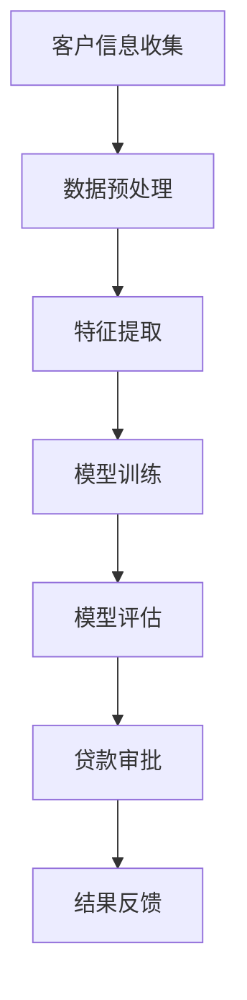
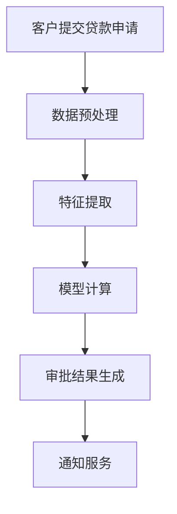
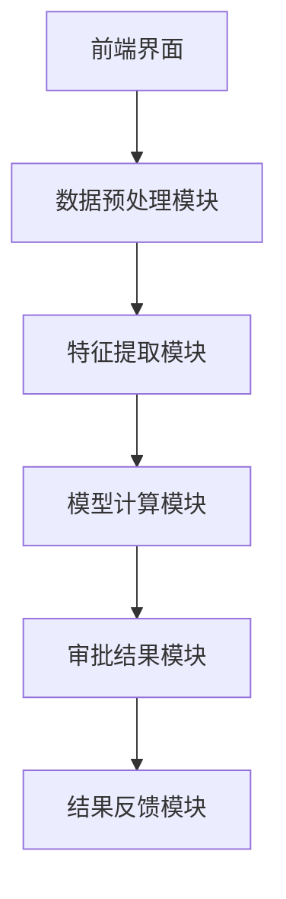
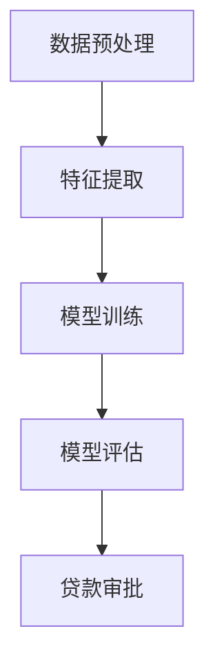
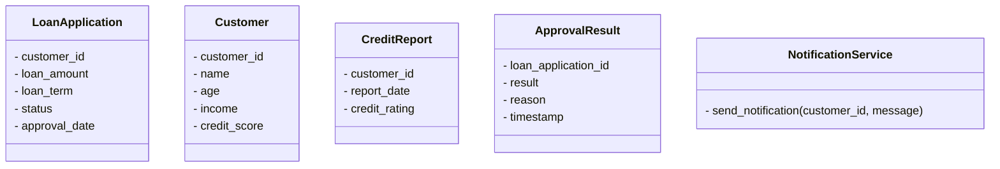
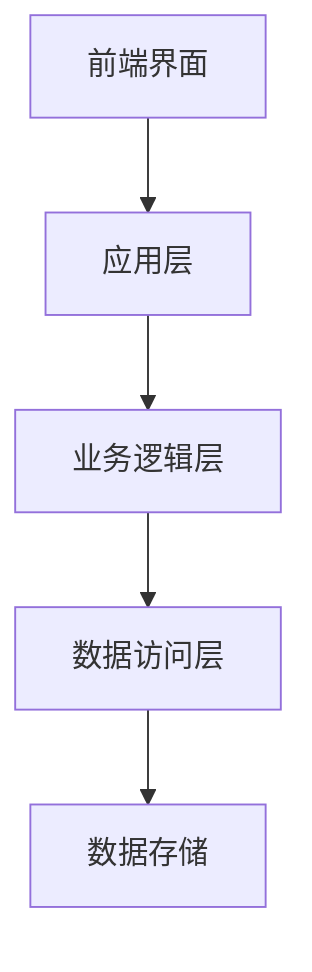
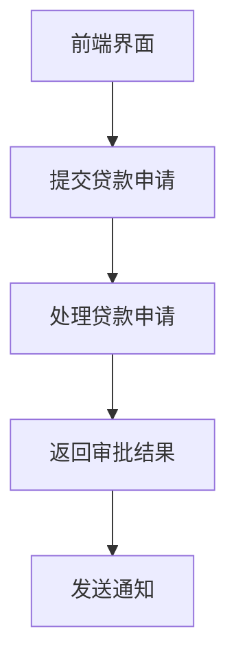
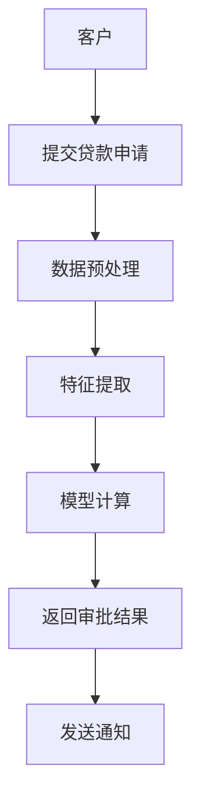

                 


# 智能个人贷款审批系统优化

## 关键词：
AI技术、金融风控、机器学习、系统优化、贷款审批、数据驱动、智能决策

## 摘要：
本文将深入探讨如何利用人工智能技术优化个人贷款审批系统。从传统贷款审批的痛点出发，分析AI技术在金融领域的应用趋势，提出基于数据驱动的智能审批解决方案。通过详细阐述算法原理、系统架构设计和项目实战，本文将展示如何利用机器学习模型提升贷款审批的效率和准确性，同时降低风险。最后，我们将总结优化的关键点，并展望未来的发展方向。

---

## 第一部分: 智能个人贷款审批系统优化背景与核心概念

### 第1章: 智能个人贷款审批系统优化背景

#### 1.1 问题背景
##### 1.1.1 传统个人贷款审批的痛点
传统的个人贷款审批流程依赖于人工审核和基于规则的决策系统。这种方式存在以下痛点：
- **效率低**：人工审核耗时长，难以满足大量申请的需求。
- **主观性强**：审核人员的经验和判断可能影响审批结果的公平性。
- **风险高**：基于规则的系统难以捕捉复杂的信用风险。

##### 1.1.2 AI技术在金融领域的应用趋势
随着AI技术的快速发展，金融行业正逐渐将AI技术应用于多个领域，包括：
- **信用评估**：利用机器学习模型分析客户的信用风险。
- **欺诈检测**：通过AI识别异常交易行为。
- **自动化审批**：AI驱动的自动化流程可以大幅缩短贷款审批时间。

##### 1.1.3 智能个人贷款审批系统的必要性
为了应对传统审批的痛点，智能个人贷款审批系统的引入变得尤为重要。通过AI技术，可以实现以下目标：
- **提高审批效率**：自动化处理贷款申请，减少人工干预。
- **降低风险**：通过数据驱动的模型更准确地评估客户的信用风险。
- **提升客户体验**：快速审批结果，提高客户满意度。

#### 1.2 问题描述
##### 1.2.1 贷款审批流程中的关键问题
贷款审批流程涉及多个环节，包括：
1. **客户信息收集**：通过申请表收集客户的个人信息、收入情况、资产状况等。
2. **信用评估**：基于客户的信用历史和行为数据评估其还款能力。
3. **风险控制**：通过模型预测客户违约的概率。

##### 1.2.2 数据质量与模型准确性问题
数据质量是AI模型性能的基础。以下是一些常见的数据问题：
- **数据缺失**：部分客户可能未提供完整的财务信息。
- **数据偏差**：数据可能偏向某一特定群体，导致模型预测不准确。
- **数据噪声**：数据中存在错误或异常值，影响模型的训练效果。

##### 1.2.3 系统性能与效率优化问题
系统的性能和效率直接影响用户体验。以下是需要优化的关键点：
- **响应时间**：确保系统在短时间内完成贷款申请的处理。
- **资源利用率**：优化系统架构，减少资源浪费。
- **模型计算效率**：通过算法优化提升模型的计算速度。

#### 1.3 问题解决思路
##### 1.3.1 利用AI技术优化贷款审批流程
AI技术可以通过以下方式优化贷款审批流程：
- **自动化处理**：利用自然语言处理技术自动提取申请表中的信息。
- **智能评估**：通过机器学习模型快速评估客户的信用风险。
- **实时监控**：利用实时数据流技术监控贷款审批过程中的异常情况。

##### 1.3.2 数据驱动的决策优化
数据驱动的决策优化是智能审批系统的核心。以下是其实现方式：
- **数据清洗与预处理**：确保数据的完整性和准确性。
- **特征工程**：通过提取有用的特征提升模型的性能。
- **模型调优**：通过交叉验证和超参数优化提升模型的准确性。

##### 1.3.3 系统架构优化与性能提升
系统的架构设计直接影响其性能和可扩展性。以下是优化思路：
- **模块化设计**：将系统划分为独立的功能模块，便于维护和扩展。
- **分布式架构**：利用分布式计算技术提升系统的处理能力。
- **缓存优化**：通过缓存技术减少重复计算，提升系统性能。

#### 1.4 系统边界与外延
##### 1.4.1 系统功能边界
智能个人贷款审批系统的功能边界包括：
- **前端界面**：供客户提交贷款申请和查询审批状态。
- **后端处理**：包括数据处理、模型计算和结果返回。
- **外部系统集成**：与征信机构、银行系统等外部系统对接。

##### 1.4.2 系统与外部系统的交互
系统的外部交互包括：
- **征信系统**：查询客户的信用报告。
- **银行系统**：获取客户的账户信息和交易记录。
- **第三方服务**：如支付网关和通知服务。

##### 1.4.3 系统的可扩展性与灵活性
系统的可扩展性与灵活性是其长期发展的关键。以下是其实现方式：
- **模块化设计**：通过模块化设计实现功能的灵活扩展。
- **接口标准化**：通过标准化接口方便与外部系统的集成。
- **动态配置**：通过动态配置实现系统的灵活调整。

#### 1.5 核心概念与结构
##### 1.5.1 系统核心要素组成
智能个人贷款审批系统的核心要素包括：
- **客户信息**：包括个人信息、财务状况、信用历史等。
- **贷款产品**：包括贷款类型、贷款金额、贷款期限等。
- **信用评估模型**：基于机器学习的信用评估模型。
- **审批规则**：包括审批策略、风险控制规则等。

##### 1.5.2 核心概念之间的关系
以下是核心概念之间的关系：

| 关系类型 | 主体 | 客体 | 描述 |
|----------|------|------|------|
| 包含关系 | 系统 | 功能模块 | 系统由多个功能模块组成。 |
| 关联关系 | 客户信息 | 模型输入 | 模型的输入数据来源于客户信息。 |
| 依赖关系 | 模型 | 计算资源 | 模型的运行依赖计算资源。 |
| 关联关系 | 审批结果 | 通知服务 | 审批结果通过通知服务反馈给客户。 |

##### 1.5.3 系统功能模块的逻辑结构
以下是系统功能模块的逻辑结构：



---

## 第二部分: 核心概念与联系

### 第2章: 智能个人贷款审批系统的核心概念

#### 2.1 AI模型在贷款审批中的应用
##### 2.1.1 传统模型与现代AI模型的对比

| 对比维度 | 传统模型 | 现代AI模型 |
|----------|-----------|------------|
| 基础 | 基于规则 | 基于数据驱动 |
| 精度 | 较低 | 较高 |
| 灵活性 | 较差 | 较好 |
| 需求数据 | 较少 | 较多 |

##### 2.1.2 基于规则的模型 vs 基于数据的模型
基于规则的模型依赖于人工定义的规则，而基于数据的模型通过机器学习算法自动学习规则。以下是两者的对比：

| 对比维度 | 基于规则的模型 | 基于数据的模型 |
|----------|----------------|----------------|
| 知识依赖 | 高 | 低 |
| 维护成本 | 高 | 低 |
| 精度 | 一般 | 较高 |

##### 2.1.3 混合模型的优势与挑战
混合模型结合了基于规则和基于数据的模型的优点。以下是其优势与挑战：
- **优势**：既能利用规则的可解释性，又能利用数据模型的高精度。
- **挑战**：需要平衡规则和数据模型的权重，实现复杂。

#### 2.2 数据特征与模型性能
##### 2.2.1 数据特征的分类与重要性
数据特征可以分为以下几类：
- **人口统计特征**：年龄、性别、职业等。
- **财务特征**：收入、资产、负债等。
- **行为特征**：借贷历史、还款记录等。

##### 2.2.2 数据清洗与特征工程
数据清洗和特征工程是提升模型性能的关键步骤。以下是其实现步骤：
1. **数据清洗**：处理缺失值、异常值和重复数据。
2. **特征提取**：从原始数据中提取有用的特征。
3. **特征选择**：通过统计方法或模型筛选重要特征。
4. **特征变换**：对特征进行标准化或归一化处理。

##### 2.2.3 特征对模型性能的影响
特征对模型性能的影响可以通过以下方式分析：
- **特征重要性分析**：通过特征重要性分析确定哪些特征对模型的预测结果影响最大。
- **特征交互分析**：分析特征之间的交互作用。

#### 2.3 模型选择与优化
##### 2.3.1 常见AI模型在贷款审批中的应用
以下是常见AI模型在贷款审批中的应用：

| 模型类型 | 应用场景 |
|----------|-----------|
| 逻辑回归 | 信用评分 |
| 支持向量机 | 客户分类 |
| 随机森林 | 风险评估 |
| 神经网络 | 复杂模式识别 |

##### 2.3.2 模型选择的策略与方法
模型选择的策略包括：
- **基于性能指标**：如准确率、召回率、F1分数等。
- **基于可解释性**：如逻辑回归模型比神经网络模型更容易解释。
- **基于计算资源**：计算资源有限时选择计算效率高的模型。

##### 2.3.3 模型优化的技巧与实践
模型优化的技巧包括：
- **参数调优**：通过网格搜索或随机搜索找到最佳超参数。
- **数据增强**：通过数据增强技术增加训练数据。
- **模型融合**：通过投票法或加权法融合多个模型的结果。

#### 2.4 系统架构与数据流
##### 2.4.1 系统架构的ER实体关系图
以下是系统架构的ER实体关系图：

```mermaid
erd
    customer
    loan_application
    credit_report
    approval_result
    notification_service
    bank_system
    model
    data_preprocessing
    feature_engineering
```

##### 2.4.2 数据流的可视化流程图
以下是数据流的可视化流程图：



##### 2.4.3 系统模块的交互关系
以下是系统模块的交互关系：



---

## 第三部分: 算法原理与数学模型

### 第3章: 智能个人贷款审批系统的算法原理

#### 3.1 模型

#### 3.2 算法流程图
以下是算法流程图：



#### 3.3 核心算法实现代码
以下是核心算法实现代码：

```python
import pandas as pd
from sklearn.model import LogisticRegression
from sklearn.metrics import accuracy_score

# 数据加载
data = pd.read_csv('loan_data.csv')

# 特征提取
X = data.drop('target', axis=1)
y = data['target']

# 模型训练
model = LogisticRegression()
model.fit(X, y)

# 模型评估
y_pred = model.predict(X)
print('准确率：', accuracy_score(y, y_pred))
```

#### 3.4 数学模型和公式
##### 3.4.1 逻辑回归模型
逻辑回归模型的数学公式为：

$$ P(y=1|x) = \frac{1}{1 + e^{-(\beta_0 + \beta_1x_1 + \beta_2x_2 + \dots + \beta_nx_n)}} $$

##### 3.4.2 随机森林模型
随机森林模型的数学公式为：

$$ y = \sum_{i=1}^{n} \text{树}_i(x) $$

##### 3.4.3 神经网络模型
神经网络模型的数学公式为：

$$ y = \sigma(\beta_0 + \beta_1x_1 + \beta_2x_2 + \dots + \beta_nx_n) $$

其中，$\sigma$ 表示sigmoid函数。

---

## 第四部分: 系统分析与架构设计

### 第4章: 智能个人贷款审批系统的系统分析与架构设计

#### 4.1 问题场景分析
贷款审批系统需要处理以下问题场景：
- **高并发处理**：同时处理大量贷款申请。
- **数据隐私保护**：确保客户数据的安全性。
- **实时反馈**：快速返回贷款审批结果。

#### 4.2 系统功能设计
##### 4.2.1 系统功能模块
以下是系统功能模块的领域模型类图：



#### 4.3 系统架构设计
##### 4.3.1 系统架构分层图
以下是系统架构分层图：



#### 4.4 接口设计
##### 4.4.1 系统接口
以下是系统接口的描述：

| 接口名称 | 接口描述 |
|----------|-----------|
| submit_loan_application | 提交贷款申请 |
| get_approval_status | 获取审批状态 |
| send_notification | 发送通知 |

##### 4.4.2 接口交互流程图
以下是接口交互流程图：



#### 4.5 系统交互流程图
以下是系统交互流程图：



---

## 第五部分: 项目实战

### 第5章: 智能个人贷款审批系统的项目实战

#### 5.1 环境安装
##### 5.1.1 安装Python
```bash
python --version
```

##### 5.1.2 安装依赖
```bash
pip install pandas scikit-learn
```

#### 5.2 核心代码实现
##### 5.2.1 数据预处理
```python
import pandas as pd
from sklearn.model import LogisticRegression
from sklearn.metrics import accuracy_score

# 数据加载
data = pd.read_csv('loan_data.csv')

# 特征提取
X = data.drop('target', axis=1)
y = data['target']

# 模型训练
model = LogisticRegression()
model.fit(X, y)

# 模型评估
y_pred = model.predict(X)
print('准确率：', accuracy_score(y, y_pred))
```

##### 5.2.2 模型应用
```python
# 单个样本预测
new_customer = pd.DataFrame({
    'age': [30],
    'income': [60000],
    'credit_score': [700]
})

y_new = model.predict(new_customer)
print('预测结果：', y_new)
```

#### 5.3 代码应用解读与分析
##### 5.3.1 数据预处理
数据预处理是模型训练的关键步骤。以下是数据预处理的解读：
- **数据清洗**：处理缺失值、异常值和重复数据。
- **特征工程**：提取有用的特征并进行标准化处理。
- **数据分割**：将数据划分为训练集和测试集。

##### 5.3.2 模型训练
模型训练是通过机器学习算法对数据进行训练，得到一个能够预测贷款审批结果的模型。以下是模型训练的解读：
- **选择算法**：根据数据特点选择合适的算法。
- **参数调优**：通过网格搜索找到最佳超参数。
- **模型评估**：通过准确率、召回率等指标评估模型性能。

#### 5.4 实际案例分析
##### 5.4.1 案例背景
以下是一个实际案例的背景：
- **客户信息**：30岁，收入60000元，信用评分700分。
- **贷款金额**：30万元，贷款期限5年。

##### 5.4.2 数据分析
- **信用评分**：700分属于较高信用评分。
- **收入水平**：60000元属于中高收入水平。
- **年龄**：30岁属于中青年，具有较强的还款能力。

##### 5.4.3 模型预测
根据模型预测，该客户的贷款申请结果为通过。

#### 5.5 项目总结
##### 5.5.1 成功之处
- **提高了审批效率**：通过自动化处理大幅缩短审批时间。
- **提升了审批准确性**：通过机器学习模型提高了审批结果的准确性。
- **降低了风险**：通过数据驱动的模型降低了信用风险。

##### 5.5.2 不足之处
- **模型的可解释性**：部分模型的可解释性较差，难以向客户解释审批结果。
- **数据隐私问题**：客户数据的安全性需要进一步加强。

---

## 第六部分: 最佳实践

### 第6章: 智能个人贷款审批系统的最佳实践

#### 6.1 小结
智能个人贷款审批系统的优化是一个复杂的系统工程，需要从数据、算法、系统架构等多个方面进行综合考虑。以下是优化的关键点：
- **数据质量**：确保数据的完整性和准确性。
- **模型选择**：选择适合数据特点的模型。
- **系统架构**：设计高效的系统架构。
- **安全性**：确保客户数据的安全性。

#### 6.2 注意事项
- **数据隐私保护**：在处理客户数据时，需要遵守相关法律法规，确保数据的安全性。
- **模型的可解释性**：在实际应用中，模型的可解释性非常重要，尤其是在金融领域。
- **系统稳定性**：确保系统的稳定性，避免因为系统故障导致审批结果错误。

#### 6.3 拓展阅读
- **《机器学习实战》**：深入理解机器学习算法的实现和应用。
- **《深度学习》**：学习深度学习技术在金融领域的应用。
- **《系统设计精解》**：掌握系统设计的技巧和方法。

---

## 作者：AI天才研究院/AI Genius Institute & 禅与计算机程序设计艺术/Zen And The Art of Computer Programming

