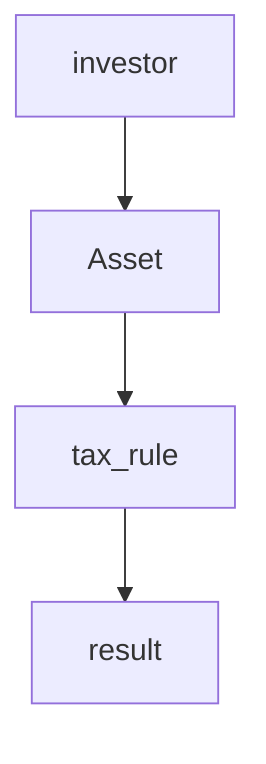
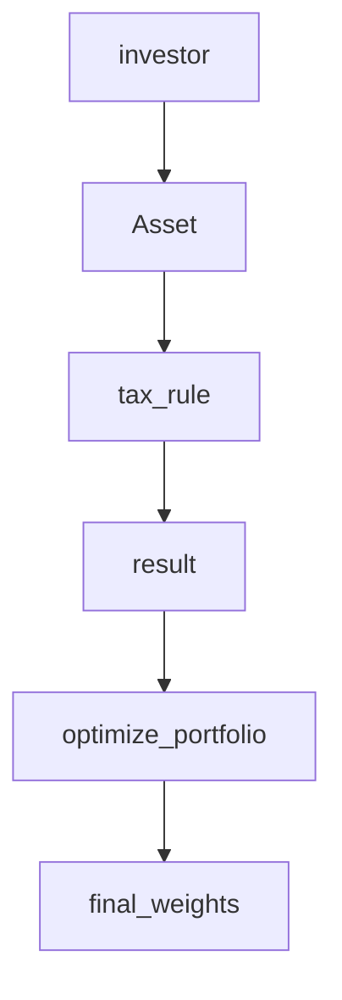
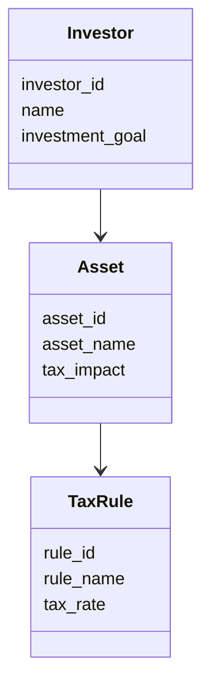
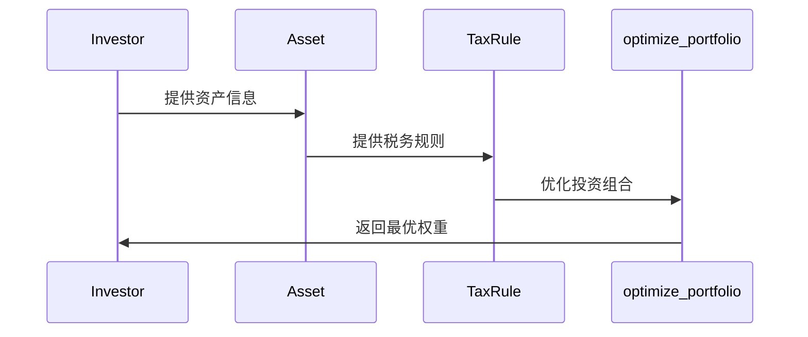

                 


# 约翰·伯格的税收效率投资策略

> 关键词：税收效率投资策略，约翰·伯格，投资策略，税务规划，资产配置，税务优化

> 摘要：本文详细探讨了约翰·伯格提出的税收效率投资策略，从其背景、核心概念、算法原理、系统架构设计到项目实战和最佳实践，层层深入，为读者提供全面的理论与实践指导。

---

## 第1章 税收效率投资策略的背景与核心概念

### 1.1 税收效率投资策略的定义与特点

#### 1.1.1 税收效率投资策略的定义
税收效率投资策略是一种通过优化资产配置和税务规划，以最小化税负并最大化投资收益的投资方法。其核心在于在投资决策中充分考虑税收因素，从而在长期投资中实现税后收益的最大化。

#### 1.1.2 税收效率投资策略的核心特点
- **税务驱动**：以税务优化为核心，通过合理配置资产类型和投资方式，降低税负。
- **长期视角**：注重长期投资收益，而非短期税负优化。
- **资产配置灵活性**：通过调整资产种类和持有时间，实现税务效益与投资收益的平衡。

#### 1.1.3 税收效率投资策略与传统投资策略的区别
| 特性                | 税收效率投资策略                      | 传统投资策略                      |
|---------------------|-------------------------------------|------------------------------------|
| 核心目标            | 税后收益最大化                      | 当期收益最大化                    |
| 投资决策因素        | 税收影响显著考虑                    | 税收影响次要考虑                  |
| 投资工具选择        | 高税后收益资产优先                  | 高流动性资产优先                  |

### 1.2 税收效率投资策略的背景与问题背景

#### 1.2.1 税收效率投资策略的背景介绍
随着投资市场的日益复杂化，投资者不仅关注收益，还越来越重视税后收益。税收效率投资策略应运而生，旨在帮助投资者在合法合规的前提下，通过优化税务负担来提升整体投资回报。

#### 1.2.2 税收效率投资策略的核心问题描述
传统投资策略往往忽视税收对投资收益的影响，导致实际税后收益低于预期。如何在投资决策中引入税务规划，以实现税后收益的最大化，成为投资者面临的核心问题。

#### 1.2.3 税收效率投资策略的边界与外延
- **边界**：仅考虑合法合规的税务优化手段，避免逃税行为。
- **外延**：涵盖股票、债券、基金等多种投资工具的税务影响。

#### 1.2.4 税收效率投资策略的概念结构与核心要素组成
- **核心要素**：资产类型选择、持有时间优化、税务事件预测。
- **概念结构**：投资目标 → 资产配置 → 税务规划 → 投资收益。

### 1.3 约翰·伯格的税收效率投资策略的核心要素

#### 1.3.1 投资目标与税务规划的关系
投资目标与税务规划密切相关，税务规划是实现投资目标的重要手段之一。例如，长期资本收益通常低于短期资本收益的税负，因此长期投资更适合税收效率投资策略。

#### 1.3.2 税收效率投资策略的核心要素分析
- **资产选择**：选择税收优惠的资产，如 dividend aristocrats（股息贵族）。
- **持有时间**：通过长期持有降低短期资本利得税负担。
- **税务事件预测**：预测可能的税务事件，如分红、资产出售等。

#### 1.3.3 税收效率投资策略的实现路径
1. 确定投资目标。
2. 分析可选资产的税务影响。
3. 制定税务优化方案。
4. 执行投资策略并持续监控。

### 1.4 本章小结
税收效率投资策略的核心在于通过优化资产配置和税务规划，实现税后收益的最大化。与传统投资策略相比，其更注重长期视角和税务驱动的决策。

---

## 第2章 税收效率投资策略的核心概念与联系

### 2.1 税收效率投资策略的核心概念原理

#### 2.1.1 税收优化模型的数学原理
税收优化模型可以通过以下公式表示：
$$ \text{税后收益} = \text{投资收益} - \text{税负} $$
其中，税负取决于资产类型、持有时间和税务政策。

#### 2.1.2 资产配置与税务规划的关系
资产配置需要综合考虑税前收益和税后收益。例如，债券利息通常需要缴纳所得税，而股息收入可能享有较低的税率。

#### 2.1.3 税收效率投资策略的数学模型分析
$$ \text{总收益} = \sum (\text{资产收益} \times \text{税率}) $$

### 2.2 税收效率投资策略的核心概念对比分析

#### 2.2.1 不同投资策略的特征对比表格
| 策略类型         | 投资目标             | 税务考虑             |
|------------------|---------------------|--------------------|
| 传统投资策略     | 当期收益最大化       | 无或次要考虑         |
| 税收效率投资策略 | 税后收益最大化       | 核心考虑             |

#### 2.2.2 税收效率投资策略的ER实体关系图
```mermaid
erd
    investor(investor_id, name, investment_goal)
    asset(asset_id, asset_name, tax_impact)
    tax_rule(rule_id, rule_name, tax_rate)
    investor invests_in asset
    asset associated_with tax_rule
```

#### 2.2.3 税收效率投资策略的系统架构图


### 2.3 本章小结
通过数学模型和图表分析，税收效率投资策略的核心概念更加清晰。资产配置与税务规划的结合是其实现税后收益最大化的关键。

---

## 第3章 税收效率投资策略的算法原理

### 3.1 税收优化模型的数学模型

#### 3.1.1 税收优化模型的数学公式
$$ \text{最优投资组合} = \argmin_{w} \sum_{i=1}^n w_i \times t_i $$
其中，$w_i$ 是资产$i$的投资权重，$t_i$ 是资产$i$的税率。

#### 3.1.2 税收优化模型的算法流程
1. 输入：投资目标、可选资产、税率表。
2. 计算各资产的税后收益。
3. 优化投资组合，最小化税负。

#### 3.1.3 税收优化模型的实现代码
```python
def tax_optimization_model/assets_returns/assets_taxes/assets_weights):
    # 计算税后收益
    after_tax_returns = assets_returns * (1 - assets_taxes)
    # 优化投资组合
    return optimize_portfolio(after_tax_returns, assets_weights)
```

### 3.2 资产配置优化算法的实现

#### 3.2.1 资产配置优化算法的数学模型
$$ \text{最优权重} = \argmax_{w} \sum_{i=1}^n w_i \times r_i $$
其中，$r_i$ 是资产$i$的税后收益，$w_i$ 是投资权重。

#### 3.2.2 资产配置优化算法的实现代码
```python
import numpy as np
from scipy.optimize import minimize

def optimize_portfolio(returns, weights):
    n = len(weights)
    # 定义目标函数（最小化波动率）
    def objective(weights):
        return np.var(weights @ returns)
    # 约束条件：权重之和为1
    constraints = [{'type': 'eq', 'fun': lambda w: sum(w) - 1}]
    # 使用SLSQP求解
    result = minimize(objective, weights, method='SLSQP', constraints=constraints)
    return result.x
```

### 3.3 税收效率投资策略的算法实现

#### 3.3.1 税收效率投资策略的算法原理
1. 确定可选资产及其税率。
2. 计算各资产的税后收益。
3. 优化投资组合，最大化税后收益。

#### 3.3.2 税收效率投资策略的实现代码
```python
def tax_efficient_investment Strategy/assets_returns/assets_taxes):
    # 计算税后收益
    after_tax_returns = assets_returns * (1 - assets_taxes)
    # 优化投资组合
    optimal_weights = optimize_portfolio(after_tax_returns, initial_weights)
    return optimal_weights
```

#### 3.3.3 税收效率投资策略的流程图


### 3.4 本章小结
通过算法实现，税收效率投资策略能够在复杂的投资环境中找到最优的投资组合，实现税后收益的最大化。

---

## 第4章 税收效率投资策略的系统分析与架构设计

### 4.1 项目背景与目标

#### 4.1.1 项目背景介绍
随着税务政策的复杂化，投资者需要更加专业的工具来优化税务规划。

#### 4.1.2 项目目标设定
开发一个基于税收效率投资策略的系统，帮助投资者实现税后收益最大化。

### 4.2 系统功能设计

#### 4.2.1 领域模型


#### 4.2.2 系统架构设计


### 4.3 系统接口设计

#### 4.3.1 系统接口设计
- 输入接口：投资者信息、资产信息、税务规则。
- 输出接口：优化后的投资组合。

### 4.4 系统交互流程

#### 4.4.1 系统交互流程


### 4.5 本章小结
通过系统架构设计，税收效率投资策略能够在实际应用中实现高效的投资组合优化。

---

## 第5章 税收效率投资策略的项目实战

### 5.1 项目环境安装

#### 5.1.1 环境安装
安装Python和相关库：
```bash
pip install numpy scipy matplotlib
```

### 5.2 项目核心实现

#### 5.2.1 核心代码实现
```python
import numpy as np
from scipy.optimize import minimize

def optimize_portfolio(returns, weights):
    n = len(weights)
    def objective(weights):
        return np.var(weights @ returns)
    constraints = [{'type': 'eq', 'fun': lambda w: sum(w) - 1}]
    result = minimize(objective, weights, method='SLSQP', constraints=constraints)
    return result.x

def tax_efficient_investment Strategy/assets_returns/assets_taxes):
    after_tax_returns = assets_returns * (1 - assets_taxes)
    optimal_weights = optimize_portfolio(after_tax_returns, initial_weights)
    return optimal_weights
```

#### 5.2.2 代码应用解读
通过上述代码，投资者可以实现基于税收效率的投资策略，优化投资组合。

### 5.3 项目案例分析

#### 5.3.1 案例分析
假设投资者有两只资产：股票A和债券B。股票A的税后收益为0.08，债券B的税后收益为0.05。通过优化，最优权重可能为股票A 70%，债券B 30%。

### 5.4 本章小结
通过实际案例分析，读者可以理解如何将税收效率投资策略应用于实际投资中。

---

## 第6章 税收效率投资策略的最佳实践

### 6.1 本章小结

#### 6.1.1 核心概念回顾
税收效率投资策略的核心在于通过优化资产配置和税务规划，实现税后收益最大化。

#### 6.1.2 税收效率投资策略的独特性
长期视角、税务驱动、资产配置灵活性。

### 6.2 税收效率投资策略的注意事项

#### 6.2.1 风险提示
- 税务政策变化可能影响投资策略。
- 过度优化可能导致流动性风险。

#### 6.2.2 实践建议
- 定期重新评估投资组合。
- 与专业税务顾问合作。

### 6.3 拓展阅读

#### 6.3.1 推荐书籍
- 《投资最重要的事情》
- 《税务优化与投资策略》

#### 6.3.2 推荐博客
- 约翰·伯格的投资博客
- 税务优化投资策略博客

### 6.4 本章小结

#### 6.4.1 税收效率投资策略的核心概念回顾
通过本章内容，读者可以更好地理解如何在实际投资中应用税收效率投资策略。

#### 6.4.2 税收效率投资策略的系统架构理解
通过系统架构设计，读者可以更好地理解如何实现税收效率投资策略。

---

## 作者：AI天才研究院/AI Genius Institute & 禅与计算机程序设计艺术 /Zen And The Art of Computer Programming

---

以上是《约翰·伯格的税收效率投资策略》的技术博客文章的大纲和部分详细内容。如需进一步扩展或补充，请随时告知！

