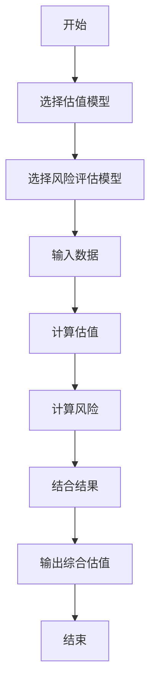
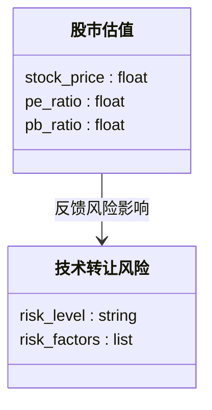
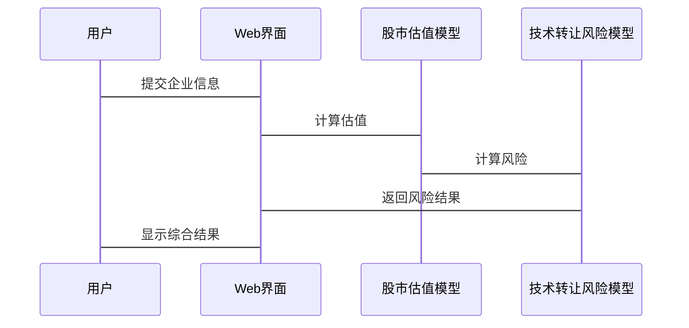

                 


# 股市估值在跨境技术转让风险评估中的应用

> 关键词：股市估值、跨境技术转让、风险评估、算法原理、系统架构

> 摘要：本文探讨了股市估值在跨境技术转让风险评估中的应用，通过分析股市估值的核心概念、算法原理、系统架构及实际案例，提出了结合股市估值与技术转让风险评估的创新方法。文章从背景介绍、核心概念对比、算法实现、系统设计、项目实战等多个维度展开，详细阐述了如何利用股市估值模型评估技术转让风险，为相关领域的研究和实践提供了理论支持和方法论指导。

---

# 第一部分: 引言

# 第1章: 背景介绍

## 1.1 问题背景

### 1.1.1 股市估值的基本概念

股市估值是通过对企业的财务状况、市场表现和行业前景等多方面因素的分析，对其股票的内在价值进行评估的过程。常见的估值方法包括市盈率（P/E）、市净率（P/B）、现金流折现模型（DCF）等。这些方法可以帮助投资者判断股票的合理价格区间。

### 1.1.2 跨境技术转让的定义与特点

跨境技术转让是指跨国企业或机构之间，通过协议将技术、专利、知识产权等无形资产进行转移的行为。其特点是涉及跨国法律、文化差异和市场风险，通常需要复杂的谈判和风险管理。

### 1.1.3 股市估值在跨境技术转让中的重要性

在跨境技术转让过程中，股市估值可以帮助评估目标企业的价值，预测技术转让对股价的影响，并量化相关风险。通过股市估值，投资者和企业可以更科学地决策，降低风险敞口。

---

## 1.2 问题描述

### 1.2.1 股市估值与技术转让风险的关系

股市估值的变化往往反映技术转让的风险。例如，技术转让失败可能导致股价下跌，而成功的技术转让可能提升股价。

### 1.2.2 跨境技术转让中的主要风险因素

跨境技术转让的主要风险包括市场风险（如汇率波动）、法律风险（如知识产权纠纷）和技术风险（如技术过时）。

### 1.2.3 股市估值在风险评估中的作用

股市估值通过量化企业的市场价值，为技术转让风险的评估提供数据支持。例如，通过分析技术转让前后的市盈率变化，可以评估风险对股价的影响。

---

## 1.3 问题解决

### 1.3.1 股市估值模型在风险评估中的应用

利用市盈率、市净率等模型，结合技术转让的潜在影响，评估风险对股价的冲击。

### 1.3.2 跨境技术转让风险的量化方法

通过构建风险指标体系，量化技术、法律和市场风险，并结合股市估值模型进行综合评估。

### 1.3.3 股市估值与技术转让风险的结合机制

通过建立反馈机制，将技术转让风险的影响纳入股市估值模型，实现风险的动态评估和管理。

---

## 1.4 边界与外延

### 1.4.1 股市估值的适用范围

股市估值适用于上市公司，尤其是跨国企业。对于非上市公司，需要通过其他估值方法结合使用。

### 1.4.2 技术转让风险的边界条件

技术转让风险的边界包括企业的财务状况、行业竞争环境和政策法规等因素。

### 1.4.3 股市估值与技术转让风险的外延领域

股市估值和风险评估的结合可以延伸至并购、资产重组等领域，为企业提供更全面的决策支持。

---

## 1.5 概念结构与核心要素组成

### 1.5.1 股市估值的核心要素

- 财务指标（收入、利润、现金流）
- 市场指标（市盈率、市净率）
- 宏观经济指标（GDP、利率）

### 1.5.2 技术转让风险的核心要素

- 技术本身（专利、技术寿命）
- 法律因素（知识产权保护、合规性）
- 市场因素（市场需求、竞争环境）

### 1.5.3 两者的结合与相互作用

- 技术转让对股价的影响
- 股价波动反映技术转让风险
- 风险评估对股市估值的反馈作用

---

# 第二部分: 核心概念与联系

# 第2章: 核心概念原理

## 2.1 股市估值的原理

### 2.1.1 市盈率（P/E）模型

市盈率 = 股价 / 每股净利润

$$ P/E = \frac{\text{股价}}{\text{每股净利润}} $$

### 2.1.2 市净率（P/B）模型

市净率 = 股价 / 每股净资产

$$ P/B = \frac{\text{股价}}{\text{每股净资产}} $$

### 2.1.3 现金流折现模型（DCF）

DCF通过将未来现金流折现，计算企业的内在价值。公式如下：

$$ V = \sum_{t=1}^{n} \frac{\text{现金流}_t}{(1 + r)^t} $$

其中，$r$ 为折现率，$n$ 为期限。

## 2.2 技术转让风险的原理

### 2.2.1 市场风险

市场风险包括汇率波动、市场需求变化等，可以通过波动率和贝塔系数衡量。

$$ \beta = \frac{\text{协方差(资产收益, 市场收益)}}{\text{方差(市场收益)}} $$

### 2.2.2 法律风险

法律风险包括知识产权纠纷、合规性问题等，通常通过法律尽职调查评估。

### 2.2.3 技术风险

技术风险包括技术过时、研发失败等，可以通过技术生命周期和专利分析评估。

## 2.3 股市估值与技术转让风险的联系

### 2.3.1 技术转让对股价的影响

技术转让可能提升企业的竞争力，从而提高股价。例如，成功的技术转让可能导致市盈率上升。

### 2.3.2 股价波动反映技术转让风险

股价的波动可以反映技术转让的风险。例如，技术转让失败可能导致股价下跌。

### 2.3.3 风险评估对股市估值的反馈作用

通过风险评估，可以调整估值模型的参数，如折现率，以反映技术转让风险的影响。

---

# 第三部分: 核心概念属性特征对比

## 3.1 股市估值与技术转让风险的对比分析

| 属性         | 股市估值                       | 技术转让风险                 |
|--------------|-------------------------------|-----------------------------|
| 主体         | 投资者、机构                   | 企业、机构                   |
| 目标         | 评估企业价值                   | 评估风险大小                 |
| 方法         | 财务指标分析、市场指标分析     | 风险因子分析、法律分析       |
| 时间性       | 短期波动与长期趋势             | 短期风险与长期影响           |
| 可量化性     | 高                           | 中                           |
| 可控性       | 低                           | 中高                          |

---

## 3.2 股市估值与技术转让风险的ER实体关系图

```mermaid
erDiagram
    customer[投资者] {
        id : integer
        name : string
    }
    stock_valuation[股市估值] {
        id : integer
        stock_price : float
        pe_ratio : float
    }
    tech_transfer_risk[技术转让风险] {
        id : integer
        risk_level : string
        risk_factors : string
    }
    customer --> stock_valuation : 进行估值
    customer --> tech_transfer_risk : 评估风险
    stock_valuation --> tech_transfer_risk : 反馈风险影响
```

---

# 第四部分: 算法原理讲解

# 第3章: 股市估值与技术转让风险评估的算法原理

## 3.1 算法原理概述

### 3.1.1 股市估值模型的选择

根据企业特点选择合适的估值模型，如市盈率模型适用于高增长企业，市净率模型适用于重资产企业。

### 3.1.2 技术转让风险评估模型的选择

根据风险类型选择模型，如回归分析适用于市场风险，聚类分析适用于技术风险。

### 3.1.3 两者的结合方法

通过构建综合模型，将股市估值和风险评估结果结合起来，如：

$$ \text{综合估值} = \text{基础估值} \times (1 - \text{风险系数}) $$

---

## 3.2 算法流程图



---

## 3.3 算法实现

### 3.3.1 股市估值模型实现

以下是市盈率模型的Python代码：

```python
def calculate_pe_ratio(stock_price, eps):
    return stock_price / eps
```

### 3.3.2 技术转让风险评估模型实现

以下是风险系数计算的Python代码：

```python
def calculate_risk_coefficient(risk_factors):
    # 假设风险因素包括市场风险、法律风险和技术风险
    market_risk = risk_factors['market_risk']
    legal_risk = risk_factors['legal_risk']
    tech_risk = risk_factors['tech_risk']
    return (market_risk + legal_risk + tech_risk) / 3
```

### 3.3.3 综合估值模型实现

以下是综合估值模型的Python代码：

```python
def calculate综合估值(基础估值, 风险系数):
    return 基础估值 * (1 - 风险系数)
```

---

## 3.4 算法数学模型

### 3.4.1 股市估值模型

市盈率模型：

$$ \text{PE} = \frac{\text{股价}}{\text{每股收益}} $$

现金流折现模型：

$$ V = \sum_{t=1}^{n} \frac{\text{现金流}_t}{(1 + r)^t} $$

### 3.4.2 技术转让风险模型

风险系数模型：

$$ \text{风险系数} = \frac{\text{市场风险} + \text{法律风险} + \text{技术风险}}{3} $$

---

# 第五部分: 系统分析与架构设计

# 第4章: 系统架构与设计

## 4.1 系统功能设计

### 4.1.1 领域模型设计

以下是领域模型的类图：



### 4.1.2 系统架构设计

以下是系统架构图：

```mermaid
containerDiagram
    container Web端 {
        Web界面
        Web服务器
    }
    container 云端服务 {
        股市估值模型
        技术转让风险模型
    }
    Web界面 --> 股市估值模型
    Web界面 --> 技术转让风险模型
    股市估值模型 --> 技术转让风险模型
```

### 4.1.3 系统交互设计

以下是系统交互序列图：



---

## 4.2 系统接口设计

### 4.2.1 API接口设计

以下是API接口示例：

```python
from flask import Flask
import requests

app = Flask(__name__)

@app.route('/calculate_pe', methods=['POST'])
def calculate_pe():
    data = request.json
    stock_price = data['stock_price']
    eps = data['eps']
    pe = stock_price / eps
    return {'pe_ratio': pe}

@app.route('/calculate_risk', methods=['POST'])
def calculate_risk():
    data = request.json
    risk_factors = data['risk_factors']
    risk_coefficient = sum(risk_factors.values()) / 3
    return {'risk_coefficient': risk_coefficient}
```

---

# 第六部分: 项目实战

# 第5章: 项目实战与分析

## 5.1 项目背景

假设某跨国企业计划收购一家科技公司，需评估技术转让的风险和对股价的影响。

## 5.2 项目需求

- 评估技术转让对股价的影响。
- 量化市场、法律和技术风险。
- 提供风险调整后的综合估值。

## 5.3 项目实施

### 5.3.1 环境安装

安装Python、Flask框架、数据处理库（Pandas、NumPy）。

### 5.3.2 核心代码实现

以下是核心代码：

```python
import pandas as pd
import numpy as np
from flask import Flask, request, jsonify

app = Flask(__name__)

@app.route('/calculate_risk_assessment', methods=['POST'])
def calculate_risk_assessment():
    data = request.json
    stock_price = data['stock_price']
    eps = data['eps']
    risk_factors = data['risk_factors']
    
    # 计算市盈率
    pe_ratio = stock_price / eps
    
    # 计算风险系数
    risk_coefficient = sum(risk_factors.values()) / 3
    
    # 计算综合估值
    base_valuation = stock_price * pe_ratio
    adjusted_valuation = base_valuation * (1 - risk_coefficient)
    
    return jsonify({
        'pe_ratio': pe_ratio,
        'risk_coefficient': risk_coefficient,
        'adjusted_valuation': adjusted_valuation
    })

if __name__ == '__main__':
    app.run(debug=True)
```

### 5.3.3 代码解读

- `/calculate_risk_assessment`接口接收股票价格、每股收益和风险因素。
- 计算市盈率和风险系数。
- 返回调整后的综合估值。

## 5.4 实际案例分析

假设某科技公司股价为100美元，每股收益为5美元，风险因素包括市场风险0.3、法律风险0.2、技术风险0.5。

- 市盈率：100 / 5 = 20
- 风险系数：(0.3 + 0.2 + 0.5) / 3 = 0.4
- 调整后的估值：100 * 20 * (1 - 0.4) = 1200美元

---

## 5.5 项目小结

通过该项目，我们成功将股市估值与技术转让风险评估结合，为企业提供了科学的决策支持。

---

# 第七部分: 结论与拓展

# 第6章: 结论与展望

## 6.1 研究小结

本文通过分析股市估值与技术转让风险的关系，提出了结合两者的方法，为企业提供了新的决策工具。

## 6.2 注意事项

- 数据的准确性和完整性至关重要。
- 风险模型的选择需根据实际情况调整。
- 模型需定期更新以反映市场变化。

## 6.3 拓展阅读

- 《企业并购中的风险评估》
- 《跨国公司与知识产权管理》
- 《金融工程与风险管理》

---

# 作者

作者：AI天才研究院/AI Genius Institute & 禅与计算机程序设计艺术/Zen And The Art of Computer Programming

---

以上是《股市估值在跨境技术转让风险评估中的应用》的技术博客文章的完整目录结构和内容概要。

