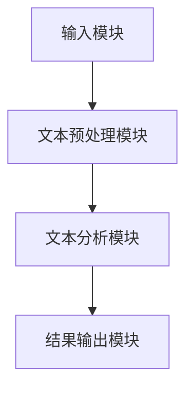
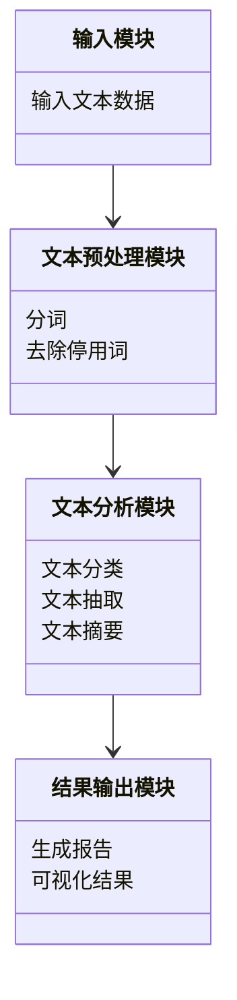

                 


# 自然语言处理在监管合规自动化中的应用

## 关键词：自然语言处理, 监管合规, 自动化, 文本分析, 机器学习, 合规系统

## 摘要：自然语言处理（NLP）技术在监管合规自动化中的应用日益广泛。随着企业对合规性要求的不断提高，传统的手动合规检查方式逐渐被自动化解决方案所取代。本文将深入探讨自然语言处理的核心概念、算法原理及其在监管合规中的具体应用，结合实际案例分析，展示如何利用NLP技术提高合规效率，降低成本，并确保合规性。

---

## 第一部分：自然语言处理与监管合规自动化概述

## 第1章：自然语言处理与监管合规的背景介绍

### 1.1 自然语言处理的基本概念

#### 1.1.1 自然语言处理的定义
自然语言处理（NLP）是人工智能（AI）的一个分支，旨在使计算机能够理解和生成人类语言。NLP的核心目标是让计算机能够像人类一样理解、解析和生成自然语言文本。

#### 1.1.2 自然语言处理的核心技术
- **词法分析**：将文本分割成单词或短语，并分析其基本结构。
- **句法分析**：研究句子的语法结构，识别主语、谓语等成分。
- **语义分析**：理解文本的语义含义，提取关键信息。
- **文本生成**：根据输入生成符合语法和语义的文本。

#### 1.1.3 自然语言处理的应用领域
- **信息提取**：从文本中提取关键信息（如日期、地点、人物）。
- **文本分类**：将文本归类到特定类别（如 spam 或 ham）。
- **机器翻译**：将一种语言翻译成另一种语言。
- **对话系统**：实现人与计算机之间的自然语言对话。

### 1.2 监管合规的基本概念

#### 1.2.1 监管合规的定义
监管合规是指企业或组织在经营过程中，按照相关法律法规和行业标准，确保其行为符合监管机构的要求。合规性是企业合法运营的基础，也是避免罚款和声誉损失的关键。

#### 1.2.2 监管合规的主要领域
- **金融行业**：遵守反洗钱（AML）、证券交易法规等。
- **医疗行业**：确保患者数据隐私和医疗记录的合规性。
- **企业合规**：遵循公司治理、反腐败法规等。

#### 1.2.3 监管合规的挑战与痛点
- **数据量大**：企业每天需要处理大量文本数据，如合同、报告、客户反馈等。
- **人工成本高**：传统合规检查依赖人工审查，效率低且成本高。
- **合规标准复杂**：法律法规不断更新，合规标准日益严格。

### 1.3 自然语言处理在监管合规中的应用前景

#### 1.3.1 自然语言处理在监管合规中的优势
- **提高效率**：自动化处理大量文本数据，减少人工干预。
- **降低成本**：通过自动化合规检查，降低人力成本。
- **实时监控**：实时分析文本数据，及时发现合规风险。

#### 1.3.2 自然语言处理在监管合规中的应用场景
- **合同审查**：自动识别合同中的关键条款和潜在风险。
- **合规报告生成**：从大量文档中提取信息，自动生成合规报告。
- **风险预警**：通过分析文本数据，提前发现潜在的合规风险。

#### 1.3.3 自然语言处理在监管合规中的未来发展趋势
- **智能化**：结合机器学习和深度学习技术，提升NLP模型的准确性。
- **多语言支持**：支持多种语言的合规检查，满足全球化需求。
- **实时处理**：实现对实时文本数据的快速分析和处理。

### 1.4 本章小结
本章介绍了自然语言处理的基本概念和监管合规的核心概念，分析了NLP在监管合规中的优势和应用场景，并展望了未来的发展趋势。

---

## 第2章：自然语言处理的核心概念与原理

### 2.1 自然语言处理的核心技术

#### 2.1.1 词法分析
词法分析是NLP的基础步骤，将文本分割成有意义的词语或短语。例如，将“Hello world”分割成“Hello”和“world”。

#### 2.1.2 句法分析
句法分析研究句子的语法结构，识别主语、谓语等成分。例如，将“John eats an apple”分析为：主语“John”，谓语“eats”，宾语“an apple”。

#### 2.1.3 语义分析
语义分析旨在理解文本的语义含义。例如，从“John eats an apple”中提取信息：主体是John，动作是吃，客体是苹果。

### 2.2 监管合规中的文本处理需求

#### 2.2.1 文本抽取
从文本中提取特定信息，例如从合同中提取签订日期、金额等。

#### 2.2.2 文本分类
将文本归类到特定类别，例如将客户反馈分为满意、一般、不满意。

#### 2.2.3 文本摘要
从长文本中提取关键信息，生成简短的摘要。例如，从一份合规报告中提取主要违规点。

### 2.3 自然语言处理与监管合规的结合点

#### 2.3.1 文本抽取在监管合规中的应用
- 从监管文件中提取合规要求。
- 从合同中提取关键条款。

#### 2.3.2 文本分类在监管合规中的应用
- 分类监管报告的类型。
- 分类客户投诉的合规风险等级。

#### 2.3.3 文本摘要在监管合规中的应用
- 摘要合规报告的主要内容。
- 摘要监管文件的关键条款。

### 2.4 本章小结
本章详细介绍了自然语言处理的核心技术，并分析了这些技术在监管合规中的具体应用。

---

## 第3章：自然语言处理的核心算法与数学模型

### 3.1 词袋模型（Bag-of-Words）

#### 3.1.1 词袋模型的定义
词袋模型是一种简单的文本表示方法，将文本表示为单词的集合，不考虑单词的顺序。

#### 3.1.2 词袋模型的数学公式
文本表示为一个向量，向量的维度是词汇表的大小，每个维度表示一个单词的出现次数。

$$ \text{向量维度} = \text{词汇表大小} $$

#### 3.1.3 词袋模型的优缺点
- **优点**：简单易实现。
- **缺点**：不考虑单词顺序，忽略语法和语义信息。

### 3.2 TF-IDF算法

#### 3.2.1 TF-IDF算法的定义
TF-IDF（Term Frequency-Inverse Document Frequency）是一种常用的文本表示方法，用于衡量一个单词在文档中的重要性。

#### 3.2.2 TF-IDF算法的数学公式
$$ \text{TF}(t, d) = \frac{\text{单词 } t \text{ 在文档 } d \text{ 中出现的次数}}{\text{文档 } d \text{ 的总单词数}} $$

$$ \text{IDF}(t) = \log\left(\frac{\text{总文档数}}{\text{包含单词 } t \text{ 的文档数}}\right) $$

$$ \text{TF-IDF}(t, d) = \text{TF}(t, d) \times \text{IDF}(t) $$

#### 3.2.3 TF-IDF算法的优缺点
- **优点**：能够有效区分重要单词和不重要单词。
- **缺点**：无法捕捉单词之间的语义关系。

### 3.3 Word2Vec算法

#### 3.3.1 Word2Vec算法的定义
Word2Vec是一种基于神经网络的文本表示方法，通过词向量来捕捉单词的语义信息。

#### 3.3.2 Word2Vec算法的数学模型
Word2Vec使用一个单层神经网络，将输入单词映射到一个低维向量空间。

$$ \text{输入单词} \rightarrow \text{词向量} $$

#### 3.3.3 Word2Vec算法的优缺点
- **优点**：能够捕捉单词的语义信息。
- **缺点**：需要大量训练数据，计算资源消耗大。

### 3.4 BERT模型

#### 3.4.1 BERT模型的定义
BERT（Bidirectional Encoder Representations from Transformers）是一种基于Transformer的预训练语言模型，能够捕捉文本的上下文信息。

#### 3.4.2 BERT模型的数学公式
BERT使用多层Transformer结构，通过自注意力机制捕捉文本的上下文关系。

$$ \text{输入文本} \rightarrow \text{词向量} \rightarrow \text{上下文向量} $$

#### 3.4.3 BERT模型的优缺点
- **优点**：能够捕捉复杂的语义信息，效果优于传统方法。
- **缺点**：需要大量计算资源，模型较大。

### 3.5 本章小结
本章介绍了自然语言处理中常用的几种算法，包括词袋模型、TF-IDF、Word2Vec和BERT模型，并分析了它们的优缺点。

---

## 第4章：监管合规中的自然语言处理系统架构设计

### 4.1 系统架构概述

#### 4.1.1 系统架构的定义
系统架构是指系统的整体结构和组成部分，包括功能模块、数据流和交互方式。

#### 4.1.2 系统架构的设计原则
- **模块化**：将系统划分为独立的模块，便于维护和扩展。
- **可扩展性**：设计时考虑未来的扩展需求。
- **高可用性**：确保系统在部分模块故障时仍能正常运行。

#### 4.1.3 系统架构的组成部分
- **输入模块**：接收文本数据。
- **处理模块**：对文本进行分析和处理。
- **输出模块**：生成结果并输出。

### 4.2 监管合规自然语言处理系统的功能设计

#### 4.2.1 文本预处理模块
文本预处理包括分词、去除停用词、去除标点符号等步骤。

#### 4.2.2 文本分析模块
文本分析模块包括文本分类、文本抽取、文本摘要等功能。

#### 4.2.3 结果输出模块
结果输出模块将分析结果以可视化或报告形式输出。

### 4.3 系统架构的实现

#### 4.3.1 系统架构设计图


#### 4.3.2 系统功能模块设计图


### 4.4 本章小结
本章设计了一个监管合规自然语言处理系统的架构，包括输入模块、文本预处理模块、文本分析模块和结果输出模块，并用Mermaid图展示了系统的组成部分和功能模块之间的关系。

---

## 第5章：项目实战——搭建一个监管合规文档分析系统

### 5.1 项目介绍

#### 5.1.1 项目目标
搭建一个能够自动分析监管合规文档的系统，提取关键信息并生成合规报告。

#### 5.1.2 项目需求
- **输入**：监管合规文档（如合同、报告）。
- **输出**：合规报告，包括关键条款、潜在风险等。

### 5.2 环境配置

#### 5.2.1 安装Python
安装Python 3.x版本。

#### 5.2.2 安装依赖库
安装自然语言处理相关的库，如 `jieba`（中文分词）、`spacy`（英语分词）、`transformers`（BERT模型）。

### 5.3 核心代码实现

#### 5.3.1 文本预处理
```python
import jieba

def text_preprocessing(text):
    words = jieba.lcut(text)
    return words
```

#### 5.3.2 文本分类
```python
from transformers import BertTokenizer, BertModel
import torch

def text_classification(text):
    tokenizer = BertTokenizer.from_pretrained('bert-base-chinese')
    model = BertModel.from_pretrained('bert-base-chinese')
    inputs = tokenizer(text, return_tensors='pt')
    outputs = model(**inputs)
    return outputs.last_hidden_state[:, 0, :]
```

#### 5.3.3 文本摘要
```python
from transformers import T5Tokenizer, T5ForConditionalGeneration

def text_summarization(text):
    tokenizer = T5Tokenizer.from_pretrained('t5-base')
    model = T5ForConditionalGeneration.from_pretrained('t5-base')
    inputs = tokenizer.encode(text, return_tensors='pt', max_length=512)
    outputs = model.generate(inputs, max_length=150, min_length=50, num_beams=5)
    summary = tokenizer.decode(outputs[0])
    return summary
```

### 5.4 案例分析与详细解读
以一份监管合同为例，展示系统如何处理文本数据并生成合规报告。

#### 5.4.1 输入文本
```plaintext
合同编号：2023001
甲方：XXX公司
乙方：YYY公司
签订日期：2023年1月1日
金额：100万元
```

#### 5.4.2 文本预处理
```plaintext
['合同编号：2023001', '甲方：XXX公司', '乙方：YYY公司', '签订日期：2023年1月1日', '金额：100万元']
```

#### 5.4.3 文本分类
分类结果：合同类型为“普通合同”。

#### 5.4.4 文本摘要
摘要结果：合同编号：2023001，签订日期：2023年1月1日，金额：100万元。

#### 5.4.5 合规报告
合规报告：
- 合同编号：2023001
- 签订日期：2023年1月1日
- 金额：100万元
- 合同类型：普通合同

### 5.5 本章小结
本章通过一个实际案例展示了如何搭建一个监管合规文档分析系统，包括文本预处理、文本分类和文本摘要的实现，并生成了合规报告。

---

## 第6章：总结与展望

### 6.1 总结
本文详细介绍了自然语言处理在监管合规自动化中的应用，包括NLP的核心概念、算法原理和系统架构设计，并通过一个实际案例展示了系统的实现过程。

### 6.2 展望
随着NLP技术的不断发展，监管合规自动化将更加智能化和高效化。未来，结合深度学习和大数据技术，监管合规系统将能够更好地应对复杂的合规挑战。

### 6.3 最佳实践 tips
- **选择合适的NLP模型**：根据具体需求选择适合的NLP模型，如BERT适合复杂的语义分析。
- **数据预处理**：确保文本数据的清洁和标准化，提高模型的准确性。
- **系统架构设计**：合理设计系统架构，确保系统的可扩展性和高可用性。

### 6.4 本章小结
本章总结了全文的主要内容，并展望了NLP在监管合规自动化中的未来发展方向。

---

## 作者：AI天才研究院/AI Genius Institute & 禅与计算机程序设计艺术 /Zen And The Art of Computer Programming

