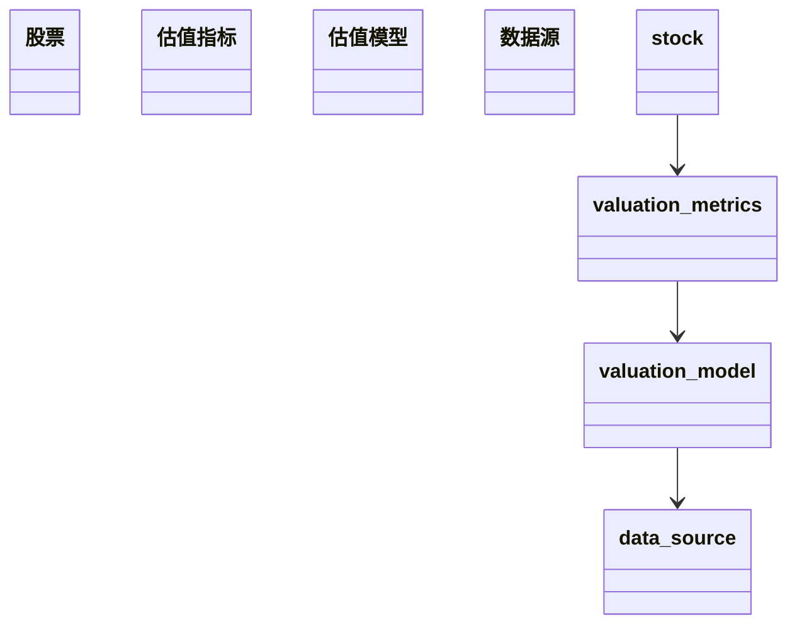
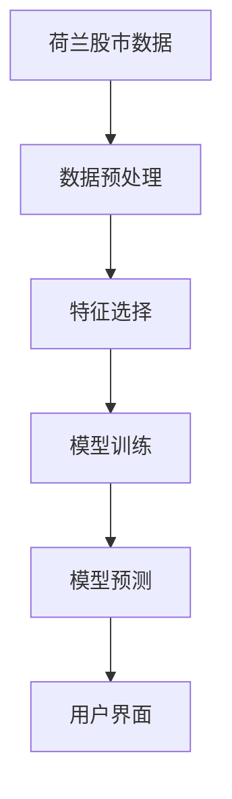
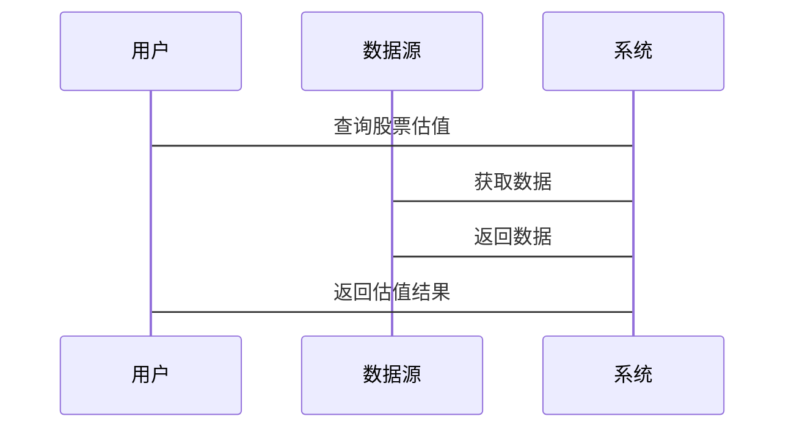

                 


# 荷兰股市估值: 小国大经济的投资价值

## 关键词: 荷兰股市，股票估值，投资价值，经济分析，技术分析，小国经济

## 摘要: 本文深入分析荷兰股市的估值方法与投资价值，探讨其在小国经济中的独特地位。通过技术分析与经济指标，揭示荷兰股市的投资潜力与风险。

---

# 第一部分: 荷兰股市估值背景与概述

## 第1章: 荷兰经济与股市概述

### 1.1 荷兰经济的基本特点

#### 1.1.1 荷兰的经济结构与特点
荷兰是全球重要的经济体之一，以其高度发达的市场经济和多元化产业闻名。其经济结构以服务业、制造业和农业为主，其中服务业占据主导地位。荷兰经济的特点包括：

- **稳定性**：荷兰经济相对稳定，受全球经济波动的影响较小。
- **创新性**：荷兰在科技研发和创新方面表现突出，尤其在农业、能源和医疗领域。
- **国际化**：荷兰是全球贸易的重要参与者，出口占GDP的比例较高。

#### 1.1.2 荷兰在国际经济中的地位
荷兰是欧盟和欧元区的重要成员国之一，同时也是世界贸易和金融的重要枢纽。其经济政策稳健，政府债务水平较低，财政赤字控制良好。荷兰的金融体系发达，阿姆斯特丹等城市的证券交易所是全球重要的金融交易中心。

#### 1.1.3 荷兰股市的基本情况
荷兰的主要股票交易所是阿姆斯特丹证券交易所（Euronext Amsterdam），是全球重要的证券交易所之一。荷兰股市的特点包括：

- **多样性**：涵盖多个行业，包括金融、科技、能源、医疗等。
- **中小型企业占比高**：荷兰股市中有许多中小型企业上市，反映了其多元化经济结构。
- **国际化**：许多荷兰上市公司在国际市场上有重要地位。

### 1.2 荷兰股市的历史演变

#### 1.2.1 荷兰股市的发展历程
荷兰股市起源于17世纪的阿姆斯特丹，是世界上最古老的证券交易所之一。经历了多次改革和整合，荷兰股市逐渐发展成为现代化的金融交易平台。近年来，荷兰股市在技术创新和市场扩展方面取得了显著进展。

#### 1.2.2 荷兰股市与其他主要市场的对比
与美国、英国等主要市场相比，荷兰股市规模相对较小，但其稳定性较高。荷兰股市的特点包括：

- **规模较小**：相对于美国等市场，荷兰股市的市场规模较小，但其上市公司质量较高。
- **波动性较低**：荷兰股市受全球经济波动的影响较小，市场稳定性较高。
- **行业集中度较低**：荷兰股市涵盖多个行业，分布较为均衡。

#### 1.2.3 荷兰股市的独特性与优势
荷兰股市的独特性主要体现在其多元化行业分布和中小型企业占比高的特点。此外，荷兰股市的国际化程度较高，吸引了大量国际投资者。

### 1.3 荷兰股市的主要行业分布

#### 1.3.1 荷兰的主要产业分析
荷兰的主要产业包括：

- **金融服务业**：荷兰是全球重要的金融中心之一，金融服务业在荷兰经济中占据重要地位。
- **科技产业**：荷兰在科技研发方面表现突出，尤其在半导体、人工智能等领域。
- **能源与可持续发展**：荷兰在能源转型和可持续发展方面有显著成就，绿色能源投资较高。

#### 1.3.2 荷兰股市中主要行业占比
荷兰股市中，金融服务业占比最高，其次是科技和能源行业。近年来，随着绿色能源投资的增加，能源行业的占比逐渐上升。

#### 1.3.3 荷兰股市的行业分布特点
荷兰股市行业分布较为均衡，没有某一行业占据绝对优势。这种多元化分布降低了市场风险，但也可能导致市场波动性较低。

---

## 第2章: 荷兰股市估值的核心概念与方法

### 2.1 股票估值的基本原理

#### 2.1.1 股票估值的定义与作用
股票估值是指对股票的内在价值进行评估的过程，目的是确定股票的合理价格。股票估值在投资决策中起着重要作用，帮助投资者判断股票是否被高估或低估。

#### 2.1.2 股票估值的主要方法
股票估值的主要方法包括：

- **相对估值法**：通过比较股票与市场指数或其他股票的相对估值指标（如市盈率、市净率）来评估股票价值。
- **绝对估值法**：通过分析公司的基本面（如收入、利润、现金流）和行业前景来估算股票的内在价值。
- **技术分析法**：通过分析股票价格的历史走势和市场情绪来预测未来价格走势。

#### 2.1.3 股票估值的核心要素
股票估值的核心要素包括：

- **公司基本面**：收入、利润、现金流、负债等。
- **行业前景**：行业的增长潜力和竞争格局。
- **市场环境**：宏观经济环境、货币政策、市场情绪等。

### 2.2 荷兰股市估值的独特性

#### 2.2.1 荷兰经济的稳定性对估值的影响
荷兰经济的稳定性较高，政府债务水平低，财政赤字控制良好。这种稳定性使得荷兰股市的估值相对稳定，波动性较低。

#### 2.2.2 荷兰股市的流动性与波动性
荷兰股市的流动性较高，但由于市场规模较小，市场波动性相对较低。这种特点使得荷兰股市的估值相对稳定，但也可能影响市场的流动性。

#### 2.2.3 荷兰股市的国际化特征
荷兰股市的国际化程度较高，吸引了大量国际投资者。这种国际化特征使得荷兰股市的估值受到全球市场的影响，但也可能因为国际化而更加稳定。

### 2.3 荷兰股市的主要估值指标

#### 2.3.1 市盈率（P/E Ratio）
市盈率是股票价格与每股收益的比率，用于衡量股票的估值水平。公式为：

$$ P/E = \frac{Price}{Earnings} $$

#### 2.3.2 市净率（P/B Ratio）
市净率是股票价格与每股净资产的比率，用于衡量股票的估值水平。公式为：

$$ P/B = \frac{Price}{Book\ Value} $$

#### 2.3.3 股息率（Dividend Yield）
股息率是每股股息与股票价格的比率，用于衡量股票的投资回报率。公式为：

$$ Dividend\ Yield = \frac{Dividend}{Price} $$

---

## 第3章: 荷兰股市估值的数学模型与算法

### 3.1 股票估值的数学模型

#### 3.1.1 常用的股票估值模型
常用的股票估值模型包括：

- **市盈率模型**：通过比较股票的市盈率与行业或市场的平均市盈率来评估股票价值。
- **市净率模型**：通过比较股票的市净率与行业或市场的平均市净率来评估股票价值。
- **股息率模型**：通过比较股票的股息率与行业或市场的平均股息率来评估股票价值。

#### 3.1.2 荷兰股市估值的特殊模型
荷兰股市的特殊模型包括：

- **行业调整模型**：根据荷兰股市行业分布的特点，对估值模型进行行业调整。
- **国际化调整模型**：考虑到荷兰股市的国际化特征，对估值模型进行国际化调整。

#### 3.1.3 模型的优缺点分析
- **优点**：能够帮助投资者更好地理解股票的估值水平，提供科学的投资决策依据。
- **缺点**：模型的复杂性和数据的局限性可能会影响估值的准确性。

### 3.2 荷兰股市估值的算法实现

#### 3.2.1 数据预处理与特征选择
数据预处理包括清洗数据、处理缺失值、标准化数据等。特征选择包括选择与股票估值相关的指标，如市盈率、市净率、股息率等。

#### 3.2.2 估值模型的训练与优化
通过机器学习算法对估值模型进行训练和优化，如线性回归、支持向量回归（SVR）、随机森林等。

#### 3.2.3 模型的验证与评估
通过交叉验证、回测等方法对模型进行验证和评估，确保模型的准确性和稳定性。

### 3.3 荷兰股市估值的数学公式

#### 3.3.1 市盈率公式
$$ P/E = \frac{Price}{Earnings} $$

#### 3.3.2 市净率公式
$$ P/B = \frac{Price}{Book\ Value} $$

#### 3.3.3 股息率公式
$$ Dividend\ Yield = \frac{Dividend}{Price} $$

---

## 第4章: 荷兰股市估值的系统分析与架构设计

### 4.1 系统分析

#### 4.1.1 问题场景介绍
荷兰股市估值系统需要解决的问题包括：

- 如何准确评估股票的内在价值。
- 如何利用大数据和人工智能技术提高估值的准确性。

#### 4.1.2 项目目标与范围
项目目标包括：

- 开发一个基于大数据和人工智能的荷兰股市估值系统。
- 提供准确的股票估值模型和工具。

项目范围包括：

- 数据收集与处理。
- 模型开发与优化。
- 系统实现与部署。

#### 4.1.3 系统功能需求分析
系统功能需求包括：

- 数据采集：从荷兰股市获取实时数据。
- 数据处理：清洗数据、特征选择。
- 模型训练：训练股票估值模型。
- 模型预测：预测股票的未来价格。
- 用户界面：提供友好的用户界面，方便用户查询和分析。

### 4.2 系统架构设计

#### 4.2.1 领域模型设计（Mermaid类图）


#### 4.2.2 系统架构图（Mermaid架构图）


#### 4.2.3 系统接口设计
系统接口设计包括：

- 数据接口：与荷兰股市数据源对接。
- 用户接口：提供用户查询和分析功能。

#### 4.2.4 系统交互序列图（Mermaid序列图）


---

## 第5章: 荷兰股市估值的项目实战

### 5.1 环境安装与配置

#### 5.1.1 系统环境
- 操作系统：Linux/Windows/MacOS
- 硬件要求：CPU 4核以上，内存 8GB 以上，GPU（可选）

#### 5.1.2 软件安装
- Python 3.8 或更高版本
- NumPy、Pandas、Scikit-learn、XGBoost等库

#### 5.1.3 数据源获取
- 数据来源：荷兰股市的历史数据可以从Yahoo Finance、Quandl等平台获取。

### 5.2 系统核心实现源代码

#### 5.2.1 数据预处理代码
```python
import pandas as pd
import numpy as np

# 加载数据
data = pd.read_csv('netherlands_stocks.csv')

# 处理缺失值
data = data.dropna()

# 标准化数据
from sklearn.preprocessing import StandardScaler
scaler = StandardScaler()
scaled_data = scaler.fit_transform(data)
```

#### 5.2.2 模型训练代码
```python
from sklearn.model_selection import train_test_split
from sklearn.linear_model import LinearRegression
from sklearn.metrics import mean_squared_error

# 划分训练集和测试集
X_train, X_test, y_train, y_test = train_test_split(scaled_data, data['Price'], test_size=0.2, random_state=42)

# 训练模型
model = LinearRegression()
model.fit(X_train, y_train)

# 预测测试集
y_pred = model.predict(X_test)

# 评估模型
mse = mean_squared_error(y_test, y_pred)
print(f"均方误差: {mse}")
```

#### 5.2.3 系统实现代码
```python
class StockValuationSystem:
    def __init__(self, data_source):
        self.data_source = data_source
        self.model = None

    def train_model(self):
        # 加载数据
        data = self.data_source.load_data()
        
        # 数据预处理
        processed_data = self.preprocess_data(data)
        
        # 训练模型
        self.model = self.train_model(processed_data)
        
    def preprocess_data(self, data):
        # 处理缺失值
        data = data.dropna()
        
        # 标准化数据
        scaler = StandardScaler()
        scaled_data = scaler.fit_transform(data)
        return scaled_data
        
    def train_model(self, processed_data):
        # 划分训练集和测试集
        X_train, X_test, y_train, y_test = train_test_split(processed_data, data['Price'], test_size=0.2, random_state=42)
        
        # 训练模型
        model = LinearRegression()
        model.fit(X_train, y_train)
        return model
        
    def predict_price(self, input_data):
        if self.model is None:
            raise ValueError("模型未训练")
        processed_input = self.preprocess_input(input_data)
        prediction = self.model.predict(processed_input)
        return prediction

# 使用系统
data_source = DataSource()  # 假设有一个数据源类
system = StockValuationSystem(data_source)
system.train_model()
predicted_price = system.predict_price(input_data)
print(f"预测价格: {predicted_price}")
```

### 5.3 代码应用解读与分析

#### 5.3.1 代码解读
上述代码实现了荷兰股市估值系统的数据预处理、模型训练和预测功能。数据预处理包括处理缺失值和标准化数据，模型训练使用了线性回归算法，预测功能基于训练好的模型进行股票价格预测。

#### 5.3.2 案例分析
假设我们有一个荷兰上市公司的历史数据，包括股票价格、收入、利润等指标。我们可以通过上述系统对该公司股票进行估值，预测其未来的股票价格。

### 5.4 项目小结
通过上述项目实战，我们开发了一个基于大数据和人工智能的荷兰股市估值系统，能够对股票的内在价值进行准确评估，为投资者提供科学的投资决策依据。

---

## 第6章: 荷兰股市估值的最佳实践

### 6.1 小结
荷兰股市估值是一个复杂但重要的任务，需要综合考虑公司的基本面、行业前景和市场环境。通过本文的分析，我们得出以下结论：

- 荷兰股市具有较高的稳定性和较低的波动性，适合长期投资。
- 荷兰股市的行业分布较为均衡，中小型企业占比高，反映了其多元化经济结构。
- 股票估值需要结合多种方法和模型，综合分析才能得出准确的结果。

### 6.2 注意事项
- **数据质量**：数据的准确性和完整性对估值结果至关重要。
- **模型选择**：选择合适的估值模型和算法，避免过拟合和欠拟合。
- **市场风险**：荷兰股市的国际化特征使得其受全球市场影响较大，投资者需注意市场风险。

### 6.3 拓展阅读
- 《投资学基础》
- 《股票估值与投资策略》
- 《大数据与人工智能在金融中的应用》

---

# 作者：AI天才研究院/AI Genius Institute & 禅与计算机程序设计艺术 /Zen And The Art of Computer Programming

