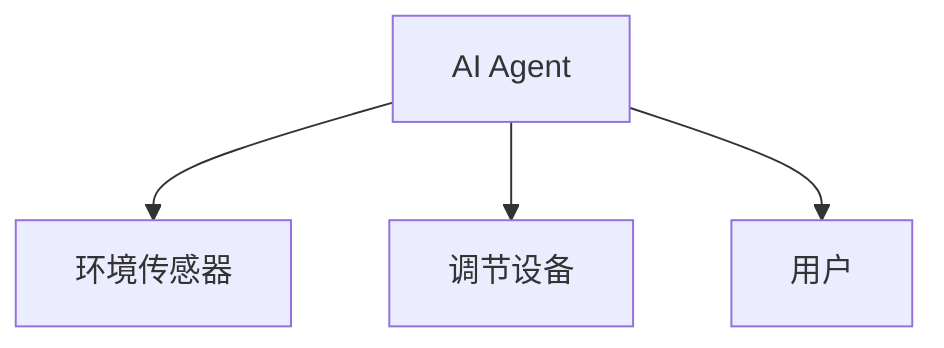
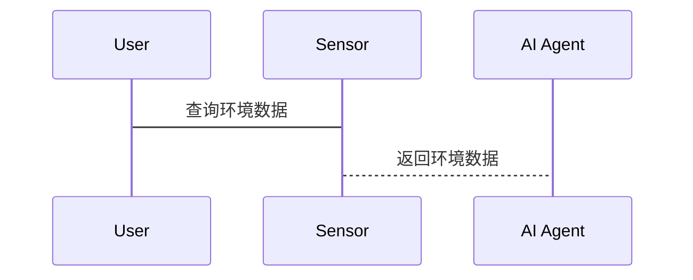
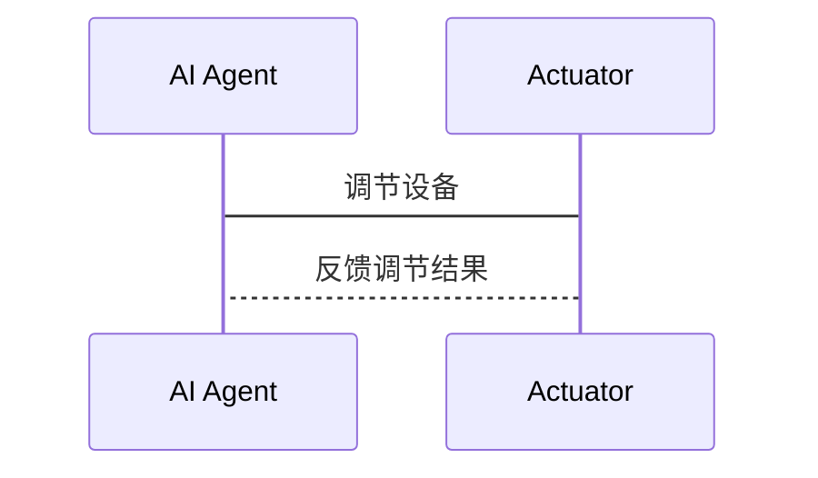
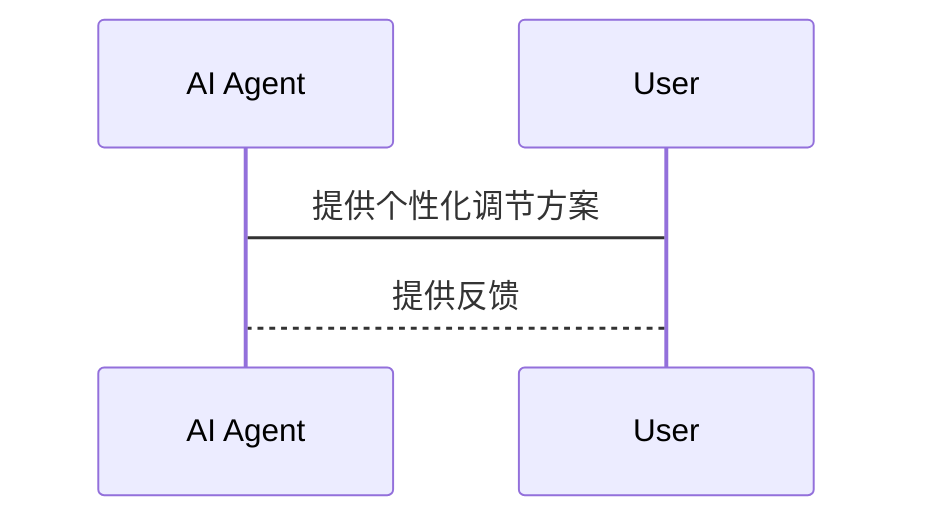

                 


# AI Agent在智能床头柜中的睡眠环境调节

> 关键词：AI Agent, 智能床头柜, 睡眠环境调节, 智能家居, 物联网, 环境感知, 智能调节

> 摘要：本文探讨了AI Agent在智能床头柜中的应用，重点分析了其如何通过环境感知和用户需求优化睡眠环境。文章从背景介绍、核心概念、算法原理到系统架构设计，再到项目实战，全面解析了AI Agent在睡眠环境调节中的技术实现与应用价值。

---

## 第1章: AI Agent与智能床头柜概述

### 1.1 AI Agent的基本概念
AI Agent（人工智能代理）是指能够感知环境并采取行动以实现目标的智能实体。它具备自主性、反应性、社会性等核心特征，广泛应用于智能家居、自动驾驶等领域。

#### 1.1.1 什么是AI Agent
AI Agent是一种能够感知环境、做出决策并执行动作的智能系统。它可以独立完成任务，无需人类干预。

#### 1.1.2 AI Agent的核心特征
- **自主性**：AI Agent能够自主决策，无需外部指令。
- **反应性**：能够实时感知环境变化并做出反应。
- **目标导向**：以实现特定目标为导向。
- **学习能力**：能够通过数据优化自身的决策能力。

#### 1.1.3 AI Agent在智能家居中的应用
在智能家居中，AI Agent通常用于环境控制、设备管理等领域。例如，智能音箱、智能空调等设备都可能集成AI Agent技术。

### 1.2 智能床头柜的功能与特点
智能床头柜是一种结合了智能家居技术的床头柜，具备环境感知、智能调节等功能，旨在为用户提供更舒适的睡眠环境。

#### 1.2.1 智能床头柜的基本功能
- **环境感知**：通过传感器检测温度、湿度、光线、噪声等环境参数。
- **智能调节**：根据感知数据自动调节灯光、空调、加湿器等设备。
- **用户交互**：通过语音或触控等方式与用户互动，满足个性化需求。

#### 1.2.2 智能床头柜的智能化升级
智能化升级使床头柜从单纯的家具变为具有感知和决策能力的智能设备，能够主动适应用户的需求。

#### 1.2.3 睡眠环境调节的重要性
睡眠环境的好坏直接影响用户的睡眠质量，进而影响身体健康和生活质量。通过智能调节，床头柜可以为用户提供更舒适的睡眠环境。

### 1.3 AI Agent在睡眠环境调节中的作用
AI Agent通过感知环境和用户需求，优化床头柜的调节功能，提升睡眠环境的舒适度。

#### 1.3.1 AI Agent如何优化睡眠环境
- **实时感知**：AI Agent通过传感器实时监测环境参数。
- **智能决策**：根据感知数据和用户需求，优化环境调节方案。
- **个性化服务**：为不同用户提供个性化的睡眠环境调节方案。

#### 1.3.2 AI Agent与床头柜的结合方式
AI Agent通常以软件形式嵌入床头柜系统中，通过物联网技术与智能家居设备连接，实现协同工作。

#### 1.3.3 睡眠环境调节的多维度分析
睡眠环境调节需要考虑温度、湿度、光线、噪声等多个维度，AI Agent能够综合这些因素，制定最优调节方案。

---

## 第2章: 睡眠健康与环境调节

### 2.1 睡眠健康的重要性
良好的睡眠对身体健康和心理状态至关重要。睡眠不足可能导致注意力不集中、记忆力减退等问题。

#### 2.1.1 睡眠对身体的影响
- **免疫系统**：睡眠有助于增强免疫系统功能。
- **代谢调节**：睡眠影响身体代谢，与肥胖、糖尿病等疾病相关。
- **修复功能**：睡眠期间，身体进行细胞修复和再生。

#### 2.1.2 睡眠对心理的影响
良好的睡眠有助于维持心理健康，缓解压力，预防抑郁症等心理疾病。

#### 2.1.3 睡眠与生活质量的关系
睡眠质量直接影响日常生活质量，睡眠不足可能导致工作效率下降、人际关系紧张等问题。

### 2.2 睡眠环境的影响因素
睡眠环境中的温度、噪声、光线等因素都会影响睡眠质量。

#### 2.2.1 环境温度对睡眠的影响
- **适宜温度**：一般在16-24摄氏度之间。
- **温度波动**：温度波动可能导致睡眠中断。

#### 2.2.2 噪声对睡眠的影响
- **噪音水平**：低于30分贝的环境有助于睡眠。
- **噪音类型**：低频噪音对睡眠的影响更大。

#### 2.2.3 光线对睡眠的影响
- **光照强度**：强光会抑制褪黑激素分泌，影响睡眠。
- **光照时间**：睡前使用电子设备会影响睡眠质量。

#### 2.2.4 床具对睡眠的影响
- **床垫硬度**：过硬或过软的床垫会影响睡眠质量。
- **枕头高度**：枕头过高或过低可能导致颈部不适。

### 2.3 睡眠环境调节的技术需求
为了实现智能床头柜的睡眠环境调节，需要具备环境感知技术和智能调节设备。

#### 2.3.1 环境感知技术的需求
- **传感器类型**：温度传感器、湿度传感器、光线传感器、噪声传感器。
- **数据采集**：实时采集环境数据，确保数据准确性。

#### 2.3.2 智能调节设备的需求
- **调节设备**：空调、加湿器、灯光调节器等。
- **设备控制**：通过AI Agent实现设备的智能控制。

#### 2.3.3 用户个性化需求
- **个性化设置**：不同用户对睡眠环境的需求不同，需要提供个性化调节方案。
- **用户反馈**：根据用户的反馈不断优化调节策略。

---

## 第3章: AI Agent的核心概念与原理

### 3.1 AI Agent的核心概念
AI Agent通过感知环境、分析数据、做出决策并执行动作，以实现目标。

#### 3.1.1 AI Agent的感知能力
AI Agent能够通过传感器或其他数据源感知环境信息。

#### 3.1.2 AI Agent的决策能力
基于感知数据和预设规则，AI Agent能够做出决策。

#### 3.1.3 AI Agent的执行能力
AI Agent能够通过执行器或其他设备实现决策结果。

### 3.2 AI Agent的核心原理
AI Agent的核心原理包括数据采集、数据分析、决策制定和执行动作四个步骤。

#### 3.2.1 数据采集
AI Agent通过传感器采集环境数据，例如温度、湿度、光线、噪声等。

#### 3.2.2 数据分析
对采集到的数据进行分析，识别出有用的信息，例如异常值、趋势等。

#### 3.2.3 决策制定
根据分析结果和预设规则，AI Agent制定出最优的调节方案。

#### 3.2.4 执行动作
AI Agent通过执行器或API调用其他设备，执行调节动作。

### 3.3 AI Agent与其他技术的对比
AI Agent与传统自动化的区别在于其具备感知和决策能力，能够适应复杂环境。

#### 3.3.1 与传统自动化的对比
- **传统自动化**：基于预设规则执行固定动作。
- **AI Agent**：具备感知和决策能力，能够动态调整动作。

#### 3.3.2 与规则引擎的对比
- **规则引擎**：基于预设规则进行条件判断。
- **AI Agent**：具备学习和优化能力，能够动态调整规则。

### 3.4 实体关系ER图
通过ER图展示AI Agent、环境传感器、调节设备等实体之间的关系。

```mermaid
er
  left outer join
  left_table : AI Agent
  right_table : 环境传感器
  join_columns : 设备ID
```

---

## 第4章: 算法原理与数学模型

### 4.1 算法原理
AI Agent的核心算法包括数据处理、决策制定和优化调整。

#### 4.1.1 数据处理
对传感器采集到的数据进行预处理，例如去噪、归一化等。

#### 4.1.2 决策制定
基于处理后的数据，AI Agent通过算法制定调节方案。

#### 4.1.3 优化调整
根据用户反馈和环境变化，不断优化调节策略。

### 4.2 算法实现
实现AI Agent的算法包括数据采集、特征提取、模型训练和预测等步骤。

#### 4.2.1 数据采集与预处理
```python
import pandas as pd

# 读取数据
data = pd.read_csv('environment_data.csv')

# 数据预处理
data_clean = data.dropna()
```

#### 4.2.2 特征提取
```python
from sklearn.preprocessing import StandardScaler

# 标准化处理
scaler = StandardScaler()
data_scaled = scaler.fit_transform(data_clean)
```

#### 4.2.3 模型训练
```python
from sklearn.linear_model import LinearRegression

# 训练模型
model = LinearRegression()
model.fit(data_scaled, target)
```

### 4.3 数学模型
AI Agent的决策模型可以基于回归分析或机器学习算法。

#### 4.3.1 回归模型
$$ y = \beta_0 + \beta_1x_1 + \beta_2x_2 + \dots + \beta_nx_n $$

其中，$y$ 是目标变量，$x_i$ 是输入变量，$\beta_i$ 是系数。

#### 4.3.2 机器学习模型
$$ y = f(x) $$

其中，$f$ 是机器学习模型的预测函数。

---

## 第5章: 系统架构设计

### 5.1 系统架构
智能床头柜系统架构包括感知层、决策层和执行层。

#### 5.1.1 感知层
通过传感器采集环境数据，例如温度、湿度、光线、噪声等。

#### 5.1.2 决策层
AI Agent通过算法分析数据，制定调节方案。

#### 5.1.3 执行层
通过执行器或API调用其他设备，执行调节动作。

### 5.2 系统架构图


### 5.3 接口设计
系统接口设计包括传感器接口、执行器接口和用户接口。

#### 5.3.1 传感器接口
```python
class Sensor:
    def read_data(self):
        pass
```

#### 5.3.2 执行器接口
```python
class Actuator:
    def set_mode(self, mode):
        pass
```

#### 5.3.3 用户接口
```python
class UserInterface:
    def get_feedback(self):
        pass
```

### 5.4 交互流程
系统交互流程包括数据采集、决策制定和执行动作三个阶段。

#### 5.4.1 数据采集


#### 5.4.2 决策制定


#### 5.4.3 执行动作


---

## 第6章: 项目实战与实现

### 6.1 环境安装
#### 6.1.1 安装Python
```bash
# 安装Python
sudo apt-get install python3
```

#### 6.1.2 安装依赖库
```bash
pip install numpy pandas scikit-learn
```

#### 6.1.3 安装开发工具
安装PyCharm或Jupyter Notebook作为开发工具。

### 6.2 核心代码实现
#### 6.2.1 数据采集
```python
import pandas as pd
import numpy as np

# 读取数据
data = pd.read_csv('environment_data.csv')

# 数据预处理
data_clean = data.dropna()
```

#### 6.2.2 特征提取
```python
from sklearn.preprocessing import StandardScaler

# 标准化处理
scaler = StandardScaler()
data_scaled = scaler.fit_transform(data_clean)
```

#### 6.2.3 模型训练
```python
from sklearn.linear_model import LinearRegression

# 训练模型
model = LinearRegression()
model.fit(data_scaled, target)
```

### 6.3 案例分析
通过实际案例分析，验证AI Agent在智能床头柜中的应用效果。

#### 6.3.1 案例背景
某用户的睡眠质量较差，希望通过智能床头柜改善睡眠环境。

#### 6.3.2 调节方案
AI Agent根据环境数据和用户反馈，制定个性化的调节方案，例如调整室温至22摄氏度，降低室内噪声等。

#### 6.3.3 实验结果
实验结果显示，用户的睡眠质量显著提升，证明AI Agent的有效性。

### 6.4 项目小结
通过项目实战，验证了AI Agent在智能床头柜中的应用价值，同时积累了一定的开发经验。

---

## 第7章: 总结与展望

### 7.1 小结
本文详细探讨了AI Agent在智能床头柜中的应用，从背景介绍到系统架构设计，再到项目实战，全面解析了其技术实现与应用价值。

### 7.2 注意事项
在实际应用中，需要注意数据隐私保护、系统稳定性等问题，确保系统的安全性和可靠性。

### 7.3 未来研究方向
未来可以进一步研究AI Agent的自适应学习能力，探索更复杂的环境调节策略，例如多目标优化、动态调节等。

### 7.4 拓展阅读
推荐读者阅读相关领域的书籍和论文，深入了解AI Agent和智能家居技术的发展趋势。

---

## 作者信息

作者：AI天才研究院/AI Genius Institute & 禅与计算机程序设计艺术/Zen And The Art of Computer Programming

