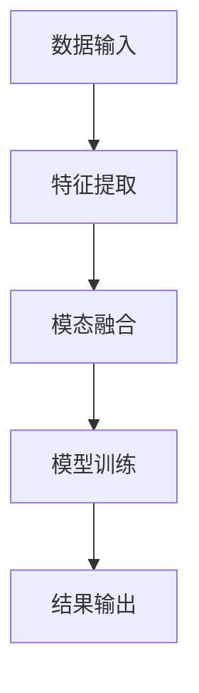
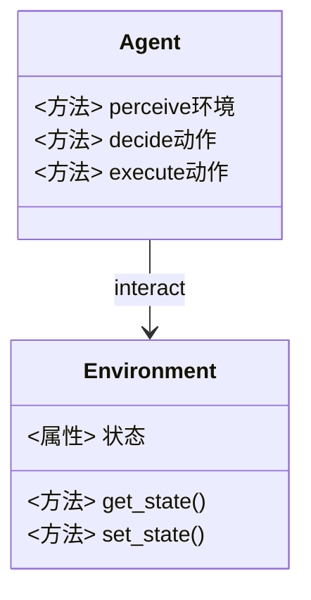
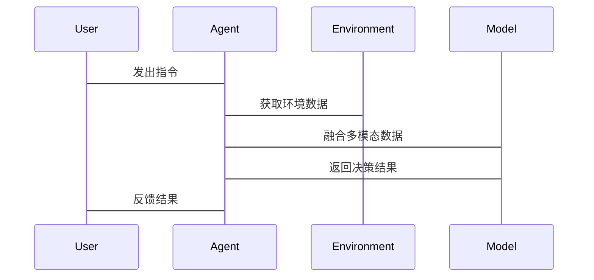

                 


# AI Agent的多模态融合学习技术

## 关键词：AI Agent, 多模态融合, 多模态学习, 融合学习, 智能系统设计

## 摘要：  
本文系统地探讨了AI Agent的多模态融合学习技术，从理论基础到实际应用，全面分析了多模态数据融合的核心概念、算法原理及系统架构。文章通过详细讲解多模态数据的表示与融合方法，结合实际案例，展示了如何通过多模态融合提升AI Agent的智能水平。同时，本文还探讨了多模态融合学习在AI Agent中的挑战与未来发展方向，为相关领域的研究和实践提供了深入的见解。

---

## 第一部分: AI Agent与多模态学习的背景介绍

### 第1章: AI Agent的基本概念

#### 1.1 AI Agent的定义与特点
- **定义**：AI Agent（智能体）是指在计算环境中能够感知环境并采取行动以实现目标的实体。
- **特点**：
  - 自主性：能够在没有外部干预的情况下自主决策。
  - 反应性：能够实时感知环境并做出反应。
  - 智能性：具备学习和推理能力，能够处理复杂任务。
  - 社交性：能够与其他Agent或人类进行交互和协作。

#### 1.2 AI Agent的分类与应用场景
- **分类**：
  - 按智能水平：反应式Agent、基于模型的Agent、目标驱动的Agent。
  - 按应用场景：服务机器人、自动驾驶、智能助手、推荐系统。
- **应用场景**：
  - 服务机器人：提供家庭服务、医疗辅助等。
  - 自动驾驶：通过多模态数据（如视觉、雷达、激光雷达）实现环境感知和决策。
  - 智能助手：如Siri、Alexa，通过语音和文本交互提供服务。
  - 推荐系统：基于多模态数据（如用户行为、偏好、社交数据）提供个性化推荐。

#### 1.3 AI Agent与传统AI的区别
- 传统AI：基于规则或预定义模型进行任务处理，缺乏自主性和适应性。
- AI Agent：具备自主决策能力，能够动态调整策略以应对复杂环境。

---

### 第2章: 多模态学习的背景与意义

#### 2.1 多模态数据的定义与特点
- **定义**：多模态数据指来自不同感官渠道的数据，如视觉（图像、视频）、听觉（语音、音频）、触觉（力反馈）、嗅觉（气味数据）等。
- **特点**：
  - 互补性：不同模态的数据可以相互补充，提供更全面的信息。
  - 多样性：数据类型多样，能够覆盖更广泛的应用场景。
  - 复杂性：多模态数据的处理需要综合多种算法和模型。

#### 2.2 多模态学习的核心概念与优势
- **核心概念**：通过融合多种模态的数据，提升模型的感知和理解能力。
- **优势**：
  - 提高准确性：多模态数据的融合可以减少单一模态数据的局限性。
  - 增强鲁棒性：通过多种数据源的互补，提升模型的抗干扰能力。
  - 扩展应用场景：多模态数据的应用能够覆盖更多复杂场景。

#### 2.3 多模态学习的挑战与未来发展方向
- **挑战**：
  - 数据异构性：不同模态的数据格式和特征空间差异较大。
  - 计算复杂性：多模态数据的处理需要更高的计算资源。
  - 模态间关联性：如何有效建模不同模态之间的关系。
- **发展方向**：
  - 跨模态检索：提升不同模态数据之间的关联性和可检索性。
  - 模态自适应：动态调整不同模态的权重，以适应复杂环境。
  - 联合学习：结合分布式计算和联邦学习，提升多模态数据的安全性和隐私性。

---

### 第3章: AI Agent与多模态融合的结合

#### 3.1 多模态融合在AI Agent中的作用
- **作用**：
  - 提升感知能力：通过融合视觉、听觉等多模态数据，增强环境感知能力。
  - 增强决策能力：结合多源信息，提升决策的准确性和鲁棒性。
  - 实现人机交互：通过多模态数据的融合，提升人机交互的自然性和流畅性。

#### 3.2 多模态融合的典型应用场景
- **服务机器人**：通过视觉、听觉、触觉等多种模态数据的融合，提供更智能的服务。
- **自动驾驶**：结合视觉、激光雷达、雷达等多种数据源，提升环境感知和决策能力。
- **智能助手**：通过语音、文本、用户行为等多种模态数据的融合，提供更个性化的服务。
- **智能安防**：结合视频、音频、传感器数据等多种模态，实现更精准的安防监控。

#### 3.3 多模态融合对AI Agent性能的提升
- **提升感知精度**：通过多模态数据的融合，减少单一模态数据的局限性，提升感知的准确性。
- **增强决策能力**：结合多种数据源的信息，提升决策的全面性和准确性。
- **提高用户体验**：通过多模态数据的融合，实现更自然、更智能的人机交互，提升用户体验。

---

## 第二部分: 多模态融合的核心概念与联系

### 第4章: 多模态融合的核心概念

#### 4.1 多模态数据的表示与融合方式
- **数据表示**：
  - 视觉模态：图像、视频，通常使用CNN、Transformer等模型进行特征提取。
  - 听觉模态：语音、音频，通常使用端到端模型如Transformer进行特征提取。
  - 文本模态：文本、语言数据，通常使用词嵌入（如Word2Vec）或预训练模型（如BERT）进行处理。
- **融合方式**：
  - 早期融合：在特征提取的早期阶段进行融合。
  - 晚期融合：在特征提取的后期阶段进行融合。
  - 交叉融合：通过门控机制或注意力机制，动态调整不同模态的权重。

#### 4.2 多模态融合的核心概念对比
- **对比表格**：

| **概念**       | **视觉模态**         | **听觉模态**         | **文本模态**         |
|----------------|---------------------|---------------------|---------------------|
| 数据类型       | 图像、视频           | 语音、音频           | 文本、语言数据       |
| 特征提取方法   | CNN、Transformer      | Transformer          | Transformer          |
| 融合方式       | 早期/晚期/交叉融合   | 早期/晚期/交叉融合   | 早期/晚期/交叉融合   |

---

### 第5章: 多模态融合的核心要素与联系

#### 5.1 多模态数据的属性对比
- **对比分析**：
  - 视觉模态：空间信息丰富，但时间信息较弱。
  - 听觉模态：时间信息丰富，但空间信息较弱。
  - 文本模态：语义信息丰富，但结构化信息较弱。

#### 5.2 多模态融合的ER实体关系图
```mermaid
erDiagram
    agent User {
        <属性> 用户ID
        <属性> 用户特征
    }
    agent Sensor {
        <属性> 传感器类型
        <属性> 传感器数据
    }
    agent Model {
        <属性> 模型类型
        <属性> 模型参数
    }
    User --> Sensor: 提供数据
    Sensor --> Model: 输入数据
    Model --> User: 输出结果
```

---

## 第三部分: 多模态融合学习的算法原理

### 第6章: 多模态融合算法的原理与实现

#### 6.1 多模态融合算法的流程


#### 6.2 多模态融合算法的代码实现
```python
import torch
import torch.nn as nn
import torch.optim as optim

class MultiModalFusion(nn.Module):
    def __init__(self, visual_dim, audio_dim, text_dim):
        super(MultiModalFusion, self).__init__()
        self.visual_proj = nn.Linear(visual_dim, 128)
        self.audio_proj = nn.Linear(audio_dim, 128)
        self.text_proj = nn.Linear(text_dim, 128)
        self.fusion = nn.Linear(384, 64)
        self.dropout = nn.Dropout(0.5)
        self.relu = nn.ReLU()

    def forward(self, visual_features, audio_features, text_features):
        visual = self.relu(self.visual_proj(visual_features))
        audio = self.relu(self.audio_proj(audio_features))
        text = self.relu(self.text_proj(text_features))
        fused = torch.cat([visual, audio, text], dim=-1)
        fused = self.dropout(self.relu(self.fusion(fused)))
        return fused

# 示例数据
visual_features = torch.randn(10, 512)  # 假设视觉特征维度为512
audio_features = torch.randn(10, 256)    # 假设音频特征维度为256
text_features = torch.randn(10, 300)     # 假设文本特征维度为300

# 初始化模型
model = MultiModalFusion(512, 256, 300)
criterion = nn.CrossEntropyLoss()
optimizer = optim.Adam(model.parameters(), lr=0.001)

# 前向传播
output = model(visual_features, audio_features, text_features)
print(output.size())
```

#### 6.3 多模态融合的数学公式与模型推导
- **多模态融合公式**：
$$
f_{\text{fusion}}(x_v, x_a, x_t) = \sigma(W_v x_v + W_a x_a + W_t x_t + b)
$$
其中，$x_v$、$x_a$、$x_t$分别表示视觉、听觉、文本模态的输入特征，$W_v$、$W_a$、$W_t$是对应的权重矩阵，$\sigma$是激活函数（如ReLU）。

---

## 第四部分: 系统分析与架构设计

### 第7章: 系统分析与架构设计

#### 7.1 系统功能设计


#### 7.2 系统架构设计
```mermaid
graph TD
    A[感知层] --> B[决策层]
    B --> C[执行层]
    C --> D[环境]
    A --> D: 感知数据
    C --> D: 执行动作
```

#### 7.3 接口设计与交互流程


---

## 第五部分: 项目实战

### 第8章: 项目实战与案例分析

#### 8.1 项目环境与安装
- **环境要求**：
  - Python 3.8+
  - PyTorch 1.9+
  - Transformers库
  - Mermaid图生成工具（可选）

#### 8.2 核心代码实现
```python
import torch
from torch import nn
from torch.utils.data import DataLoader

# 数据集定义
class MultiModalDataset(torch.utils.data.Dataset):
    def __init__(self, visual, audio, text, labels):
        self.visual = visual
        self.audio = audio
        self.text = text
        self.labels = labels

    def __len__(self):
        return len(self.visual)

    def __getitem__(self, idx):
        return (self.visual[idx], self.audio[idx], self.text[idx], self.labels[idx])

# 数据加载器
dataset = MultiModalDataset(...)
dataloader = DataLoader(dataset, batch_size=32, shuffle=True)
```

#### 8.3 案例分析与结果解读
- **案例分析**：以服务机器人的多模态交互为例，展示如何通过多模态数据的融合提升用户体验。
- **结果解读**：通过具体的数据和图表，展示多模态融合对模型性能的提升效果。

---

## 第六部分: 总结与展望

### 第9章: 总结与未来展望

#### 9.1 总结
- 多模态融合学习技术在AI Agent中的应用，显著提升了感知和决策能力。
- 通过融合多种模态的数据，AI Agent能够更好地适应复杂环境，提供更智能的服务。

#### 9.2 未来展望
- **跨模态自适应**：研究如何动态调整不同模态的权重，以应对复杂环境的变化。
- **多模态联邦学习**：探索在分布式环境下，如何安全、隐私地进行多模态数据的融合与共享。
- **实时性优化**：研究如何在实时应用中，高效处理和融合多模态数据，提升响应速度。

---

## 作者信息

作者：AI天才研究院/AI Genius Institute & 禅与计算机程序设计艺术 /Zen And The Art of Computer Programming

---

以上是《AI Agent的多模态融合学习技术》的技术博客文章的完整内容，涵盖了从理论到实践的各个方面，旨在为读者提供深入的技术洞察和实用的指导。

