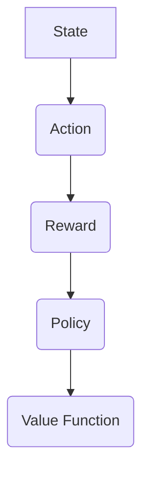
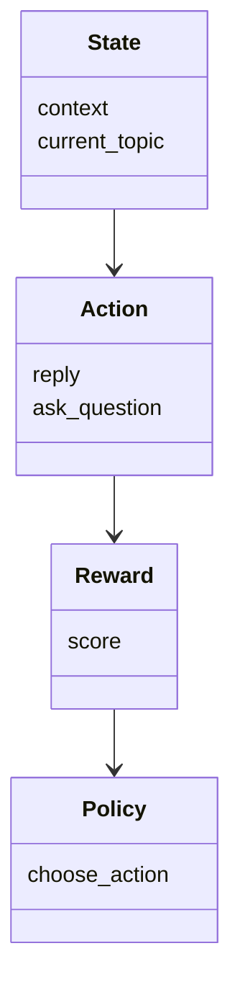
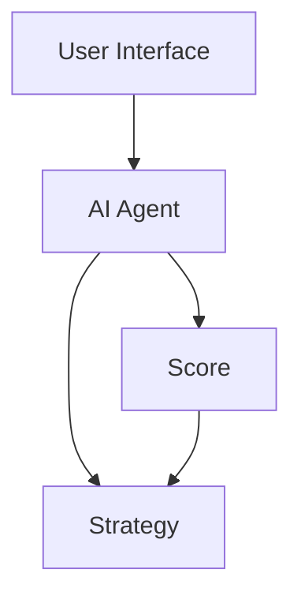
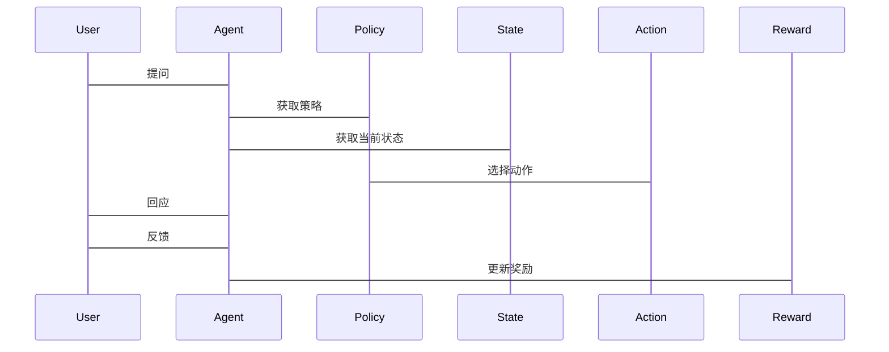

                 


# AI Agent的强化学习在对话策略优化中的应用

> 关键词：AI Agent，强化学习，对话策略优化，Q-learning，策略梯度，系统架构设计

> 摘要：本文深入探讨了AI Agent在对话策略优化中的应用，重点分析了强化学习技术的核心原理及其在实际对话系统中的应用案例。通过结合算法实现和系统架构设计，本文为读者提供了从理论到实践的全面指导，帮助读者理解如何利用强化学习优化对话策略，提升对话系统的性能和用户体验。

---

# 第一部分: AI Agent与强化学习基础

## 第1章: AI Agent的基本概念

### 1.1 AI Agent的定义与特点

#### 1.1.1 AI Agent的定义
AI Agent（智能体）是指在环境中能够感知并自主行动以实现目标的实体。它能够通过传感器获取信息，利用计算能力进行决策，并通过执行器与环境交互。

#### 1.1.2 AI Agent的核心特点
- **自主性**：能够在没有外部干预的情况下自主决策。
- **反应性**：能够实时感知环境变化并做出反应。
- **目标导向**：所有行动都以实现特定目标为导向。
- **学习能力**：通过与环境的交互不断优化自身行为。

#### 1.1.3 AI Agent的分类与应用场景
AI Agent可以分为简单反射型、基于模型的反应型、目标驱动型和实用驱动型。应用场景包括智能客服、虚拟助手、自动驾驶等。

### 1.2 强化学习的基本原理

#### 1.2.1 强化学习的定义
强化学习是一种机器学习范式，通过智能体在环境中采取行动，以最大化累积奖励的长期目标。智能体通过与环境的交互学习策略。

#### 1.2.2 强化学习的核心要素
- **状态（State）**：智能体所处的环境信息。
- **动作（Action）**：智能体在某一状态下采取的行为。
- **奖励（Reward）**：智能体采取行动后获得的反馈，用于指导学习。
- **策略（Policy）**：智能体选择动作的概率分布。
- **值函数（Value Function）**：衡量状态或动作奖励的价值。

#### 1.2.3 强化学习与监督学习的区别
- 监督学习：基于已知的输入输出标签进行学习。
- 强化学习：通过与环境交互，根据奖励信号优化策略。

---

## 第2章: 对话策略优化的背景与挑战

### 2.1 对话系统的发展历程

#### 2.1.1 从规则驱动到数据驱动的转变
早期对话系统依赖于手动编写的规则，随着深度学习的发展，逐渐转向基于数据驱动的模型。

#### 2.1.2 当前对话系统的瓶颈与不足
- **上下文理解不足**：难以处理复杂对话中的上下文信息。
- **策略优化有限**：传统方法难以实现全局最优策略。
- **用户多样性**：用户需求和表达方式多样化，增加了对话系统的难度。

### 2.2 强化学习在对话策略优化中的作用

#### 2.2.1 强化学习的优势
- **全局优化**：能够全局优化对话策略，而不仅仅是局部优化。
- **自适应学习**：通过与用户的交互不断优化策略，适应不同用户的需求。
- **动态调整**：能够根据对话的进展动态调整策略。

#### 2.2.2 强化学习在对话策略优化中的应用案例
- 智能客服：通过强化学习优化回答策略，提高用户满意度。
- 虚拟助手：通过强化学习优化对话流程，提升用户体验。

---

## 第3章: 强化学习的核心概念与联系

### 3.1 强化学习的核心概念

#### 3.1.1 状态（State）
状态表示智能体所处的环境信息。例如，在对话系统中，状态可以是当前对话的主题和上下文信息。

#### 3.1.2 动作（Action）
动作是智能体在某一状态下采取的行为。例如，在对话系统中，动作可以是回答用户的问题或引导用户输入更多信息。

#### 3.1.3 奖励（Reward）
奖励是对智能体采取动作的反馈，通常是一个标量值，表示动作的好坏。例如，在对话系统中，奖励可以是用户的满意度评分。

#### 3.1.4 策略（Policy）
策略是智能体选择动作的概率分布。例如，在对话系统中，策略可以是根据当前状态选择回答问题或请求更多信息的概率分布。

#### 3.1.5 值函数（Value Function）
值函数衡量状态或动作奖励的价值。例如，在对话系统中，值函数可以衡量当前状态下的期望奖励。

### 3.2 核心概念的属性特征对比

#### 3.2.1 状态与动作的对比分析
| 属性 | 状态 | 动作 |
|------|------|------|
| 定义 | 当前环境信息 | 智能体采取的行为 |
| 示例 | 对话主题 | 回答用户问题 |

#### 3.2.2 奖励

| 属性 | 奖励 |
|------|------|
| 定义 | 动作的反馈，标量值 |
| 示例 | 用户满意度评分 |

### 3.3 核心概念的ER实体关系图



---

## 第4章: 强化学习算法原理与实现

### 4.1 强化学习算法的核心原理

#### 4.1.1 Q-learning算法

Q-learning是一种经典的强化学习算法，适用于离散动作空间。其核心思想是通过更新Q值表来学习最优策略。

#### 4.1.2 策略梯度方法

策略梯度方法是一种基于概率的强化学习算法，适用于连续动作空间。其核心思想是通过优化策略的参数来最大化期望奖励。

### 4.2 强化学习算法的数学模型

#### 4.2.1 Q-learning算法的数学模型

$$ Q(s, a) \leftarrow Q(s, a) + \alpha [r + \max_{a'} Q(s', a') - Q(s, a)] $$

其中：
- \( Q(s, a) \)：状态 \( s \) 下动作 \( a \) 的Q值。
- \( \alpha \)：学习率。
- \( r \)：奖励。
- \( \max_{a'} Q(s', a') \)：下一个状态 \( s' \) 下的最大Q值。

#### 4.2.2 策略梯度方法的数学模型

$$ \theta \leftarrow \theta + \alpha \nabla_\theta \mathbb{E}[R] $$

其中：
- \( \theta \)：策略参数。
- \( \alpha \)：学习率。
- \( \nabla_\theta \mathbb{E}[R] \)：策略梯度。

### 4.3 强化学习算法的实现

#### 4.3.1 Q-learning算法的实现

```python
class QLearning:
    def __init__(self, state_space, action_space, learning_rate=0.1, gamma=0.9):
        self.state_space = state_space
        self.action_space = action_space
        self.learning_rate = learning_rate
        self.gamma = gamma
        self.q_table = defaultdict(lambda: defaultdict(float))
    
    def choose_action(self, state):
        max_action = max(self.q_table[state].items(), key=lambda x: x[1])[0]
        return max_action
    
    def learn(self, state, action, reward, next_state):
        q_current = self.q_table[state][action]
        q_next = max(self.q_table[next_state].values())
        self.q_table[state][action] += self.learning_rate * (reward + self.gamma * q_next - q_current)
```

#### 4.3.2 策略梯度方法的实现

```python
class PolicyGradient:
    def __init__(self, state_space, action_space, hidden_dim=32, learning_rate=0.01):
        self.state_space = state_space
        self.action_space = action_space
        self.hidden_dim = hidden_dim
        self.learning_rate = learning_rate
        self.model = self.build_model()
    
    def build_model(self):
        model = tf.keras.Sequential([
            tf.keras.layers.Dense(self.hidden_dim, activation='relu'),
            tf.keras.layers.Dense(self.action_space, activation='softmax')
        ])
        return model
    
    def choose_action(self, state):
        state = tf.convert_to_tensor([state], dtype=tf.float32)
        logits = self.model(state)
        action = tf.random.categorical(logits, 1)[0][0]
        return action
    
    def learn(self, state, action, reward):
        state = tf.convert_to_tensor([state], dtype=tf.float32)
        with tf.GradientTape() as tape:
            logits = self.model(state)
            loss = -tf.reduce_mean(tf.nn.sparse_softmax_cross_entropy_with_logits(labels=action, logits=logits)) + reward
        gradients = tape.gradient(loss, self.model.trainable_weights)
        self.model.optimizer.apply_gradients(zip(gradients, self.model.trainable_weights))
```

---

## 第5章: 系统分析与架构设计

### 5.1 问题场景介绍

在对话系统中，AI Agent需要根据当前对话的状态和上下文信息，选择最优的回应动作，以提高用户满意度。

### 5.2 项目介绍

本项目旨在通过强化学习优化对话策略，提升对话系统的性能和用户体验。

### 5.3 系统功能设计

#### 5.3.1 领域模型设计



#### 5.3.2 系统架构设计



#### 5.3.3 系统接口设计

- 输入接口：用户输入、系统状态
- 输出接口：系统回应、奖励信号

#### 5.3.4 交互序列图



---

## 第6章: 项目实战与案例分析

### 6.1 项目实战

#### 6.1.1 环境安装

```bash
pip install numpy gym tensorflow
```

#### 6.1.2 系统核心实现源代码

```python
import gym
import numpy as np
import tensorflow as tf

class AI-Agent:
    def __init__(self, env):
        self.env = env
        self.state = env.reset()
    
    def choose_action(self):
        # 根据强化学习算法选择动作
        pass
    
    def learn(self):
        # 更新强化学习算法模型
        pass

if __name__ == "__main__":
    env = gym.make("DialogEnv-v0")
    agent = AI-Agent(env)
    agent.learn()
```

#### 6.1.3 代码解读与分析

```python
# 初始化对话环境
env = gym.make("DialogEnv-v0")
state = env.reset()

# 选择动作
action = agent.choose_action(state)

# 执行动作
next_state, reward, done = env.step(action)

# 学习优化
agent.learn(state, action, reward, next_state)
```

#### 6.1.4 实际案例分析

以智能客服系统为例，通过强化学习优化对话策略，提高用户满意度。

### 6.2 项目小结

通过强化学习优化对话策略，可以有效提升对话系统的性能和用户体验。具体表现为：
- 提高用户满意度
- 提升对话效率
- 降低运营成本

---

## 第7章: 最佳实践与注意事项

### 7.1 最佳实践 tips

- **算法选择**：根据具体场景选择合适的强化学习算法。
- **数据处理**：确保数据的多样性和代表性。
- **系统优化**：不断迭代优化对话策略，提升系统性能。

### 7.2 小结

本文深入探讨了AI Agent在对话策略优化中的应用，通过强化学习技术实现了对话策略的全局优化，显著提升了对话系统的性能和用户体验。

### 7.3 注意事项

- **算法选择**：选择合适的强化学习算法，避免盲目追求复杂性。
- **数据处理**：确保数据的多样性和质量，避免过拟合。
- **系统优化**：不断迭代优化对话策略，提升系统性能。

### 7.4 拓展阅读

推荐阅读以下内容：
- 《强化学习入门》
- 《深度强化学习》
- 《对话系统优化》

---

# 作者：AI天才研究院/AI Genius Institute & 禅与计算机程序设计艺术 /Zen And The Art of Computer Programming

--- 

> 本文由AI天才研究院/AI Genius Institute原创撰写，转载请注明出处。

