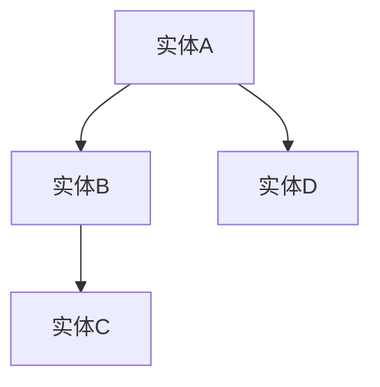
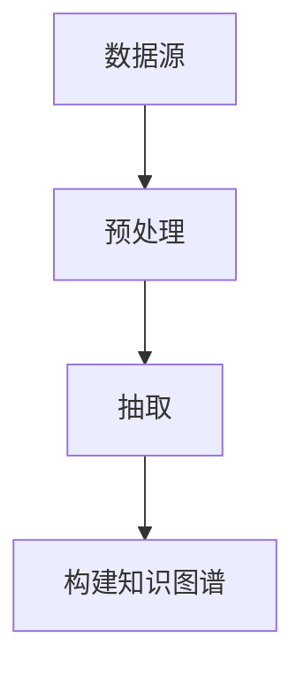
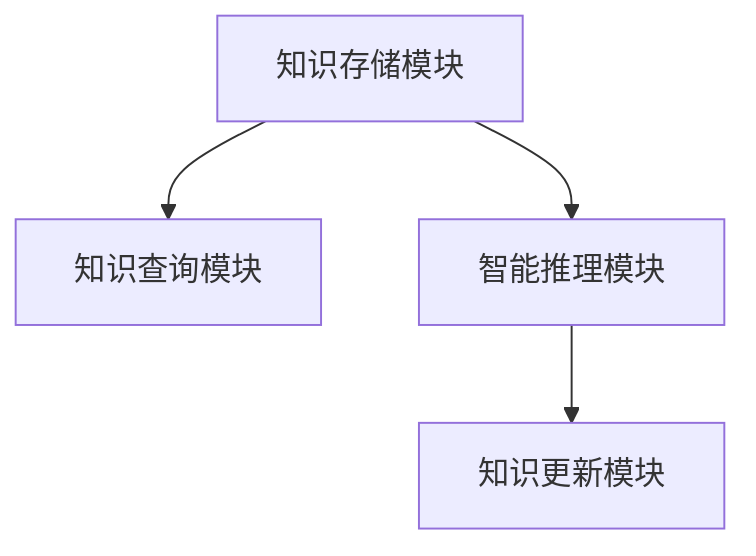
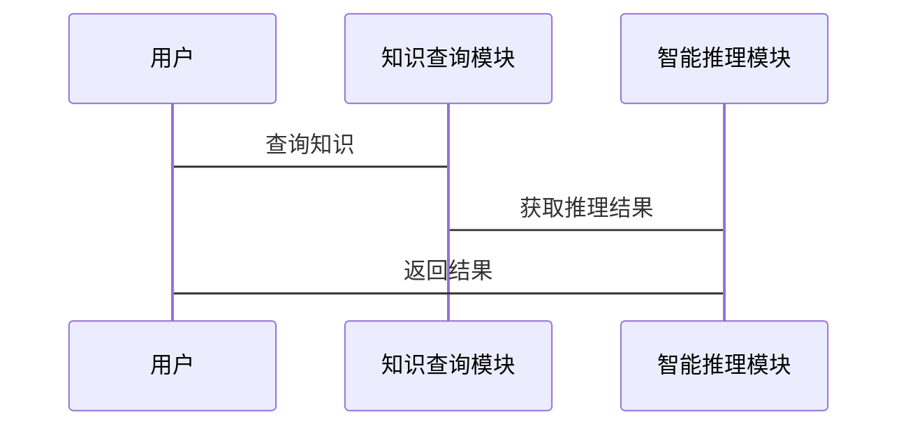

                 


# AI Agent的知识库构建与维护

> 关键词：知识库，AI Agent，自然语言处理，知识图谱，机器学习

> 摘要：AI Agent的知识库构建与维护是实现智能化系统的核心任务。本文详细探讨了知识库的基本概念、构建方法、存储技术、更新机制以及在AI Agent中的应用场景。通过理论分析和实际案例，介绍了如何利用知识图谱、自然语言处理和机器学习等技术构建高效的知识库，并通过系统设计和项目实战提供可操作的实现方案。

---

## 第1章：AI Agent与知识库概述

### 1.1 知识库的基本概念

#### 1.1.1 知识库的定义
知识库是一种结构化的数据集合，用于存储和管理特定领域的知识。它通常包含实体、关系和属性，能够支持智能系统进行推理和决策。

#### 1.1.2 知识库的特征
- **结构化**：数据以结构化的形式存储，便于计算机处理。
- **可扩展性**：支持动态添加和更新知识。
- **语义丰富性**：包含丰富的语义信息，支持智能推理。

#### 1.1.3 知识库与数据库的区别
| 特性         | 知识库               | 数据库               |
|--------------|----------------------|----------------------|
| 数据类型     | 多种，包括文本、关系 | 结构化数据，如数值、字符串 |
| 查询方式     | 支持语义查询         | 支持基本的SQL查询     |
| 应用场景     | 智能系统、知识推理   | 数据管理、事务处理     |

### 1.2 AI Agent的定义与特点

#### 1.2.1 AI Agent的基本概念
AI Agent（智能体）是能够感知环境并采取行动以实现目标的实体。它可以是一个软件程序，通过与环境交互来完成任务。

#### 1.2.2 AI Agent的核心功能
- **感知**：通过传感器或API获取环境信息。
- **推理**：基于知识库进行逻辑推理。
- **决策**：根据推理结果做出决策。
- **行动**：执行动作以改变环境状态。

#### 1.2.3 AI Agent与传统程序的区别
| 特性         | AI Agent             | 传统程序             |
|--------------|----------------------|----------------------|
| 智能性       | 高，能自主决策       | 无，按预设规则运行     |
| 知识库依赖   | 依赖，用于推理       | 无，依赖预设规则       |
| 适应性       | 强，能自适应变化     | 弱，难以动态调整       |

### 1.3 知识库在AI Agent中的作用

#### 1.3.1 知识库作为AI Agent的记忆模块
知识库为AI Agent提供长期记忆，存储已知信息，支持其理解和推理新信息。

#### 1.3.2 知识库支持智能推理的重要性
通过知识库，AI Agent可以进行基于知识的推理，做出更智能的决策。

#### 1.3.3 知识库在自然语言处理中的应用
知识库为自然语言处理提供背景知识，帮助模型更好地理解语义和上下文。

### 1.4 本章小结
本章介绍了知识库和AI Agent的基本概念，强调了知识库在AI Agent中的核心作用，为后续章节奠定了基础。

---

## 第2章：知识表示与存储

### 2.1 知识表示的基本方法

#### 2.1.1 符号表示法
符号表示法使用符号和规则来表示知识，例如逻辑表达式。

#### 2.1.2 概念图表示法
概念图通过节点和边表示概念及其关系，直观展示知识结构。

#### 2.1.3 知识图谱表示法
知识图谱是大规模的语义网络，广泛应用于知识库构建。

#### 2.1.4 优缺点对比
| 表示方法     | 符号表示法           | 概念图表示法         | 知识图谱表示法       |
|--------------|----------------------|----------------------|----------------------|
| 优点         | 表达精确             | 可视化能力强         | 规模大，语义丰富       |
| 缺点         | 难以处理复杂关系     | 编码复杂             | 构建和维护成本高       |

#### 2.1.5 用Mermaid展示知识图谱


#### 2.1.6 知识图谱的存储方式
知识图谱通常存储为RDF三元组（主语、谓词、宾语），支持语义查询。

### 2.2 知识存储的技术选择

#### 2.2.1 关系型数据库
- 优点：结构化，支持复杂查询。
- 缺点：难以处理非结构化数据。

#### 2.2.2 图数据库
- 优点：擅长处理关系数据，支持高效查询。
- 缺点：学习曲线较高。

#### 2.2.3 NoSQL数据库
- 优点：灵活，支持多种数据类型。
- 缺点：缺乏对语义关系的直接支持。

#### 2.2.4 优缺点对比
| 数据库类型   | 关系型数据库         | 图数据库             | NoSQL数据库           |
|--------------|----------------------|----------------------|----------------------|
| 优点         | 结构化，支持复杂查询 | 高效处理关系数据     | 灵活，扩展性强         |
| 缺点         | 难以处理复杂关系     | 学习曲线高           | 缺乏语义支持           |

#### 2.2.5 知识存储的实现示例
使用Python的NetworkX库构建知识图谱：
```python
import networkx as nx
G = nx.Graph()
G.add_edge("A", "B")
G.add_edge("B", "C")
nx.draw(G, node_size=500, node_color="red")
plt.show()
```

### 2.3 知识表示的优化方法

#### 2.3.1 知识嵌入
知识嵌入（如Word2Vec）将知识表示为向量，便于计算和推理。

#### 2.3.2 知识压缩
通过数据压缩技术减少存储空间，同时保持语义信息。

#### 2.3.3 知识分层
将知识按层次组织，便于管理和检索。

### 2.4 本章小结
本章探讨了知识表示与存储的方法，分析了不同技术的优缺点，并通过代码示例展示了知识图谱的构建过程。

---

## 第3章：知识库的构建方法与更新机制

### 3.1 知识获取与预处理

#### 3.1.1 知识获取的来源
- 结构化数据：数据库、表格。
- 非结构化数据：文本、图像。
- 半结构化数据：HTML、XML。

#### 3.1.2 知识预处理步骤
1. 数据清洗：去除噪声。
2. 数据解析：提取结构化信息。
3. 数据融合：整合多个来源的数据。

#### 3.1.3 正则表达式示例
提取电子邮件地址的正则表达式：
```python
import re
pattern = r'\b[\w.-]+@[\w.-]+\.[\w.-]+\b'
text = "Contact me at alice@example.com"
matches = re.findall(pattern, text)
print(matches)  # 输出: ['alice@example.com']
```

### 3.2 知识构建的算法与模型

#### 3.2.1 知识图谱构建算法
- 基于规则的抽取：使用预定义规则提取实体和关系。
- 基于机器学习的抽取：使用模型自动学习抽取规则。

#### 3.2.2 知识构建的流程


#### 3.2.3 知识构建的数学模型
使用图嵌入模型（如GraphSAGE）进行节点表示：
$$
h_i = \sigma(A h_i + b)
$$
其中，$h_i$ 是节点i的表示，$A$ 是邻接矩阵，$b$ 是偏置项，$\sigma$ 是激活函数。

### 3.3 知识库的更新机制

#### 3.3.1 增量式更新
- 优点：高效，只更新变化部分。
- 缺点：需要维护版本控制。

#### 3.3.2 全量式更新
- 优点：彻底，确保数据一致性。
- 缺点：资源消耗大。

#### 3.3.3 更新策略
- 定期全量备份。
- 实时增量更新。

### 3.4 本章小结
本章详细介绍了知识库的构建方法和更新策略，分析了不同算法和模型的优缺点，并通过代码示例展示了知识图谱的构建过程。

---

## 第4章：知识库在AI Agent中的应用与系统设计

### 4.1 系统需求与功能分析

#### 4.1.1 系统需求分析
- 知识存储与查询。
- 智能推理与决策。
- 知识库的动态更新。

#### 4.1.2 功能模块划分
1. 知识存储模块。
2. 知识查询模块。
3. 智能推理模块。
4. 知识更新模块。

### 4.2 系统架构设计

#### 4.2.1 系统架构图


#### 4.2.2 分层架构设计
```mermaid
layers
    L1[数据层]
    L2[业务逻辑层]
    L3[应用层]
    L1 --> L2
    L2 --> L3
```

#### 4.2.3 接口设计
- RESTful API：用于外部调用。
- 数据接口：用于知识库的读写操作。

### 4.3 交互设计与流程优化

#### 4.3.1 交互流程


#### 4.3.2 流程优化
- 并行处理：提高查询效率。
- 缓存机制：减少重复查询。

### 4.4 本章小结
本章通过系统设计展示了知识库在AI Agent中的应用，分析了系统的架构、接口和交互流程，并提出了优化建议。

---

## 第5章：知识库构建与维护的项目实战

### 5.1 环境搭建与工具安装

#### 5.1.1 安装Python库
```bash
pip install networkx
pip install matplotlib
pip install scikit-learn
```

#### 5.1.2 安装数据库
- 图数据库：Neo4j。
- 关系型数据库：PostgreSQL。

### 5.2 核心代码实现

#### 5.2.1 知识图谱构建代码
```python
import networkx as nx
G = nx.Graph()
G.add_nodes_from(["A", "B", "C"])
G.add_edges_from([("A", "B"), ("B", "C")])
nx.draw(G, node_size=1000, node_color="blue")
plt.show()
```

#### 5.2.2 知识抽取代码
```python
import re
text = "Alice is a student at University of Oxford."
pattern = r'\b[A-Z][a-z]+ \b'
names = re.findall(pattern, text)
print(names)  # 输出: ['Alice']
```

#### 5.2.3 知识更新代码
```python
# 更新知识图谱中的节点属性
G.nodes["A"]["age"] = 25
```

### 5.3 代码解读与分析

#### 5.3.1 知识图谱构建
使用NetworkX库构建图结构，展示实体之间的关系。

#### 5.3.2 知识抽取
利用正则表达式从文本中提取实体信息。

#### 5.3.3 知识更新
动态修改知识图谱中的节点属性，保持知识库的最新性。

### 5.4 实际案例分析

#### 5.4.1 案例背景
构建一个教育领域的知识库，存储课程、教师和学生信息。

#### 5.4.2 实施步骤
1. 数据收集：获取课程和教师信息。
2. 数据清洗：去除重复和错误数据。
3. 知识构建：建立课程-教师关系。
4. 知识更新：动态添加新课程信息。

### 5.5 项目小结
本章通过实际案例展示了知识库的构建与维护过程，强调了代码实现和项目管理的重要性。

---

## 第6章：知识库构建与维护的最佳实践

### 6.1 知识库设计的注意事项

#### 6.1.1 设计原则
- **模块化**：功能独立，便于维护。
- **可扩展性**：支持新增功能和数据。
- **安全性**：保护知识库不被篡改。

#### 6.1.2 常见问题
- 数据冗余：避免重复存储。
- 数据一致性：确保数据准确无误。
- 数据访问控制：限制非授权访问。

### 6.2 知识库维护的策略

#### 6.2.1 数据备份
定期备份知识库，防止数据丢失。

#### 6.2.2 数据清洗
定期清理无效数据，保持知识库整洁。

#### 6.2.3 数据同步
确保多个副本的数据一致性。

### 6.3 工具与平台推荐

#### 6.3.1 知识图谱工具
- Neo4j：图数据库。
- Apache Jena：RDF存储与推理。

#### 6.3.2 自然语言处理工具
- spaCy：文本处理。
- NLTK：词法分析。

#### 6.3.3 机器学习框架
- Scikit-learn：数据处理。
- TensorFlow：深度学习。

### 6.4 拓展阅读

#### 6.4.1 推荐书籍
- 《知识图谱：概念、方法与应用》。
- 《自然语言处理实战：核心技术与Python实现》。

#### 6.4.2 推荐论文
- “GraphSAGE: Inductive Representation Learning on Large Graphs”。
- “BERT: Pre-training of Deep Bidirectional Transformers for Natural Language Processing”。

### 6.5 本章小结
本章总结了知识库构建与维护的最佳实践，提供了工具推荐和拓展阅读资料，帮助读者进一步深入学习。

---

## 第7章：总结与展望

### 7.1 本篇总结
本文系统地介绍了AI Agent的知识库构建与维护，从概念到实践，详细讲解了知识表示、存储、构建和更新的方法，并通过实际案例展示了实现过程。

### 7.2 未来展望
未来，知识库将更加智能化和动态化，与AI技术的结合将更加紧密，为AI Agent的发展提供更多可能性。

---

## 作者：AI天才研究院 & 禅与计算机程序设计艺术

---

**摘要**：本文系统地探讨了AI Agent的知识库构建与维护，从知识表示、存储、构建到更新，结合实际案例和代码示例，提供了全面的解决方案。通过理论分析和实践指导，帮助读者掌握知识库的核心技术，为构建高效的AI Agent提供坚实的基础。

---

**注**：由于篇幅限制，上述目录大纲和文章内容为精简版，实际撰写时需要根据具体需求扩展每个章节的内容，包括更详细的代码实现、数学公式推导、系统设计图的绘制等。

