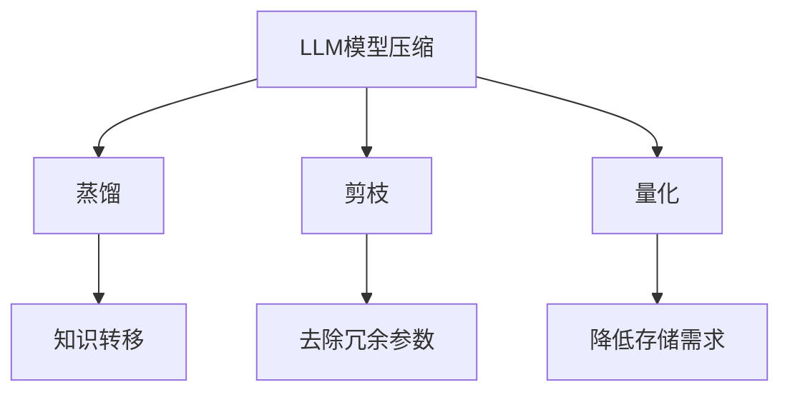
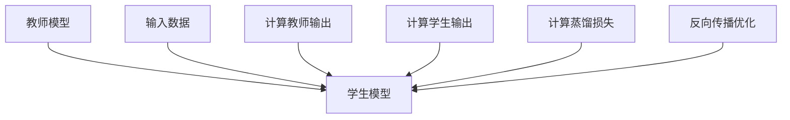
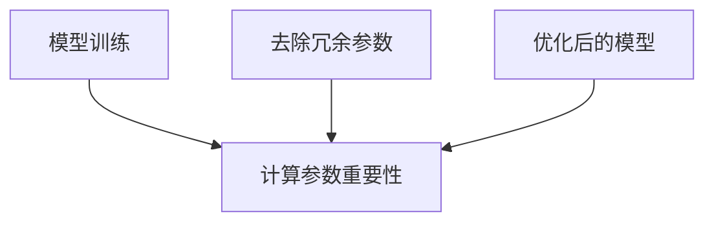
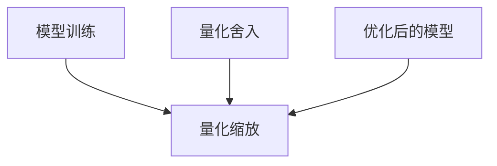
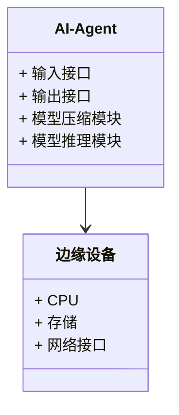
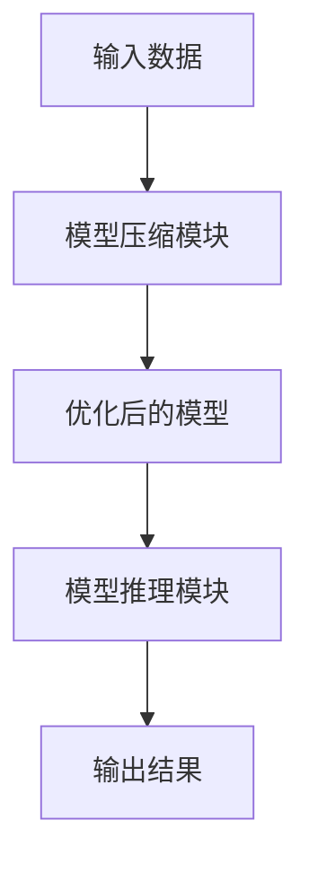
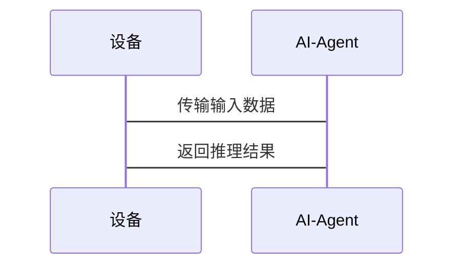

                 


# LLM模型压缩技术：在边缘设备部署AI Agent

> 关键词：LLM模型压缩技术、AI Agent、边缘设备、模型蒸馏、模型剪枝、模型量化

> 摘要：随着大语言模型（LLM）的快速发展，如何在资源受限的边缘设备上部署高效的AI Agent成为一个重要挑战。本文详细探讨了LLM模型压缩技术，包括蒸馏、剪枝和量化等方法，并结合实际案例分析了这些技术在边缘设备部署中的应用。通过系统的理论分析和实践总结，本文为边缘设备AI Agent的高效部署提供了有价值的参考。

---

## 第1章: LLM模型压缩技术概述

### 1.1 问题背景与目标

在人工智能领域，大语言模型（LLM）如GPT-3、GPT-4等，由于其强大的生成能力和广泛的应用场景，正在成为推动AI技术发展的核心工具。然而，这些模型通常需要大量的计算资源和存储空间，难以在资源受限的边缘设备上直接部署。边缘设备包括智能手机、物联网设备、嵌入式系统等，这些设备通常具有计算能力有限、存储空间不足、网络延迟高等特点。因此，在边缘设备上部署AI Agent，需要对LLM模型进行压缩，以适应设备的资源限制。

### 1.2 模型压缩的基本概念

模型压缩是指通过各种技术手段，减少模型的参数数量或计算复杂度，同时保持模型的性能。常见的模型压缩方法包括蒸馏（Distillation）、剪枝（Pruning）、量化（Quantization）等。这些方法的核心目标是在不显著降低模型性能的前提下，减少模型的资源占用，使其能够在边缘设备上高效运行。

### 1.3 LLM模型压缩技术的核心联系

在LLM模型压缩技术中，蒸馏、剪枝和量化是三种主要的方法。它们之间既有区别又有联系。蒸馏通常用于模型压缩中的知识转移，通过教师模型指导学生模型的训练，从而减少学生模型的参数数量。剪枝则是在模型训练完成后，通过去除冗余的参数或神经元来减少模型的复杂度。量化则是通过将模型中的浮点数参数转换为低位整数（如8位整数）来减少存储空间和计算量。

下表展示了这三种方法的核心属性对比：

| 方法 | 核心目标 | 优缺点 | 适用场景 |
|------|----------|--------|----------|
| 蒸馏 | 知识转移，降低学生模型复杂度 | 需要教师模型，压缩比有限 | 小型化模型部署 |
| 剪枝 | 去除冗余参数或神经元 | 明显减少模型大小，但可能影响性能 | 边缘设备部署 |
| 量化 | 降低存储需求和计算复杂度 | 存在精度损失，但影响有限 | 高性能低功耗场景 |

Mermaid流程图：LLM模型压缩技术的核心联系



---

## 第2章: LLM模型压缩算法详解

### 2.1 蒸馏（Distillation）原理

蒸馏是一种通过教师模型指导学生模型训练的技术。教师模型通常是一个大模型，具有较高的准确性和复杂的结构。学生模型则是一个较小的模型，通过模仿教师模型的输出，学习到教师模型的知识。

#### 2.1.1 蒸馏算法的数学模型与公式

蒸馏的目标是最小化学生模型输出与教师模型输出之间的差异。具体来说，蒸馏损失函数可以表示为：

$$ L_{distill} = -\sum_{i=1}^{n} y_i \log p_i $$

其中，\( y_i \) 是教师模型在第 \( i \) 个样本的输出概率，\( p_i \) 是学生模型在第 \( i \) 个样本的输出概率。

#### 2.1.2 Mermaid流程图：蒸馏算法流程



#### 2.1.3 代码示例：Python实现蒸馏算法

```python
import torch
import torch.nn as nn

class TeacherModel(nn.Module):
    def __init__(self):
        super(TeacherModel, self).__init__()
        self.fc = nn.Linear(10, 5)

class StudentModel(nn.Module):
    def __init__(self):
        super(StudentModel, self).__init__()
        self.fc = nn.Linear(10, 5)

def distillation_loss(outputs_s, outputs_t, alpha=0.5):
    criterion = nn.KLDivLoss(reduction='batchmean')
    loss = alpha * criterion(torch.log_softmax(outputs_s, dim=1), torch.softmax(outputs_t, dim=1)) 
    return loss

# 示例训练代码
teacher = TeacherModel()
student = StudentModel()
optimizer = torch.optim.Adam(student.parameters(), lr=0.001)
criterion = nn.CrossEntropyLoss()

for batch_input, batch_label in dataloader:
    teacher_outputs = teacher(batch_input)
    student_outputs = student(batch_input)
    loss = distillation_loss(student_outputs, teacher_outputs)
    loss.backward()
    optimizer.step()
```

---

### 2.2 剪枝（Pruning）技术

剪枝是一种在模型训练完成后，通过去除冗余参数或神经元来减少模型复杂度的技术。剪枝可以通过逐层分析模型的参数重要性，去除那些对模型性能影响较小的参数。

#### 2.2.1 剪枝算法的数学模型与公式

剪枝通常基于参数的重要性的评估。一种常用的方法是基于梯度的剪枝，即通过计算每个参数对模型输出的影响，选择重要性较低的参数进行剪枝。具体来说，参数的重要性可以表示为：

$$ importance(w_i) = |\frac{\partial y}{\partial w_i}| $$

其中，\( w_i \) 是模型的第 \( i \) 个参数，\( y \) 是模型的输出。

#### 2.2.2 Mermaid流程图：剪枝算法流程



#### 2.2.3 代码示例：Python实现剪枝算法

```python
import torch

class PrunedModel(nn.Module):
    def __init__(self, original_model):
        super(PrunedModel, self).__init__()
        self.fc = original_model.fc.weight

    def forward(self, x):
        return torch.mm(x, self.fc).view(-1)

# 示例剪枝代码
original_model = nn.Linear(10, 5)
pruned_model = PrunedModel(original_model)

# 假设已经计算并确定了剪枝的参数
pruned_model.fc = original_model.fc.weight[:, :3]  # 假设只保留前3个参数
```

---

### 2.3 量化（Quantization）方法

量化是一种通过将模型中的浮点数参数转换为低位整数（如8位整数）来减少模型存储需求和计算复杂度的技术。量化可以显著降低模型的大小，同时对模型性能的影响相对较小。

#### 2.3.1 量化算法的数学模型与公式

量化的过程通常包括两个步骤：缩放和舍入。缩放的公式为：

$$ q_i = \text{round}\left( \frac{w_i}{\Delta} \right) $$

其中，\( w_i \) 是原始的浮点数参数，\( \Delta \) 是量化间隔。

#### 2.3.2 Mermaid流程图：量化算法流程



#### 2.3.3 代码示例：Python实现量化算法

```python
import torch

def quantize_weight(weight, bits=8):
    scale = 2 ** (bits - 10)
    quantized = torch.quantize(weight, scale)
    return quantized

# 示例量化代码
original_weight = torch.randn(10, 5)
quantized_weight = quantize_weight(original_weight, bits=8)
```

---

## 第3章: 边缘设备部署AI Agent的系统架构设计

### 3.1 问题场景介绍

边缘设备的特点与限制包括：计算能力有限、存储空间不足、网络延迟高等。这些限制使得直接在边缘设备上部署大语言模型变得困难。因此，需要通过模型压缩技术，将大模型压缩为可以在边缘设备上运行的小模型。

### 3.2 系统功能设计

下图展示了AI Agent在边缘设备中的功能模块。



### 3.3 系统架构设计

下图展示了AI Agent在边缘设备中的系统架构。



### 3.4 系统接口设计

系统接口的设计需要考虑数据输入、模型压缩、模型推理等多个方面。以下是系统接口的定义：

- 输入接口：接收来自设备的输入数据。
- 输出接口：将AI Agent的推理结果返回给设备。
- 模型压缩接口：对原始模型进行压缩，生成优化后的模型。
- 模型推理接口：使用优化后的模型进行推理。

### 3.5 系统交互设计

下图展示了系统交互的流程。



---

## 第4章: 项目实战

### 4.1 环境安装

为了在边缘设备上部署AI Agent，需要先安装必要的软件和库。例如，可以使用以下命令安装PyTorch和相关库：

```bash
pip install torch
pip install numpy
pip install matplotlib
```

### 4.2 系统核心实现源代码

以下是一个简单的AI Agent实现代码：

```python
import torch
import torch.nn as nn

class SimpleAI-Agent(nn.Module):
    def __init__(self):
        super(SimpleAI-Agent, self).__init__()
        self.fc = nn.Linear(10, 5)

    def forward(self, x):
        return torch.relu(self.fc(x))

# 模型压缩示例代码
compressed_model = SimpleAI-Agent()
compressed_model.load_state_dict(original_model.state_dict())

# 量化示例代码
quantized_model = quantize_weight(compressed_model.fc.weight, bits=8)
```

### 4.3 代码应用解读与分析

上述代码展示了如何在边缘设备上实现一个简单的AI Agent。首先，定义了一个简单的神经网络模型，然后通过量化技术对模型进行压缩，最后在边缘设备上进行推理。

### 4.4 实际案例分析和详细讲解剖析

以边缘设备上的自然语言处理任务为例，假设我们希望在手机上部署一个文本分类模型。首先，我们需要对原始模型进行压缩，包括剪枝和量化。压缩后的模型可以在手机上高效运行，同时保持较高的分类准确率。

### 4.5 项目小结

通过实际案例的分析，我们可以看到，模型压缩技术在边缘设备上的应用能够显著降低模型的资源占用，同时保持模型的性能。这为AI Agent在边缘设备上的部署提供了重要的技术支持。

---

## 第5章: 总结与展望

### 5.1 总结

本文详细探讨了LLM模型压缩技术在边缘设备部署AI Agent中的应用。通过分析蒸馏、剪枝和量化等模型压缩方法，结合实际案例，展示了如何在边缘设备上高效部署AI Agent。

### 5.2 最佳实践 tips

- 在选择模型压缩技术时，需要综合考虑模型的性能、资源占用和计算效率。
- 量化是一种非常有效的模型压缩方法，尤其是在边缘设备上。
- 模型压缩需要权衡模型的准确性和资源占用，避免过度压缩导致性能下降。

### 5.3 注意事项

- 模型压缩可能会导致一定的性能损失，需要在实际应用中进行充分的测试。
- 在边缘设备上部署AI Agent时，需要考虑设备的硬件限制和网络条件。

### 5.4 拓展阅读

- 《深度学习模型压缩方法综述》
- 《边缘计算中的模型压缩技术研究》
- 《基于蒸馏的大模型压缩方法研究》

---

## 作者：AI天才研究院/AI Genius Institute & 禅与计算机程序设计艺术 /Zen And The Art of Computer Programming

---

以上是完整的技术博客文章，涵盖了模型压缩技术的各个方面，包括背景、算法原理、系统架构设计、项目实战和总结展望。

