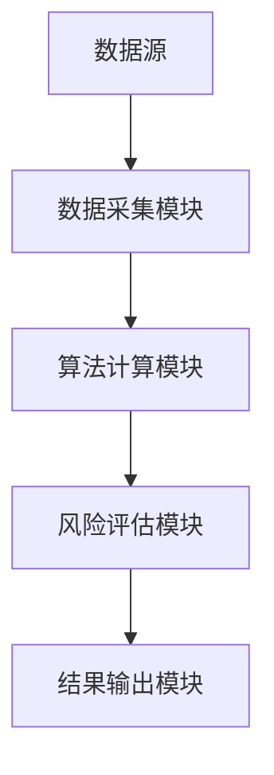
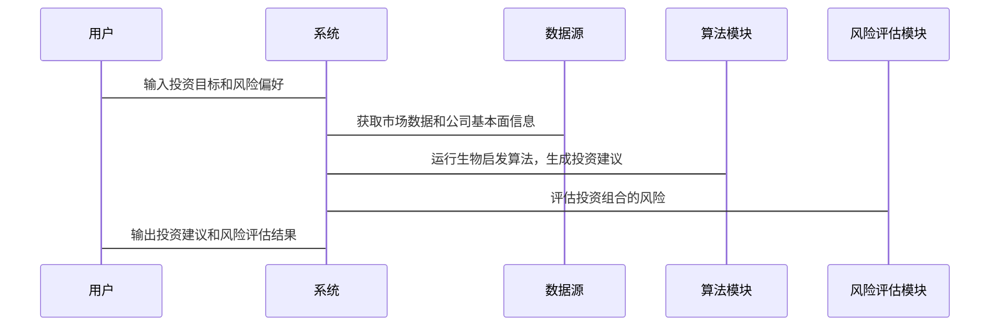

                 


# 《价值投资中的生物启发型计算机架构前景》

---

## 关键词：价值投资，生物启发型计算，计算机架构，投资策略，算法优化

---

## 摘要：

本文探讨了生物启发型计算在价值投资中的潜在应用前景。通过分析生物系统的计算原理，结合计算机架构设计，提出了一种创新的投资决策模型。文章从生物计算的基本原理出发，详细讲解了其在投资决策中的应用，包括算法优化、系统架构设计以及实际案例分析。通过结合价值投资的核心要素，本文展示了如何利用生物启发计算技术提升投资决策的科学性和准确性，为投资者提供新的思路和工具。

---

# 第一部分：价值投资与生物启发型计算的背景

## 第1章：价值投资与生物启发型计算概述

### 1.1 价值投资的核心概念

#### 1.1.1 价值投资的定义与历史发展

价值投资是一种投资策略，强调以低于内在价值的价格购买优质资产。其核心理念是通过深入分析企业的基本面，寻找被市场低估的投资标的。价值投资的代表人物包括本杰明·格雷厄姆和沃伦·巴菲特，他们提出的“安全边际”概念至今仍是价值投资的核心思想。

#### 1.1.2 生物学启发在投资中的潜在应用

生物系统在信息处理和决策机制上具有独特的优势，例如生物神经网络的自适应性和学习能力，以及生物群体的协同优化能力。这些特性为投资决策提供了新的思路。例如，投资者可以通过模拟生物神经网络的结构和功能，构建更高效的市场预测模型。

#### 1.1.3 计算机架构与投资决策的关系

计算机架构是投资决策的核心技术支撑。现代投资分析依赖于高性能计算、大数据处理和机器学习算法。通过优化计算机架构，可以提升投资决策的速度和准确性，同时降低计算成本。

---

### 1.2 生物启发型计算的基本原理

#### 1.2.1 生物系统的计算模型

生物系统通过复杂的分子网络和细胞间通信实现信息处理和决策。例如，神经网络通过突触传递和神经元激活实现信息的传递和处理。生物系统的计算模型具有高度的并行性和容错性。

#### 1.2.2 生物启发计算的核心特征

生物启发计算是一种模拟生物系统信息处理机制的计算范式。其核心特征包括：

1. **自适应性**：能够根据环境变化动态调整计算策略。
2. **并行性**：通过分布式计算提高处理效率。
3. **容错性**：能够在部分节点故障的情况下继续运行。

#### 1.2.3 生物计算与传统计算的对比

| 特性             | 生物计算             | 传统计算           |
|------------------|--------------------|-------------------|
| 并行性           | 高                 | 低                 |
| 容错性           | 高                 | 中                 |
| 自适应性         | 高                 | 低                 |
| 能效比           | 高                 | 中                 |
| 信息处理方式     | 分布式、非线性      | 集中式、线性       |

---

## 第2章：生物启发计算在价值投资中的应用潜力

### 2.1 生物启发计算的核心概念

#### 2.1.1 生物启发计算的核心概念

生物启发计算的核心概念包括：

1. **生物网络模型**：模拟生物系统中的网络结构，例如神经网络和代谢网络。
2. **自适应算法**：能够根据输入数据动态调整算法参数。
3. **群体智能**：通过多个计算单元的协同工作实现复杂任务。

#### 2.1.2 生物计算在投资决策中的应用

生物计算在投资决策中的应用主要体现在以下几个方面：

1. **市场预测**：通过模拟生物神经网络的结构，构建更高效的市场预测模型。
2. **风险评估**：利用生物系统的自适应性，提高风险评估的准确性。
3. **投资组合优化**：通过模拟生物群体的协同优化能力，优化投资组合的配置。

---

### 2.2 生物计算与价值投资的结合点

#### 2.2.1 生物计算在价值投资中的核心应用领域

1. **市场情绪分析**：通过模拟生物神经网络的自适应性，实时分析市场情绪的变化。
2. **个股基本面分析**：利用生物系统的分布式计算能力，提高个股分析的效率。
3. **投资组合优化**：通过模拟生物群体的协同优化能力，优化投资组合的配置。

#### 2.2.2 生物计算在价值投资中的优势

1. **高并行性**：生物计算的高并行性可以显著提高投资分析的效率。
2. **自适应性**：生物计算的自适应性能够更好地应对市场的不确定性。
3. **低能耗**：生物计算的高能效比可以降低投资计算的成本。

---

## 第三部分：生物启发型计算的算法与系统架构

## 第3章：生物启发计算的核心算法

### 3.1 生物启发计算的主要算法

#### 3.1.1 遗传算法（GA）

遗传算法是一种基于生物进化论的优化算法。其基本步骤包括：

1. **初始化种群**：随机生成一组初始解。
2. **适应度评估**：计算每个个体的适应度值。
3. **选择操作**：选择适应度值较高的个体进行交配。
4. **交叉操作**：通过交叉操作生成新的个体。
5. **变异操作**：对新个体进行随机变异。
6. **迭代优化**：重复上述步骤，直到达到终止条件。

#### 3.1.2 神经网络算法（NN）

神经网络是一种模拟生物神经系统的计算模型。其基本结构包括输入层、隐藏层和输出层。神经网络通过反向传播算法进行训练，优化权重参数，实现对输入数据的分类和预测。

#### 3.1.3 粒子群优化算法（PSO）

粒子群优化算法是一种基于生物群体行为的优化算法。其基本步骤包括：

1. **初始化粒子群**：随机生成一群粒子。
2. **适应度评估**：计算每个粒子的适应度值。
3. **更新速度和位置**：根据粒子的当前位置和速度，更新粒子的位置。
4. **迭代优化**：重复上述步骤，直到达到终止条件。

---

### 3.2 生物启发算法在价值投资中的应用

#### 3.2.1 遗传算法在投资组合优化中的应用

遗传算法可以用于优化投资组合的配置，通过适应度函数评估每个投资组合的收益和风险，选择最优的组合。

#### 3.2.2 神经网络算法在市场预测中的应用

神经网络可以用于预测股票价格和市场趋势，通过训练网络模型，实现对市场走势的准确预测。

#### 3.2.3 粒子群优化算法在风险控制中的应用

粒子群优化算法可以用于优化风险控制策略，通过调整投资组合的风险敞口，降低整体风险。

---

## 第4章：生物启发型计算的系统架构设计

### 4.1 生物计算系统的功能设计

#### 4.1.1 系统功能模块

1. **数据采集模块**：采集市场数据和公司基本面信息。
2. **算法计算模块**：运行生物启发算法，生成投资建议。
3. **风险评估模块**：评估投资组合的风险。
4. **结果输出模块**：输出投资建议和风险评估结果。

#### 4.1.2 系统功能流程

1. **数据采集**：从数据源获取市场数据和公司基本面信息。
2. **算法计算**：运行生物启发算法，生成投资建议。
3. **风险评估**：评估投资组合的风险。
4. **结果输出**：输出投资建议和风险评估结果。

---

### 4.2 生物计算系统的架构设计

#### 4.2.1 系统架构图



#### 4.2.2 系统接口设计

1. **数据采集接口**：从数据源获取市场数据和公司基本面信息。
2. **算法计算接口**：运行生物启发算法，生成投资建议。
3. **风险评估接口**：评估投资组合的风险。
4. **结果输出接口**：输出投资建议和风险评估结果。

---

### 4.3 生物计算系统的交互设计

#### 4.3.1 系统交互流程

1. **用户输入**：用户输入投资目标和风险偏好。
2. **数据采集**：系统从数据源获取市场数据和公司基本面信息。
3. **算法计算**：系统运行生物启发算法，生成投资建议。
4. **风险评估**：系统评估投资组合的风险。
5. **结果输出**：系统输出投资建议和风险评估结果。

#### 4.3.2 系统交互图



---

## 第五部分：生物启发型计算在价值投资中的项目实战

## 第5章：生物启发型计算在价值投资中的项目实战

### 5.1 项目环境配置

#### 5.1.1 系统环境

- 操作系统：Linux/Windows/MacOS
- 开发工具：Python/PyCharm
- 依赖库：numpy, pandas, matplotlib, scikit-learn, keras, tensorflow

#### 5.1.2 数据源配置

- 数据来源：Yahoo Finance API、Alpha Vantage API
- 数据格式：CSV/JSON
- 数据预处理：数据清洗、特征提取、标准化处理

---

### 5.2 项目核心代码实现

#### 5.2.1 遗传算法实现

```python
import random

def fitness(individual):
    # 计算投资组合的收益和风险
    return -sum(individual)

def mutate(individual):
    # 随机选择一个基因进行变异
    idx = random.randint(0, len(individual)-1)
    individual[idx] = 1 - individual[idx]
    return individual

def crossover(parent1, parent2):
    # 单点交叉
    point = random.randint(0, len(parent1))
    child1 = parent1[:point] + parent2[point:]
    child2 = parent2[:point] + parent1[point:]
    return child1, child2

def ga_optimization():
    # 初始化种群
    population = [[random.randint(0,1) for _ in range(10)] for _ in range(10)]
    for _ in range(100):
        # 适应度评估
        fitness_list = [fitness(individual) for individual in population]
        # 选择
        selected = [population[i] for i in sorted(range(len(fitness_list)), key=lambda x: fitness_list[x])[:5]]
        # 交配
        offspring = []
        for i in range(0, len(selected), 2):
            parent1 = selected[i]
            parent2 = selected[i+1]
            child1, child2 = crossover(parent1, parent2)
            child1 = mutate(child1)
            child2 = mutate(child2)
            offspring.append(child1)
            offspring.append(child2)
        # 替换种群
        population = selected + offspring
    return population[0]
```

---

### 5.2.2 神经网络实现

```python
import numpy as np
import keras
from keras.models import Sequential
from keras.layers import Dense

def build_model(input_dim):
    model = Sequential()
    model.add(Dense(64, activation='relu', input_dim=input_dim))
    model.add(Dense(32, activation='relu'))
    model.add(Dense(1, activation='sigmoid'))
    model.compile(optimizer='adam', loss='binary_crossentropy', metrics=['accuracy'])
    return model

def train_model(model, X_train, y_train, epochs=100):
    model.fit(X_train, y_train, epochs=epochs, batch_size=32, verbose=0)

def predict_model(model, X_test):
    return model.predict(X_test)
```

---

### 5.2.3 粒子群优化算法实现

```python
import random

def fitness(individual):
    # 计算投资组合的风险和收益
    return -sum(individual)

def update_position(particle, best_particle, current_position, velocity):
    # 更新粒子的位置和速度
    velocity = 0.5 * velocity + 0.3 * (best_particle - current_position)
    new_position = current_position + velocity
    return new_position, velocity

def pso_optimization():
    # 初始化粒子群
    particles = [[random.uniform(0,1) for _ in range(10)] for _ in range(10)]
    velocities = [[0 for _ in range(10)] for _ in range(10)]
    best_particle = particles[0]
    for _ in range(100):
        for i in range(len(particles)):
            # 适应度评估
            current_fitness = fitness(particles[i])
            if current_fitness > fitness(best_particle):
                best_particle = particles[i]
            # 更新位置和速度
            particles[i], velocities[i] = update_position(particles[i], best_particle, particles[i], velocities[i])
    return best_particle
```

---

## 第六部分：总结与展望

## 第6章：总结与展望

### 6.1 总结

本文探讨了生物启发型计算在价值投资中的应用前景，从生物计算的基本原理到具体的算法实现，再到系统的架构设计，提出了一个完整的解决方案。通过遗传算法、神经网络和粒子群优化算法的实现，展示了生物计算在投资决策中的潜力。

---

### 6.2 展望

未来，随着生物计算技术的不断发展，其在价值投资中的应用前景将更加广阔。通过结合深度学习和强化学习，生物计算可以在市场预测和投资组合优化中发挥更大的作用。同时，随着量子计算技术的发展，生物计算与量子计算的结合也可能为价值投资带来新的突破。

---

## 附录：最佳实践 Tips

1. **算法选择**：根据具体问题选择合适的生物启发算法。
2. **数据处理**：确保数据的准确性和完整性。
3. **系统优化**：通过并行计算和分布式计算优化系统性能。
4. **风险管理**：在实际应用中，结合传统金融理论进行风险管理。

---

## 作者：AI天才研究院/AI Genius Institute & 禅与计算机程序设计艺术/Zen And The Art of Computer Programming

---

希望这篇博客文章能够为读者提供有价值的内容和启发！

