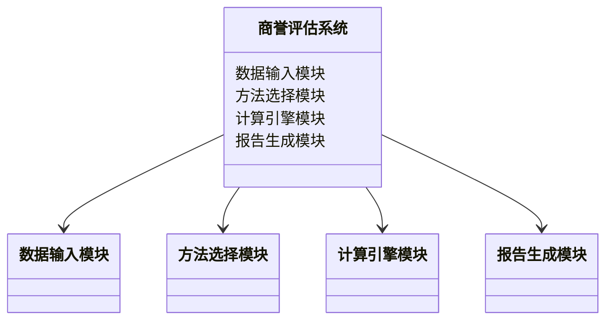
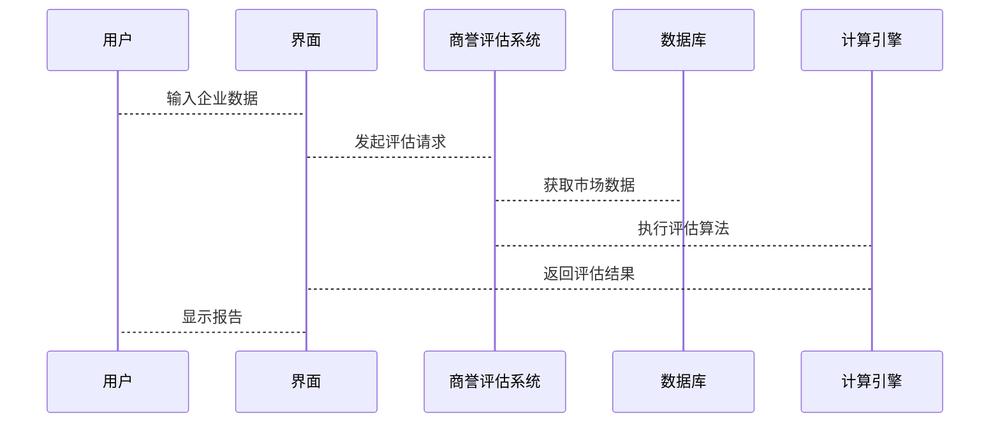

                 


```markdown
# 企业估值中的商誉处理方法

## 关键词：商誉、企业估值、会计准则、DCF模型、购买价格分配法

## 摘要：
商誉是企业在并购过程中产生的无形资产，其处理方法直接影响企业的财务状况和估值结果。本文从商誉的基本概念出发，详细分析其在企业估值中的重要性，并探讨多种商誉处理方法，如DCF模型和购买价格分配法。通过数学模型和实际案例，本文揭示了商誉处理的核心原理及其在实际应用中的注意事项，为读者提供全面的理论支持和实践指导。

## 第1章: 商誉的基本概念与问题背景

### 1.1 商誉的定义与特征

#### 1.1.1 商誉的定义
商誉是指企业在市场中由于其良好的声誉、客户关系、技术优势等无形因素而产生的超出其净资产公允价值的部分。它是企业整体价值的重要组成部分。

#### 1.1.2 商誉的特征与分类
商誉具有无形性、不可分离性和持久性等特征。根据来源，商誉可以分为内部商誉和外部商誉；根据评估标准，分为可识别商誉和不可识别商誉。

#### 1.1.3 商誉与企业价值的关系
商誉是企业价值的重要组成部分，特别是在企业并购中，商誉的合理评估直接关系到交易价格的确定和未来的财务表现。

### 1.2 商誉处理的背景与问题

#### 1.2.1 企业并购中的商誉问题
企业并购时，商誉的评估和分配直接影响收购方的财务报表和投资决策。不当的商誉处理可能导致财务数据失真，影响企业价值评估。

#### 1.2.2 商誉减值对企业财务的影响
根据会计准则，商誉需要定期进行减值测试。商誉减值会直接减少企业的净资产和利润，影响投资者对企业财务状况的判断。

#### 1.2.3 商誉处理的复杂性与挑战
商誉的评估涉及多种因素，如未来现金流预测、市场环境变化等，增加了处理过程的复杂性。此外，不同会计准则下的处理差异也给企业带来了挑战。

### 1.3 商誉处理的核心概念

#### 1.3.1 商誉的形成过程
商誉通常在企业并购时产生，是购买方对被收购方未来盈利能力的预期与实际支付价格之间的差额。

#### 1.3.2 商誉的计量方法
商誉的计量需要考虑可识别净资产的公允价值与支付对价的差额。根据会计准则，商誉不得单独出售，必须与企业整体一起出售。

#### 1.3.3 商誉的会计处理原则
根据IFRS和US GAAP的不同要求，商誉在资产负债表中作为无形资产列示，需定期进行减值测试。

### 1.4 本章小结
本章介绍了商誉的基本概念、分类及其在企业并购中的重要性。商誉的合理处理对于企业价值评估和财务决策具有重要意义。

## 第2章: 商誉处理的理论基础

### 2.1 企业价值评估的基本原理

#### 2.1.1 企业价值的构成要素
企业价值包括有形资产、无形资产和商誉等部分。商誉是企业整体价值的重要组成部分，特别是在企业并购中。

#### 2.1.2 企业价值评估的方法体系
企业价值评估的主要方法包括资产基础法、相对价值法和DCF模型。商誉的评估通常涉及这些方法的综合应用。

#### 2.1.3 商誉在企业价值中的地位
商誉是企业未来盈利能力的体现，是企业整体价值的重要组成部分。在企业并购中，商誉的评估直接关系到交易价格的确定。

### 2.2 商誉的会计处理规范

#### 2.2.1 国际会计准则（IFRS）中的商誉处理
根据IFRS，商誉作为无形资产在资产负债表中列示，需定期进行减值测试。商誉不得单独出售，必须与企业整体一起出售。

#### 2.2.2 美国会计准则（US GAAP）中的商誉处理
US GAAP同样要求商誉作为无形资产列示，并定期进行减值测试。与IFRS相比，US GAAP在商誉处理上更为严格，要求每年至少进行一次减值测试。

#### 2.2.3 不同准则下的差异与协调
尽管IFRS和US GAAP在商誉处理上有一些差异，但总体目标是一致的，即确保商誉的合理评估和财务报表的准确性。

### 2.3 商誉处理的经济与财务影响

#### 2.3.1 商誉对财务报表的影响
商誉的增减直接影响企业的净资产和利润。商誉减值会减少企业的净资产，影响投资者对企业财务状况的判断。

#### 2.3.2 商誉对投资决策的影响
商誉的合理评估有助于确定企业并购的合理价格，影响投资决策和未来盈利能力的预期。

#### 2.3.3 商誉对企业战略的影响
商誉是企业核心竞争力的体现，其合理评估有助于制定企业战略，优化资源配置，提升企业整体价值。

### 2.4 本章小结
本章详细分析了商誉在企业价值评估中的理论基础及其在会计准则中的处理规范。商誉的合理评估对于企业财务报表的准确性、投资决策的科学性和企业战略的制定具有重要意义。

## 第3章: 商誉处理的核心方法与模型

### 3.1 商誉评估的主要方法

#### 3.1.1 收购价格分配法
收购价格分配法是将收购价格分配到可识别净资产和商誉之间。具体步骤包括确定可识别净资产的公允价值，计算商誉金额。

#### 3.1.2 相对价值法
相对价值法基于市场可比交易数据，通过比较市盈率、市净率等指标来评估商誉。

#### 3.1.3 现金流量法
现金流量法基于未来现金流的预测，通过DCF模型计算企业价值，进而确定商誉金额。

### 3.2 商誉评估的数学模型

#### 3.2.1 现金流量折现模型（DCF）
DCF模型通过预测未来现金流，将其折现为现值，作为企业价值的评估依据。公式如下：

$$ \text{企业价值} = \sum_{t=1}^{n} \frac{CF_t}{(1 + r)^t} + \frac{TV}{(1 + r)^n} $$

其中，\( CF_t \) 是第t年的现金流，\( r \) 是折现率，\( TV \) 是终值。

#### 3.2.2 市盈率与市净率模型
市盈率模型通过比较可比企业的市盈率和收益，评估目标企业的价值。公式如下：

$$ \text{目标企业价值} = \text{可比企业平均市盈率} \times \text{目标企业净利润} $$

市净率模型类似，基于可比企业的市净率和净资产进行评估。

#### 3.2.3 购买价格分配法的数学公式
购买价格分配法的公式如下：

$$ \text{商誉} = \text{收购价格} - \sum \text{可识别净资产公允价值} $$

### 3.3 商誉评估方法的比较与选择

#### 3.3.1 各种方法的优缺点分析
- DCF模型优点：基于未来现金流预测，考虑了企业未来盈利能力；缺点：预测难度大，结果受假设影响较大。
- 相对价值法优点：简单易行，基于市场数据；缺点：依赖可比企业数据，可能存在偏差。
- 购买价格分配法优点：直接关联收购价格与可识别净资产；缺点：需要准确评估可识别净资产的公允价值。

#### 3.3.2 方法选择的影响因素
- 数据的可获得性
- 企业所处的行业特点
- 评估目的和需求
- 可比企业的数量和质量

#### 3.3.3 实际应用中的注意事项
- 综合运用多种方法进行验证
- 考虑宏观经济环境和行业趋势
- 定期进行商誉减值测试

### 3.4 本章小结
本章介绍了几种主要的商誉评估方法，分析了它们的优缺点及其在实际应用中的注意事项。合理选择和运用这些方法，能够提高商誉评估的准确性和科学性。

## 第4章: 系统分析与架构设计方案

### 4.1 问题场景介绍
企业并购过程中，商誉的评估需要考虑多种因素，涉及复杂的计算和数据处理。为了提高评估效率和准确性，可以构建一个商誉评估系统。

### 4.2 系统功能设计

#### 4.2.1 系统功能模块
- 数据输入与管理
- 商誉评估方法选择
- 计算引擎
- 结果展示与报告生成

#### 4.2.2 领域模型（mermaid 类图）


### 4.3 系统架构设计

#### 4.3.1 系统架构图（mermaid 架构图）
```mermaid
archi
    title 商誉评估系统架构
    client --> API Gateway: 请求
    API Gateway --> 商誉评估服务
    商誉评估服务 --> 数据库
    商誉评估服务 --> 计算引擎
    计算引擎 --> 第三方数据源
```

### 4.4 系统接口设计
- 数据输入接口：接收企业财务数据和市场数据
- 方法选择接口：根据输入数据选择合适的评估方法
- 结果输出接口：生成商誉评估报告

### 4.5 系统交互设计（mermaid 序列图）


### 4.6 本章小结
本章通过构建商誉评估系统的功能模块和架构设计，展示了如何利用技术手段提高商誉评估的效率和准确性。系统架构的设计为实际应用提供了理论基础和技术支持。

## 第5章: 项目实战

### 5.1 环境安装与配置
- 安装Python和必要的库（如numpy、pandas、scipy）
- 安装Jupyter Notebook或其他IDE
- 安装Mermaid工具以生成图表

### 5.2 核心代码实现

#### 5.2.1 数据处理代码
```python
import pandas as pd
import numpy as np

# 假设我们有一个包含可识别净资产的数据框
def calculate_goodwill(acquisition_price, identifiable_assets):
    goodwill = acquisition_price - sum(identifiable_assets)
    return goodwill

# 示例数据
acquisition_price = 1000000
identifiable_assets = [500000, 300000, 200000]
goodwill = calculate_goodwill(acquisition_price, identifiable_assets)
print("商誉金额为：", goodwill)
```

#### 5.2.2 DCF模型实现
```python
def discounted_cash_flow(cash_flows, discount_rate, terminal_value):
    npv = 0
    for t in range(len(cash_flows)):
        npv += cash_flows[t] / (1 + discount_rate) ** t
    npv += terminal_value / (1 + discount_rate) ** len(cash_flows)
    return npv

# 示例数据
cash_flows = [100000, 150000, 200000, 250000]
discount_rate = 0.1
terminal_value = 300000

enterprise_value = discounted_cash_flow(cash_flows, discount_rate, terminal_value)
print("企业价值为：", enterprise_value)
goodwill = enterprise_value - sum(identifiable_assets)
print("商誉金额为：", goodwill)
```

### 5.3 案例分析与解读

#### 5.3.1 案例背景
某公司以1000万元收购另一家公司，可识别净资产的公允价值为900万元。需评估商誉金额。

#### 5.3.2 数据处理与分析
- 收购价格：1000万元
- 可识别净资产：900万元
- 商誉计算：1000 - 900 = 100万元

#### 5.3.3 结果展示
商誉金额为100万元，需在资产负债表中作为无形资产列示，并定期进行减值测试。

### 5.4 本章小结
本章通过一个实际案例展示了商誉评估方法的应用。通过Python代码实现数据处理和模型计算，验证了理论方法的可行性。

## 第6章: 总结与最佳实践

### 6.1 本章总结
商誉是企业估值中的重要组成部分，其合理评估直接影响企业的财务状况和投资决策。本文介绍了商誉的基本概念、评估方法和系统设计，并通过实际案例展示了商誉评估的应用。

### 6.2 最佳实践 tips

#### 6.2.1 选择合适的评估方法
根据企业的具体情况和数据的可获得性，选择合适的商誉评估方法。通常，结合使用多种方法可以提高评估结果的准确性。

#### 6.2.2 定期进行商誉减值测试
根据会计准则，企业需定期进行商誉减值测试，及时调整财务报表，确保财务数据的准确性。

#### 6.2.3 建立完善的商誉管理体系
企业应建立完善的商誉管理体系，包括定期评估、信息披露和风险管理，确保商誉的合理处理和持续监控。

### 6.3 注意事项

#### 6.3.1 数据的准确性
商誉评估依赖于准确的数据，特别是可识别净资产的公允价值和未来现金流的预测。数据的误差可能导致评估结果的偏差。

#### 6.3.2 方法的适用性
不同评估方法适用于不同的情况，需根据企业的具体情况选择合适的方法。避免机械套用公式，忽略实际业务背景。

#### 6.3.3 宏观经济环境的影响
商誉评估需考虑宏观经济环境和行业趋势，这些因素可能影响企业的未来盈利能力，从而影响商誉的评估结果。

### 6.4 拓展阅读
- 阅读更多关于企业估值和商誉处理的经典文献，深入理解商誉评估的理论基础。
- 关注会计准则的最新变化，了解商誉处理的最新动态和实践。
- 学习相关技术工具和软件，提高商誉评估的效率和准确性。

### 6.5 本章小结
本章总结了商誉处理的核心内容，提出了最佳实践建议和注意事项，为读者提供了在实际工作中应用商誉处理方法的指导。

## 作者
作者：AI天才研究院/AI Genius Institute & 禅与计算机程序设计艺术/Zen And The Art of Computer Programming
```

