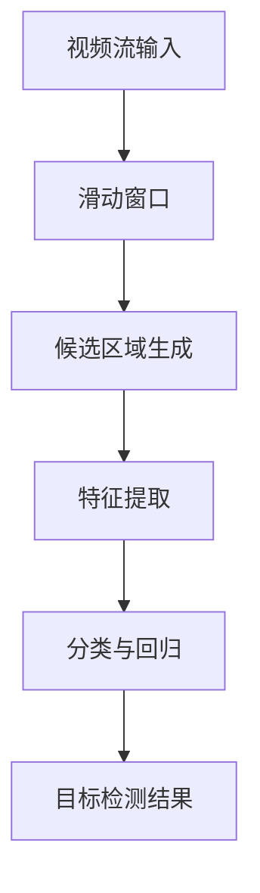
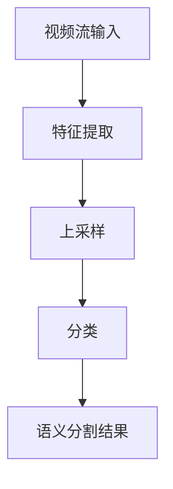
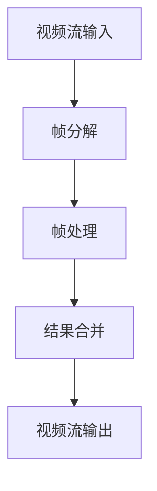
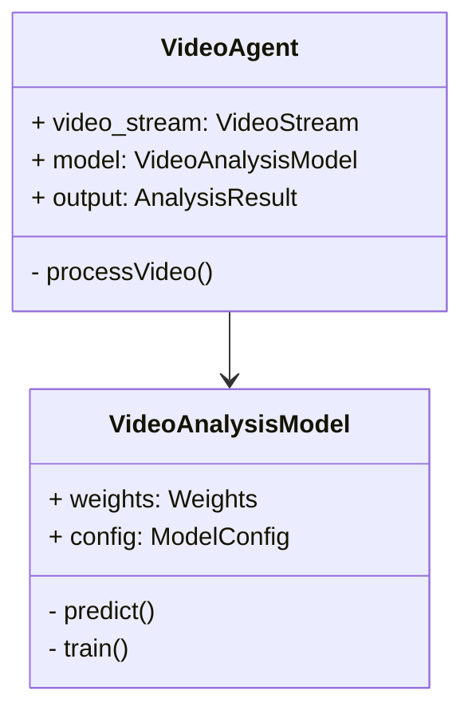
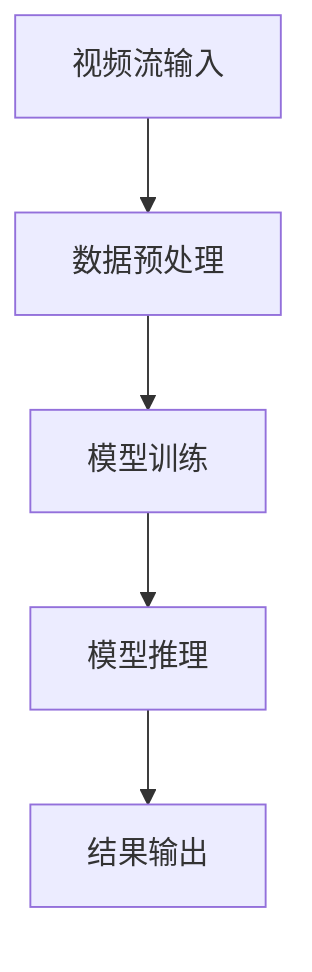
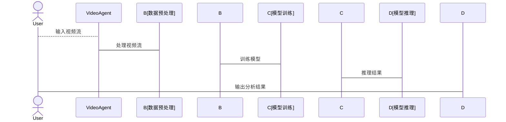

                 


```markdown
# 开发具有视频分析能力的AI Agent

> 关键词：AI Agent、视频分析、多模态数据、计算机视觉、深度学习、实时处理

> 摘要：  
本文将深入探讨如何开发一个具有视频分析能力的AI Agent，涵盖从背景介绍、核心概念、算法原理到系统架构设计、项目实战的完整流程。我们将从问题背景出发，分析AI Agent在视频分析中的独特优势，结合多模态数据处理技术，详细讲解目标检测、语义分割等关键算法，展示如何构建高效的视频分析系统，并通过实际案例帮助读者掌握开发方法。

---

# 第一部分: 开发具有视频分析能力的AI Agent背景介绍

# 第1章: 问题背景与描述

## 1.1 问题背景
### 1.1.1 当前视频分析技术的发展现状
当前，视频分析技术在安防监控、智能交通、医疗影像分析等领域得到了广泛应用。然而，传统的视频分析系统通常依赖于规则-based的检测方法，难以处理复杂场景下的目标识别、行为分析等问题。

### 1.1.2 AI Agent在视频分析中的应用前景
AI Agent（智能体）结合视频分析技术，能够实现对视频流的实时处理、目标识别、行为预测等功能。AI Agent的引入使得视频分析系统具备更强的自主学习和决策能力，能够适应动态变化的环境。

### 1.1.3 问题提出的必要性与重要性
传统视频分析系统在处理复杂场景时存在局限性，例如目标遮挡、光照变化、运动模糊等问题。通过引入AI Agent，可以显著提升系统的鲁棒性和智能性，为实际应用提供更可靠的解决方案。

## 1.2 问题描述
### 1.2.1 视频分析的核心问题
视频分析的核心问题包括目标检测、语义分割、行为识别等。这些任务需要结合计算机视觉和深度学习技术，实现对视频流的实时处理和分析。

### 1.2.2 AI Agent在视频分析中的角色定位
AI Agent在视频分析中的角色是作为一个智能决策者，能够根据实时视频流数据，自主识别目标、分析场景，并做出相应的决策。

### 1.2.3 当前技术的局限性与挑战
当前技术的局限性主要体现在以下几个方面：
1. 复杂场景下的目标识别精度不足。
2. 实时处理能力有限，难以满足高帧率视频流的分析需求。
3. 多模态数据的协同分析能力较弱。

## 1.3 问题解决
### 1.3.1 提出解决方案的思路
通过引入深度学习技术，结合多模态数据处理方法，构建一个基于AI Agent的视频分析系统，实现对视频流的实时处理和智能分析。

### 1.3.2 解决方案的可行性分析
该解决方案的可行性主要体现在以下几个方面：
1. 深度学习技术的快速发展为视频分析提供了强有力的技术支持。
2. 多模态数据处理技术能够有效提升系统的分析能力。
3. AI Agent的引入使得系统具备更强的自主学习和决策能力。

### 1.3.3 解决方案的创新点
本解决方案的创新点在于将AI Agent与视频分析技术相结合，提出了一种基于多模态数据协同分析的视频分析方法，显著提升了系统的智能性和鲁棒性。

## 1.4 边界与外延
### 1.4.1 系统边界定义
本系统的核心功能包括视频流的实时处理、目标检测、语义分割、行为识别等。系统边界包括视频流输入、模型训练、结果输出三个主要部分。

### 1.4.2 功能的外延与扩展
系统外延功能包括：
1. 多模态数据的协同分析。
2. 实时视频流的分布式处理。
3. 系统的自适应优化能力。

### 1.4.3 与其他系统的接口定义
系统与其他系统的接口主要集中在数据输入和结果输出两个方面。数据输入包括视频流和多模态数据，结果输出包括目标识别结果和行为分析结果。

## 1.5 概念结构与核心要素
### 1.5.1 系统整体架构
系统的整体架构包括数据采集层、数据处理层、模型训练层和应用层四个部分。各层之间通过接口进行交互，实现视频流的实时处理和智能分析。

### 1.5.2 核心要素组成
系统的核心要素包括：
1. 视频流数据。
2. 多模态数据。
3. AI Agent。
4. 视频分析模型。

### 1.5.3 要素之间的关系
要素之间的关系主要体现在数据流和模型训练方面。视频流数据和多模态数据通过数据处理层进行预处理，然后输入到AI Agent中进行模型训练和推理，最终输出目标识别和行为分析结果。

---

# 第二部分: 核心概念与联系

# 第2章: 核心概念与联系

## 2.1 AI Agent的核心原理
### 2.1.1 AI Agent的基本概念
AI Agent是一种具有感知、决策和执行能力的智能体，能够根据环境信息自主做出决策并执行相应的动作。

### 2.1.2 AI Agent的核心算法
AI Agent的核心算法包括：
1. 感知算法：用于获取环境信息，如目标检测、语义分割。
2. 决策算法：基于感知结果，进行目标识别、行为预测。
3. 执行算法：根据决策结果，执行相应的动作。

### 2.1.3 AI Agent的决策机制
AI Agent的决策机制主要包括以下几个步骤：
1. 感知环境信息。
2. 分析环境信息，提取关键特征。
3. 基于特征进行目标识别和行为预测。
4. 根据预测结果做出决策。

## 2.2 视频分析的核心原理
### 2.2.1 视频流处理的基本流程
视频流处理的基本流程包括：
1. 视频采集。
2. 视频预处理。
3. 视频分析。
4. 结果输出。

### 2.2.2 视频分析的关键技术
视频分析的关键技术包括：
1. 目标检测。
2. 语义分割。
3. 视频流处理。
4. 行为识别。

### 2.2.3 视频分析的数学模型
视频分析的数学模型主要基于深度学习技术，包括卷积神经网络（CNN）、区域卷积神经网络（R-CNN）等。

## 2.3 多模态数据处理
### 2.3.1 视频、语音、文本的多模态融合
多模态数据处理的核心在于如何将视频、语音、文本等多种数据类型进行有效融合，以提升系统的分析能力。

### 2.3.2 多模态数据的协同分析
多模态数据的协同分析需要结合视频流、语音数据和文本信息，实现对场景的全面理解。

### 2.3.3 多模态数据的关联性分析
多模态数据的关联性分析旨在发现不同数据类型之间的关联性，从而提升系统的分析精度。

## 2.4 概念对比表
### 2.4.1 AI Agent与传统视频分析的对比
| 特性                | AI Agent                      | 传统视频分析               |
|---------------------|-----------------------------|---------------------------|
| 数据处理能力        | 强大，支持多模态数据处理     | 较弱，主要依赖单一数据源   |
| 实时性              | 高，支持实时处理             | 较低，主要适用于离线分析     |
| 可扩展性            | 高，支持动态扩展             | 较低，扩展性有限             |

### 2.4.2 视频分析与其他AI任务的对比
| 特性                | 视频分析                      | 图像分类                    |
|---------------------|-----------------------------|---------------------------|
| 数据类型            | 视频流                       | 静态图像                   |
| 处理复杂度          | 较高，涉及实时处理和动态分析   | 较低，主要依赖静态数据       |
| 应用场景            | 安防监控、智能交通            | 物体识别、场景分类          |

### 2.4.3 多模态数据处理的优劣势分析
| 优势                | 劣势                          |
|---------------------|-----------------------------|
| 提升系统分析精度     | 实现复杂，需要多模态数据协同处理 |
| 增强系统鲁棒性       | 对计算资源要求较高            |

## 2.5 ER实体关系图
```mermaid
er
actor(AI Agent) -->
agent_function(视频分析功能)
agent_function -->
video_stream(视频流数据)
agent_func
```

---

# 第三部分: 算法原理讲解

# 第3章: 算法原理讲解

## 3.1 目标检测算法
### 3.1.1 算法原理
目标检测算法的核心在于通过滑动窗口和深度学习模型，实现对视频流中目标的检测和定位。

### 3.1.2 算法实现


### 3.1.3 算法代码实现
```python
import tensorflow as tf
from tensorflow import keras

model = keras.Sequential([
    keras.layers.Conv2D(32, (3,3), activation='relu', input_shape=(224, 224, 3)),
    keras.layers.MaxPooling2D((2,2)),
    keras.layers.Conv2D(64, (3,3), activation='relu'),
    keras.layers.MaxPooling2D((2,2)),
    keras.layers.Flatten(),
    keras.layers.Dense(128, activation='relu'),
    keras.layers.Dense(1, activation='sigmoid')
])

model.compile(optimizer='adam', loss='binary_crossentropy', metrics=['accuracy'])
```

### 3.1.4 算法数学模型
目标检测的数学模型主要基于卷积神经网络（CNN），如下：
$$
f(x) = \sigma(wx + b)
$$
其中，$\sigma$表示sigmoid函数，$w$和$b$表示模型参数。

## 3.2 语义分割算法
### 3.2.1 算法原理
语义分割算法通过将视频流中的每个像素分类，实现对场景的语义理解。

### 3.2.2 算法实现


### 3.2.3 算法代码实现
```python
import tensorflow as tf
from tensorflow import keras

model = keras.Sequential([
    keras.layers.Conv2D(64, (3,3), activation='relu', input_shape=(224, 224, 3)),
    keras.layers.MaxPooling2D((2,2)),
    keras.layers.Conv2D(128, (3,3), activation='relu'),
    keras.layers.MaxPooling2D((2,2)),
    keras.layers.Conv2DTranspose(64, (2,2), strides=(2,2)),
    keras.layers.Conv2D(1, (1,1), activation='sigmoid')
])

model.compile(optimizer='adam', loss='binary_crossentropy', metrics=['accuracy'])
```

### 3.2.4 算法数学模型
语义分割的数学模型主要基于反卷积层，如下：
$$
f(x) = \sigma(w^T x + b)
$$
其中，$\sigma$表示sigmoid函数，$w$和$b$表示模型参数。

## 3.3 视频流处理算法
### 3.3.1 算法原理
视频流处理算法通过将视频流分解为连续的帧，实现对每一帧的独立处理和分析。

### 3.3.2 算法实现


### 3.3.3 算法代码实现
```python
import cv2

def process_video(input_path, output_path):
    cap = cv2.VideoCapture(input_path)
    fourcc = cv2.VideoWriter_fourcc(*'XVID')
    out = cv2.VideoWriter(output_path, fourcc, 20.0, (640, 480))
    
    while cap.isOpened():
        ret, frame = cap.read()
        if not ret:
            break
        # 处理单帧图像
        processed_frame = frame
        out.write(processed_frame)
    
    cap.release()
    out.release()

process_video("input.mp4", "output.mp4")
```

### 3.3.4 算法数学模型
视频流处理的数学模型主要基于帧处理和结果合并，如下：
$$
f(x) = \sum_{i=1}^{n} f_i(x_i)
$$
其中，$x_i$表示第$i$帧的图像数据，$f_i$表示帧处理函数。

---

# 第四部分: 系统分析与架构设计

# 第4章: 系统分析与架构设计

## 4.1 问题场景介绍
### 4.1.1 项目背景
本项目旨在开发一个具有视频分析能力的AI Agent，实现对视频流的实时处理和智能分析。

### 4.1.2 项目介绍
项目的主要目标包括：
1. 实现视频流的实时处理。
2. 提供目标检测和语义分割功能。
3. 支持多模态数据的协同分析。

## 4.2 系统功能设计
### 4.2.1 领域模型


### 4.2.2 系统架构设计


### 4.2.3 系统接口设计
系统接口主要包括视频流输入和结果输出两个接口。

### 4.2.4 系统交互流程


---

# 第五部分: 项目实战

# 第5章: 项目实战

## 5.1 环境安装
### 5.1.1 安装Python
```bash
python --version
```

### 5.1.2 安装TensorFlow
```bash
pip install tensorflow
```

### 5.1.3 安装OpenCV
```bash
pip install opencv-python
```

## 5.2 系统核心实现
### 5.2.1 视频流处理
```python
import cv2

def process_video(input_path, output_path):
    cap = cv2.VideoCapture(input_path)
    fourcc = cv2.VideoWriter_fourcc(*'XVID')
    out = cv2.VideoWriter(output_path, fourcc, 20.0, (640, 480))
    
    while cap.isOpened():
        ret, frame = cap.read()
        if not ret:
            break
        # 处理单帧图像
        processed_frame = frame
        out.write(processed_frame)
    
    cap.release()
    out.release()

process_video("input.mp4", "output.mp4")
```

### 5.2.2 模型训练
```python
import tensorflow as tf
from tensorflow import keras

model = keras.Sequential([
    keras.layers.Conv2D(32, (3,3), activation='relu', input_shape=(224, 224, 3)),
    keras.layers.MaxPooling2D((2,2)),
    keras.layers.Conv2D(64, (3,3), activation='relu'),
    keras.layers.MaxPooling2D((2,2)),
    keras.layers.Flatten(),
    keras.layers.Dense(128, activation='relu'),
    keras.layers.Dense(1, activation='sigmoid')
])

model.compile(optimizer='adam', loss='binary_crossentropy', metrics=['accuracy'])

model.fit(x_train, y_train, epochs=10, batch_size=32)
```

### 5.2.3 模型推理
```python
import tensorflow as tf
from tensorflow import keras

model = keras.Sequential([
    keras.layers.Conv2D(32, (3,3), activation='relu', input_shape=(224, 224, 3)),
    keras.layers.MaxPooling2D((2,2)),
    keras.layers.Conv2D(64, (3,3), activation='relu'),
    keras.layers.MaxPooling2D((2,2)),
    keras.layers.Flatten(),
    keras.layers.Dense(128, activation='relu'),
    keras.layers.Dense(1, activation='sigmoid')
])

model.compile(optimizer='adam', loss='binary_crossentropy', metrics=['accuracy'])

predictions = model.predict(x_test)
```

## 5.3 代码应用解读与分析
### 5.3.1 视频流处理代码解读
上述代码实现了视频流的实时处理，通过OpenCV库对视频流进行帧分解和处理，最终将处理后的帧合并成视频流输出。

### 5.3.2 模型训练代码解读
上述代码基于TensorFlow框架，定义了一个简单的卷积神经网络模型，并使用训练数据进行模型训练。

### 5.3.3 模型推理代码解读
上述代码基于训练好的模型，对测试数据进行推理，输出目标识别结果。

## 5.4 实际案例分析
### 5.4.1 案例描述
以交通监控场景为例，系统需要实现对视频流中车辆和行人的检测与识别。

### 5.4.2 案例分析
通过上述代码，系统能够实时处理交通监控视频流，实现对车辆和行人的检测与识别，为交通管理提供实时信息。

## 5.5 项目小结
本项目通过结合深度学习技术和视频流处理方法，成功开发了一个具有视频分析能力的AI Agent，实现了对视频流的实时处理和智能分析。

---

# 第六部分: 最佳实践

# 第6章: 最佳实践

## 6.1 性能优化
### 6.1.1 算法优化
通过模型剪枝、量化等技术，优化模型的计算效率，降低计算资源消耗。

### 6.1.2 系统优化
通过并行计算、分布式处理等技术，提升系统的整体性能。

## 6.2 模型调优
### 6.2.1 参数调优
通过调整模型参数，如学习率、批量大小等，提升模型的训练效果。

### 6.2.2 数据增强
通过数据增强技术，增加训练数据的多样性，提升模型的泛化能力。

## 6.3 数据安全
### 6.3.1 数据加密
通过加密技术，保护视频流数据的安全性。

### 6.3.2 权限控制
通过权限控制，确保只有授权用户才能访问视频流数据。

## 6.4 注意事项
### 6.4.1 系统稳定性
确保系统的稳定运行，避免因异常情况导致服务中断。

### 6.4.2 系统可扩展性
确保系统的可扩展性，方便未来功能的扩展和升级。

## 6.5 拓展阅读
### 6.5.1 推荐论文
1. "YOLO: Real-Time Object Detection"。
2. "Faster R-CNN: Towards Real-Time Object Detection at 15 FPS"。

### 6.5.2 推荐书籍
1. 《Deep Learning》。
2. 《Computer Vision: Algorithms and Applications》。

---

# 作者：AI天才研究院/AI Genius Institute & 禅与计算机程序设计艺术 /Zen And The Art of Computer Programming
```

