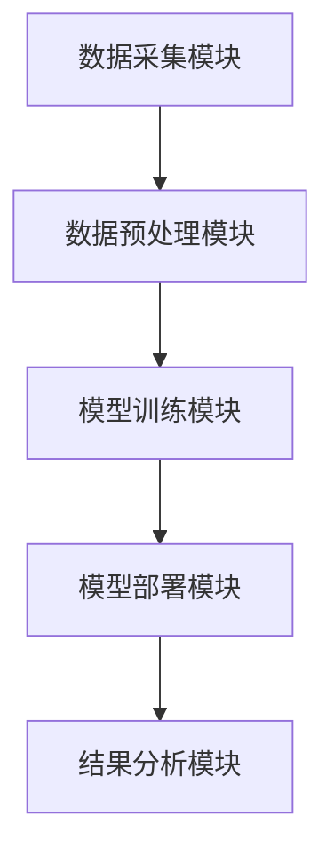

                 


# 智能财务舞弊模式识别系统

## 关键词：智能财务，舞弊模式识别，机器学习，深度学习，自然语言处理

## 摘要：  
本文详细探讨了智能财务舞弊模式识别系统的设计与实现，从背景、技术原理到系统架构，结合实际案例分析，全面阐述了如何利用人工智能技术提升财务舞弊识别的效率与准确性。文章首先介绍了财务舞弊的基本概念与智能识别的必要性，随后深入分析了机器学习、深度学习和自然语言处理在舞弊识别中的应用，接着详细讲解了监督学习与无监督学习的算法原理，并通过系统架构设计与项目实战，展示了如何构建一个高效的智能财务舞弊识别系统。

---

## 第一章: 财务舞弊模式识别的背景与意义

### 1.1 财务舞弊的基本概念  
财务舞弊是指通过虚构、隐瞒、篡改财务数据或其他非法手段，误导利益相关者对财务状况的判断，从而谋取不正当利益的行为。常见的财务舞弊手段包括虚增收入、隐瞒支出、虚减负债等。财务舞弊不仅损害企业的利益，还可能引发信任危机，甚至导致企业破产或法律风险。

#### 1.1.1 财务舞弊的定义与分类  
- **定义**：财务舞弊是指在财务报表或其他财务资料中，通过虚构、隐瞒或篡改数据，误导利益相关者的行为。
- **分类**：根据舞弊行为的不同，可以将财务舞弊分为收入舞弊、支出舞弊、资产舞弊、负债舞弊和所有者权益舞弊等。

#### 1.1.2 财务舞弊的常见手段与特征  
- **常见手段**：虚增收入、虚减支出、虚增资产、虚减负债、隐瞒关联交易等。
- **特征**：数据异常、业务逻辑不符、关联性不强、重复交易等。

#### 1.1.3 财务舞弊对企业与社会的危害  
- **对企业的影响**：误导投资者决策、降低企业信用评级、影响融资能力等。
- **对社会的影响**：破坏市场公平性、影响经济秩序、损害公众利益等。

### 1.2 智能识别技术在财务舞弊中的应用  
随着人工智能技术的快速发展，智能识别技术在财务舞弊识别中的应用越来越广泛。传统的财务舞弊识别方法依赖于人工审计，效率低、成本高且容易受到主观因素的影响。而智能识别技术可以通过大数据分析、机器学习和深度学习等方法，快速识别财务数据中的异常模式，提高识别的准确性和效率。

#### 1.2.1 传统财务舞弊识别方法的局限性  
- **效率低**：传统方法依赖人工审计，耗时耗力。
- **主观性强**：审计结果容易受到审计师主观判断的影响。
- **覆盖面有限**：难以覆盖大规模、复杂的财务数据。

#### 1.2.2 智能技术在财务舞弊识别中的优势  
- **高效性**：智能技术可以快速处理海量数据，提高识别效率。
- **准确性**：通过机器学习和深度学习等技术，可以发现复杂的数据模式，提高识别的准确性。
- **可扩展性**：智能技术可以适应不同规模和复杂度的财务数据。

#### 1.2.3 智能财务舞弊识别系统的概念与框架  
智能财务舞弊识别系统是一种基于人工智能技术的财务舞弊识别系统，其核心是利用机器学习、深度学习和自然语言处理等技术，从财务数据中识别异常模式。系统框架包括数据采集、数据预处理、特征提取、模型训练、模型部署和结果分析等模块。

---

## 第二章: 智能财务舞弊模式识别的核心技术  

### 2.1 机器学习在财务舞弊识别中的应用  

#### 2.1.1 监督学习与无监督学习的对比  
- **监督学习**：需要标注的数据进行训练，适用于分类任务。
- **无监督学习**：不需要标注数据，适用于聚类任务。

#### 2.1.2 常见机器学习算法在财务舞弊识别中的应用  
- **决策树**：适用于分类任务，能够处理非数值型数据。
- **随机森林**：通过集成多个决策树模型，提高准确性和鲁棒性。
- **支持向量机（SVM）**：适用于分类任务，能够处理高维数据。

#### 2.1.3 机器学习模型的训练与优化  
- **训练数据**：需要标注的财务数据。
- **特征提取**：提取与财务舞弊相关的特征，如收入与支出的异常波动。
- **模型优化**：通过交叉验证和网格搜索等方法优化模型参数。

### 2.2 深度学习在财务舞弊识别中的应用  

#### 2.2.1 神经网络在财务数据处理中的优势  
- **非线性表达能力**：神经网络可以处理复杂的非线性关系。
- **自动特征提取**：深度学习模型可以自动提取特征，减少人工干预。

#### 2.2.2 CNN与RNN在财务舞弊识别中的应用  
- **卷积神经网络（CNN）**：适用于处理时间序列数据，如财务时间序列数据。
- **循环神经网络（RNN）**：适用于处理长序列数据，如财务报告中的文本数据。

#### 2.2.3 深度学习模型的训练与优化  
- **训练数据**：需要标注的财务数据。
- **模型架构**：设计适合财务数据的神经网络架构。
- **训练优化**：使用Adam优化器和学习率衰减等方法优化模型。

### 2.3 自然语言处理（NLP）在财务舞弊识别中的应用  

#### 2.3.1 NLP在财务报告分析中的作用  
- **文本分类**：将财务报告分为正常和舞弊两类。
- **实体识别**：识别财务报告中的关键实体，如公司名称、金额等。

#### 2.3.2 基于NLP的财务舞弊识别方法  
- **词袋模型**：将财务报告中的文本表示为词袋，提取关键词进行分类。
- **TF-IDF**：计算关键词的重要性，用于文本分类。
- **BERT**：基于预训练的语言模型，进行文本分类和实体识别。

#### 2.3.3 NLP模型的训练与优化  
- **预训练模型**：使用公开的预训练模型，如BERT，进行微调。
- **模型优化**：通过交叉验证和网格搜索等方法优化模型参数。

---

## 第三章: 监督学习算法原理与实现  

### 3.1 监督学习的基本原理  

#### 3.1.1 监督学习的定义与特点  
- **定义**：监督学习是一种机器学习方法，通过标注数据训练模型，使其能够对新数据进行分类或回归。
- **特点**：需要标注数据，适用于分类和回归任务。

#### 3.1.2 监督学习的数学模型  
- **线性回归**：用于回归任务，模型形式为 $y = \beta_0 + \beta_1x + \epsilon$。
- **逻辑回归**：用于分类任务，模型形式为 $P(y=1|x) = \frac{1}{1 + e^{-\beta_0 - \beta_1x}}$。

#### 3.1.3 常见监督学习算法的对比  
- **决策树**：适用于分类任务，具有高可解释性。
- **随机森林**：通过集成多个决策树模型，提高准确性和鲁棒性。
- **支持向量机（SVM）**：适用于分类任务，能够处理高维数据。

### 3.2 常见监督学习算法的实现  

#### 3.2.1 决策树算法的实现  
- **ID3算法**：基于信息增益，选择分裂属性。
- **C4.5算法**：基于信息增益率，选择分裂属性。
- **CART算法**：适用于回归和分类任务，基于基尼指数选择分裂属性。

#### 3.2.2 随机森林算法的实现  
- **随机采样**：在训练数据中随机采样，构建多个决策树。
- **袋装法**：通过投票或平均的方式，得到最终的预测结果。

#### 3.2.3 支持向量机（SVM）算法的实现  
- **核函数**：通过核函数将数据映射到高维空间，进行线性分割。
- **软-margin**：允许部分数据点在间隔内，提高模型的泛化能力。

---

## 第四章: 无监督学习算法原理与实现  

### 4.1 无监督学习的基本原理  

#### 4.1.1 无监督学习的定义与特点  
- **定义**：无监督学习是一种机器学习方法，通过未标注数据训练模型，使其能够发现数据中的潜在结构。
- **特点**：不需要标注数据，适用于聚类和降维任务。

#### 4.1.2 无监督学习的数学模型  
- **K-means聚类**：将数据划分为K个簇，目标是最小化簇内距离。
- **DBSCAN聚类**：基于密度的聚类算法，适用于处理噪声数据。

#### 4.1.3 常见无监督学习算法的对比  
- **K-means**：适用于球形簇，需要预先指定簇数。
- **DBSCAN**：适用于任意形状的簇，能够发现噪声数据。
- **层次聚类**：适用于层次结构的簇，可以通过树状图展示。

### 4.2 常见无监督学习算法的实现  

#### 4.2.1 K-means聚类算法的实现  
- **初始化**：随机选择K个初始质心。
- **迭代**：计算每个数据点到质心的距离，更新质心位置，直到收敛。

#### 4.2.2 DBSCAN聚类算法的实现  
- **密度计算**：计算每个数据点的密度，选择密度大于阈值的点作为核心点。
- **扩张**：从核心点出发，扩展到密度连接的点，形成簇。

#### 4.2.3 层次聚类算法的实现  
- **距离计算**：计算数据点之间的距离，选择合适的距离度量。
- **合并**：根据距离矩阵，逐步合并最近的簇，形成树状结构。

---

## 第五章: 系统架构设计与实现  

### 5.1 系统功能设计  

#### 5.1.1 数据采集模块  
- **功能**：从财务系统中采集财务数据，包括收入、支出、资产、负债等。
- **实现**：通过API接口或文件导入方式，获取财务数据。

#### 5.1.2 数据预处理模块  
- **功能**：对采集到的财务数据进行清洗和特征提取。
- **实现**：使用Pandas库进行数据清洗，使用特征选择方法提取关键特征。

#### 5.1.3 模型训练模块  
- **功能**：对预处理后的数据进行模型训练，生成可用于识别舞弊的模型。
- **实现**：使用Scikit-learn库训练监督学习模型，使用Keras库训练深度学习模型。

#### 5.1.4 模型部署模块  
- **功能**：将训练好的模型部署到生产环境，用于实时识别财务舞弊。
- **实现**：将模型封装为API服务，提供给前端调用。

#### 5.1.5 结果分析模块  
- **功能**：对模型识别的结果进行分析，生成报告和可视化图表。
- **实现**：使用Matplotlib库进行数据可视化，生成分析报告。

### 5.2 系统架构设计  

#### 5.2.1 模块划分  
- **数据采集模块**：负责数据的采集和存储。
- **数据预处理模块**：负责数据的清洗和特征提取。
- **模型训练模块**：负责模型的训练和优化。
- **模型部署模块**：负责模型的部署和应用。
- **结果分析模块**：负责结果的分析和可视化。

#### 5.2.2 系统架构图  


#### 5.2.3 接口设计  
- **数据接口**：定义数据格式和接口协议，确保不同模块之间的数据交互。
- **模型接口**：定义模型调用接口，方便前端调用。

#### 5.2.4 交互流程  
- **数据采集**：通过API接口或文件导入，获取财务数据。
- **数据预处理**：清洗数据，提取特征。
- **模型训练**：训练模型，优化参数。
- **模型部署**：将模型部署到生产环境，提供API服务。
- **结果分析**：调用模型，分析识别结果，生成报告。

---

## 第六章: 项目实战  

### 6.1 环境配置  

#### 6.1.1 安装必要的库  
- **Python**：3.6及以上版本。
- **Pandas**：用于数据处理。
- **Scikit-learn**：用于机器学习算法。
- **Keras**：用于深度学习模型。
- **Matplotlib**：用于数据可视化。

#### 6.1.2 配置开发环境  
- **IDE**：PyCharm或Jupyter Notebook。
- **虚拟环境**：使用virtualenv或conda管理依赖。

### 6.2 核心实现  

#### 6.2.1 数据采集与预处理  
```python
import pandas as pd

# 数据采集
data = pd.read_csv('financial_data.csv')

# 数据清洗
data = data.dropna()
data = data.drop_duplicates()

# 特征提取
features = data[['收入', '支出', '资产', '负债']]
labels = data['标签']  # 1表示舞弊，0表示正常
```

#### 6.2.2 模型训练  
```python
from sklearn.model_selection import train_test_split
from sklearn.ensemble import RandomForestClassifier
from sklearn.metrics import accuracy_score

# 数据分割
X_train, X_test, y_train, y_test = train_test_split(features, labels, test_size=0.2)

# 模型训练
model = RandomForestClassifier()
model.fit(X_train, y_train)

# 模型评估
y_pred = model.predict(X_test)
print('准确率:', accuracy_score(y_test, y_pred))
```

#### 6.2.3 模型部署  
```python
# 将模型保存为pickle文件
import joblib

joblib.dump(model, 'financial_fraud.pkl')

# 创建API接口
from flask import Flask, request, jsonify

app = Flask(__name__)

@app.route('/predict', methods=['POST'])
def predict():
    data = request.json['data']
    # 数据预处理
    features = pd.DataFrame([data])[['收入', '支出', '资产', '负债']]
    # 预测
    prediction = model.predict(features)
    return jsonify({'result': int(prediction[0])})

if __name__ == '__main__':
    app.run(debug=True)
```

#### 6.2.4 案例分析  
假设我们有一个财务数据集，其中包含收入、支出、资产、负债和标签（1表示舞弊，0表示正常）。通过上述代码，我们可以训练一个随机森林模型，并通过API接口进行实时预测。例如，输入以下数据：
```json
{
  "data": {
    "收入": 1000000,
    "支出": 500000,
    "资产": 800000,
    "负债": 200000
  }
}
```
模型预测结果为1，表示存在舞弊行为。

---

## 第七章: 总结与展望  

### 7.1 总结  
本文详细探讨了智能财务舞弊模式识别系统的设计与实现，从背景、技术原理到系统架构，结合实际案例分析，全面阐述了如何利用人工智能技术提升财务舞弊识别的效率与准确性。通过机器学习、深度学习和自然语言处理等技术，我们可以有效地识别财务数据中的异常模式，帮助企业和审计机构降低财务舞弊的风险。

### 7.2 未来展望  
未来，随着人工智能技术的不断发展，智能财务舞弊模式识别系统将更加智能化和高效化。一方面，我们可以进一步优化现有的算法，提高识别的准确性和效率；另一方面，我们可以探索新的技术，如强化学习和图神经网络，进一步提升系统的识别能力。此外，随着大数据技术的普及，我们可以将更多的财务数据纳入分析范围，进一步提高识别的全面性和准确性。

### 7.3 注意事项  
在实际应用中，需要注意以下几点：  
1. 数据隐私与安全：确保财务数据的安全性和隐私性。  
2. 模型解释性：确保模型的可解释性，便于审计和解释。  
3. 模型更新：定期更新模型，以应对新的舞弊手段和技术变化。

---

## 作者：AI天才研究院/AI Genius Institute & 禅与计算机程序设计艺术/Zen And The Art of Computer Programming  

---

本文通过详细的技术分析和实际案例，展示了如何利用人工智能技术构建智能财务舞弊模式识别系统。希望本文能够为相关领域的研究和实践提供有价值的参考。

