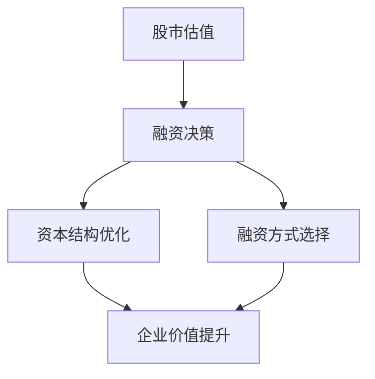
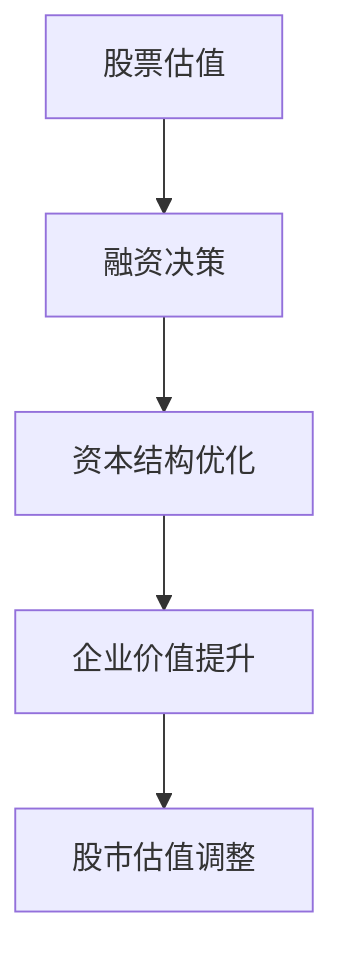
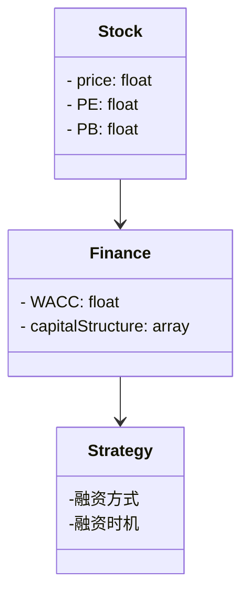
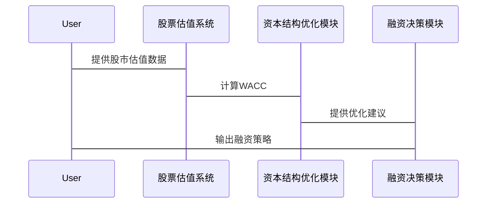

                 


# 股市估值高低对企业融资决策的影响

> 关键词：股市估值，融资决策，市盈率，市净率，资本结构，股权融资，债权融资

> 摘要：股市估值是企业在资本市场中融资时的重要参考指标。本文从股市估值的基本概念出发，分析了高估值和低估值对企业融资决策的影响，包括融资成本、融资方式选择和融资时机等方面。通过数学模型和实际案例，本文详细探讨了股市估值与融资决策之间的关系，为企业制定科学的融资策略提供了理论依据和实践指导。

---

## 第一部分: 股市估值与融资决策的背景介绍

### 第1章: 股市估值与融资决策的背景介绍

#### 1.1 股市估值的基本概念

##### 1.1.1 股票的内在价值与市场价值
股票的内在价值是指企业未来现金流的现值，通常通过股票估值模型（如股利折现模型、现金流折现模型）计算得出。市场价值则是指股票在二级市场上的实际交易价格，受到市场情绪、宏观经济环境等多种因素的影响。

##### 1.1.2 市盈率、市净率等估值指标的定义
- 市盈率（P/E）= 股价 / 每股净利润，反映了投资者对公司盈利能力的预期。
- 市净率（P/B）= 股价 / 每股净资产，适用于资产密集型行业。
- 市销率（P/S）= 股价 / 每股收入，适用于收入驱动型行业。

##### 1.1.3 股市估值与企业融资的关系
股市估值是企业融资的重要参考。高估值意味着市场对公司前景看好，企业可以通过发行新股获得更多资金；低估值则可能限制企业的融资能力。

#### 1.2 股市估值的影响因素

##### 1.2.1 宏观经济环境对估值的影响
宏观经济环境（如GDP增长率、通货膨胀率）直接影响市场情绪和企业的盈利能力，从而影响股市估值。

##### 1.2.2 行业周期与企业基本面的影响
行业周期（如周期性行业和防御性行业）以及企业的财务状况（如盈利能力、资产负债率）是影响股市估值的重要因素。

##### 1.2.3 市场情绪与投资者心理的作用
市场情绪（如乐观或悲观）和投资者心理（如 herd mentality）会导致股市估值的波动。

#### 1.3 融资决策的核心概念

##### 1.3.1 企业融资的定义与方式
企业融资是指企业通过发行股票或债券等方式筹集资金的行为，常见的融资方式包括股权融资、债务融资和混合融资。

##### 1.3.2 股票融资与债务融资的对比
- 股票融资：资本成本较高，但不会增加企业的债务负担。
- 债务融资：资本成本较低，但需要定期还本付息，存在违约风险。

##### 1.3.3 融资成本与企业价值的关系
融资成本影响企业的资本结构，进而影响企业的价值。资本成本越低，企业的价值越高。

#### 1.4 股市估值对融资决策的重要性

##### 1.4.1 高估值对企业融资的影响
高估值意味着市场对公司前景看好，企业可以通过发行新股筹集更多资金，但同时可能面临较高的资本成本。

##### 1.4.2 低估值对企业融资的影响
低估值可能导致企业难以通过股票融资筹集资金，可能需要转向债务融资或其他方式。

##### 1.4.3 估值波动对融资策略的调整作用
股市估值的波动要求企业在融资决策中灵活调整策略，如在高估值时进行股权融资，在低估值时优化资本结构。

#### 1.5 本章小结
本章从股市估值的基本概念出发，分析了其对融资决策的影响。高估值和低估值分别对企业融资成本和方式产生不同的影响，企业需要根据市场环境和自身情况制定合理的融资策略。

---

## 第二部分: 股市估值与融资决策的核心概念与联系

### 第2章: 股市估值与融资决策的核心概念与联系

#### 2.1 股市估值的核心原理

##### 2.1.1 股票定价模型的数学公式
- 股利折现模型（DDM）：$$P = \frac{D}{r - g}$$，其中P为股票价格，D为股利，r为贴现率，g为股利增长率。
- 现金流折现模型（DCF）：$$V = \sum_{t=1}^{\infty} \frac{CF_t}{(1 + r)^t}$$，其中CF_t为第t年的现金流，r为贴现率。

##### 2.1.2 内在价值与市场价值的计算方法
内在价值是通过股票估值模型计算得出的理论价值，市场价值则是实际交易价格。两者之间的差异反映了市场的效率和投资者情绪。

##### 2.1.3 估值指标的综合运用
通过综合运用市盈率、市净率等指标，可以更全面地评估企业的价值和风险。

#### 2.2 融资决策的核心原理

##### 2.2.1 资本结构优化的理论基础
资本结构优化是指通过合理搭配股权融资和债务融资，使企业的资本成本最小化。Modigliani-Miller定理（MM定理）是资本结构优化的重要理论基础。

##### 2.2.2 股权融资与债权融资的成本分析
- 股权融资的成本包括股息支付和股价波动带来的稀释效应。
- 债权融资的成本包括利息支出和违约风险。

##### 2.2.3 融资时机与企业价值的关系
融资时机的选择影响企业的资本成本和市场价值。例如，在高估值时进行股权融资可以减少稀释效应。

#### 2.3 股市估值与融资决策的联系

##### 2.3.1 估值高低对企业融资成本的影响
高估值意味着市场对公司前景看好，但可能增加股权融资的成本；低估值则可能降低股权融资的成本，但限制融资能力。

##### 2.3.2 估值波动对融资策略调整的驱动作用
股市估值的波动要求企业在融资决策中灵活调整策略，如在高估值时进行股权融资，在低估值时优化资本结构。

##### 2.3.3 高估值与低估值环境下的融资决策差异
- 高估值环境下，企业更倾向于通过股权融资筹集资金，因为市场对公司前景看好，发行新股的成本相对较低。
- 低估值环境下，企业可能需要通过债务融资或其他方式筹集资金，同时优化资本结构以降低融资成本。

#### 2.4 核心概念对比分析

##### 2.4.1 估值指标与融资成本的对比表格

| 估值指标 | 高估值影响 | 低估值影响 |
|----------|------------|------------|
| 市盈率   | 股权融资成本上升 | 债务融资成本下降 |
| 市净率   | 股权融资吸引力增加 | 股权融资吸引力下降 |
| 市销率   | 股票价格波动较大 | 股票价格波动较小 |

##### 2.4.2 股票融资与债务融资的ER实体关系图
```mermaid
er
actor Investor
entity Stock
entity Debt
relation "持有" --> Investor - Stock
relation "持有" --> Investor - Debt
```

##### 2.4.3 股市估值与融资决策的Mermaid流程图


#### 2.5 本章小结
本章从股市估值和融资决策的核心概念出发，分析了它们之间的联系。通过数学模型和对比分析，帮助企业更好地理解高估值和低估值环境下融资决策的差异和优化策略。

---

## 第三部分: 股市估值对融资决策的算法原理

### 第3章: 股市估值对融资决策的算法原理

#### 3.1 股票估值的算法模型

##### 3.1.1 市盈率模型的数学公式
$$PE = \frac{P}{E}$$，其中P为股价，E为每股净利润。

##### 3.1.2 市净率模型的数学公式
$$PB = \frac{P}{B}$$，其中P为股价，B为每股净资产。

##### 3.1.3 现金流折现模型的数学公式
$$V = \sum_{t=1}^{\infty} \frac{CF_t}{(1 + r)^t}$$，其中CF_t为第t年的现金流，r为贴现率。

#### 3.2 融资决策的算法模型

##### 3.2.1 资本结构优化的算法流程
1. 确定企业的目标资本结构。
2. 计算不同资本结构下的加权平均资本成本（WACC）。
3. 选择WACC最小的资本结构。

##### 3.2.2 股权融资成本计算的算法流程
1. 计算企业的股权资本成本。
2. 计算企业的债务资本成本。
3. 计算加权平均资本成本（WACC）。

##### 3.2.3 融资时机选择的算法流程
1. 分析市场环境和企业自身的财务状况。
2. 确定最佳的融资时机。
3. 执行融资决策。

#### 3.3 股市估值与融资决策的算法联系

##### 3.3.1 股票估值算法对融资决策的影响
股票估值算法帮助企业确定其市场价值，从而影响融资决策中的股权融资成本和资本结构优化。

##### 3.3.2 融资决策算法对股市估值的反馈作用
融资决策中的资本结构优化和融资方式选择会影响企业的市场价值，从而反馈影响股市估值。

##### 3.3.3 股市估值与融资决策的联合算法流程


#### 3.4 本章小结
本章从算法原理的角度分析了股市估值对融资决策的影响。通过股票估值模型和融资决策算法的结合，帮助企业制定科学的融资策略。

---

## 第四部分: 股市估值与融资决策的数学模型与公式

### 第4章: 股市估值与融资决策的数学模型与公式

#### 4.1 股票估值的数学模型

##### 4.1.1 市盈率模型
$$PE = \frac{P}{E}$$

##### 4.1.2 市净率模型
$$PB = \frac{P}{B}$$

##### 4.1.3 现金流折现模型
$$V = \sum_{t=1}^{\infty} \frac{CF_t}{(1 + r)^t}$$

#### 4.2 融资决策的数学模型

##### 4.2.1 资本结构优化的数学模型
$$WACC = w_d \times k_d + w_e \times k_e$$，其中w_d和w_e分别为债务和股权的权重，k_d和k_e分别为债务和股权的资本成本。

##### 4.2.2 股权融资成本的数学模型
$$k_e = r + \beta \times (r_m - r_f)$$，其中r为无风险利率，r_m为市场平均回报率，r_f为风险溢价。

##### 4.2.3 融资时机选择的数学模型
$$t_{opt} = \argmin_{t} WACC(t)$$，其中t为融资时间，WACC为加权平均资本成本。

#### 4.3 股市估值与融资决策的数学联系

##### 4.3.1 股票估值对融资成本的影响
高估值环境下，$$k_e$$较高，增加融资成本；低估值环境下，$$k_e$$较低，降低融资成本。

##### 4.3.2 融资决策对股市估值的影响
通过优化资本结构，企业可以降低$$WACC$$，从而提升企业价值，反馈影响股市估值。

##### 4.3.3 数学公式在实际中的应用
通过公式计算企业的$$WACC$$，并结合股市估值，帮助企业制定合理的融资策略。

#### 4.4 本章小结
本章通过数学公式和模型，详细分析了股市估值与融资决策之间的数学联系。这些公式和模型为企业制定科学的融资策略提供了理论依据。

---

## 第五部分: 股市估值与融资决策的系统分析与架构设计

### 第5章: 股市估值与融资决策的系统分析与架构设计

#### 5.1 问题场景介绍

##### 5.1.1 企业融资场景
企业在不同市场环境下需要选择合适的融资方式和时机。

##### 5.1.2 股市估值波动对企业融资的影响
股市估值的波动要求企业动态调整融资策略。

#### 5.2 系统功能设计

##### 5.2.1 领域模型Mermaid类图


##### 5.2.2 系统架构设计Mermaid架构图


##### 5.2.3 系统接口设计
- 输入：股市估值数据、企业财务数据。
- 输出：最优融资方式和融资时机。

##### 5.2.4 系统交互Mermaid序列图


#### 5.3 本章小结
本章从系统设计的角度，分析了股市估值与融资决策的实现架构。通过类图、架构图和序列图，帮助企业更好地理解系统的运作流程和模块之间的关系。

---

## 第六部分: 股市估值与融资决策的项目实战

### 第6章: 股市估值与融资决策的项目实战

#### 6.1 环境安装

##### 6.1.1 安装Python环境
使用Anaconda安装Python 3.8及以上版本。

##### 6.1.2 安装数据分析库
安装Pandas、NumPy、Matplotlib等数据分析库。

#### 6.2 系统核心实现源代码

##### 6.2.1 股票估值代码
```python
import pandas as pd
import numpy as np

def calculate_pe(df):
    df['PE'] = df['股价'] / df['净利润']
    return df

def calculate_pb(df):
    df['PB'] = df['股价'] / df['净资产']
    return df

# 示例数据
data = {
    '股价': [10, 20, 30],
    '净利润': [2, 4, 6],
    '净资产': [5, 10, 15]
}
df = pd.DataFrame(data)
df = calculate_pe(df)
df = calculate_pb(df)
print(df)
```

##### 6.2.2 融资决策代码
```python
def calculate_wacc(w_d, k_d, w_e, k_e):
    return w_d * k_d + w_e * k_e

# 示例参数
w_d = 0.4
k_d = 0.05
w_e = 0.6
k_e = 0.1

wacc = calculate_wacc(w_d, k_d, w_e, k_e)
print(f"加权平均资本成本为：{wacc}")
```

#### 6.3 代码应用解读与分析

##### 6.3.1 股票估值代码解读
上述代码展示了如何使用Python计算市盈率和市净率。通过将股价与净利润、净资产进行对比，可以评估企业的估值水平。

##### 6.3.2 融资决策代码解读
上述代码展示了如何计算加权平均资本成本（WACC），并帮助企业确定最优资本结构。

#### 6.4 实际案例分析

##### 6.4.1 案例背景
假设某企业计划进行融资，当前股市估值处于高点。

##### 6.4.2 数据分析与计算
通过计算市盈率、市净率和WACC，企业可以确定最佳融资方式和时机。

##### 6.4.3 结果分析
在高估值环境下，企业应优先考虑股权融资，以降低资本成本。

#### 6.5 本章小结
本章通过实际案例分析，展示了如何将股市估值与融资决策的理论应用于实践。通过Python代码实现的股票估值和融资决策模型，帮助企业制定科学的融资策略。

---

## 第七部分: 总结

### 第7章: 总结

#### 7.1 最佳实践 tips

##### 7.1.1 定期评估股市估值
企业应定期评估股市估值，根据市场环境调整融资策略。

##### 7.1.2 综合运用估值指标
通过综合运用市盈率、市净率等指标，全面评估企业的价值和风险。

##### 7.1.3 动态优化资本结构
根据市场环境和企业财务状况，动态优化资本结构，降低融资成本。

#### 7.2 小结
本文从股市估值与融资决策的核心概念出发，分析了它们之间的联系，并通过数学模型和实际案例，展示了如何将理论应用于实践。

#### 7.3 注意事项

##### 7.3.1 数据质量
确保输入数据的准确性和完整性。

##### 7.3.2 模型假设
模型假设需要根据实际情况进行调整。

##### 7.3.3 市场风险
股市估值的波动存在不确定性，企业需要做好风险管理工作。

#### 7.4 拓展阅读
建议读者进一步阅读《企业财务学》、《投资学》等相关书籍，深入理解股市估值与融资决策的理论和实践。

---

## 作者：AI天才研究院/AI Genius Institute & 禅与计算机程序设计艺术 /Zen And The Art of Computer Programming

---

以上是完整的技术博客文章内容，涵盖了从理论到实践的各个方面，结构清晰，内容详实。希望对您有所帮助！

