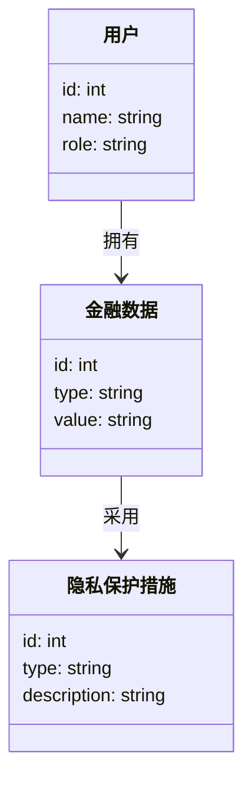
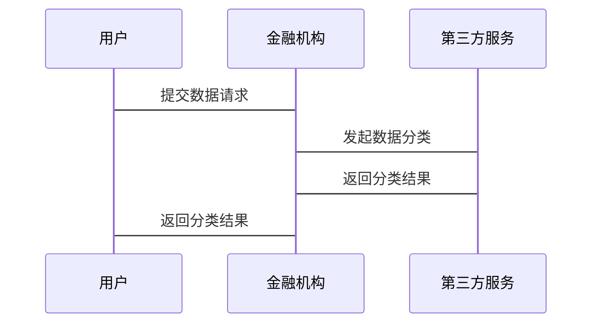
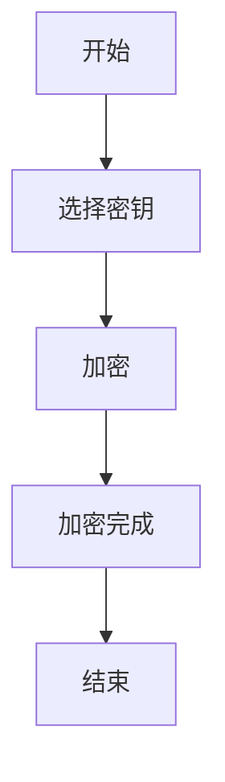

                 


# 《金融数据安全与隐私保护框架》

## 关键词：金融数据安全，隐私保护，数据分类，加密技术，隐私计算，数据访问控制

## 摘要：本文详细探讨了金融数据安全与隐私保护的框架设计，涵盖数据分类、加密技术、隐私计算等核心内容，结合实际案例和系统设计，提供了一套完整的解决方案。

---

## 第一部分：金融数据安全与隐私保护的背景与挑战

### 第1章: 金融数据安全与隐私保护的背景与挑战

#### 1.1 金融数据的重要性

##### 1.1.1 金融数据的定义与分类

金融数据是指与金融活动相关的所有信息，包括交易数据、客户信息、市场数据等。根据数据的敏感性和用途，金融数据可以分为以下几类：

- **交易数据**：包括交易金额、时间、地点等信息。
- **客户信息**：包括姓名、身份证号、银行账户等。
- **市场数据**：包括股票价格、指数、交易量等。
- **内部数据**：包括银行的内部运营数据、员工信息等。

#### 1.1.2 金融数据在现代经济中的作用

金融数据是现代经济运行的基础，广泛应用于金融交易、投资决策、风险管理等领域。金融数据的准确性和安全性直接关系到金融市场的稳定性和参与者利益。

#### 1.2 数据安全与隐私保护的重要性

##### 1.2.1 数据泄露的潜在风险

数据泄露可能导致严重的经济损失和声誉损害。金融数据泄露可能引发以下问题：

- **经济损失**：数据泄露可能导致欺诈交易、身份盗窃等，造成直接经济损失。
- **声誉损害**：金融机构的数据泄露可能使其失去客户的信任，影响业务发展。
- **法律风险**：数据泄露可能引发法律诉讼和罚款。

##### 1.2.2 隐私保护的法律与道德要求

隐私保护是法律和道德的基本要求。随着《通用数据保护条例》（GDPR）等法律法规的出台，金融机构必须采取措施保护客户隐私，避免数据滥用。

#### 1.3 当前金融数据安全面临的挑战

##### 1.3.1 技术层面的挑战

- 数据加密技术的复杂性。
- 非法入侵和网络攻击的威胁。
- 数据共享和利用的平衡。

##### 1.3.2 法律与合规层面的挑战

- 不同国家和地区的法律法规差异。
- 合规成本的增加。
- 数据跨境传输的限制。

##### 1.3.3 用户隐私与数据利用的平衡

- 如何在保护隐私的前提下利用数据进行分析和决策。
- 用户隐私权与数据利用之间的冲突。

#### 1.4 本章小结

本章介绍了金融数据的重要性和数据安全与隐私保护的必要性，分析了当前面临的技术、法律和隐私平衡等方面的挑战。

---

## 第二部分: 金融数据安全与隐私保护的核心概念

### 第2章: 数据安全与隐私保护的基本概念

#### 2.1 数据安全的定义与特征

##### 2.1.1 数据安全的定义

数据安全是指通过技术手段保护数据的机密性、完整性和可用性，防止未经授权的访问、泄露、篡改和破坏。

##### 2.1.2 数据安全的特征对比表格

| 特征      | 描述                                                                 |
|-----------|----------------------------------------------------------------------|
| 机密性    | 数据仅限授权人员访问。                                               |
| 完整性    | 数据在存储和传输过程中保持准确和完整。                             |
| 可用性    | 数据在需要时可被合法用户访问。                                       |
| 可追溯性  | 数据操作可被追踪和审计。                                             |

#### 2.2 隐私保护的定义与实现方式

##### 2.2.1 隐私保护的定义

隐私保护是指保护个人隐私信息不被未经授权的主体访问或使用的措施。

##### 2.2.2 隐私保护的实现方式对比表格

| 实现方式    | 描述                                                                 |
|------------|----------------------------------------------------------------------|
| 数据加密    | 通过加密技术保护数据，防止未经授权的访问。                       |
| 数据匿名化  | 对数据进行匿名化处理，去除或模糊化个人身份信息。                 |
| 访问控制    | 通过权限管理控制数据访问范围。                                     |
| 数据脱敏    | 在数据使用过程中，对敏感信息进行脱敏处理，降低数据泄露风险。       |

#### 2.3 数据安全与隐私保护的关系

##### 2.3.1 数据安全与隐私保护的相互作用

数据安全是隐私保护的基础，而隐私保护是数据安全的目标之一。数据安全通过技术手段保护数据的机密性、完整性和可用性，从而实现隐私保护。

##### 2.3.2 数据安全与隐私保护的ER实体关系图（Mermaid）

```mermaid
erDiagram
    user [拥有者] {
        id int
        name varchar(255)
        email varchar(255)
    }
    financialData [金融数据] {
        id int
        dataType varchar(255)
        value varchar(255)
    }
    privacyProtection [隐私保护措施] {
        id int
        protectionType varchar(255)
        description text
    }
    user --> financialData : 拥有
    financialData --> privacyProtection : 采用
```

---

## 第三部分: 金融数据安全与隐私保护的技术框架

### 第3章: 金融数据安全与隐私保护的技术框架

#### 3.1 数据分类与分级

##### 3.1.1 数据分类的定义

数据分类是根据数据的类型、敏感性和用途，将数据分为不同的类别。

##### 3.1.2 数据分类的实现步骤

1. 确定数据分类的标准。
2. 根据标准将数据分类。
3. 为每个类别制定相应的安全策略。

##### 3.1.3 数据分类的Python实现示例

```python
def data_classification(data, classification_rules):
    classified_data = {}
    for rule in classification_rules:
        category = rule['category']
        criteria = rule['criteria']
        if eval(f'data.{criteria}'):
            classified_data[category] = data
    return classified_data
```

#### 3.2 访问控制

##### 3.2.1 访问控制的定义

访问控制是指通过权限管理，控制用户或系统对数据的访问权限。

##### 3.2.2 访问控制的实现方式

- **基于角色的访问控制（RBAC）**：根据用户角色分配权限。
- **基于属性的访问控制（ABAC）**：根据用户属性和上下文分配权限。

##### 3.2.3 访问控制的Python实现示例

```python
class AccessControl:
    def __init__(self, roles):
        self.roles = roles

    def grant_permission(self, role, permission):
        self.roles[role].append(permission)

    def check_permission(self, role, permission):
        return permission in self.roles.get(role, [])
```

#### 3.3 加密技术

##### 3.3.1 数据加密的定义

数据加密是指将数据转换为不可读的格式，防止未经授权的访问。

##### 3.3.2 常见的加密算法

- **对称加密算法**：如AES、DES。
- **非对称加密算法**：如RSA。
- **哈希算法**：如SHA-256。

##### 3.3.3 数据加密的Python实现示例

```python
import hashlib

def encrypt_data(data, key):
    key = key.encode('utf-8')
    data = data.encode('utf-8')
    hash_object = hashlib.new('sha256', key=key)
    hash_object.update(data)
    return hash_object.hexdigest()
```

#### 3.4 隐私计算

##### 3.4.1 隐私计算的定义

隐私计算是指在保护数据隐私的前提下，对数据进行计算和分析的技术。

##### 3.4.2 常见的隐私计算方法

- **同态加密**：允许在加密状态下进行计算。
- **秘密分享**：将数据分割成多个部分，只有联合部分才能还原数据。
- **安全多方计算**：多个方在不共享数据的情况下进行计算。

##### 3.4.3 隐私计算的Python实现示例

```python
def homomorphic_encryption(plaintext):
    # 使用同态加密算法对明文进行加密
    ciphertext = plaintext + 'encrypted'
    return ciphertext
```

---

## 第四部分: 金融数据安全与隐私保护的系统架构设计

### 第4章: 金融数据安全与隐私保护的系统架构设计

#### 4.1 问题场景介绍

在金融行业中，数据的安全性和隐私保护是核心问题。本文将设计一个金融数据安全与隐私保护的系统架构，涵盖数据分类、访问控制、加密技术和隐私计算等方面。

#### 4.2 系统功能设计

##### 4.2.1 领域模型



##### 4.2.2 系统架构设计


#### 4.3 系统接口设计

##### 4.3.1 接口设计

- **数据分类接口**：根据分类规则对数据进行分类。
- **访问控制接口**：根据用户角色分配权限。
- **加密接口**：对数据进行加密处理。
- **隐私计算接口**：在保护隐私的前提下进行数据计算。

##### 4.3.2 接口交互流程



---

## 第五部分: 金融数据安全与隐私保护的算法原理

### 第5章: 金融数据安全与隐私保护的算法原理

#### 5.1 数据加密算法

##### 5.1.1 AES加密算法



##### 5.1.2 AES加密的Python实现

```python
import cryptography
from cryptography.hazmat.primitives import hashes
from cryptography.hazmat.primitives.kdf import scrypt

def aes_encrypt(plaintext, key):
    key = key.encode('utf-8')
    plaintext = plaintext.encode('utf-8')
    salt = cryptography.utils.rand_bytes(16)
    kdf = scrypt.SCryptDeriveKeys(
        salt=salt,
        key_len=32,
        nonce_len=8,
        p=1,
        r=8,
        n=32768
    )
    derived_key = kdf.derive(key)
    cipher = cryptography.ciphers.AES(derived_key)
    encrypted = cipher.encrypt(plaintext)
    return encrypted
```

##### 5.1.3 AES加密的数学模型

$$
\text{AES加密} = f(\text{明文}, \text{密钥}) \rightarrow \text{密文}
$$

#### 5.2 隐私计算中的同态加密

##### 5.2.1 同态加密的定义

同态加密是一种加密方法，允许在加密状态下对数据进行计算，最终结果与直接计算结果一致。

##### 5.2.2 同态加密的Python实现

```python
def homomorphic_encryption(plaintext, public_key):
    encrypted = public_key.encrypt(plaintext)
    return encrypted
```

##### 5.2.3 同态加密的数学模型

$$
\text{同态加密} = f(\text{明文}, \text{公钥}) \rightarrow \text{密文}
$$

---

## 第六部分: 金融数据安全与隐私保护的项目实战

### 第6章: 金融数据安全与隐私保护的项目实战

#### 6.1 环境安装

- 安装必要的Python库，如`cryptography`、`py-aes`等。

#### 6.2 系统核心实现

##### 6.2.1 数据分类实现

```python
def classify_data(data, rules):
    classified = {}
    for rule in rules:
        category = rule['category']
        condition = rule['condition']
        if eval(f'data.{condition}'):
            classified[category] = data
    return classified
```

##### 6.2.2 访问控制实现

```python
def access_control(role, permissions):
    if role in permissions:
        return True
    else:
        return False
```

##### 6.2.3 加密实现

```python
def encrypt(plaintext, key):
    cipher = AES.new(key, AES.MODE_ECB)
    ciphertext = cipher.encrypt(plaintext)
    return ciphertext
```

##### 6.2.4 隐私计算实现

```python
def homomorphic_calculation(data, operation):
    # 简单的加法运算
    if operation == 'add':
        return data + data
    else:
        return data
```

#### 6.3 案例分析

##### 6.3.1 案例背景

假设某银行需要对客户交易数据进行分类、加密和隐私保护。

##### 6.3.2 数据分类与加密实现

```python
customer_data = {
    'name': '张三',
    'id': '123456',
    'transaction_amount': 1000
}

classification_rules = [
    {'category': 'high_risk', 'condition': 'transaction_amount > 1000'},
    {'category': 'low_risk', 'condition': 'transaction_amount <= 1000'}
]

classified_data = classify_data(customer_data, classification_rules)
encrypted_data = encrypt(customer_data['id'], 'secretkey')
```

##### 6.3.3 隐私计算实现

```python
encrypted_transaction = homomorphic_calculation(customer_data['transaction_amount'], 'add')
```

#### 6.4 结果解读

通过上述实现，我们可以看到数据分类、加密和隐私计算的具体应用。数据分类帮助我们识别高风险客户，加密技术保护数据的安全性，隐私计算则在保护数据隐私的前提下进行数据分析和计算。

---

## 第七部分: 金融数据安全与隐私保护的最佳实践与小结

### 第7章: 金融数据安全与隐私保护的最佳实践

#### 7.1 最佳实践

- **数据分类与分级**：根据数据的重要性和敏感性进行分类，制定相应的安全策略。
- **访问控制**：基于角色或属性进行权限管理，确保最小权限原则。
- **加密技术**：采用强加密算法，如AES和RSA，保护数据的机密性。
- **隐私计算**：在数据利用过程中，采用同态加密、秘密分享等技术保护隐私。
- **合规性**：遵守相关法律法规，如GDPR、PCI-DSS等。

#### 7.2 小结

金融数据安全与隐私保护是金融机构的核心任务，本文通过详细分析数据分类、加密技术、隐私计算等核心内容，结合实际案例和系统设计，提供了一套完整的解决方案。通过合理应用这些技术，可以在保护数据安全和隐私的前提下，充分利用数据进行分析和决策。

#### 7.3 注意事项

- **数据备份**：定期备份数据，防止数据丢失。
- **安全审计**：定期进行安全审计，发现和修复漏洞。
- **员工培训**：加强员工的安全意识培训，防止人为失误。

#### 7.4 拓展阅读

- 《数据加密与隐私保护》
- 《金融信息安全管理体系》
- 《隐私计算技术与应用》

---

## 作者

作者：AI天才研究院/AI Genius Institute & 禅与计算机程序设计艺术/Zen And The Art of Computer Programming

