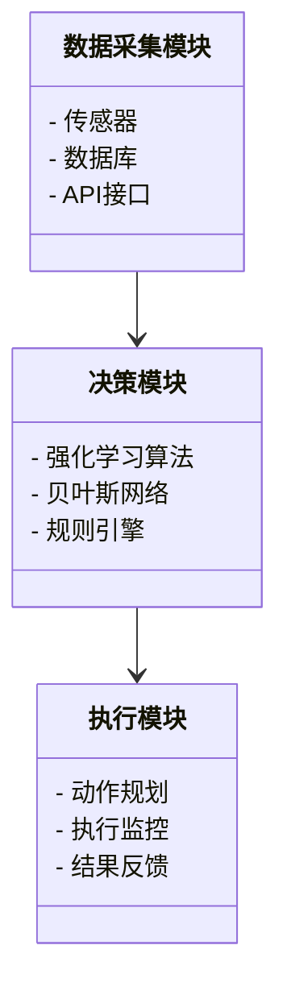
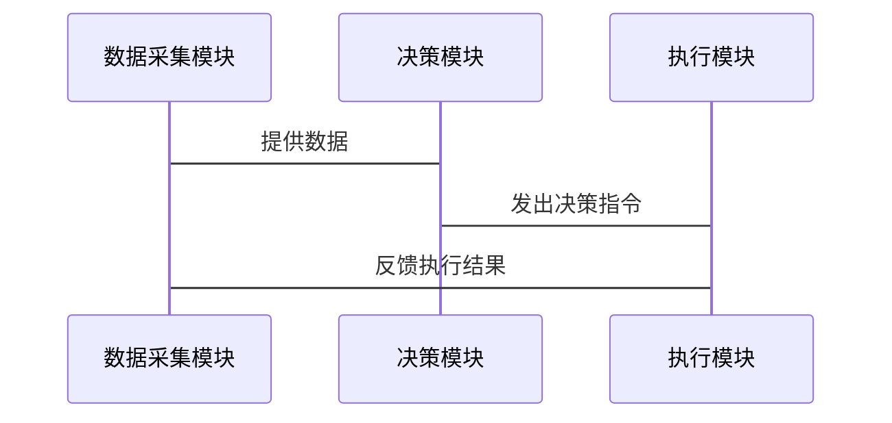

                 


# AI Agent在企业质量管理体系优化中的应用

> **关键词**：AI Agent、企业质量管理、优化、人工智能、系统架构、数学模型  
> **摘要**：本文探讨了AI Agent在企业质量管理体系中的应用，从基本概念到核心原理，再到系统架构和实战案例，详细分析了AI Agent如何优化企业质量管理流程。通过数学模型和算法原理的深入讲解，结合实际项目案例，展示了AI Agent在质量管理中的巨大潜力和具体实现方法。

---

## 第1章: AI Agent的基本概念与应用背景

### 1.1 AI Agent的定义与核心特征

#### 1.1.1 AI Agent的定义  
AI Agent（人工智能代理）是指能够感知环境、自主决策并执行任务的智能实体。它可以是一个软件程序、一个机器人或一个复杂的系统，其核心目标是通过智能化手段优化特定任务的执行效率和效果。

#### 1.1.2 AI Agent的核心特征  
- **自主性**：AI Agent能够在没有外部干预的情况下自主完成任务。  
- **反应性**：能够实时感知环境变化并做出响应。  
- **目标导向性**：以明确的目标为导向，优化决策和行动。  
- **学习能力**：通过数据和经验不断优化自身的性能。  

#### 1.1.3 AI Agent与传统自动化工具的区别  
AI Agent的核心区别在于其“智能性”：它不仅能够执行预设任务，还能通过学习和推理优化任务执行过程，适应复杂多变的环境。

---

### 1.2 企业质量管理体系的现状与挑战

#### 1.2.1 企业质量管理体系的基本概念  
企业质量管理体系是指企业为确保产品或服务符合质量标准而建立的一系列制度、流程和工具。其核心目标是通过标准化流程和持续改进，提升产品质量和服务水平。

#### 1.2.2 当前质量管理中的主要问题  
1. **效率低下**：传统质量管理依赖人工检查，效率低且易出错。  
2. **数据孤岛**：各部门之间数据难以共享，难以形成完整的质量追溯体系。  
3. **应对复杂性不足**：面对复杂的产品和多变的市场需求，传统方法难以快速响应。  

#### 1.2.3 数字化转型对企业质量管理的新要求  
随着数字化转型的推进，企业质量管理需要更加智能化、数据化和实时化。AI Agent的引入为企业质量管理提供了新的可能性。

---

### 1.3 AI Agent在质量管理中的应用前景

#### 1.3.1 AI Agent在质量管理中的潜在价值  
- **实时监控**：通过传感器和物联网技术实时采集数据，快速识别质量问题。  
- **智能预测**：基于历史数据和机器学习模型，预测潜在的质量问题。  
- **优化流程**：通过数据分析优化质量管理流程，降低运营成本。  

#### 1.3.2 企业采用AI Agent的优势  
- **提升效率**：AI Agent能够快速处理大量数据，显著提高质量管理效率。  
- **降低成本**：通过自动化和优化减少人工干预，降低管理成本。  
- **增强决策能力**：基于数据的智能决策能够显著提升质量管理的精准度。  

#### 1.3.3 应用中的主要挑战与解决方案  
- **挑战**：数据隐私、算法复杂性、系统集成难度。  
- **解决方案**：通过数据加密技术保护隐私，采用模块化设计降低算法复杂性，通过接口标准化解决系统集成问题。

---

### 1.4 本章小结  
本章从AI Agent的基本概念出发，分析了企业质量管理体系的现状与挑战，并探讨了AI Agent在质量管理中的应用前景。通过对比AI Agent与传统自动化工具的区别，明确了AI Agent在质量管理中的独特价值。

---

## 第2章: AI Agent的核心原理

### 2.1 AI Agent的基本架构

#### 2.1.1 感知层  
AI Agent的感知层负责从环境中获取数据，通常包括传感器、摄像头等硬件设备和相关数据处理算法。  
- **数据采集**：通过传感器获取环境数据（如温度、湿度等）。  
- **数据处理**：对采集的数据进行清洗、转换和分析，提取有用信息。  

#### 2.1.2 决策层  
决策层是AI Agent的核心，负责根据感知层提供的信息做出决策。  
- **基于规则的决策**：根据预设的规则（如“如果温度超过60℃，则停止生产”）做出决策。  
- **基于机器学习的决策**：通过训练模型（如支持向量机、随机森林）进行分类和预测。  
- **基于强化学习的决策**：通过试错和奖励机制优化决策策略。  

#### 2.1.3 执行层  
执行层负责将决策层的决策转化为具体行动。  
- **动作规划**：制定具体的执行步骤（如“调整生产线速度”）。  
- **执行监控**：实时监控执行过程，确保决策正确执行。  
- **结果反馈**：将执行结果反馈给感知层，形成闭环。

---

### 2.2 AI Agent的感知机制

#### 2.2.1 数据采集与处理  
- **数据采集**：通过传感器、数据库、API等多种方式获取数据。  
- **数据清洗**：去除噪声数据，确保数据质量。  
- **数据融合**：将多源数据进行融合，形成完整的数据集。  

#### 2.2.2 信息融合与分析  
- **信息融合**：通过贝叶斯网络等方法对多源数据进行融合，提高信息的准确性。  
- **异常检测**：基于统计学或机器学习方法识别数据中的异常点。  

#### 2.2.3 异常检测与识别  
- **异常检测**：通过时间序列分析、聚类分析等方法识别数据中的异常点。  
- **异常识别**：基于规则或模型对异常进行分类，确定具体问题类型。  

---

### 2.3 AI Agent的决策机制

#### 2.3.1 基于规则的决策  
- **规则定义**：通过人工定义规则（如“如果温度超过60℃，则停止生产”）。  
- **规则执行**：根据当前状态匹配规则，做出决策。  

#### 2.3.2 基于机器学习的决策  
- **模型训练**：通过历史数据训练分类或回归模型。  
- **模型推理**：基于当前数据，利用模型做出预测或分类。  

#### 2.3.3 基于强化学习的决策  
- **强化学习算法**：通过试错和奖励机制优化决策策略。  
- **数学表达**：  
  $$ Q(s,a) = r + \gamma \max Q(s',a') $$  
  其中，$Q(s,a)$ 表示在状态 $s$ 下采取动作 $a$ 的价值，$r$ 是奖励，$\gamma$ 是折扣因子。  

---

### 2.4 AI Agent的执行机制

#### 2.4.1 动作规划与优化  
- **动作规划**：制定具体的执行步骤（如“调整生产线速度”）。  
- **动作优化**：通过优化算法（如遗传算法）优化执行步骤。  

#### 2.4.2 执行过程监控  
- **实时监控**：通过传感器和监控系统实时跟踪执行过程。  
- **异常处理**：发现异常时，触发报警并采取应急措施。  

#### 2.4.3 执行结果反馈  
- **反馈机制**：将执行结果反馈给感知层，形成闭环。  
- **结果分析**：分析执行结果，优化未来决策。  

---

### 2.5 本章小结  
本章详细讲解了AI Agent的核心原理，包括感知层、决策层和执行层的架构，以及感知机制、决策机制和执行机制的具体实现方式。通过数学模型和算法的深入分析，明确了AI Agent在质量管理中的技术实现路径。

---

## 第3章: AI Agent的算法原理与数学模型

### 3.1 AI Agent的核心算法

#### 3.1.1 强化学习算法  
- **算法流程**：  
  1. 初始化策略 $\pi$ 和价值函数 $V$。  
  2. 在环境中采取动作，观察结果并获得奖励。  
  3. 更新价值函数和策略，优化决策模型。  
- **数学表达**：  
  $$ Q(s,a) = r + \gamma \max Q(s',a') $$  

#### 3.1.2 贝叶斯网络  
- **贝叶斯网络**：通过概率关系建模系统中的变量关系。  
- **优势**：能够处理不确定性，适合复杂的质量管理场景。  

#### 3.1.3 分析与对比  
- **对比项**：强化学习适合动态环境，贝叶斯网络适合处理不确定性。  
- **适用场景**：根据具体场景选择合适的算法。

---

### 3.2 基于强化学习的质量优化模型

#### 3.2.1 状态空间定义  
- **状态空间**：定义系统的状态集合（如“温度”、“湿度”等）。  

#### 3.2.2 动作空间定义  
- **动作空间**：定义系统可执行的动作集合（如“调整温度”、“暂停生产”等）。  

#### 3.2.3 奖励函数设计  
- **奖励函数**：定义系统在不同状态和动作下的奖励值。  
  $$ r = f(s,a) $$  

#### 3.2.4 算法流程图  
```mermaid
graph TD
    A[初始化策略 π] --> B[选择动作 a]
    B --> C[执行动作 a]
    C --> D[获得奖励 r]
    D --> E[更新 Q(s,a)]
    E --> F[更新策略 π]
    F --> A
```

---

### 3.3 数学模型与公式

#### 3.3.1 强化学习的数学表达  
$$ Q(s,a) = r + \gamma \max Q(s',a') $$  
其中，$\gamma$ 是折扣因子，通常取值在 0 到 1 之间。  

#### 3.3.2 贝叶斯网络的概率计算公式  
$$ P(A|B) = \frac{P(B|A)P(A)}{P(B)} $$  

---

### 3.4 本章小结  
本章详细讲解了AI Agent的核心算法，包括强化学习和贝叶斯网络的原理和数学模型。通过算法流程图和数学公式的深入分析，明确了AI Agent在质量管理中的技术实现路径。

---

## 第4章: 系统架构与项目实战

### 4.1 企业质量管理系统的架构设计

#### 4.1.1 系统功能设计  
- **功能模块**：数据采集模块、决策模块、执行模块。  

#### 4.1.2 系统架构图  


#### 4.1.3 系统接口设计  
- **接口定义**：通过REST API实现模块之间的数据交互。  

#### 4.1.4 系统交互序列图  


---

### 4.2 项目实战: 汽车制造企业的质量管理优化

#### 4.2.1 项目背景  
某汽车制造企业希望利用AI Agent优化其质量管理流程，提升生产效率和产品质量。

#### 4.2.2 环境配置  
- **硬件**：部署传感器和摄像头。  
- **软件**：Python、TensorFlow、Kafka、Redis。  

#### 4.2.3 核心代码实现  

##### 4.2.3.1 数据采集模块  
```python
import numpy as np
from kafka import KafkaProducer

# 传感器数据生成
def generate_data():
    temperature = np.random.uniform(50, 70)
    humidity = np.random.uniform(30, 60)
    return temperature, humidity

# 数据采集
def collect_data():
    producer = KafkaProducer(bootstrap_servers='localhost:9092')
    while True:
        temp, hum = generate_data()
        producer.send('quality_check', value={'temperature': temp, 'humidity': hum})
```

##### 4.2.3.2 决策模块  
```python
import tensorflow as tf
from tensorflow.keras import layers

# 加载数据
data = ...  # 加载历史数据

# 构建强化学习模型
model = tf.keras.Sequential([
    layers.Dense(64, activation='relu'),
    layers.Dense(1, activation='linear')
])

# 编译模型
model.compile(optimizer=tf.keras.optimizers.Adam(learning_rate=0.001), loss='mse')

# 训练模型
model.fit(data['state'], data['action'], epochs=100, batch_size=32)
```

##### 4.2.3.3 执行模块  
```python
# 动作规划
def plan_actions():
    current_state = get_current_state()
    predicted_action = model.predict(current_state)
    return predicted_action

# 执行监控
def monitor_execution():
    while True:
        action = plan_actions()
        execute_action(action)
        if get_status() == '异常':
            handle_exception()
```

#### 4.2.4 项目小结  
通过实际案例的分析和代码实现，展示了AI Agent在质量管理中的具体应用。通过传感器数据采集、模型训练和动作规划，显著提升了质量管理的效率和精准度。

---

## 第5章: 总结与展望

### 5.1 总结  
本文详细探讨了AI Agent在企业质量管理体系中的应用，从基本概念到核心原理，再到系统架构和实战案例，全面分析了AI Agent在质量管理中的优化潜力。通过数学模型和算法的深入讲解，明确了AI Agent的技术实现路径。

### 5.2 展望  
未来，随着AI技术的不断发展，AI Agent在质量管理中的应用将更加广泛和深入。通过与物联网、大数据等技术的结合，AI Agent将为企业质量管理带来更大的价值。

---

## 参考文献  
1. Russell, S., & Norvig, P. (2010). Artificial Intelligence: A Modern Approach.  
2. Sutton, R. S., & Barto, A. G. (2018). Reinforcement Learning: An Introduction.  
3. Bishop, C. M. (2006). Pattern Recognition and Machine Learning.  

---

## 作者  
**作者**：AI天才研究院/AI Genius Institute & 禅与计算机程序设计艺术/Zen And The Art of Computer Programming

