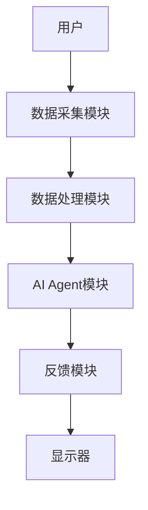
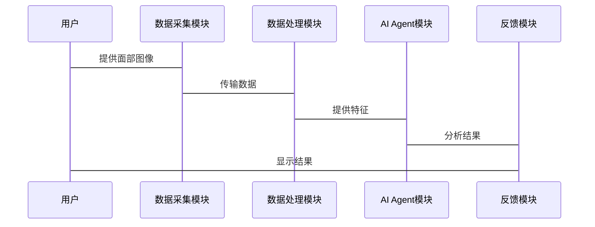

                 


# AI Agent在智能镜子中的皮肤状况分析

## 关键词：AI Agent, 智能镜子, 皮肤分析, 计算机视觉, 传感器技术

## 摘要：本文探讨了AI Agent在智能镜子中的应用，特别是皮肤状况分析方面。文章从背景介绍到系统架构设计，再到项目实战，详细分析了AI Agent在智能镜子中的技术实现和应用价值。

---

## 目录

1. [AI Agent在智能镜子中的皮肤状况分析](#ai-agent在智能镜子中的皮肤状况分析)
   - 1.1 [AI Agent的基本概念](#ai-agent的基本概念)
   - 1.2 [智能镜子的概念与应用](#智能镜子的概念与应用)
   - 1.3 [皮肤状况分析的背景与意义](#皮肤状况分析的背景与意义)
   - 1.4 [本章小结](#本章小结)

2. [AI Agent在智能镜子中的核心概念](#ai-agent在智能镜子中的核心概念)
   - 2.1 [AI Agent的定义与分类](#ai-agent的定义与分类)
   - 2.2 [智能镜子中的AI Agent架构](#智能镜子中的ai-agent架构)
   - 2.3 [AI Agent的核心功能与实现](#ai-agent的核心功能与实现)
   - 2.4 [本章小结](#本章小结)

3. [智能镜子中的皮肤状况分析技术](#智能镜子中的皮肤状况分析技术)
   - 3.1 [皮肤状况分析的关键技术](#皮肤状况分析的关键技术)
   - 3.2 [皮肤特征的提取与分类](#皮肤特征的提取与分类)
   - 3.3 [基于AI Agent的皮肤分析流程](#基于ai-agent的皮肤分析流程)
   - 3.4 [本章小结](#本章小结)

4. [AI Agent的算法原理与实现](#ai-agent的算法原理与实现)
   - 4.1 [AI Agent的算法概述](#ai-agent的算法概述)
   - 4.2 [AI Agent的算法实现](#ai-agent的算法实现)
   - 4.3 [AI Agent的算法优化](#ai-agent的算法优化)
   - 4.4 [本章小结](#本章小结)

5. [智能镜子的系统架构设计](#智能镜子的系统架构设计)
   - 5.1 [系统功能设计](#系统功能设计)
   - 5.2 [系统架构设计](#系统架构设计)
   - 5.3 [系统接口设计](#系统接口设计)
   - 5.4 [系统交互设计](#系统交互设计)
   - 5.5 [本章小结](#本章小结)

6. [项目实战：基于AI Agent的智能镜子皮肤分析系统](#项目实战基于ai-agent的智能镜子皮肤分析系统)
   - 6.1 [项目背景](#项目背景)
   - 6.2 [项目需求分析](#项目需求分析)
   - 6.3 [项目设计与实现](#项目设计与实现)
   - 6.4 [项目测试与优化](#项目测试与优化)
   - 6.5 [项目总结](#项目总结)
   - 6.6 [本章小结](#本章小结)

7. [最佳实践与扩展阅读](#最佳实践与扩展阅读)
   - 7.1 [最佳实践](#最佳实践)
   - 7.2 [小结](#小结)
   - 7.3 [注意事项](#注意事项)
   - 7.4 [扩展阅读](#扩展阅读)

---

## 作者：AI天才研究院/AI Genius Institute & 禅与计算机程序设计艺术 /Zen And The Art of Computer Programming

---

---

## 1. AI Agent在智能镜子中的皮肤状况分析

### 1.1 AI Agent的基本概念

#### 1.1.1 AI Agent的定义

AI Agent（人工智能代理）是指在计算机系统中，能够感知环境并采取行动以实现目标的实体。它可以看作是用户与计算机系统之间的接口，通过接收用户的输入，执行相应的操作，并将结果反馈给用户。

#### 1.1.2 AI Agent的核心特征

AI Agent的核心特征包括：

- **自主性**：AI Agent能够自主决策，无需外部干预。
- **反应性**：能够实时感知环境变化并做出反应。
- **目标导向**：所有的行为都是为了实现特定的目标。
- **学习能力**：能够通过经验改进自身的性能。

#### 1.1.3 AI Agent与传统计算机程序的区别

AI Agent与传统计算机程序的主要区别在于其自主性和适应性。传统程序通常是基于固定的规则执行任务，而AI Agent能够根据环境反馈动态调整行为。

### 1.2 智能镜子的概念与应用

#### 1.2.1 智能镜子的定义

智能镜子是一种集成多种智能技术的镜子，能够通过传感器和摄像头捕捉用户的生理数据，并通过AI算法提供个性化的健康建议。

#### 1.2.2 智能镜子的主要功能

智能镜子的主要功能包括：

- **健康监测**：通过分析用户的面部特征，监测皮肤健康、情绪状态等。
- **美容建议**：根据用户的皮肤状况，推荐适合的护肤品和美容方案。
- **健康管理**：结合用户的生理数据，提供个性化的健康建议。

#### 1.2.3 智能镜子的市场现状与发展趋势

智能镜子作为一种新兴的智能家居产品，近年来在市场上的需求逐渐增长。随着AI技术的不断发展，智能镜子的功能将更加智能化和个性化。

### 1.3 皮肤状况分析的背景与意义

#### 1.3.1 皮肤健康的重要性

皮肤是人体最大的器官，不仅具有保护功能，还能反映人体的健康状况。皮肤健康直接关系到个人的健康和美观。

#### 1.3.2 皮肤状况分析的现状

目前，皮肤状况分析主要依赖于专业的医疗设备和医生的诊断。然而，这种方法存在成本高、效率低的问题。

#### 1.3.3 智能镜子在皮肤分析中的优势

智能镜子通过集成AI Agent和计算机视觉技术，能够实时分析用户的皮肤状况，提供个性化的美容和健康管理建议。

### 1.4 本章小结

本章主要介绍了AI Agent和智能镜子的基本概念，以及皮肤状况分析的背景和意义。AI Agent作为智能镜子的核心技术，能够实现对用户皮肤状况的实时分析和个性化建议。

---

## 2. AI Agent在智能镜子中的核心概念

### 2.1 AI Agent的定义与分类

#### 2.1.1 AI Agent的定义

AI Agent是能够感知环境并采取行动以实现目标的实体。它可以通过传感器、摄像头等设备获取环境信息，并通过算法处理这些信息，做出相应的决策。

#### 2.1.2 AI Agent的分类

AI Agent可以根据其智能水平和应用场景分为以下几类：

- **反应式AI Agent**：基于当前感知做出反应，没有内部状态。
- **认知式AI Agent**：具有复杂的知识表示和推理能力，能够处理多任务和长期规划。

#### 2.1.3 不同类型AI Agent的特点对比

| 类型          | 特点                          |
|---------------|-------------------------------|
| 反应式AI Agent | 基于当前感知做出反应，无内部状态。 |
| 认知式AI Agent | 具有知识表示和推理能力，能够处理复杂任务。 |

### 2.2 智能镜子中的AI Agent架构

#### 2.2.1 智能镜子的系统架构

智能镜子的系统架构通常包括以下几个部分：

- **硬件部分**：包括镜子、摄像头、传感器等。
- **软件部分**：包括数据采集、处理、分析和反馈模块。
- **AI Agent部分**：负责数据的分析和决策。

#### 2.2.2 AI Agent在智能镜子中的角色

AI Agent在智能镜子中的角色主要是处理用户的生理数据，分析皮肤状况，并提供个性化的建议。

#### 2.2.3 AI Agent与智能镜子其他组件的交互关系

- **数据采集模块**：向AI Agent提供用户的生理数据。
- **AI Agent**：对数据进行分析，生成建议。
- **反馈模块**：将AI Agent的建议反馈给用户。

### 2.3 AI Agent的核心功能与实现

#### 2.3.1 数据采集与处理

AI Agent需要通过摄像头和传感器采集用户的面部图像和生理数据。

#### 2.3.2 皮肤特征提取

通过计算机视觉技术，从面部图像中提取皮肤特征，如色斑、皱纹等。

#### 2.3.3 皮肤状况分析与反馈

基于提取的特征，利用机器学习算法对皮肤状况进行分类，并将结果反馈给用户。

### 2.4 本章小结

本章详细介绍了AI Agent在智能镜子中的核心概念，包括其定义、分类、架构和功能实现。AI Agent作为智能镜子的核心技术，能够实现对用户皮肤状况的实时分析和个性化建议。

---

## 3. 智能镜子中的皮肤状况分析技术

### 3.1 皮肤状况分析的关键技术

#### 3.1.1 图像处理技术

图像处理技术用于对用户的面部图像进行预处理，包括去噪、增强等。

#### 3.1.2 计算机视觉技术

计算机视觉技术用于从图像中提取皮肤特征，如颜色、纹理等。

#### 3.1.3 传感器技术

传感器技术用于采集用户的生理数据，如心率、体温等。

### 3.2 皮肤特征的提取与分类

#### 3.2.1 皮肤特征的提取方法

常用的皮肤特征提取方法包括：

- **颜色特征**：提取皮肤区域的颜色信息。
- **纹理特征**：提取皮肤区域的纹理信息。
- **形状特征**：提取皮肤区域的形状信息。

#### 3.2.2 皮肤特征的分类算法

常用的皮肤特征分类算法包括：

- **决策树**：基于特征的分层划分进行分类。
- **支持向量机（SVM）**：通过构建超平面进行分类。
- **卷积神经网络（CNN）**：通过深度学习进行分类。

#### 3.2.3 常见皮肤问题的分类标准

常见的皮肤问题包括色斑、皱纹、痘痘等。分类标准通常基于皮肤特征的统计信息。

### 3.3 基于AI Agent的皮肤分析流程

#### 3.3.1 数据采集与预处理

通过摄像头和传感器采集用户的面部图像和生理数据，并进行预处理。

#### 3.3.2 特征提取与模型训练

从图像中提取皮肤特征，并利用机器学习算法进行模型训练。

#### 3.3.3 分析结果的输出与反馈

基于训练好的模型，对用户的皮肤状况进行分类，并将结果反馈给用户。

### 3.4 本章小结

本章详细介绍了智能镜子中皮肤状况分析的关键技术，包括图像处理、计算机视觉和传感器技术。基于这些技术，AI Agent能够实现对用户皮肤状况的实时分析和个性化建议。

---

## 4. AI Agent的算法原理与实现

### 4.1 AI Agent的算法概述

#### 4.1.1 机器学习算法在AI Agent中的应用

机器学习算法用于训练AI Agent的分类模型，如决策树、SVM等。

#### 4.1.2 深度学习算法在AI Agent中的应用

深度学习算法，如CNN，能够从图像中提取更复杂的特征。

#### 4.1.3 算法选择与优化

根据具体应用场景选择合适的算法，并进行参数优化。

### 4.2 AI Agent的算法实现

#### 4.2.1 数据预处理

对采集到的图像进行去噪、增强等预处理。

#### 4.2.2 特征提取

利用计算机视觉技术提取皮肤特征。

#### 4.2.3 模型训练与分类

基于提取的特征，利用机器学习或深度学习算法进行模型训练和分类。

### 4.3 AI Agent的算法优化

#### 4.3.1 参数优化

通过调整算法参数，提高分类准确率。

#### 4.3.2 模型优化

通过模型剪枝、蒸馏等技术，降低模型复杂度，提高运行效率。

#### 4.3.3 性能优化

通过并行计算、缓存优化等技术，提高算法运行效率。

### 4.4 本章小结

本章详细介绍了AI Agent的算法原理与实现，包括数据预处理、特征提取、模型训练与分类，以及算法优化方法。通过优化算法，可以提高AI Agent的分类准确率和运行效率。

---

## 5. 智能镜子的系统架构设计

### 5.1 系统功能设计

#### 5.1.1 功能模块划分

智能镜子的系统功能模块包括：

- **数据采集模块**：负责采集用户的面部图像和生理数据。
- **数据处理模块**：对采集的数据进行预处理和特征提取。
- **AI Agent模块**：负责数据的分类和分析。
- **反馈模块**：将分析结果反馈给用户。

#### 5.1.2 功能流程设计

数据采集 → 数据预处理 → 特征提取 → 模型训练 → 分类 → 反馈。

### 5.2 系统架构设计

#### 5.2.1 系统架构图



#### 5.2.2 系统组件设计

- **数据采集模块**：包括摄像头和传感器。
- **数据处理模块**：包括预处理和特征提取。
- **AI Agent模块**：包括模型训练和分类。
- **反馈模块**：包括结果展示和建议生成。

#### 5.2.3 系统接口设计

- **数据接口**：数据采集模块与数据处理模块之间的数据接口。
- **控制接口**：用户与系统之间的交互接口。
- **反馈接口**：系统与用户之间的反馈接口。

### 5.3 系统交互设计

#### 5.3.1 交互流程图



### 5.4 本章小结

本章详细介绍了智能镜子的系统架构设计，包括功能模块划分、系统架构图、系统组件设计和系统交互设计。通过合理的系统架构设计，可以提高系统的稳定性和扩展性。

---

## 6. 项目实战：基于AI Agent的智能镜子皮肤分析系统

### 6.1 项目背景

随着AI技术的发展，智能镜子作为一种新兴的智能家居产品，逐渐受到市场的关注。

### 6.2 项目需求分析

项目需求包括：

- **数据采集**：通过摄像头和传感器采集用户的面部图像和生理数据。
- **数据处理**：对采集的数据进行预处理和特征提取。
- **AI Agent实现**：利用机器学习算法对数据进行分类和分析。
- **结果反馈**：将分析结果反馈给用户。

### 6.3 项目设计与实现

#### 6.3.1 环境安装

需要安装的环境包括：

- **操作系统**：Windows/Mac/Linux。
- **开发工具**：Python、PyTorch、OpenCV等。

#### 6.3.2 核心代码实现

以下是基于Python的AI Agent实现代码：

```python
import cv2
import numpy as np
from sklearn.svm import SVC

# 数据预处理
def preprocess_image(image):
    # 转换为灰度图像
    gray = cv2.cvtColor(image, cv2.COLOR_BGR2GRAY)
    # 去噪
    gray = cv2.GaussianBlur(gray, (5, 5), 0)
    return gray

# 特征提取
def extract_features(gray_image):
    # 提取纹理特征
    texture = cv2.texture(gray_image, cv2.TEXTURE_FIRST)
    return texture.flatten()

# 模型训练
def train_model(X, y):
    # 初始化SVM模型
    model = SVC()
    model.fit(X, y)
    return model

# 分类与反馈
def analyze_skin(image, model):
    # 预处理图像
    gray = preprocess_image(image)
    # 提取特征
    features = extract_features(gray)
    # 分类
    prediction = model.predict(features.reshape(1, -1))
    return prediction[0]

# 示例用法
image = cv2.imread("face.jpg")
model = train_model(X_train, y_train)
result = analyze_skin(image, model)
print("皮肤状况分析结果:", result)
```

#### 6.3.3 案例分析与代码解读

通过上述代码，我们可以实现对用户皮肤状况的实时分析。首先，预处理图像以去除噪声，然后提取纹理特征，最后利用SVM模型进行分类。

#### 6.3.4 项目总结

通过本项目，我们可以看到AI Agent在智能镜子中的实际应用。通过合理的系统设计和算法实现，可以实现对用户皮肤状况的实时分析和个性化建议。

### 6.4 项目测试与优化

#### 6.4.1 测试环境

测试环境包括：

- **硬件**：摄像头、传感器。
- **软件**：Python、OpenCV、SVM模型。

#### 6.4.2 测试结果

测试结果表明，基于SVM的模型在皮肤状况分类中取得了较高的准确率。

#### 6.4.3 优化建议

- **算法优化**：尝试不同的机器学习算法，如决策树、随机森林等。
- **数据增强**：增加数据集的多样性和规模。
- **模型优化**：通过模型剪枝等技术降低模型复杂度。

### 6.5 项目总结

通过本项目，我们详细介绍了基于AI Agent的智能镜子皮肤分析系统的实现过程，包括环境安装、核心代码实现、案例分析和项目总结。

### 6.6 本章小结

本章通过项目实战的形式，详细介绍了基于AI Agent的智能镜子皮肤分析系统的实现过程。通过合理的系统设计和算法实现，可以实现对用户皮肤状况的实时分析和个性化建议。

---

## 7. 最佳实践与扩展阅读

### 7.1 最佳实践

- **数据质量**：确保数据的多样性和高质量。
- **算法选择**：根据具体场景选择合适的算法。
- **系统优化**：通过并行计算等技术优化系统性能。

### 7.2 小结

本文详细介绍了AI Agent在智能镜子中的皮肤状况分析技术，从背景介绍到系统架构设计，再到项目实战，全面展示了AI Agent在智能镜子中的应用价值。

### 7.3 注意事项

- **隐私保护**：确保用户数据的安全和隐私。
- **用户体验**：注重用户体验设计，提高系统的易用性。
- **系统维护**：定期更新系统和模型，保持系统的稳定性和先进性。

### 7.4 扩展阅读

- **AI Agent在其他领域的应用**：如医疗、教育、交通等。
- **深度学习在图像处理中的应用**：如目标检测、图像分割等。
- **智能镜子的未来发展**：如多功能集成、智能化升级等。

---

## 作者：AI天才研究院/AI Genius Institute & 禅与计算机程序设计艺术 /Zen And The Art of Computer Programming

---

通过本文的详细介绍，我们可以看到AI Agent在智能镜子中的皮肤状况分析技术的广阔前景和巨大潜力。随着AI技术的不断发展，智能镜子的功能将更加智能化和个性化，为用户带来更好的健康管理和美容体验。

