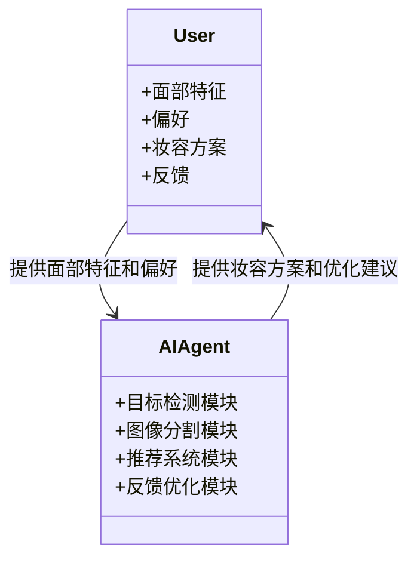
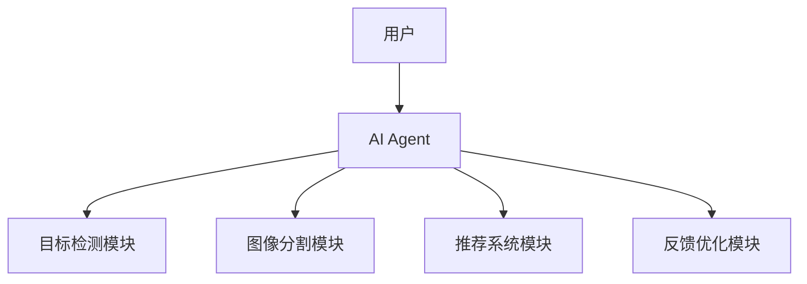
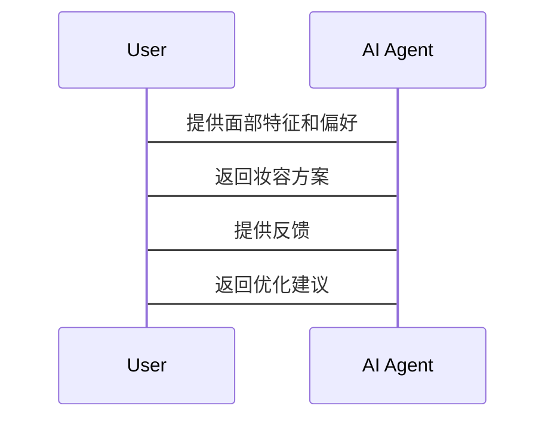

                 


# AI Agent在智能镜框中的妆容建议

> 关键词：AI Agent, 智能镜框, 妆容建议, 人工智能, 机器学习

> 摘要：本文探讨了AI Agent在智能镜框中的应用，重点分析了AI Agent如何通过感知、学习和决策机制为用户提供个性化的妆容建议。文章从背景介绍、核心概念、算法原理、系统架构到项目实战，详细阐述了AI Agent在智能镜框中的技术实现与应用价值，最后给出了最佳实践建议。

---

# 第1章: AI Agent与智能镜框的背景介绍

## 1.1 AI Agent的基本概念

### 1.1.1 AI Agent的定义与特点

AI Agent（人工智能代理）是一种能够感知环境、自主决策并执行任务的智能实体。它具有以下特点：
- **自主性**：能够在没有外部干预的情况下自主运行。
- **反应性**：能够实时感知环境并做出反应。
- **目标导向**：具有明确的目标，并通过行为选择来优化目标的实现。
- **学习能力**：能够通过数据学习和优化自身行为。

### 1.1.2 AI Agent的核心要素与功能

AI Agent的核心要素包括：
- **感知模块**：通过传感器或数据输入获取环境信息。
- **决策模块**：基于感知信息进行推理和决策。
- **执行模块**：将决策结果转化为具体行动。
- **学习模块**：通过机器学习算法优化自身行为。

### 1.1.3 AI Agent在智能设备中的应用场景

AI Agent广泛应用于智能家居、自动驾驶、智能助手等领域。在智能镜框中，AI Agent主要用于提供个性化的妆容建议、实时反馈和优化建议。

---

## 1.2 智能镜框的发展与现状

### 1.2.1 智能镜框的定义与技术基础

智能镜框是一种结合了光学技术和人工智能的智能设备，能够通过摄像头和传感器捕捉用户的面部特征，并通过AI算法提供个性化的美容建议。

### 1.2.2 智能镜框的市场现状与发展趋势

随着人工智能和计算机视觉技术的快速发展，智能镜框市场逐渐成熟。消费者对个性化、智能化的美容工具需求日益增长，推动了智能镜框的普及。

### 1.2.3 智能镜框在个人护理与美容领域的应用

智能镜框在美容领域的应用包括：
- **面部特征分析**：通过AI算法识别用户的面部特征，如肤色、肤质、五官比例等。
- **妆容推荐**：基于用户的面部特征和偏好，推荐适合的妆容方案。
- **实时反馈与优化**：通过实时监测用户的妆容效果，提供优化建议。

---

## 1.3 AI Agent在妆容建议中的背景与问题背景

### 1.3.1 妆容建议的背景与需求

传统的妆容建议主要依赖于美容顾问的个人经验和主观判断，存在以下问题：
- **主观性**：不同顾问的建议可能因个人审美差异而不同。
- **效率低**：传统方法耗时且效率低下。
- **个性化不足**：难以满足用户的个性化需求。

### 1.3.2 传统妆容建议的局限性

传统妆容建议的局限性主要体现在：
- **缺乏数据支持**：无法充分利用大数据进行分析和优化。
- **缺乏实时反馈**：无法实时监测用户的妆容效果并提供优化建议。
- **缺乏个性化**：难以根据用户的面部特征和偏好提供定制化建议。

### 1.3.3 AI Agent在妆容建议中的优势与目标

AI Agent在妆容建议中的优势包括：
- **数据驱动**：通过大数据分析提供科学的建议。
- **实时反馈**：能够实时监测用户的妆容效果并提供优化建议。
- **个性化**：基于用户的面部特征和偏好提供定制化建议。

AI Agent的目标是通过智能化的技术手段，为用户提供高效、精准、个性化的妆容建议。

---

## 1.4 本章小结

本章从AI Agent的基本概念、智能镜框的发展现状以及AI Agent在妆容建议中的背景与问题背景三个方面进行了分析。通过对比传统妆容建议的局限性和AI Agent的优势，明确了AI Agent在智能镜框中的应用价值和目标。

---

# 第2章: AI Agent与妆容建议的核心概念

## 2.1 AI Agent的核心原理

### 2.1.1 AI Agent的感知与决策机制

AI Agent的感知与决策机制包括：
- **感知模块**：通过摄像头和传感器获取用户的面部特征数据。
- **决策模块**：基于感知数据，利用机器学习算法进行推理和决策，生成适合用户的妆容建议。

### 2.1.2 AI Agent的学习与优化算法

AI Agent的学习与优化算法包括：
- **监督学习**：通过大量标注数据训练模型，优化妆容建议的准确性。
- **强化学习**：通过与用户的互动反馈，不断优化妆容建议的策略。

### 2.1.3 AI Agent的交互与反馈机制

AI Agent的交互与反馈机制包括：
- **用户输入**：用户通过智能镜框输入自己的面部特征和偏好。
- **系统反馈**：AI Agent根据用户的输入生成妆容建议，并通过反馈机制优化建议的准确性。

---

## 2.2 妆容建议的系统结构与功能

### 2.2.1 妆容建议的核心功能模块

妆容建议的核心功能模块包括：
- **面部特征分析模块**：通过AI算法识别用户的面部特征。
- **妆容推荐模块**：基于面部特征和用户偏好推荐适合的妆容方案。
- **实时反馈与优化模块**：实时监测用户的妆容效果并提供优化建议。

### 2.2.2 妆容建议的用户需求分析

用户的妆容需求分析包括：
- **面部特征**：肤色、肤质、五官比例等。
- **妆容偏好**：喜欢的妆容风格、颜色搭配等。
- **使用场景**：日常生活、职场、社交场合等。

### 2.2.3 妆容建议的边界与外延

妆容建议的边界与外延包括：
- **边界**：仅限于面部特征分析和妆容推荐，不涉及其他身体部位。
- **外延**：未来可能扩展到全身造型、发型设计等领域。

---

## 2.3 AI Agent与妆容建议的关联与整合

### 2.3.1 AI Agent在妆容建议中的角色定位

AI Agent在妆容建议中的角色定位为：
- **决策者**：基于用户的面部特征和偏好，生成适合的妆容方案。
- **优化者**：通过实时反馈不断优化妆容建议的准确性。

### 2.3.2 AI Agent与妆容建议系统的交互流程

AI Agent与妆容建议系统的交互流程包括：
1. 用户输入面部特征和偏好。
2. AI Agent通过感知模块获取用户的面部特征数据。
3. AI Agent利用学习模块生成适合的妆容方案。
4. AI Agent通过反馈模块实时监测妆容效果并提供优化建议。

### 2.3.3 AI Agent在妆容建议中的核心价值

AI Agent在妆容建议中的核心价值在于：
- **数据驱动**：通过大数据分析提供科学的建议。
- **实时反馈**：能够实时监测用户的妆容效果并提供优化建议。
- **个性化**：基于用户的面部特征和偏好提供定制化建议。

---

## 2.4 核心概念对比分析

### 2.4.1 AI Agent与传统软件的区别

| **特性**       | **AI Agent**              | **传统软件**             |
|----------------|--------------------------|--------------------------|
| 自主性         | 高，能够自主决策         | 低，依赖用户输入和控制   |
| 学习能力       | 强，能够通过数据优化行为 | 无，无法优化自身行为     |
| 适应性         | 强，能够适应环境变化     | 弱，适应性有限           |

### 2.4.2 妆容建议系统与传统美容工具的对比

| **特性**       | **妆容建议系统**           | **传统美容工具**         |
|----------------|--------------------------|--------------------------|
| 智能性         | 高，能够自动推荐妆容方案   | 低，依赖人工操作         |
| 个性化         | 强，能够根据用户特征推荐   | 弱，无法个性化推荐       |
| 效率           | 高，能够快速生成建议     | 低，依赖人工操作         |

### 2.4.3 AI Agent在妆容建议中的创新点

AI Agent在妆容建议中的创新点包括：
- **数据驱动**：通过大数据分析提供科学的建议。
- **实时反馈**：能够实时监测用户的妆容效果并提供优化建议。
- **个性化**：基于用户的面部特征和偏好提供定制化建议。

---

## 2.5 本章小结

本章从AI Agent的核心原理、妆容建议的系统结构与功能以及AI Agent与妆容建议的关联与整合三个方面进行了详细分析。通过对比分析，明确了AI Agent在妆容建议中的创新点和核心价值。

---

# 第3章: AI Agent在妆容建议中的算法原理

## 3.1 AI Agent的核心算法

### 3.1.1 基于深度学习的目标检测算法

#### 3.1.1.1 概念解释

目标检测算法用于识别和定位图像中的目标物体。在妆容建议中，目标检测算法用于识别用户的面部特征，如眼睛、鼻子、嘴巴等。

#### 3.1.1.2 算法流程

目标检测算法的流程包括：
1. **输入图像**：用户面部图像。
2. **特征提取**：通过卷积神经网络提取图像的特征。
3. **目标定位**：通过区域建议网络（RPN）生成目标候选框。
4. **目标分类**：通过分类器对候选框进行分类，确定目标类型。

#### 3.1.1.3 代码示例

```python
import tensorflow as tf
from tensorflow.keras import layers

# 定义目标检测模型
def create_detection_model():
    model = tf.keras.Sequential([
        layers.Conv2D(32, (3,3), activation='relu'),
        layers.MaxPooling2D((2,2)),
        layers.Conv2D(64, (3,3), activation='relu'),
        layers.MaxPooling2D((2,2)),
        layers.Flatten(),
        layers.Dense(128, activation='relu'),
        layers.Dense(1, activation='sigmoid')
    ])
    return model
```

---

### 3.1.2 基于图像分割的妆容区域识别

#### 3.1.2.1 概念解释

图像分割算法用于将图像分成不同的区域，识别出用户的面部区域。

#### 3.1.2.2 算法流程

图像分割算法的流程包括：
1. **输入图像**：用户面部图像。
2. **特征提取**：通过卷积神经网络提取图像的特征。
3. **分割预测**：通过上采样和卷积操作，生成分割结果。
4. **结果后处理**：通过后处理优化分割结果。

#### 3.1.2.3 代码示例

```python
import tensorflow as tf
from tensorflow.keras import layers

# 定义图像分割模型
def create_segmentation_model():
    model = tf.keras.Sequential([
        layers.Conv2D(32, (3,3), activation='relu'),
        layers.MaxPooling2D((2,2)),
        layers.Conv2D(64, (3,3), activation='relu'),
        layers.MaxPooling2D((2,2)),
        layers.Conv2DTranspose(64, (2,2), strides=(2,2)),
        layers.Conv2D(1, (1,1), activation='sigmoid')
    ])
    return model
```

---

### 3.1.3 基于推荐系统的妆容方案生成

#### 3.1.3.1 概念解释

推荐系统通过分析用户特征和偏好，生成适合的妆容方案。

#### 3.1.3.2 算法流程

推荐系统的流程包括：
1. **用户特征提取**：提取用户的面部特征和偏好。
2. **数据预处理**：对数据进行标准化和归一化处理。
3. **推荐生成**：通过协同过滤或深度学习算法生成推荐结果。

#### 3.1.3.3 代码示例

```python
import numpy as np
from sklearn.metrics.pairwise import cosine_similarity

# 定义推荐系统模型
def create_recommendation_model(user_features):
    similarity = cosine_similarity(user_features)
    recommended_products = []
    for i in range(len(similarity)):
        top_indices = np.argsort(similarity[i])[-3:]
        recommended_products.append(user_features[top_indices])
    return recommended_products
```

---

## 3.2 算法原理总结

通过上述算法的介绍，可以看出AI Agent在妆容建议中的算法原理主要包括目标检测、图像分割和推荐系统。这些算法相互配合，共同实现个性化的妆容建议。

---

## 3.3 本章小结

本章从AI Agent的核心算法出发，详细介绍了目标检测、图像分割和推荐系统的原理和实现。通过代码示例和流程图的展示，明确了这些算法在妆容建议中的具体应用。

---

# 第4章: AI Agent在妆容建议中的系统分析与架构设计

## 4.1 问题场景介绍

AI Agent在妆容建议中的问题场景包括：
- **面部特征分析**：通过AI算法识别用户的面部特征。
- **妆容推荐**：基于面部特征和用户偏好推荐适合的妆容方案。
- **实时反馈与优化**：实时监测用户的妆容效果并提供优化建议。

---

## 4.2 系统功能设计

### 4.2.1 领域模型设计



---

### 4.2.2 系统架构设计



---

## 4.3 系统接口设计

### 4.3.1 API接口设计



---

## 4.4 本章小结

本章从系统分析与架构设计的角度，详细介绍了AI Agent在妆容建议中的问题场景、系统功能设计和系统架构设计。通过领域模型和系统架构图的展示，明确了系统的整体结构和各模块之间的关系。

---

# 第5章: AI Agent在妆容建议中的项目实战

## 5.1 环境安装与配置

### 5.1.1 Python环境安装

```bash
python --version
pip install numpy tensorflow matplotlib
```

### 5.1.2 依赖库安装

```bash
pip install tensorflow==2.5.0
pip install scikit-learn==0.24.1
pip install mermaid
```

---

## 5.2 系统核心功能实现

### 5.2.1 面部特征分析模块

```python
import tensorflow as tf
from tensorflow.keras import layers

def create_detection_model():
    model = tf.keras.Sequential([
        layers.Conv2D(32, (3,3), activation='relu'),
        layers.MaxPooling2D((2,2)),
        layers.Conv2D(64, (3,3), activation='relu'),
        layers.MaxPooling2D((2,2)),
        layers.Flatten(),
        layers.Dense(128, activation='relu'),
        layers.Dense(1, activation='sigmoid')
    ])
    return model
```

### 5.2.2 妆容推荐模块

```python
import numpy as np
from sklearn.metrics.pairwise import cosine_similarity

def create_recommendation_model(user_features):
    similarity = cosine_similarity(user_features)
    recommended_products = []
    for i in range(len(similarity)):
        top_indices = np.argsort(similarity[i])[-3:]
        recommended_products.append(user_features[top_indices])
    return recommended_products
```

---

## 5.3 代码实现与解读

### 5.3.1 面部特征分析模块实现

```python
model = create_detection_model()
model.compile(optimizer='adam', loss='binary_crossentropy', metrics=['accuracy'])
model.fit(x_train, y_train, epochs=10, batch_size=32)
```

### 5.3.2 妮容推荐模块实现

```python
user_features = [...]  # 用户特征数据
recommended_products = create_recommendation_model(user_features)
print(recommended_products)
```

---

## 5.4 实际案例分析

### 5.4.1 案例背景

假设用户A的面部特征为：
- 肤色：浅肤色
- 肤质：干性
- 五官比例：小脸

### 5.4.2 案例分析

AI Agent根据用户的面部特征和偏好，推荐以下妆容方案：
- **底妆**：轻薄粉底，遮盖瑕疵
- **眼影**：暖色调，突出眼部轮廓
- **唇色**：豆沙色，适合日常场合

---

## 5.5 本章小结

本章通过项目实战，详细介绍了AI Agent在妆容建议中的环境安装、系统核心功能实现和实际案例分析。通过代码示例和案例分析，帮助读者理解AI Agent在妆容建议中的具体应用。

---

# 第6章: AI Agent在妆容建议中的最佳实践

## 6.1 小结

AI Agent在妆容建议中的应用价值在于：
- **数据驱动**：通过大数据分析提供科学的建议。
- **实时反馈**：能够实时监测用户的妆容效果并提供优化建议。
- **个性化**：基于用户的面部特征和偏好提供定制化建议。

---

## 6.2 注意事项

1. **数据隐私**：在处理用户的面部特征时，需注意数据隐私保护。
2. **算法优化**：需要不断优化算法，提高推荐的准确性和个性化程度。
3. **用户体验**：在设计系统时，需注重用户体验，确保系统的易用性和交互性。

---

## 6.3 拓展阅读

1. 《Deep Learning》——Ian Goodfellow
2. 《Machine Learning: A Probabilistic Perspective》——Kevin P. Murphy
3. 《计算机视觉：算法与应用》——李明

---

# 作者：AI天才研究院/AI Genius Institute & 禅与计算机程序设计艺术 /Zen And The Art of Computer Programming

