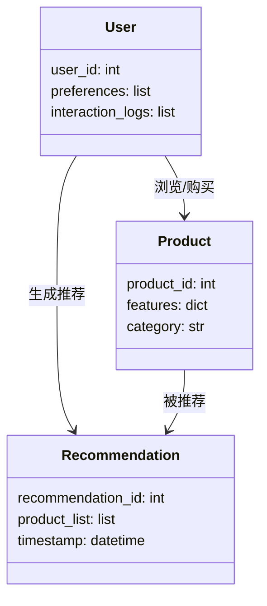

                 


# AI辅助产品推荐与个性化服务的算法与实现

## 关键词：AI推荐算法，个性化服务，协同过滤，内容推荐，混合推荐

## 摘要：本文详细探讨了AI辅助产品推荐与个性化服务的核心算法及其实现。首先介绍了推荐系统和个性化服务的基本概念与背景，随后分析了协同过滤、内容推荐和混合推荐等算法的原理与实现细节，接着通过系统架构设计展示了如何将这些算法应用于实际项目，并通过案例分析验证了算法的有效性。最后，总结了最佳实践和注意事项，为读者提供了全面的指导。

---

# 第一部分: 背景与概念

## 第1章: 背景介绍

### 1.1 问题背景与问题描述

#### 1.1.1 问题背景
在当今互联网时代，用户每天面对海量信息，如何快速找到所需内容成为一大挑战。传统推荐系统依赖人工筛选，效率低下且难以满足个性化需求。随着AI技术的发展，基于算法的推荐系统逐渐成为解决这一问题的重要工具。

#### 1.1.2 问题描述
推荐系统的目标是根据用户行为和偏好，预测并推荐相关产品或内容。个性化服务则进一步通过用户数据，提供定制化体验，满足用户的特定需求。

#### 1.1.3 解决方法
AI技术的应用使推荐系统更加智能化。通过机器学习算法，系统能够分析用户行为、偏好和历史数据，生成个性化推荐。推荐算法主要包括协同过滤、内容推荐和混合推荐等。

### 1.2 核心概念与边界

#### 1.2.1 核心概念
推荐系统通过算法分析用户行为和产品特征，生成个性化推荐列表。个性化服务则在此基础上，提供定制化体验，如动态调整推荐内容或优化用户界面。

#### 1.2.2 系统边界
推荐系统通常包括数据采集、特征提取、算法计算和结果展示四个模块。个性化服务则涉及用户画像构建、动态内容生成和实时反馈处理。

#### 1.2.3 概念结构
推荐系统和个性化服务共同构建了一个完整的推荐生态系统。推荐系统负责生成候选列表，个性化服务则根据用户实时需求进行调整和优化。

---

## 第2章: 核心概念与联系

### 2.1 核心原理

#### 2.1.1 推荐系统的定义与分类
推荐系统根据用户行为和产品特征，预测用户兴趣，推荐相关产品。主要分类包括基于协同过滤、基于内容推荐和混合推荐。

#### 2.1.2 个性化服务的实现机制
个性化服务通过分析用户数据，构建用户画像，动态调整推荐内容，提供定制化体验。

#### 2.1.3 二者的相互关系
推荐系统为个性化服务提供基础推荐列表，个性化服务在此基础上优化推荐结果，满足用户个性化需求。

### 2.2 核心概念的属性特征对比

| 特征         | 推荐系统 | 个性化服务 |
|--------------|----------|-------------|
| 目标         | 提供推荐列表 | 提供定制化体验 |
| 输入数据     | 用户行为、产品特征 | 用户画像、实时需求 |
| 输出结果     | 推荐列表 | 定制化内容 |
| 实现方式     | 协同过滤、内容推荐 | 用户画像构建、动态内容生成 |

### 2.3 ER实体关系图

```mermaid
er
  actor: 用户
  product: 产品
  recommendation_result: 推荐结果
  interaction_log: 用户行为日志
  actor --> product: 浏览/购买
  product --> recommendation_result: 被推荐
  actor --> interaction_log: 产生日志
```

---

# 第三部分: 算法原理与实现

## 第3章: 协同过滤算法

### 3.1 算法原理

#### 3.1.1 用户-用户协同过滤
基于用户相似性计算，找到与目标用户相似的用户，推荐这些用户喜欢的产品。

#### 3.1.2 物品-物品协同过滤
基于产品相似性计算，找到与目标产品相似的产品，推荐给用户。

#### 3.1.3 混合协同过滤
结合用户-用户和物品-物品协同过滤，综合考虑用户和产品的相似性。

### 3.2 算法流程图

```mermaid
graph TD
    A[用户A] --> B[用户B]: 相似度计算
    B --> C[推荐列表]: 推荐产品
```

### 3.3 Python实现

```python
def user_based_recommendation(users, user_id):
    # 计算用户相似度
    user_similarity = {}
    for u in users:
        if u != user_id:
            similarity = cosine_similarity(users[user_id], users[u])
            user_similarity[u] = similarity
    # 排序并选择相似度最高的用户
    sorted_users = sorted(user_similarity.items(), key=lambda x: -x[1])
    # 推荐产品
    recommended_products = []
    for u in sorted_users[:5]:
        recommended_products.extend(users[u]['products'])
    return recommended_products
```

### 3.4 数学模型

协同过滤的相似度计算通常使用余弦相似度：

$$
\text{similarity}(u_i, u_j) = \frac{\sum_{k} (r_{i,k} - \bar{r}_i)(r_{j,k} - \bar{r}_j)}{\sqrt{\sum_{k} (r_{i,k} - \bar{r}_i)^2} \sqrt{\sum_{k} (r_{j,k} - \bar{r}_j)^2}}
$$

其中，$r_{i,k}$表示用户$i$对物品$k$的评分，$\bar{r}_i$是用户$i$的平均评分。

---

## 第4章: 内容推荐算法

### 4.1 算法原理

#### 4.1.1 基于内容的推荐
分析产品特征，如产品描述、类别等，推荐与目标产品相似的产品。

#### 4.1.2 基于深度学习的内容推荐
使用神经网络提取产品特征，生成更精确的推荐。

### 4.2 算法流程图

```mermaid
graph TD
    A[产品A] --> B[产品B]: 特征相似度计算
    B --> C[推荐列表]: 推荐产品
```

### 4.3 Python实现

```python
def content_based_recommendation(products, product_id):
    # 提取产品特征
    product_features = extract_features(products[product_id])
    # 计算相似度
    similarities = {}
    for p in products:
        if p != product_id:
            similarity = cosine_similarity(product_features, products[p]['features'])
            similarities[p] = similarity
    # 排序并推荐
    sorted_products = sorted(similarities.items(), key=lambda x: -x[1])
    recommended_products = [p for p, _ in sorted_products[:5]]
    return recommended_products
```

### 4.4 数学模型

内容推荐通常使用余弦相似度计算产品特征向量之间的相似度：

$$
\text{similarity}(p_i, p_j) = \frac{\sum_{k} w_{i,k} \cdot w_{j,k}}{\sqrt{\sum_{k} w_{i,k}^2} \sqrt{\sum_{k} w_{j,k}^2}}
$$

其中，$w_{i,k}$表示产品$p_i$在特征$k$上的权重。

---

## 第5章: 混合推荐算法

### 5.1 算法原理

#### 5.1.1 组合协同过滤和内容推荐
将协同过滤和内容推荐的结果进行加权组合，生成最终推荐列表。

#### 5.1.2 多策略混合推荐
结合多种推荐策略，如协同过滤、内容推荐和基于规则的推荐，生成更准确的推荐。

### 5.2 算法流程图

```mermaid
graph TD
    A[协同过滤] --> B[内容推荐]: 组合策略
    B --> C[推荐列表]: 综合推荐
```

### 5.3 Python实现

```python
def hybrid_recommendation(users, products, user_id, product_id):
    # 协同过滤推荐
    cf_recommendations = user_based_recommendation(users, user_id)
    # 内容推荐
    cb_recommendations = content_based_recommendation(products, product_id)
    # 综合推荐
    hybrid_recommendations = list(set(cf_recommendations + cb_recommendations))
    return hybrid_recommendations
```

---

# 第四部分: 系统架构与设计

## 第6章: 系统分析与架构设计

### 6.1 项目背景

#### 6.1.1 项目介绍
本项目旨在开发一个AI辅助的产品推荐系统，结合协同过滤和内容推荐算法，为用户提供个性化推荐服务。

### 6.2 系统功能设计

#### 6.2.1 领域模型



#### 6.2.2 系统架构设计


#### 6.2.3 接口设计

| 接口名称       | 输入          | 输出          |
|----------------|---------------|---------------|
| get_recommendations | user_id, product_id | recommendation_list |

#### 6.2.4 交互流程

```mermaid
sequenceDiagram
    用户发送推荐请求
    前端接收请求
    前端调用后端API
    后端处理请求
    后端查询数据库
    后端计算推荐结果
    后端返回推荐列表
    前端展示推荐结果
```

---

## 第7章: 项目实战

### 7.1 环境安装

#### 7.1.1 安装Python和相关库
安装Python 3.8及以上版本，以及必要的库如NumPy、Scikit-learn、Flask等。

```bash
pip install numpy scikit-learn flask
```

### 7.2 核心代码实现

#### 7.2.1 协同过滤实现

```python
from sklearn.metrics.pairwise import cosine_similarity

def user_based_recommendation(users, user_id):
    # 计算相似度矩阵
    similarity_matrix = cosine_similarity(users[user_id], users.values())
    # 找出相似度最高的用户
    similar_users = [i for i, s in enumerate(similarity_matrix[user_id]) if i != user_id]
    # 推荐产品
    recommended_products = []
    for u in similar_users[:5]:
        recommended_products.extend(users[u]['products'])
    return recommended_products
```

#### 7.2.2 内容推荐实现

```python
from sklearn.feature_extraction.text import TfidfVectorizer

def content_based_recommendation(products, product_id):
    # 提取特征向量
    vectorizer = TfidfVectorizer()
    product_features = vectorizer.fit_transform([products[product_id]['description']])
    # 计算相似度
    similarities = cosine_similarity(product_features, products.values())
    # 推荐产品
    recommended_products = []
    for i, s in enumerate(similarities[0]):
        if i != product_id:
            recommended_products.append(products[i]['id'])
    return recommended_products
```

### 7.3 代码解读与分析

协同过滤部分通过计算用户相似度，找到相似用户的推荐列表。内容推荐部分使用TF-IDF提取产品描述的特征向量，计算相似度后生成推荐列表。

### 7.4 案例分析

以一个电商网站为例，假设用户A购买了产品X，系统会基于协同过滤推荐与A相似的用户购买的产品，同时基于内容推荐推荐与X相似的产品，最终生成综合推荐列表。

### 7.5 项目小结

通过协同过滤和内容推荐的结合，系统能够生成准确的推荐结果，提升用户体验。

---

# 第五部分: 总结与展望

## 第8章: 总结与展望

### 8.1 最佳实践 tips

- 数据预处理是关键，确保数据质量和完整性。
- 根据业务需求选择合适的推荐算法。
- 定期更新模型，保持推荐的时效性。

### 8.2 小结

本文详细探讨了AI辅助产品推荐与个性化服务的核心算法，包括协同过滤、内容推荐和混合推荐，并通过系统架构设计和项目实战展示了如何实现这些算法。推荐系统和个性化服务的结合能够有效提升用户体验，具有广阔的应用前景。

### 8.3 注意事项

- 数据隐私和安全问题需要高度重视。
- 推荐系统需要不断优化和调整，以适应用户需求的变化。
- 多算法结合能够提升推荐的准确性和多样性。

### 8.4 拓展阅读

建议深入学习推荐系统的高级算法，如基于深度学习的推荐模型（如深度神经网络、注意力机制等），以及实时推荐系统的实现。

---

# 作者：AI天才研究院 & 禅与计算机程序设计艺术

