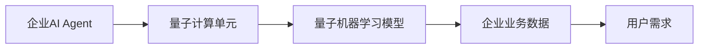
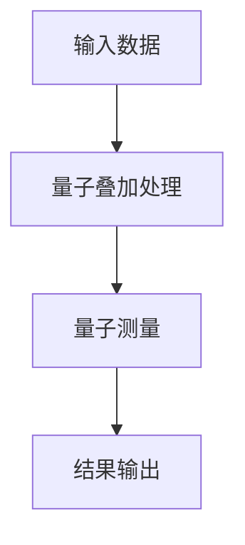
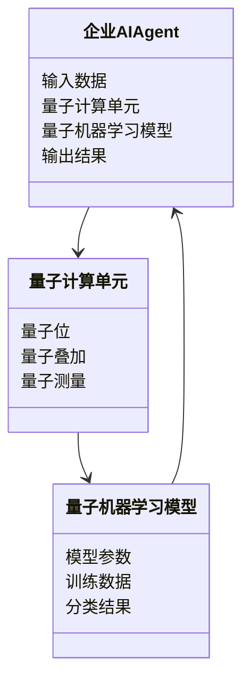
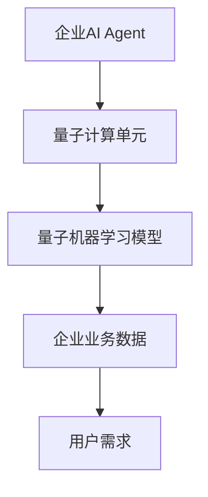
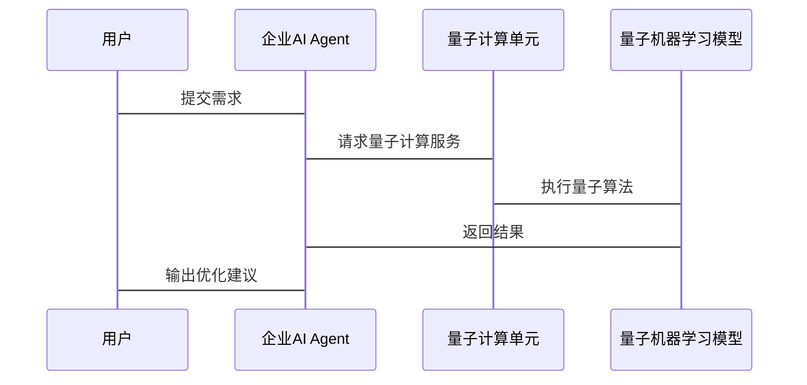

                 


# 企业AI Agent的量子机器学习应用优化

> 关键词：企业AI Agent，量子机器学习，量子计算，算法优化，系统架构

> 摘要：本文探讨了企业AI Agent在量子机器学习中的应用优化，从量子计算的基本原理到量子机器学习算法的设计，再到企业AI Agent的量子化模型构建，系统分析了量子机器学习如何提升企业AI Agent的性能。本文通过详细分析和案例解读，为企业AI Agent的量子化应用提供了理论依据和实践指导。

---

# 第一部分: 企业AI Agent的量子机器学习应用背景

## 第1章: 企业AI Agent与量子机器学习概述

### 1.1 企业AI Agent的核心概念

#### 1.1.1 什么是企业AI Agent
企业AI Agent是一种智能化的计算机程序，能够感知环境、理解用户需求并执行相应操作，以优化企业内部流程、提高效率并增强用户体验。企业AI Agent通常具备自主决策、问题解决和学习能力。

#### 1.1.2 企业AI Agent的定义与特点
- **定义**：企业AI Agent是基于人工智能技术构建的智能体，能够处理复杂的业务逻辑，执行自动化操作。
- **特点**：
  - 自主性：能够在没有人工干预的情况下独立运行。
  - 反应性：能够实时感知环境变化并做出响应。
  - 学习能力：通过机器学习算法不断优化自身的决策模型。
  - 可扩展性：能够适应企业规模的变化和业务需求的扩展。

#### 1.1.3 企业AI Agent的应用场景
企业AI Agent广泛应用于企业内部的各个领域，例如：
- **客户支持**：通过自然语言处理技术为用户提供智能客服。
- **流程自动化**：优化企业内部的审批流程、供应链管理等。
- **数据挖掘与分析**：从海量数据中提取有价值的信息，辅助决策。
- **风险管理**：实时监控企业运营中的风险，并提出应对策略。

### 1.2 量子机器学习的基本原理

#### 1.2.1 量子计算的简介
量子计算是一种基于量子力学原理的计算方式，与传统的经典计算相比，量子计算具有以下特点：
- **量子叠加**：量子位（qubit）可以同时处于多个状态的叠加态。
- **量子纠缠**：两个或多个量子位之间可以形成纠缠态，一个量子位的状态会直接影响另一个量子位的状态。
- **并行计算能力**：量子计算机可以在一次计算中处理大量的可能性，从而提高计算效率。

#### 1.2.2 量子机器学习的核心概念
量子机器学习是利用量子计算技术进行机器学习的一种新方法。与经典机器学习不同，量子机器学习利用量子叠加和纠缠的特性，能够在更短的时间内完成复杂的计算任务。

#### 1.2.3 量子机器学习的优势与挑战
- **优势**：
  - 计算效率高：量子计算机能够在某些特定问题上显著提高计算速度。
  - 处理复杂问题能力强：量子计算能够处理大规模的数据和复杂的模型。
- **挑战**：
  - 量子计算的稳定性较差，容易受到外界干扰。
  - 量子算法的设计和优化需要高度的专业知识。
  - 量子计算的硬件实现仍然面临技术难题。

### 1.3 企业AI Agent与量子机器学习的结合

#### 1.3.1 量子计算在AI Agent中的应用
量子计算的高计算效率和并行处理能力可以显著提升企业AI Agent的性能。例如，通过量子计算优化AI Agent的决策模型，使其能够快速处理大量数据并做出最优决策。

#### 1.3.2 量子机器学习如何优化AI Agent
量子机器学习可以通过以下方式优化企业AI Agent：
- **模型优化**：利用量子算法优化AI Agent的模型参数，提高模型的准确性和泛化能力。
- **数据处理**：量子计算能够快速处理大规模数据，提升AI Agent的数据处理能力。
- **决策优化**：通过量子计算优化AI Agent的决策过程，使其能够在复杂环境下做出最优决策。

#### 1.3.3 企业AI Agent量子化的必要性
随着企业对智能化需求的不断提高，传统的经典计算已经无法满足企业AI Agent的性能要求。量子计算的出现为企业AI Agent的优化提供了新的可能性。通过量子化，企业AI Agent能够更高效地处理复杂任务，提升企业的竞争力。

---

## 第2章: 企业AI Agent的量子机器学习应用背景

### 2.1 当前企业AI Agent的发展现状

#### 2.1.1 传统AI Agent的应用局限性
尽管传统AI Agent在企业中得到了广泛应用，但其性能仍然存在一定的局限性：
- **计算效率低**：在处理大规模数据和复杂任务时，传统AI Agent的计算效率较低。
- **模型优化能力有限**：传统的机器学习算法在优化模型时需要大量的计算资源，且优化效果有限。
- **适应性差**：传统AI Agent在面对快速变化的环境时，适应能力较弱。

#### 2.1.2 量子计算对企业AI Agent的推动作用
量子计算的出现为企业AI Agent的优化提供了新的机遇：
- **提升计算效率**：量子计算的高并行性使得AI Agent能够更快地处理复杂任务。
- **优化模型参数**：量子算法能够更高效地优化AI Agent的模型参数，提高模型的准确性。
- **增强适应性**：量子计算的强大能力使得AI Agent能够更好地适应复杂多变的环境。

#### 2.1.3 企业AI Agent量子化的趋势
随着量子计算技术的不断发展，企业AI Agent的量子化已经成为一种趋势。通过量子化，企业能够显著提升AI Agent的性能，从而在激烈的市场竞争中占据优势。

### 2.2 量子机器学习在企业AI Agent中的应用前景

#### 2.2.1 量子机器学习提升AI Agent性能的潜力
量子机器学习在企业AI Agent中的应用前景广阔：
- **数据处理能力**：量子计算能够快速处理海量数据，提升AI Agent的数据处理能力。
- **模型优化**：量子算法能够更高效地优化AI Agent的模型参数，提高模型的准确性和泛化能力。
- **决策优化**：量子计算能够优化AI Agent的决策过程，使其能够在复杂环境下做出最优决策。

#### 2.2.2 企业AI Agent量子化应用的典型案例
目前，量子机器学习在企业AI Agent中的应用还处于起步阶段，但已经出现了一些典型案例：
- **量子优化算法在供应链管理中的应用**：通过量子优化算法优化供应链管理流程，提高效率。
- **量子机器学习在金融领域的应用**：利用量子机器学习算法进行金融数据分析和预测，辅助投资决策。
- **量子计算在智能客服中的应用**：通过量子计算优化智能客服的响应速度和准确性。

#### 2.2.3 未来发展趋势与挑战
量子机器学习在企业AI Agent中的应用将呈现以下发展趋势：
- **算法优化**：量子算法的设计和优化将更加成熟，提升AI Agent的性能。
- **硬件支持**：量子计算机的硬件技术将不断进步，为AI Agent的量子化提供更好的支持。
- **应用领域拓展**：量子机器学习将在更多领域得到应用，如金融、医疗、制造等。

同时，量子机器学习的应用也面临一些挑战：
- **技术难题**：量子算法的设计和优化需要高度的专业知识，技术门槛较高。
- **硬件限制**：目前量子计算机的硬件技术还不够成熟，限制了其广泛应用。
- **成本问题**：量子计算的硬件和软件成本较高，限制了其在中小企业的应用。

### 2.3 本章小结

---

# 第二部分: 企业AI Agent的量子机器学习核心概念与联系

## 第3章: 量子机器学习的核心原理

### 3.1 量子计算的基本原理

#### 3.1.1 量子位与经典位的对比

| 特性         | 经典位（bit）             | 量子位（qubit）         |
|--------------|--------------------------|-------------------------|
| 状态         | 二进制状态（0或1）        | 可以处于0、1或叠加态     |
| 并行处理能力 | 串行处理                 | 并行处理能力极强         |
| 易受干扰     | 不容易受到干扰           | 容易受到外界干扰         |

#### 3.1.2 量子叠加与量子纠缠
- **量子叠加**：量子位可以同时处于多个状态的叠加态，例如，一个量子位可以同时处于0和1的状态。
- **量子纠缠**：当两个或多个量子位之间形成纠缠态时，其中一个量子位的状态会直接影响另一个量子位的状态。

#### 3.1.3 量子计算的优势与局限性
- **优势**：
  - 并行计算能力强。
  - 处理复杂问题效率高。
- **局限性**：
  - 量子计算的硬件实现难度大。
  - 量子计算的稳定性较差，容易受到外界干扰。

### 3.2 量子机器学习的算法原理

#### 3.2.1 量子支持向量机
量子支持向量机是一种基于量子计算的支持向量机算法。与经典支持向量机相比，量子支持向量机能够更高效地处理大规模数据和复杂模型。

#### 3.2.2 量子神经网络
量子神经网络是一种基于量子计算的神经网络模型。通过量子叠加和纠缠的特性，量子神经网络能够更高效地进行特征提取和模式识别。

#### 3.2.3 量子聚类算法
量子聚类算法是一种基于量子计算的聚类算法。通过量子计算的强大能力，量子聚类算法能够更高效地处理大规模数据，提高聚类的准确性和效率。

### 3.3 量子机器学习与经典机器学习的对比

| 特性         | 量子机器学习             | 经典机器学习           |
|--------------|--------------------------|------------------------|
| 计算效率     | 高                      | 较低                   |
| 处理复杂性   | 能够处理复杂问题         | 处理复杂问题能力有限     |
| 模型优化     | 优化能力强               | 优化能力较弱            |
| 硬件支持     | 需要量子计算机           | 需要经典计算机           |

---

## 第4章: 企业AI Agent的量子机器学习应用模型

### 4.1 企业AI Agent的量子化模型设计

#### 4.1.1 量子化模型的基本框架
企业AI Agent的量子化模型通常包括以下几个部分：
- **输入层**：接收企业内部的数据和用户需求。
- **量子计算单元**：利用量子计算技术对输入数据进行处理。
- **量子机器学习模型**：基于量子算法对数据进行分析和学习。
- **输出层**：输出优化后的结果或决策建议。

#### 4.1.2 量子化模型的输入输出设计
- **输入**：企业内部数据（如销售数据、客户信息等）和用户需求。
- **输出**：优化后的决策建议或处理结果。

#### 4.1.3 量子化模型的训练与优化
量子化模型的训练与优化需要结合量子算法，通过不断调整模型参数，提高模型的准确性和泛化能力。

### 4.2 量子机器学习在企业AI Agent中的实体关系图



### 4.3 量子机器学习算法流程图



## 第5章: 企业AI Agent的量子机器学习算法实现

### 5.1 量子算法的实现步骤

#### 5.1.1 环境安装
为了实现量子算法，首先需要安装必要的量子计算库和工具。常用的量子计算库包括Qiskit和Cirq。

#### 5.1.2 算法实现
以下是量子支持向量机的实现代码示例：

```python
from qiskit import QuantumCircuit, execute, Aer
from qiskit.circuit import QuantumRegister, ClassicalRegister

def quantum_svm(q, c):
    qc = QuantumCircuit(q, c)
    # 状态制备
    qc.h(q[0])
    qc.x(q[1])
    qc.h(q[0])
    qc.mcry(c, q[0], q[1:q.width])
    qc.h(q[0])
    qc.measure(q[0], c[0])
    return qc

# 创建量子电路
qr = QuantumRegister(2, 'q')
cr = ClassicalRegister(1, 'c')
qc = quantum_svm(qr, cr)
# 执行量子计算
backend = Aer.get_backend('qasm_simulator')
job = execute(qc, backend)
result = job.result()
```

#### 5.1.3 结果解读
量子支持向量机的结果可以通过测量量子位的状态来解读。通过分析测量结果，可以得到量子支持向量机的分类结果。

### 5.2 量子机器学习算法的数学模型

量子支持向量机的数学模型如下：

$$
\text{最大化} \frac{1}{\nu} \text{，使得} \sum_{i=1}^{n} \alpha_i y_i = 1 \text{，且} 0 \leq \alpha_i \leq C
$$

其中，$\alpha_i$ 是拉格朗日乘子，$y_i$ 是样本标签，$C$ 是正则化参数。

### 5.3 量子聚类算法的实现

量子聚类算法的实现步骤如下：

1. 初始化量子位。
2. 应用量子叠加操作。
3. 应用量子测量操作。
4. 解读测量结果。

---

## 第6章: 企业AI Agent的量子机器学习系统架构设计

### 6.1 系统功能设计

#### 6.1.1 领域模型设计



#### 6.1.2 系统架构设计



#### 6.1.3 系统接口设计
- **输入接口**：接收企业业务数据和用户需求。
- **输出接口**：输出优化后的决策建议或处理结果。

#### 6.1.4 系统交互设计



### 6.2 系统优化与实现

#### 6.2.1 硬件优化
为了提高量子机器学习算法的性能，需要优化量子计算机的硬件设计，减少量子位的干扰和损耗。

#### 6.2.2 软件优化
优化量子算法的实现，提高算法的运行效率和准确性。

#### 6.2.3 交互优化
优化企业AI Agent与用户之间的交互界面，提高用户体验。

---

## 第7章: 企业AI Agent的量子机器学习应用案例分析

### 7.1 应用场景介绍

#### 7.1.1 案例背景
某企业希望通过量子机器学习优化其供应链管理流程，提高效率和降低成本。

#### 7.1.2 数据准备
收集企业的销售数据、供应商信息和库存数据，为量子机器学习算法提供输入数据。

#### 7.1.3 算法实现
通过量子优化算法对供应链管理流程进行优化，找到最优的供应商和库存策略。

### 7.2 代码实现与解读

#### 7.2.1 环境安装
安装必要的量子计算库和工具：

```bash
pip install qiskit
pip install numpy
pip install matplotlib
```

#### 7.2.2 量子优化算法实现

```python
from qiskit import QuantumCircuit, execute, Aer
from qiskit.circuit import QuantumRegister, ClassicalRegister

def quantum_optimization(q, c):
    qc = QuantumCircuit(q, c)
    # 状态制备
    qc.h(q[0])
    qc.x(q[1])
    qc.h(q[0])
    qc.mcry(c, q[0], q[1:q.width])
    qc.h(q[0])
    qc.measure(q[0], c[0])
    return qc

# 创建量子电路
qr = QuantumRegister(2, 'q')
cr = ClassicalRegister(1, 'c')
qc = quantum_optimization(qr, cr)
# 执行量子计算
backend = Aer.get_backend('qasm_simulator')
job = execute(qc, backend)
result = job.result()
```

#### 7.2.3 结果分析
通过分析量子优化算法的结果，找到最优的供应链管理策略，优化企业的运营效率。

### 7.3 案例小结

---

## 第8章: 企业AI Agent的量子机器学习应用总结与展望

### 8.1 本章小结

### 8.2 最佳实践 tips

1. 量子计算的应用需要结合企业的实际需求。
2. 量子机器学习算法的设计和优化需要高度的专业知识。
3. 量子计算机的硬件实现仍然面临技术难题。

### 8.3 注意事项

- 量子计算的应用需要考虑硬件和软件的兼容性。
- 量子机器学习算法的优化需要结合企业的具体需求。
- 量子计算的稳定性和安全性问题需要高度重视。

### 8.4 拓展阅读

- 《量子计算与经典计算的结合》
- 《企业AI Agent的优化与实践》
- 《量子机器学习算法的设计与实现》

---

# 结语

企业AI Agent的量子机器学习应用优化是一项具有挑战性的任务，但也是一项具有巨大潜力的技术。通过量子计算的强大能力，企业AI Agent的性能可以得到显著提升，为企业创造更大的价值。未来，随着量子计算技术的不断发展，企业AI Agent的量子化应用将更加广泛，推动企业智能化的进程。

---

# 作者：AI天才研究院/AI Genius Institute & 禅与计算机程序设计艺术 /Zen And The Art of Computer Programming

