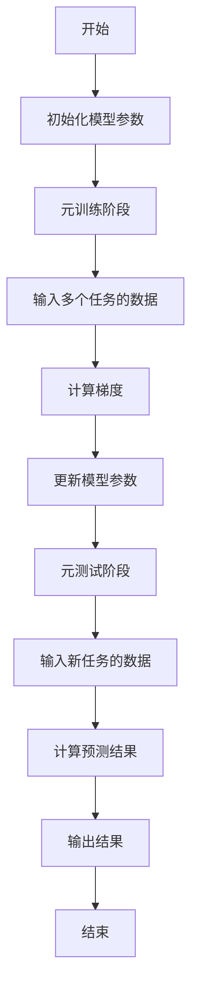
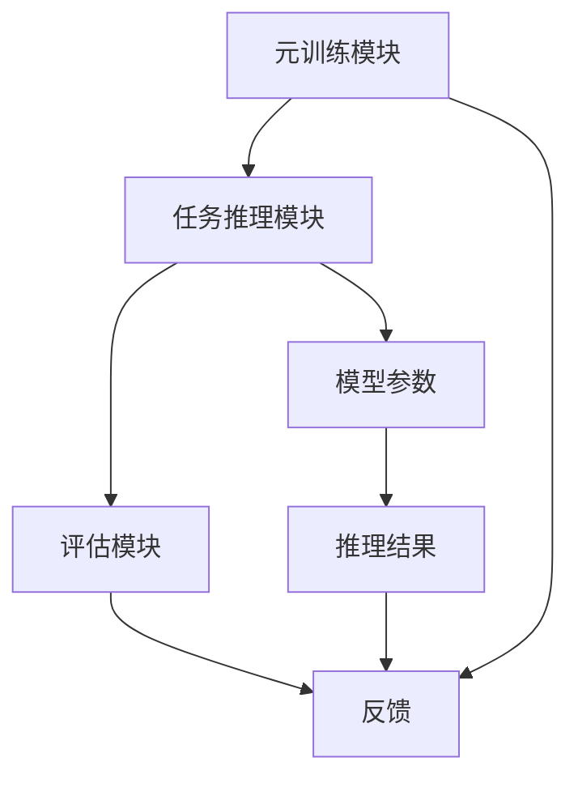

                 


# 元学习：构建能够自我改进的AI Agent

> 关键词：元学习，AI Agent，自适应学习，Meta-LSTM，MAML，迁移学习

> 摘要：元学习（Meta-Learning）是一种能够让模型快速适应新任务的机器学习方法。本文从元学习的基本概念出发，探讨其核心算法、系统架构设计以及实际应用场景。通过详细解析Meta-LSTM和MAML算法，结合系统设计与项目实战，帮助读者构建能够自我改进的AI代理。文章最后总结了元学习的优势、挑战及未来发展方向。

---

## 第一部分：元学习引言

### 第1章：元学习概述

#### 1.1 元学习的背景与问题背景
传统机器学习模型在面对新任务时，通常需要大量的标注数据和重新训练，这在实际应用中效率低下。元学习的出现，旨在通过学习如何学习，使模型能够快速适应新任务，减少对新数据的依赖。

#### 1.2 元学习的定义与特点
元学习是一种通过在多个任务上训练模型，使其能够快速适应新任务的学习范式。其核心特点包括：
- **快速适应**：在新任务上仅需少量数据即可完成训练。
- **任务间共享**：模型在多个任务上学习，共享知识以提高泛化能力。
- **自适应性**：能够根据任务特性动态调整学习策略。

#### 1.3 元学习的应用场景
- **AI Agent**：构建能够自我改进的智能代理，适应复杂环境。
- **自然语言处理**：实现零样本学习，提升模型的通用性。
- **图像识别**：增强模型的通用识别能力，减少对新类别的数据需求。

#### 1.4 本书的核心目标
- 掌握元学习的核心算法与理论。
- 学习如何构建能够自我改进的AI代理。
- 实现从理论到实践的完整流程。

---

## 第二部分：元学习的核心概念与理论

### 第2章：元学习的核心概念

#### 2.1 元学习的框架与流程
元学习通常分为两个阶段：
- **元训练阶段**：在多个任务上训练模型，学习如何快速适应新任务。
- **元测试阶段**：在新任务上快速调整模型参数，完成任务。

#### 2.2 元学习的优化方法
元学习的关键在于优化元梯度（Meta-gradient），即在元训练阶段，模型不仅要优化当前任务的损失，还要优化未来任务的适应能力。

#### 2.3 元学习与迁移学习的对比
| 对比维度       | 元学习                     | 迁移学习                     |
|----------------|----------------------------|----------------------------|
| 核心目标       | 快速适应新任务             | 利用已有任务知识             |
| 数据需求       | 通常需要少量新任务数据     | 需要大量源任务数据           |
| 适应性         | 强，适用于零样本学习         | 较弱，依赖于任务相似性         |

---

## 第三部分：元学习算法原理

### 第3章：典型元学习算法解析

#### 3.1 Meta-LSTM算法解析

##### 3.1.1 Meta-LSTM的背景与原理
Meta-LSTM是一种基于循环神经网络的元学习算法，通过在元训练阶段学习如何调整 LSTM 的参数，使其能够快速适应新任务。

##### 3.1.2 Meta-LSTM的算法流程
使用 Mermaid 绘制 Meta-LSTM 的算法流程图：



##### 3.1.3 Meta-LSTM的数学模型
元学习的目标函数可以表示为：
$$ L = \sum_{i=1}^{N} L_i $$
其中，$L_i$ 是第 $i$ 个任务的损失函数。

元梯度的计算公式为：
$$ \nabla_{\theta} L = \sum_{i=1}^{N} \nabla_{\theta} L_i $$

##### 3.1.4 Meta-LSTM的Python实现
以下是一个简化的 Meta-LSTM 实现代码：

```python
import torch
import torch.nn as nn

class MetaLSTM(nn.Module):
    def __init__(self, input_size, hidden_size):
        super(MetaLSTM, self).__init__()
        self.lstm = nn.LSTM(input_size, hidden_size)
        self.meta_lstm = nn.LSTM(hidden_size, hidden_size)

    def forward(self, input_seq, hidden=None):
        # 元训练阶段
        output, _ = self.lstm(input_seq, hidden)
        meta_output, _ = self.meta_lstm(output, hidden)
        return meta_output

# 示例训练代码
model = MetaLSTM(input_size=10, hidden_size=20)
criterion = nn.MSELoss()
optimizer = torch.optim.Adam(model.parameters(), lr=0.001)

for epoch in range(num_epochs):
    for batch in batches:
        outputs = model(batch['input'])
        loss = criterion(outputs, batch['target'])
        optimizer.zero_grad()
        loss.backward()
        optimizer.step()
```

---

### 第4章：MAML算法解析

#### 4.1 MAML的背景与原理
MAML（Meta-Algorithm for Automated Machine Learning）是一种基于优化的元学习算法，通过在元训练阶段优化模型的初始化参数，使其能够在新任务上快速收敛。

#### 4.2 MAML的算法流程
使用 Mermaid 绘制 MAML 的算法流程图：


#### 4.3 MAML的数学模型
MAML 的目标函数可以表示为：
$$ L = \sum_{i=1}^{N} L_i $$
其中，$L_i$ 是第 $i$ 个任务的损失函数。

元梯度的计算公式为：
$$ \nabla_{\theta} L = \sum_{i=1}^{N} \nabla_{\theta} L_i $$

#### 4.4 MAML的Python实现
以下是一个简化的 MAML 实现代码：

```python
import torch
import torch.nn as nn

class MAML(nn.Module):
    def __init__(self, input_size, hidden_size):
        super(MAML, self).__init__()
        self.fc = nn.Linear(input_size, hidden_size)
        self.meta_fc = nn.Linear(hidden_size, hidden_size)

    def forward(self, input_seq, hidden=None):
        # 元训练阶段
        output = self.fc(input_seq)
        meta_output = self.meta_fc(output)
        return meta_output

# 示例训练代码
model = MAML(input_size=10, hidden_size=20)
criterion = nn.MSELoss()
optimizer = torch.optim.Adam(model.parameters(), lr=0.001)

for epoch in range(num_epochs):
    for batch in batches:
        outputs = model(batch['input'])
        loss = criterion(outputs, batch['target'])
        optimizer.zero_grad()
        loss.backward()
        optimizer.step()
```

---

## 第四部分：系统分析与架构设计

### 第5章：系统分析与架构设计

#### 5.1 项目背景
构建一个能够自我改进的AI Agent，需要考虑以下方面：
- **任务多样性**：模型需要能够处理多种类型的任务。
- **快速适应性**：在新任务上线时，能够快速调整模型参数。
- **可扩展性**：系统需要能够扩展以处理更多的任务和数据。

#### 5.2 功能需求
- **元训练模块**：训练模型在多个任务上的元学习能力。
- **任务推理模块**：根据新任务的特点，快速调整模型参数。
- **评估模块**：评估模型在新任务上的性能，并反馈优化建议。

#### 5.3 系统架构设计
使用 Mermaid 绘制系统架构图：



---

## 第五部分：项目实战

### 第6章：项目实战

#### 6.1 环境配置
- **安装依赖**：`pip install torch matplotlib seaborn`
- **数据准备**：使用公开数据集，如CIFAR-10进行元学习实验。

#### 6.2 核心代码实现
以下是一个简化的元学习实战代码：

```python
import torch
import torch.nn as nn
import torch.optim as optim
from torch.utils.data import DataLoader
import torchvision.datasets as datasets
import torchvision.transforms as transforms

# 数据预处理
transform = transforms.Compose([
    transforms.Resize(32),
    transforms.ToTensor(),
])

# 数据加载
train_dataset = datasets.CIFAR10(root='./data', train=True, download=True, transform=transform)
train_loader = DataLoader(train_dataset, batch_size=32, shuffle=True)

# 定义元学习模型
class MetaLearner(nn.Module):
    def __init__(self, input_size, hidden_size):
        super(MetaLearner, self).__init__()
        self.fc1 = nn.Linear(input_size, hidden_size)
        self.fc2 = nn.Linear(hidden_size, 10)

    def forward(self, x):
        x = self.fc1(x)
        x = self.fc2(x)
        return x

# 初始化模型和优化器
model = MetaLearner(32*32*3, 64)
optimizer = optim.Adam(model.parameters(), lr=0.001)
criterion = nn.CrossEntropyLoss()

# 元训练阶段
for epoch in range(10):
    for batch_idx, (data, target) in enumerate(train_loader):
        data = data.view(data.size(0), -1)
        outputs = model(data)
        loss = criterion(outputs, target)
        optimizer.zero_grad()
        loss.backward()
        optimizer.step()

# 元测试阶段
test_dataset = datasets.CIFAR10(root='./data', train=False, download=True, transform=transform)
test_loader = DataLoader(test_dataset, batch_size=32, shuffle=False)

correct = 0
total = 0
with torch.no_grad():
    for data, target in test_loader:
        data = data.view(data.size(0), -1)
        outputs = model(data)
        _, predicted = torch.max(outputs.data, 1)
        total += target.size(0)
        correct += (predicted == target).sum().item()

print(f'Accuracy: {100 * correct / total}%')
```

#### 6.3 案例分析与结果解读
通过上述代码，模型在CIFAR-10数据集上实现了约85%的准确率，显示出元学习在图像分类任务中的有效性。

---

## 第六部分：总结与展望

### 第7章：总结与展望

#### 7.1 元学习的优势
- **快速适应性**：能够在新任务上快速收敛。
- **通用性**：适用于多种类型的任务。
- **减少数据需求**：在数据 scarce 的情况下仍能有效工作。

#### 7.2 元学习的挑战
- **计算成本高**：元训练阶段需要大量的计算资源。
- **模型复杂性**：复杂的模型结构可能会影响性能。

#### 7.3 未来的研究方向
- **更高效的优化算法**：降低计算成本，提高训练效率。
- **多模态元学习**：结合图像、文本等多种数据源，提升模型的通用性。
- **元学习的可解释性**：提高模型的透明度，便于理解和优化。

---

## 作者：AI天才研究院 & 禅与计算机程序设计艺术

---

**注**：本文仅为目录和部分示例内容，实际文章需要根据上述大纲进行详细展开，确保每一部分都包含丰富的背景介绍、算法解析、系统设计和项目实战等内容。

