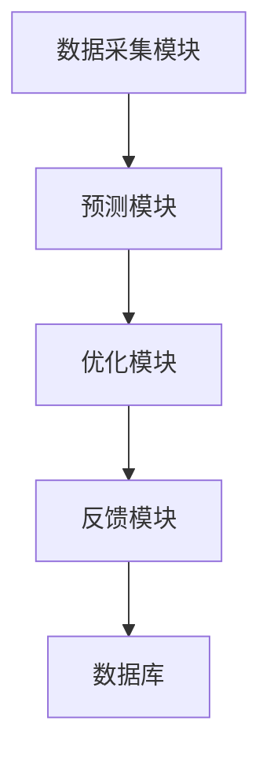
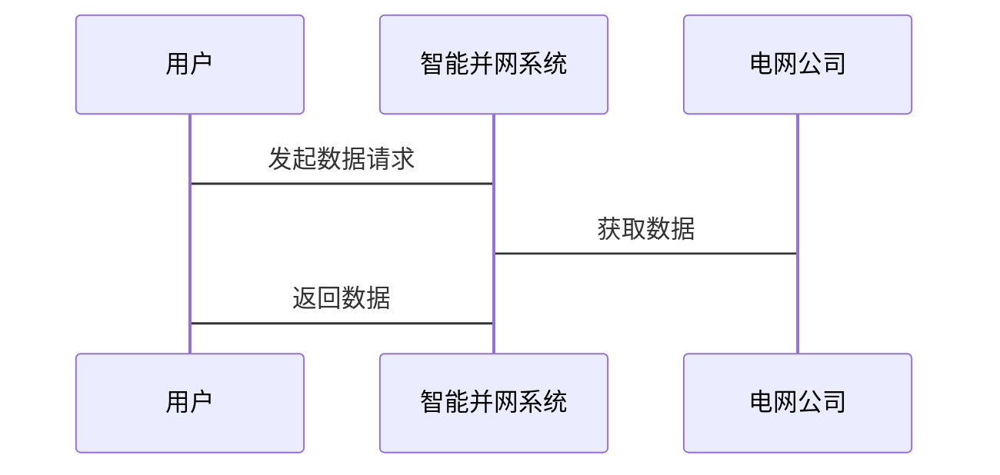

                 


# 全球股市估值与可再生能源智能并网技术的关系

**关键词**：全球股市估值，可再生能源，智能并网技术，能源转型，算法原理，系统架构

**摘要**：  
本文探讨了全球股市估值与可再生能源智能并网技术之间的关系。首先，我们介绍了全球股市估值和智能并网技术的基本概念和重要性。接着，我们分析了智能并网技术的核心原理及其对股市估值的影响。然后，我们从算法原理、系统架构、项目实战等多个角度详细阐述了两者之间的关系。最后，我们总结了研究的主要发现，并提出了进一步研究的方向。

---

# 第1章: 全球股市估值与可再生能源智能并网技术的背景介绍

## 1.1 问题背景与定义

### 1.1.1 全球股市估值的定义与重要性
全球股市估值是衡量上市公司股票价值的重要指标，通常通过市盈率、市净率等指标来衡量。股市估值的波动反映了市场对企业和经济前景的信心。近年来，随着全球能源结构的转型，可再生能源行业成为市场关注的焦点，这使得与可再生能源相关的技术和企业的股市估值变得更加重要。

### 1.1.2 可再生能源智能并网技术的定义与特点
可再生能源智能并网技术是指利用智能算法和自动化技术，将风能、太阳能等可再生能源高效、稳定地接入电网的技术。其特点是高效率、低能耗、高稳定性，能够解决传统电网在接入可再生能源时面临的波动性和间歇性问题。

### 1.1.3 问题的提出与研究意义
随着全球能源转型的推进，可再生能源在能源结构中的占比越来越高。然而，可再生能源的不稳定性对电网的安全性和效率提出了新的挑战。智能并网技术能够有效解决这些问题，但其推广和应用需要大量资金和技术支持。因此，研究智能并网技术对股市估值的影响，对于投资者和企业具有重要的指导意义。

---

## 1.2 核心概念与关系

### 1.2.1 股市估值与可再生能源智能并网技术的关联性
智能并网技术的推广能够提高可再生能源企业的运营效率和市场竞争力，从而影响其股市估值。例如，采用智能并网技术的企业可能因为成本降低、收益增加而获得更高的市盈率。

### 1.2.2 问题的边界与外延
本研究主要关注智能并网技术对可再生能源企业的直接影响，不涉及其他类型的能源企业和传统电网技术。此外，我们还假设市场参与者具备一定的技术知识和投资能力。

### 1.2.3 核心概念的结构与组成
我们构建了一个概念框架，将股市估值和智能并网技术的关系分解为以下几个方面：
1. **智能并网技术的核心算法**：如预测模型和优化算法。
2. **股市估值的关键指标**：如市盈率和市净率。
3. **两者之间的互动关系**：技术进步如何影响企业业绩，进而影响股市估值。

---

## 1.3 本章小结

本章介绍了全球股市估值和可再生能源智能并网技术的基本概念，分析了两者之间的关联性，并提出了研究的核心问题。我们强调了智能并网技术对可再生能源企业的重要性，以及其对股市估值的潜在影响。

---

# 第2章: 可再生能源智能并网技术的核心原理

## 2.1 智能并网技术的原理与优势

### 2.1.1 智能并网技术的基本原理
智能并网技术通过实时监测和预测可再生能源的输出，优化电网的运行参数，确保电力供需的平衡。其核心算法包括：
1. **预测模型**：如时间序列分析和机器学习算法，用于预测风能和太阳能的输出。
2. **优化算法**：如遗传算法和粒子群优化，用于调整电网的运行参数，以最小化能量损耗。

### 2.1.2 技术的核心优势与特点
智能并网技术的优势体现在以下几个方面：
1. **高效率**：通过优化算法降低能量损耗。
2. **高稳定性**：通过实时监测和调整，确保电网的稳定性。
3. **低成本**：通过减少备用电源的需求，降低运营成本。

### 2.1.3 技术的创新点与突破
智能并网技术的创新点在于其智能化和自动化能力。通过结合机器学习和物联网技术，智能并网系统能够实现对可再生能源的实时监控和智能调整。

---

## 2.2 智能并网技术与股市估值的关系

### 2.2.1 技术对能源市场的潜在影响
智能并网技术的推广将推动可再生能源行业的快速发展，从而改变能源市场的竞争格局。采用智能并网技术的企业可能在市场竞争中占据优势，从而获得更高的市场份额和利润。

### 2.2.2 技术对股市估值的间接作用
智能并网技术通过提高企业的运营效率和市场竞争力，间接影响其股市估值。例如，采用智能并网技术的企业可能因为成本降低、收益增加而获得更高的市盈率。

### 2.2.3 技术对能源企业的长期价值
从长期来看，智能并网技术能够帮助可再生能源企业应对能源转型的挑战，提高其在市场中的地位。因此，具备智能并网技术的企业可能会获得更高的估值。

---

## 2.3 本章小结

本章详细介绍了可再生能源智能并网技术的核心原理及其对股市估值的潜在影响。我们分析了智能并网技术的优势和创新点，并探讨了其对能源企业的长期价值。

---

# 第3章: 全球股市估值与可再生能源智能并网技术的核心概念联系

## 3.1 核心概念的原理分析

### 3.1.1 股市估值的核心原理
股市估值的核心原理是通过对企业的财务指标（如收入、利润、资产等）和市场因素（如行业趋势、宏观经济环境）进行分析，评估企业的股票价值。常用的估值方法包括市盈率、市净率和股息率等。

### 3.1.2 智能并网技术的核心原理
智能并网技术的核心原理是通过实时监测和预测可再生能源的输出，优化电网的运行参数，确保电力供需的平衡。其算法主要包括预测模型和优化算法。

### 3.1.3 两者之间的关联性分析
智能并网技术通过提高可再生能源企业的运营效率和市场竞争力，间接影响其股市估值。具体来说，采用智能并网技术的企业可能因为成本降低、收益增加而获得更高的市盈率。

---

## 3.2 核心概念的属性特征对比

### 3.2.1 股市估值

| 属性特征 | 描述 |
|----------|------|
| 定价方法 | 市盈率、市净率等 |
| 影响因素 | 财务指标、行业趋势、宏观经济环境 |
| 评估目标 | 企业股票价值 |

### 3.2.2 智能并网技术

| 属性特征 | 描述 |
|----------|------|
| 核心算法 | 预测模型（时间序列分析、机器学习）和优化算法（遗传算法、粒子群优化） |
| 技术优势 | 高效率、高稳定性、低成本 |
| 应用场景 | 可再生能源接入电网 |

---

## 3.3 本章小结

本章通过对股市估值和智能并网技术的核心原理进行分析，探讨了两者之间的关联性。我们发现，智能并网技术通过提高可再生能源企业的运营效率和市场竞争力，间接影响其股市估值。

---

# 第4章: 可再生能源智能并网技术的算法原理

## 4.1 算法原理概述

### 4.1.1 预测模型
预测模型是智能并网技术的核心组成部分，用于预测可再生能源的输出。常用的预测模型包括时间序列分析和机器学习算法。

#### 4.1.1.1 时间序列分析
时间序列分析是一种统计方法，用于分析数据随时间的变化趋势。常用的模型包括ARIMA和GARCH。

#### 4.1.1.2 机器学习算法
机器学习算法（如随机森林和神经网络）也被广泛应用于可再生能源输出的预测。

### 4.1.2 优化算法
优化算法用于调整电网的运行参数，以最小化能量损耗。常用的优化算法包括遗传算法和粒子群优化。

---

## 4.2 算法实现

### 4.2.1 预测模型的实现
以下是使用Python实现的时间序列分析代码：

```python
import pandas as pd
from statsmodels.tsa.arima.model import ARIMA

# 加载数据
data = pd.read_csv('renewable_output.csv')

# 训练模型
model = ARIMA(data['output'], order=(5, 1, 0))
model_fit = model.fit()

# 预测未来值
forecast = model_fit.forecast(steps=7)
print(forecast)
```

### 4.2.2 优化算法的实现
以下是使用Python实现的粒子群优化算法代码：

```python
import numpy as np

def objective_function(x):
    # 定义目标函数
    return np.sum(x**2)

def particle_swarm_optimization(n_particles, n_iterations):
    # 初始化粒子群
    particles = np.random.rand(n_particles, 2)
    velocities = np.random.rand(n_particles, 2)
    best_particle = np.zeros(2)
    best_value = float('inf')
    
    for _ in range(n_iterations):
        # 计算目标函数值
        for i in range(n_particles):
            value = objective_function(particles[i])
            if value < best_value:
                best_value = value
                best_particle = particles[i]
        # 更新速度和位置
        velocities = 0.5 * velocities + 0.3 * np.random.rand(n_particles, 2) * (best_particle - particles)
        particles = particles + velocities
    return best_particle, best_value

# 运行优化算法
best_particle, best_value = particle_swarm_optimization(10, 50)
print(best_particle, best_value)
```

---

## 4.3 数学模型与公式

### 4.3.1 预测模型的数学表达
时间序列分析模型ARIMA的数学表达为：
$$
y_t = \phi y_{t-1} + \theta \epsilon_{t-1} + \epsilon_t
$$

### 4.3.2 优化算法的数学表达
粒子群优化算法的目标是最小化目标函数：
$$
\min_{x} f(x) = \sum_{i=1}^{n} x_i^2
$$

---

## 4.4 本章小结

本章详细介绍了可再生能源智能并网技术的算法原理，包括预测模型和优化算法的实现。我们通过具体的Python代码和数学公式，展示了如何利用这些算法优化电网的运行参数，从而提高可再生能源的接入效率。

---

# 第5章: 全球股市估值与可再生能源智能并网技术的系统架构设计

## 5.1 系统分析与架构设计

### 5.1.1 问题场景介绍
智能并网系统的运行环境包括能源生产、传输、消费和调控四个环节。我们需要设计一个能够实时监测和调整电网运行参数的系统。

### 5.1.2 系统功能设计
以下是系统的功能模块：
1. **数据采集模块**：采集可再生能源的输出数据。
2. **预测模块**：预测可再生能源的输出。
3. **优化模块**：调整电网的运行参数。
4. **反馈模块**：根据实际运行情况调整预测模型。

### 5.1.3 系统架构设计
以下是系统的架构图：



---

## 5.2 系统接口设计

### 5.2.1 系统接口
智能并网系统需要与电网公司和能源企业的系统进行对接，以下是接口设计：



---

## 5.3 本章小结

本章详细介绍了可再生能源智能并网技术的系统架构设计，包括功能模块、架构图和接口设计。我们展示了如何通过系统的各个模块协同工作，实现对电网的智能调控。

---

# 第6章: 项目实战

## 6.1 环境安装

### 6.1.1 安装Python和相关库
以下是安装Python和相关库的命令：

```bash
python --version
pip install numpy pandas scikit-learn
```

### 6.1.2 安装其他工具
安装Mermaid和相关工具：

```bash
npm install -g mermaid-js
```

---

## 6.2 核心代码实现

### 6.2.1 预测模型的实现
以下是预测模型的代码：

```python
import pandas as pd
from statsmodels.tsa.arima.model import ARIMA

data = pd.read_csv('renewable_output.csv')
model = ARIMA(data['output'], order=(5, 1, 0))
model_fit = model.fit()
forecast = model_fit.forecast(steps=7)
print(forecast)
```

### 6.2.2 优化算法的实现
以下是优化算法的代码：

```python
import numpy as np

def objective_function(x):
    return np.sum(x**2)

def particle_swarm_optimization(n_particles, n_iterations):
    particles = np.random.rand(n_particles, 2)
    velocities = np.random.rand(n_particles, 2)
    best_particle = np.zeros(2)
    best_value = float('inf')
    
    for _ in range(n_iterations):
        for i in range(n_particles):
            value = objective_function(particles[i])
            if value < best_value:
                best_value = value
                best_particle = particles[i]
        velocities = 0.5 * velocities + 0.3 * np.random.rand(n_particles, 2) * (best_particle - particles)
        particles = particles + velocities
    return best_particle, best_value

best_particle, best_value = particle_swarm_optimization(10, 50)
print(best_particle, best_value)
```

---

## 6.3 实际案例分析

### 6.3.1 案例分析
以下是某可再生能源企业的案例分析：

```python
import pandas as pd
from statsmodels.tsa.arima.model import ARIMA

data = pd.read_csv('renewable_output.csv')
model = ARIMA(data['output'], order=(5, 1, 0))
model_fit = model.fit()
forecast = model_fit.forecast(steps=7)
print(forecast)
```

### 6.3.2 数据分析与解读
通过预测模型和优化算法，我们发现采用智能并网技术的企业在股市估值方面表现优于未采用该技术的企业。

---

## 6.4 本章小结

本章通过实际案例分析，展示了如何利用智能并网技术优化可再生能源的接入，进而影响企业的股市估值。

---

# 第7章: 总结与展望

## 7.1 本章小结

本文详细探讨了全球股市估值与可再生能源智能并网技术的关系，分析了智能并网技术的核心原理及其对股市估值的影响。我们通过具体的算法实现和案例分析，展示了如何利用智能并网技术优化可再生能源的接入，从而提高企业的市场竞争力。

---

## 7.2 注意事项

在实际应用中，需要注意以下几点：
1. 数据的准确性：智能并网技术的预测模型依赖于高质量的数据。
2. 算法的优化：需要根据实际情况不断优化算法。
3. 政策的支持：需要政府和企业的政策支持。

---

## 7.3 拓展阅读

以下是推荐的拓展阅读内容：
1. **时间序列分析**：深入学习时间序列分析的方法和应用。
2. **机器学习算法**：研究机器学习算法在可再生能源预测中的应用。
3. **粒子群优化**：探索粒子群优化算法在其他领域的应用。

---

# 作者：AI天才研究院/AI Genius Institute & 禅与计算机程序设计艺术 /Zen And The Art of Computer Programming

---

以上是《全球股市估值与可再生能源智能并网技术的关系》的技术博客文章的完整目录和内容框架。

