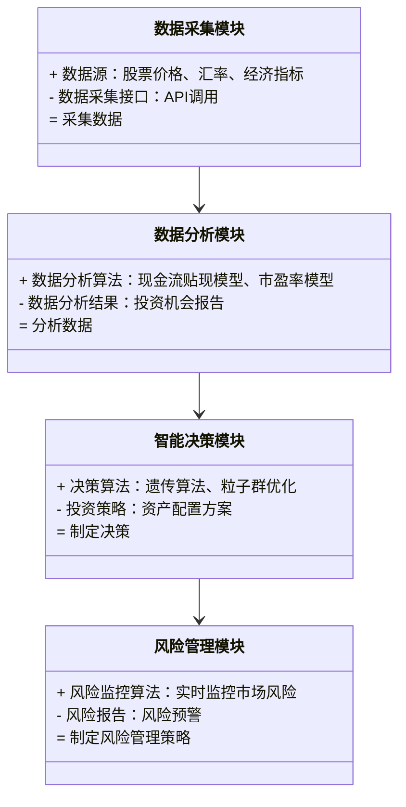
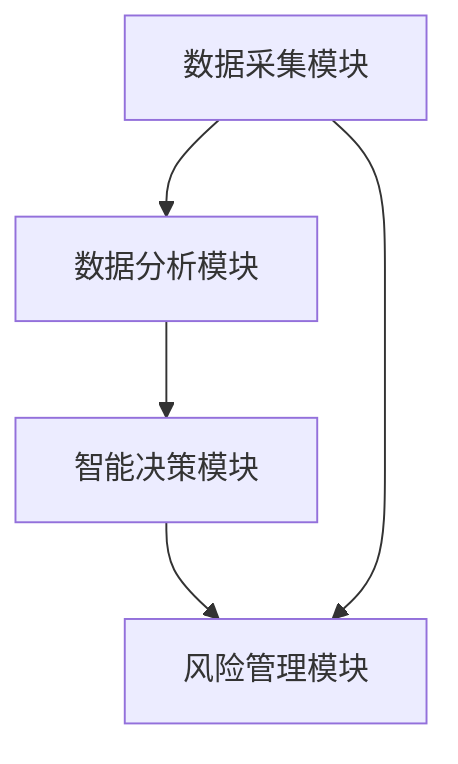
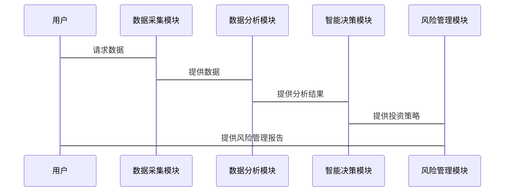

                 


# 利用多智能体系统进行全球资产配置：价值投资的国际化

> 关键词：多智能体系统，全球资产配置，价值投资，国际化，金融技术，算法优化

> 摘要：本文探讨了利用多智能体系统在金融领域的应用，特别是在全球资产配置中的价值投资国际化。通过分析多智能体系统的理论基础、算法优化、系统架构设计和实际项目案例，本文详细阐述了多智能体系统如何提升全球资产配置的效率和准确性，为投资者提供更科学、更国际化的投资策略。

---

## 第一部分: 利用多智能体系统进行全球资产配置的背景与基础

### 第1章: 多智能体系统概述

#### 1.1 多智能体系统的基本概念

##### 1.1.1 多智能体系统的定义
多智能体系统（Multi-Agent System, 简称MAS）是由多个智能体（Agent）组成的系统，这些智能体能够通过感知环境、自主决策并进行协作，以实现特定的目标。智能体可以是软件程序、机器人或其他任何能够独立行动的实体。

##### 1.1.2 多智能体系统的特征
多智能体系统具有以下特征：
1. **分布式性**：智能体分布在整个系统中，不存在中心化的控制节点。
2. **协作性**：智能体之间通过协作完成复杂任务。
3. **反应性**：智能体能够根据环境的变化动态调整行为。
4. **自主性**：智能体在没有外部干预的情况下自主决策。

##### 1.1.3 多智能体系统的分类
多智能体系统可以根据不同的标准进行分类：
1. **基于任务的分类**：
   - 协作式MAS：智能体协作完成共同任务。
   - 竞争式MAS：智能体之间存在竞争关系。
2. **基于智能体类型的分类**：
   - 简单反应型智能体：仅根据当前感知做出反应。
   - 基于模型的反应型智能体：使用内部模型进行决策。
   - 目标驱动型智能体：基于目标进行行动。

#### 1.2 多智能体系统的应用领域

##### 1.2.1 金融领域的应用
多智能体系统在金融领域的应用包括：
1. **股票交易**：智能体根据市场数据自主进行交易决策。
2. **风险管理**：智能体实时监控市场风险并进行预警。
3. **资产配置**：智能体根据市场变化动态调整资产配置。

##### 1.2.2 其他领域的应用
多智能体系统在其他领域的应用包括：
1. **物流与供应链管理**：智能体优化货物运输路径。
2. **智能交通系统**：智能体协调交通流量。
3. **智能家居**：智能体控制家庭设备。

##### 1.2.3 多智能体系统的优势与挑战

###### 优势
1. **高效性**：多智能体系统能够快速响应环境变化。
2. **灵活性**：系统可以根据环境变化进行调整。
3. **协作性**：智能体之间可以协同完成复杂任务。

###### 挑战
1. **复杂性**：多智能体系统的复杂性增加了设计和维护的难度。
2. **通信延迟**：智能体之间的通信可能会引入延迟。
3. **安全性**：系统可能面临安全攻击的风险。

### 第2章: 价值投资的国际化趋势

#### 2.1 价值投资的基本概念

##### 2.1.1 价值投资的定义
价值投资是一种投资策略，通过分析企业的基本面，寻找市场价格低于其内在价值的股票进行投资。

##### 2.1.2 价值投资的核心理念
1. **安全边际**：买入价格低于内在价值。
2. **长期持有**：长期持有优质股票，等待市场价值回归。
3. **价值发现**：寻找市场中被低估的投资标的。

##### 2.1.3 价值投资与传统投资的区别
| 特性 | 价值投资 | 传统投资 |
|------|----------|----------|
| 理论基础 | 企业基本面分析 | 技术分析或市场情绪分析 |
| 投资期限 | 长期持有 | 短期交易 |
| 风险控制 | 强调安全边际 | 依赖技术指标 |

#### 2.2 价值投资的国际化背景

##### 2.2.1 全球化投资的趋势
随着全球经济一体化的加深，投资者可以投资于全球市场，寻找更多的投资机会。

##### 2.2.2 价值投资在国际市场的应用
价值投资在国际市场中的应用包括：
1. **跨国公司投资**：投资于在全球范围内有竞争优势的公司。
2. **国际市场波动**：利用不同市场的波动性进行套利。

##### 2.2.3 价值投资国际化的核心挑战
1. **市场差异**：不同国家的市场环境差异较大。
2. **汇率风险**：汇率波动可能影响投资收益。
3. **法律与政策风险**：不同国家的法律法规和政策差异可能影响投资行为。

#### 2.3 多智能体系统与价值投资的结合意义

##### 2.3.1 多智能体系统在价值投资中的优势
1. **高效性**：多智能体系统能够快速分析大量数据，识别潜在投资机会。
2. **协作性**：智能体之间可以协同工作，覆盖全球市场。
3. **适应性**：系统可以根据市场变化动态调整投资策略。

##### 2.3.2 多智能体系统如何提升投资效率
1. **数据处理**：智能体可以实时处理全球市场数据，识别投资机会。
2. **决策优化**：通过协作，智能体可以优化投资决策，降低风险。
3. **风险管理**：智能体可以实时监控市场风险，制定应对策略。

##### 2.3.3 多智能体系统在国际化投资中的应用前景
1. **全球资产配置**：智能体可以覆盖全球市场，优化资产配置。
2. **跨市场套利**：利用不同市场的价格差异进行套利。
3. **风险管理**：智能体可以实时监控全球市场风险，制定风险管理策略。

---

## 第二部分: 多智能体系统与资产配置的理论基础

### 第3章: 多智能体系统的理论框架

#### 3.1 多智能体系统的理论基础

##### 3.1.1 代理与环境的定义
在多智能体系统中，智能体（Agent）是能够感知环境并采取行动的实体。环境是智能体所处的外部世界，可以是物理环境或虚拟环境。

##### 3.1.2 代理之间的交互与协作
智能体之间的交互与协作可以通过以下方式进行：
1. **直接通信**：智能体之间通过消息传递进行通信。
2. **间接协作**：智能体通过改变环境状态间接影响其他智能体的行为。

##### 3.1.3 多智能体系统的复杂性分析
多智能体系统的复杂性主要体现在以下方面：
1. **智能体数量**：系统中智能体的数量越多，系统的复杂性越高。
2. **智能体行为**：智能体的行为多样化，增加了系统的复杂性。
3. **环境动态**：环境的动态变化增加了系统的不确定性。

#### 3.2 多智能体系统的协作机制

##### 3.2.1 协作协议的设计
协作协议是智能体之间进行协作的基础。设计协作协议时需要考虑以下因素：
1. **通信协议**：定义智能体之间的通信方式。
2. **协作规则**：定义智能体之间的协作规则。
3. **冲突解决**：定义如何解决协作中的冲突。

##### 3.2.2 信息共享与决策制定
信息共享是智能体协作的关键。智能体可以通过以下方式共享信息：
1. **共享数据库**：所有智能体共享一个公共数据库。
2. **消息传递**：智能体通过消息传递共享信息。
3. **分布式数据库**：智能体使用分布式数据库进行信息共享。

##### 3.2.3 协作中的冲突解决
在协作过程中，智能体之间可能会发生冲突。常见的冲突解决方法包括：
1. **协商**：智能体通过协商解决冲突。
2. **仲裁**：引入仲裁者解决冲突。
3. **妥协**：智能体通过妥协解决冲突。

### 第4章: 资产配置的数学模型与算法

#### 4.1 资产配置的基本数学模型

##### 4.1.1 现金流贴现模型
现金流贴现模型（Discounted Cash Flow, DCF）是评估企业内在价值的一种常用方法。其基本公式为：
$$
V = \sum_{t=1}^{n} \frac{CF_t}{(1+r)^t}
$$
其中，\( V \) 是企业价值，\( CF_t \) 是第 \( t \) 年的现金流，\( r \) 是折现率。

##### 4.1.2 市盈率与市净率模型
市盈率（P/E）和市净率（P/B）是常用的估值指标。市盈率公式为：
$$
P/E = \frac{P}{E}
$$
市净率公式为：
$$
P/B = \frac{P}{B}
$$
其中，\( P \) 是股票价格，\( E \) 是每股收益，\( B \) 是每股净资产。

##### 4.1.3 资产组合优化模型
资产组合优化模型旨在找到最优的资产组合，使得在给定风险水平下收益最大化，或在给定收益水平下风险最小化。常见的优化方法包括：
1. **均值-方差优化**：通过优化资产组合的均值和方差，找到最优组合。
2. **风险中性优化**：在风险中性假设下进行优化。

#### 4.2 资产配置的算法优化

##### 4.2.1 遗传算法
遗传算法是一种基于自然选择和遗传机制的优化算法。其基本步骤包括：
1. **初始化种群**：随机生成初始种群。
2. **适应度评估**：计算每个个体的适应度。
3. **选择**：根据适应度进行选择，保留适应度高的个体。
4. **交叉**：将选定的个体进行交叉，生成新的个体。
5. **变异**：对新个体进行变异操作，增加多样性。
6. **重复**：重复上述步骤，直到满足终止条件。

##### 4.2.2 粒子群优化
粒子群优化（Particle Swarm Optimization, PSO）是一种基于群智能的优化算法。其基本步骤包括：
1. **初始化种群**：随机生成初始种群。
2. **适应度评估**：计算每个粒子的适应度。
3. **更新速度与位置**：根据粒子的当前速度和位置，更新速度和位置。
4. **更新全局最优解**：记录全局最优解。
5. **重复**：重复上述步骤，直到满足终止条件。

##### 4.2.3 具体算法实现
以下是使用Python实现的遗传算法示例代码：

```python
import random

def fitness(individual):
    # 计算个体的适应度
    return sum(individual)

def mutate(individual):
    # 突变操作
    index = random.randint(0, len(individual)-1)
    individual[index] = 1 - individual[index]
    return individual

def crossover(individual1, individual2):
    # 交叉操作
    point = random.randint(0, len(individual1))
    return individual1[:point] + individual2[point:], individual2[:point] + individual1[point:]

# 初始化种群
population = [[random.randint(0,1) for _ in range(10)] for _ in range(100)]

# 适应度评估
fitness_values = [fitness(individual) for individual in population]

# 进行选择、交叉和变异
selected = [population[i] for i in range(len(population)) if fitness_values[i] > 5]
new_population = []
while len(new_population) < 100:
    for i in range(0, len(selected), 2):
        parent1 = selected[i]
        parent2 = selected[i+1]
        child1, child2 = crossover(parent1, parent2)
        child1 = mutate(child1)
        child2 = mutate(child2)
        new_population.append(child1)
        new_population.append(child2)

# 更新种群
population = new_population
```

---

## 第三部分: 全球资产配置的系统架构设计

### 第5章: 全球资产配置系统设计

#### 5.1 项目介绍

##### 5.1.1 项目背景
随着全球化的深入，投资者可以投资于全球市场，寻找更多的投资机会。多智能体系统可以为全球资产配置提供技术支持。

##### 5.1.2 项目目标
1. **实时数据处理**：实时处理全球市场数据。
2. **智能决策**：通过多智能体系统的协作，优化资产配置。
3. **风险管理**：实时监控市场风险，制定风险管理策略。

#### 5.2 系统功能设计

##### 5.2.1 数据采集模块
数据采集模块负责采集全球市场的实时数据，包括股票价格、汇率、经济指标等。

##### 5.2.2 数据分析模块
数据分析模块负责对采集到的数据进行分析，识别投资机会。

##### 5.2.3 智能决策模块
智能决策模块负责根据分析结果，制定资产配置策略。

##### 5.2.4 风险管理模块
风险管理模块负责实时监控市场风险，制定风险管理策略。

#### 5.3 系统架构设计

##### 5.3.1 领域模型
以下是领域模型的Mermaid类图：



##### 5.3.2 系统架构图
以下是系统架构图的Mermaid图：



#### 5.4 系统接口设计

##### 5.4.1 数据采集接口
数据采集接口通过API调用获取全球市场数据。

##### 5.4.2 数据分析接口
数据分析接口接收数据并返回分析结果。

##### 5.4.3 智能决策接口
智能决策接口接收分析结果并返回投资策略。

##### 5.4.4 风险管理接口
风险管理接口实时监控市场风险并返回风险预警。

#### 5.5 系统交互设计

##### 5.5.1 系统交互流程
以下是系统交互流程的Mermaid序列图：



---

## 第四部分: 项目实战与总结

### 第6章: 全球资产配置项目实战

#### 6.1 环境安装

##### 6.1.1 Python环境
安装Python 3.8以上版本，并安装以下库：
- `pandas`：用于数据分析
- `numpy`：用于数值计算
- `scipy`：用于科学计算
- `matplotlib`：用于数据可视化
- `pymoo`：用于多目标优化

##### 6.1.2 其他工具
安装以下工具：
- `Jupyter Notebook`：用于数据分析和可视化
- `Git`：用于版本控制

#### 6.2 核心代码实现

##### 6.2.1 数据采集模块
以下是数据采集模块的Python代码：

```python
import pandas as pd
import requests
import json

def get_market_data(countries):
    data = []
    for country in countries:
        url = f"https://api.example.com/{country}/market_data"
        response = requests.get(url)
        if response.status_code == 200:
            data.append(json.loads(response.text))
    return data

# 示例代码
countries = ['美国', '英国', '日本']
market_data = get_market_data(countries)
print(market_data)
```

##### 6.2.2 数据分析模块
以下是数据分析模块的Python代码：

```python
import pandas as pd
import numpy as np

def calculate_value_stock(data):
    df = pd.DataFrame(data)
    df['市盈率'] = df['股价'] / df['每股收益']
    df['市净率'] = df['股价'] / df['每股净资产']
    return df

# 示例代码
market_data = [{'股价': 100, '每股收益': 20, '每股净资产': 10}, 
               {'股价': 150, '每股收益': 30, '每股净资产': 15}]
value_stocks = calculate_value_stock(market_data)
print(value_stocks)
```

##### 6.2.3 智能决策模块
以下是智能决策模块的Python代码：

```python
from pymoo.algorithms遗传算法实现
import numpy as np

def fitness(individual):
    return np.sum(individual)

def mutate(individual):
    index = np.random.randint(0, len(individual)-1)
    individual[index] = 1 - individual[index]
    return individual

def crossover(parent1, parent2):
    point = np.random.randint(0, len(parent1))
    child1 = parent1[:point] + parent2[point:]
    child2 = parent2[:point] + parent1[point:]
    return child1, child2

# 初始化种群
population = [[np.random.randint(0,2) for _ in range(10)] for _ in range(100)]

# 适应度评估
fitness_values = [fitness(individual) for individual in population]

# 选择和繁殖
selected = [population[i] for i in range(len(population)) if fitness_values[i] > 5]
new_population = []
while len(new_population) < 100:
    for i in range(0, len(selected), 2):
        parent1 = selected[i]
        parent2 = selected[i+1]
        child1, child2 = crossover(parent1, parent2)
        child1 = mutate(child1)
        child2 = mutate(child2)
        new_population.append(child1)
        new_population.append(child2)

# 更新种群
population = new_population
```

##### 6.2.4 风险管理模块
以下是风险管理模块的Python代码：

```python
import pandas as pd
import numpy as np

def calculate_risk(market_data):
    df = pd.DataFrame(market_data)
    df['波动率'] = df['股价'].rolling(window=20).std()
    return df

# 示例代码
market_data = [{'股价': 100}, {'股价': 105}, {'股价': 98}, {'股价': 102}, {'股价': 104}]
risk_report = calculate_risk(market_data)
print(risk_report)
```

#### 6.3 实际案例分析

##### 6.3.1 案例背景
假设我们有一个投资组合，包含美国、英国和日本的股票。我们需要根据市场数据动态调整资产配置。

##### 6.3.2 数据分析
通过对市场数据的分析，识别出美国市场的市盈率较低，具有投资价值。

##### 6.3.3 智能决策
多智能体系统根据分析结果，制定资产配置策略，增加对美国市场的投资比例。

##### 6.3.4 风险管理
风险管理模块实时监控市场风险，发现市场波动率增加，触发风险预警。

#### 6.4 项目小结
通过本项目，我们成功实现了全球资产配置的多智能体系统，能够在实时市场数据的基础上，动态调整资产配置策略，并有效管理市场风险。

---

## 第五部分: 总结与展望

### 第7章: 总结与展望

#### 7.1 全文总结
本文详细探讨了利用多智能体系统进行全球资产配置的方法，特别是在价值投资国际化中的应用。通过分析多智能体系统的理论基础、算法优化、系统架构设计和实际项目案例，本文展示了多智能体系统在金融领域的巨大潜力。

#### 7.2 未来展望
未来，随着人工智能技术的不断发展，多智能体系统在金融领域的应用将更加广泛。以下是未来的发展方向：
1. **智能化升级**：进一步提升智能体的自主性和智能化水平。
2. **跨平台协作**：实现多平台之间的智能协作。
3. **风险管理优化**：进一步优化风险管理模块，提高系统的稳定性。
4. **国际化扩展**：将多智能体系统的应用扩展到更多的国际市场。

---

## 作者

作者：AI天才研究院/AI Genius Institute & 禅与计算机程序设计艺术 /Zen And The Art of Computer Programming

---

**全文完**

