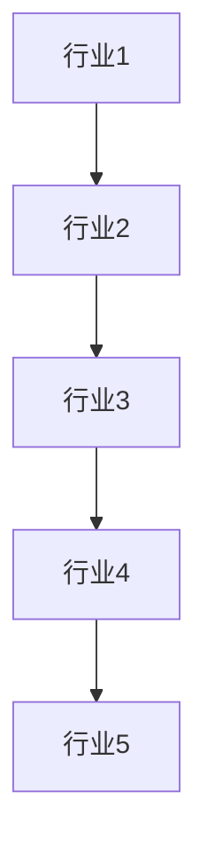
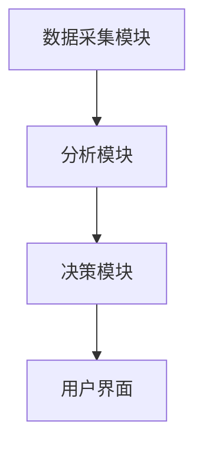
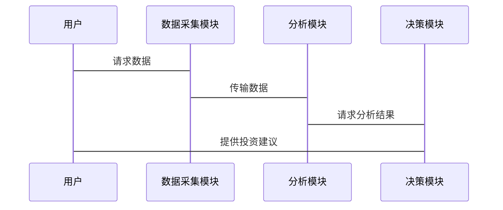

                 


# 多智能体协同进行行业轮动分析

## 关键词：多智能体协同，行业轮动分析，分布式计算，协作学习，系统架构设计

## 摘要：  
本文详细探讨了多智能体协同在行业轮动分析中的应用，从基本概念到算法原理，再到系统架构设计和实际案例分析，全面解析了多智能体协同如何助力行业轮动分析的效率和准确性。通过本文，读者可以深入了解多智能体协同的核心原理、行业轮动分析的数学模型，以及如何通过系统化的方法构建高效可靠的行业轮动分析系统。

---

## 第一部分：多智能体协同与行业轮动分析背景

### 第1章：多智能体协同与行业轮动概述

#### 1.1 多智能体协同的基本概念
多智能体协同是指多个智能体（Agent）通过协作完成共同目标的过程。智能体可以是软件程序、算法或实体设备，它们通过通信和协作完成复杂任务。多智能体协同的核心在于分布式计算和协作学习，能够有效提高系统的整体效率和灵活性。

- **1.1.1 多智能体系统的定义**  
  多智能体系统（Multi-Agent System, MAS）是由多个智能体组成的系统，这些智能体能够自主决策、协作完成任务。  
  例如，在金融领域，多个智能体可以分别负责数据收集、分析和决策，共同完成行业轮动分析。

- **1.1.2 多智能体系统的特征**  
  - **自主性**：智能体能够自主决策。  
  - **协作性**：智能体之间通过通信协作完成任务。  
  - **分布性**：智能体分布在网络中，避免单点故障。  
  - **适应性**：智能体能够根据环境变化调整行为。  

- **1.1.3 多智能体系统的应用场景**  
  多智能体系统广泛应用于金融、交通、医疗等领域。例如，在金融领域，多智能体可以用于实时数据分析、投资决策等。

#### 1.2 行业轮动分析的定义与意义
行业轮动分析是指通过分析不同行业之间的动态变化，预测行业发展趋势的过程。行业轮动分析的核心在于捕捉行业间的关联性，为投资决策提供依据。

- **1.2.1 行业轮动的定义**  
  行业轮动是指不同行业在经济周期中的交替表现。例如，在经济衰退期，防御性行业（如公用事业）表现较好，而在经济复苏期，周期性行业（如制造业）表现较好。

- **1.2.2 行业轮动分析的重要性**  
  行业轮动分析能够帮助投资者优化资产配置，降低风险，提高收益。例如，在行业轮动分析的指导下，投资者可以及时调整投资组合，避免亏损。

- **1.2.3 行业轮动分析的应用领域**  
  行业轮动分析广泛应用于金融投资、宏观经济分析等领域。例如，在金融投资中，行业轮动分析可以帮助投资者选择具有潜力的行业进行投资。

#### 1.3 多智能体协同与行业轮动分析的结合
多智能体协同与行业轮动分析的结合，能够显著提高行业轮动分析的效率和准确性。多智能体协同的优势在于分布式计算和协作学习，能够处理大规模数据，捕捉行业间的复杂关系。

- **1.3.1 多智能体协同在行业轮动分析中的作用**  
  - **分布式计算**：多智能体可以分别处理不同行业的数据，提高计算效率。  
  - **协作学习**：多个智能体可以共同学习行业间的关联性，提高模型的准确性。  

- **1.3.2 行业轮动分析的多智能体协同优势**  
  - **高效率**：多智能体协同能够并行处理数据，显著提高分析速度。  
  - **高精度**：通过协作学习，多个智能体能够共同优化模型，提高预测的准确性。  

- **1.3.3 行业轮动分析的多智能体协同挑战**  
  - **通信延迟**：智能体之间的通信可能会引入延迟。  
  - **数据隐私**：多智能体协同需要处理敏感数据，数据隐私问题需要妥善解决。  

---

## 第二部分：多智能体协同与行业轮动分析的核心概念

### 第2章：多智能体协同的核心原理

#### 2.1 多智能体系统的协作机制
多智能体系统的协作机制是实现协同的核心。分布式计算和协作学习是多智能体协同的两大核心机制。

- **2.1.1 分布式计算**  
  分布式计算是指将任务分解成多个子任务，分别由不同的智能体完成。例如，在行业轮动分析中，多个智能体可以分别负责数据收集、特征提取和模型训练。

- **2.1.2 协作学习**  
  协作学习是指多个智能体共同学习同一任务。例如，在行业轮动分析中，多个智能体可以共同训练一个行业预测模型，通过协作学习提高模型的泛化能力。

- **2.1.3 协作决策**  
  协作决策是指多个智能体共同决策，例如在投资决策中，多个智能体可以共同投票决定是否投资某个行业。

#### 2.2 多智能体系统的通信协议
通信协议是多智能体协同的重要组成部分，确保智能体之间的高效通信。

- **2.2.1 通信模型**  
  通信模型包括发布-订阅模型、点对点模型等。发布-订阅模型适合大规模多智能体系统，而点对点模型适合小型系统。

- **2.2.2 通信协议的选择**  
  选择通信协议需要考虑系统的规模、延迟要求和安全性。例如，在金融领域，通信协议需要满足低延迟和高安全性的要求。

- **2.2.3 通信中的数据加密与安全**  
  数据加密是保护通信安全的重要手段，例如使用AES加密算法对通信数据进行加密。

#### 2.3 多智能体系统的任务分配
任务分配是多智能体协同的重要环节，影响系统的效率和性能。

- **2.3.1 任务分配策略**  
  常见的任务分配策略包括基于负载均衡的分配和基于智能体能力的分配。基于负载均衡的分配能够有效减少通信延迟，而基于智能体能力的分配能够提高任务完成效率。

- **2.3.2 任务分配算法**  
  任务分配算法包括随机分配算法、贪心算法和蚁群算法等。贪心算法适用于简单任务分配，而蚁群算法适用于复杂任务分配。

- **2.3.3 任务分配的优化方法**  
  任务分配的优化方法包括遗传算法和模拟退火算法等。这些算法能够帮助找到最优的任务分配方案，提高系统的整体效率。

### 第3章：行业轮动分析的核心原理

#### 3.1 行业轮动分析的特征
行业轮动分析的特征包括周期性、关联性和动态性。

- **3.1.1 行业轮动的周期性**  
  行业轮动通常具有周期性，例如经济周期中的行业轮动。周期性可以通过时间序列分析进行建模。

- **3.1.2 行业轮动的关联性**  
  行业之间通常具有较强的关联性，例如上游行业和下游行业的关联性。关联性可以通过图论方法进行建模。

- **3.1.3 行业轮动的动态性**  
  行业轮动具有动态性，例如经济政策变化会影响行业轮动。动态性可以通过时序分析和事件驱动模型进行建模。

#### 3.2 行业轮动分析的数学模型
行业轮动分析的数学模型包括时间序列模型、回归模型和图论模型等。

- **3.2.1 时间序列模型**  
  时间序列模型适用于分析行业轮动的周期性。ARIMA模型是一种常用的时间序列模型。

- **3.2.2 回归模型**  
  回归模型适用于分析行业轮动的关联性。多元回归模型可以分析多个变量对行业轮动的影响。

- **3.2.3 图论模型**  
  图论模型适用于分析行业之间的关联性。例如，可以通过构建行业关联图分析行业之间的相互作用。

#### 3.3 行业轮动分析的实体关系图
行业轮动分析的实体关系图可以通过Mermaid流程图表示。



---

## 第三部分：多智能体协同与行业轮动分析的算法原理

### 第4章：多智能体协同的算法原理

#### 4.1 分布式计算算法
分布式计算算法是多智能体协同的核心算法。

- **4.1.1 分布式计算的流程**  
  分布式计算的流程包括任务分解、任务分配、任务执行和结果汇总。例如，在行业轮动分析中，多个智能体可以分别处理不同行业的数据，然后汇总结果。

- **4.1.2 分布式计算的实现**  
  分布式计算的实现可以通过MapReduce框架。MapReduce是一种广泛使用的分布式计算框架，适用于大规模数据处理。

- **4.1.3 分布式计算的优化**  
  分布式计算的优化可以通过负载均衡和任务并行化实现。例如，在MapReduce中，可以通过增加节点数提高计算速度。

#### 4.2 协作学习算法
协作学习算法是多智能体协同的重要算法。

- **4.2.1 协作学习的流程**  
  协作学习的流程包括数据共享、模型训练和结果整合。例如，在行业轮动分析中，多个智能体可以共享数据，共同训练一个行业预测模型。

- **4.2.2 协作学习的实现**  
  协作学习的实现可以通过联邦学习（Federated Learning）框架。联邦学习是一种分布式学习方法，适用于保护数据隐私的场景。

- **4.2.3 协作学习的优化**  
  协作学习的优化可以通过模型压缩和数据采样实现。例如，可以通过剪枝技术减少模型大小，提高计算效率。

#### 4.3 协作决策算法
协作决策算法是多智能体协同的重要算法。

- **4.3.1 协作决策的流程**  
  协作决策的流程包括意见整合、投票决策和结果反馈。例如，在投资决策中，多个智能体可以投票决定是否投资某个行业。

- **4.3.2 协作决策的实现**  
  协作决策的实现可以通过共识算法，例如在区块链中使用的工作量证明（PoW）和权益证明（PoS）等。

- **4.3.3 协作决策的优化**  
  协作决策的优化可以通过加权投票和多数投票实现。加权投票可以根据智能体的信誉或能力赋予不同的权重，而多数投票则简单多数决定。

### 第5章：行业轮动分析的算法实现

#### 5.1 时间序列分析算法
时间序列分析算法适用于分析行业轮动的周期性。

- **5.1.1 ARIMA模型**  
  ARIMA模型是一种常用的时间序列模型，适用于分析行业轮动的周期性。

- **5.1.2 LSTM网络**  
  LSTM网络是一种深度学习模型，适用于分析行业轮动的动态性。

- **5.1.3 GARCH模型**  
  GARCH模型适用于分析行业轮动的波动性。

#### 5.2 回归分析算法
回归分析算法适用于分析行业轮动的关联性。

- **5.2.1 多元回归模型**  
  多元回归模型可以分析多个变量对行业轮动的影响。

- **5.2.2 逻辑回归模型**  
  逻辑回归模型适用于分类问题，可以用于分析行业轮动的分类问题。

- **5.2.3 弹性净胜模型（Elastic Net）**  
  弹性净胜模型是一种正则化回归模型，适用于高维数据的回归分析。

#### 5.3 图论分析算法
图论分析算法适用于分析行业之间的关联性。

- **5.3.1 社区发现算法**  
  社区发现算法可以识别行业之间的社区结构，例如使用Louvain算法。

- **5.3.2 最短路径算法**  
  最短路径算法可以分析行业之间的最短路径，例如使用Dijkstra算法。

- **5.3.3 PageRank算法**  
  PageRank算法可以分析行业之间的影响力，例如用于网页排名的PageRank算法。

---

## 第四部分：多智能体协同与行业轮动分析的系统架构设计

### 第6章：系统架构设计

#### 6.1 问题场景介绍
行业轮动分析的系统需要解决以下问题：
- 如何高效地收集和处理大规模行业数据？
- 如何通过多智能体协同提高分析效率和准确性？
- 如何确保系统的安全性和可扩展性？

#### 6.2 系统功能设计
系统功能设计包括数据采集模块、分析模块和决策模块。

- **数据采集模块**  
  数据采集模块负责从多个数据源采集行业数据，例如从股票交易平台、经济数据库等。

- **分析模块**  
  分析模块负责对行业数据进行分析，包括时间序列分析、回归分析和图论分析等。

- **决策模块**  
  决策模块负责根据分析结果生成投资建议，例如推荐投资哪些行业。

#### 6.3 系统架构图
系统架构图可以通过Mermaid流程图表示。



#### 6.4 系统接口设计
系统接口设计包括数据接口、分析接口和决策接口。

- **数据接口**  
  数据接口负责与数据源交互，例如从数据库中获取行业数据。

- **分析接口**  
  分析接口负责与分析模块交互，例如调用时间序列分析算法。

- **决策接口**  
  决策接口负责与决策模块交互，例如生成投资建议。

#### 6.5 系统交互流程图
系统交互流程图可以通过Mermaid序列图表示。



---

## 第五部分：多智能体协同与行业轮动分析的项目实战

### 第7章：项目实战

#### 7.1 环境安装
项目实战需要安装以下工具：
- Python 3.8+
- NumPy、Pandas、Scikit-learn
- Mermaid工具
- MapReduce框架（如Hadoop）

#### 7.2 核心代码实现
以下是核心代码实现：

##### 7.2.1 数据采集模块
```python
import requests

def fetch_data(api_key, industry):
    url = f"https://api.example.com/industry_data?api_key={api_key}&industry={industry}"
    response = requests.get(url)
    return response.json()
```

##### 7.2.2 分析模块
```python
from sklearn.linear_model import LinearRegression

def train_model(X, y):
    model = LinearRegression()
    model.fit(X, y)
    return model
```

##### 7.2.3 决策模块
```python
def make_decision(model, new_data):
    prediction = model.predict(new_data)
    return prediction
```

#### 7.3 代码应用解读与分析
- 数据采集模块通过API接口获取行业数据。
- 分析模块使用线性回归模型训练行业预测模型。
- 决策模块根据模型预测结果生成投资建议。

#### 7.4 实际案例分析
假设我们有五个行业数据，分别对应不同的经济指标。通过多智能体协同，我们可以通过分布式计算和协作学习提高模型的准确性。

#### 7.5 项目小结
通过项目实战，我们验证了多智能体协同在行业轮动分析中的有效性。多智能体协同能够显著提高分析效率和准确性，特别是在处理大规模数据时表现优异。

---

## 第六部分：总结与展望

### 第8章：总结与展望

#### 8.1 最佳实践 tips
- 数据采集模块需要确保数据的准确性和及时性。
- 分析模块需要选择合适的算法，例如时间序列分析和回归分析。
- 决策模块需要结合业务需求，提供可操作的投资建议。

#### 8.2 小结
本文详细探讨了多智能体协同在行业轮动分析中的应用，从背景到算法实现，再到系统架构设计和项目实战，全面解析了多智能体协同的优势和挑战。

#### 8.3 注意事项
- 数据隐私问题需要妥善处理，特别是在金融领域。
- 系统的可扩展性和安全性需要重点关注。
- 智能体之间的通信延迟需要优化。

#### 8.4 拓展阅读
- 推荐阅读《分布式系统：原理与设计》。
- 推荐阅读《机器学习实战》。

---

## 作者：AI天才研究院 & 禅与计算机程序设计艺术

