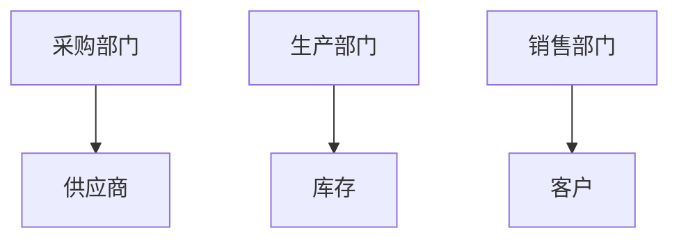
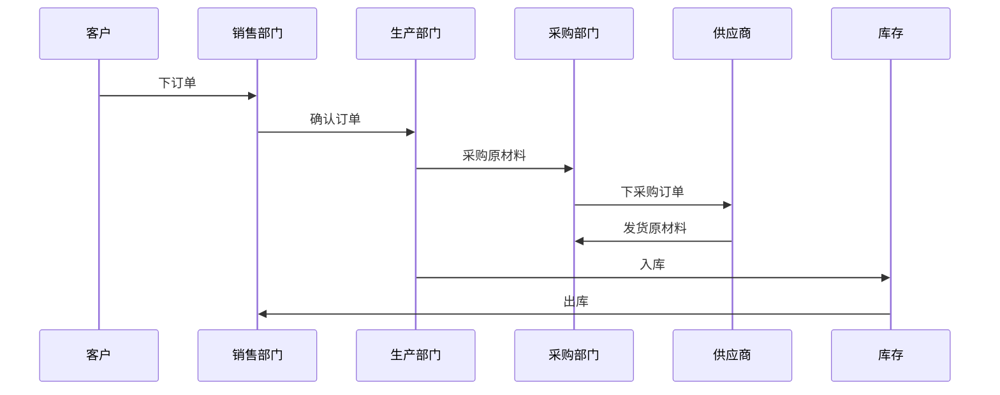
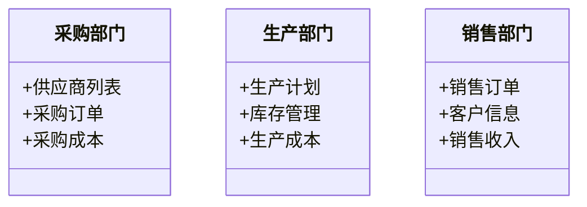

                 


# 如何识别企业的垂直整合优势

---

## 关键词：垂直整合、企业优势、供应链管理、数据分析、系统设计

---

## 摘要

企业在竞争激烈的市场环境中，通过垂直整合优化供应链管理，提升效率和降低成本，是增强竞争力的重要手段。本文从垂直整合的基本概念入手，分析其类型和战略意义，结合数据驱动的方法，系统地阐述如何识别和评估企业的垂直整合优势。通过实际案例分析和系统架构设计，为读者提供清晰的识别框架和实践指南。

---

# 第一部分: 企业垂直整合的基本概念与战略意义

## 第1章: 什么是垂直整合

### 1.1 垂直整合的定义与背景

#### 1.1.1 什么是垂直整合
垂直整合是指企业整合其供应链上下游的业务，从原材料采购到生产、分销、零售等环节，通过内部化或收购等方式，实现对关键业务的控制。这种整合方式能够提升企业对供应链的掌控能力，优化资源配置，降低外部依赖风险。

#### 1.1.2 垂直整合的背景与演变
随着全球化和市场竞争的加剧，企业为了提高效率和降低成本，开始将垂直整合作为一项重要的战略选择。特别是在信息技术和互联网的推动下，数据驱动的整合方式逐渐成为主流，企业能够更精准地分析供应链各环节的效率和成本。

#### 1.1.3 垂直整合的核心价值
- **提升效率**：通过内部化关键环节，减少外部依赖，提高整体运营效率。
- **降低成本**：消除中间环节的利润损耗，优化采购和生产成本。
- **增强灵活性**：快速响应市场需求，调整生产节奏，降低外部供应链波动的影响。

---

### 1.2 垂直整合的类型与特点

#### 1.2.1 前向整合与后向整合的定义
- **前向整合**：企业向下游延伸，例如制造企业直接控制分销渠道或零售终端。
- **后向整合**：企业向上游延伸，例如制造企业直接控制原材料供应。

#### 1.2.2 垂直整合的主要类型对比
| 类型       | 特点                                                                 |
|------------|----------------------------------------------------------------------|
| 前向整合   | 控制分销渠道，增强市场覆盖能力                                         |
| 后向整合   | 控制原材料供应，降低采购成本                                           |
| 混合整合   | 同时控制上游和下游环节，形成闭环供应链                                 |

#### 1.2.3 垂直整合的特点与优势
- **一体化**：整合上下游资源，形成一体化的供应链体系。
- **可控性**：企业对关键环节的控制能力更强，降低外部风险。
- **协同效应**：各环节协同优化，提升整体效率和竞争力。

---

## 第2章: 垂直整合的战略意义

### 2.1 垂直整合对企业竞争力的影响

#### 2.1.1 提升供应链效率
通过垂直整合，企业能够优化供应链的每个环节，减少库存和物流成本，提高交付速度。

#### 2.1.2 增强企业控制力
垂直整合使企业能够更好地控制关键资源和流程，降低对外部供应商的依赖。

#### 2.1.3 提高市场反应速度
企业能够快速调整生产和分销策略，更好地满足市场需求，提升市场竞争力。

---

### 2.2 垂直整合与企业核心竞争力

#### 2.2.1 核心竞争力的定义
核心竞争力是指企业在市场中长期竞争优势的来源，通常体现在技术、成本、质量、服务等方面。

#### 2.2.2 垂直整合对核心竞争力的促进作用
- **降低成本**：通过整合供应链，减少中间环节，降低采购和生产成本。
- **提升质量**：企业能够更好地控制原材料和生产过程，确保产品质量。
- **增强创新**：整合上游研发环节，加快产品创新步伐。

#### 2.2.3 垂直整合的风险与挑战
- **高投入**：整合上下游需要大量的资金和资源投入。
- **管理复杂性**：整合后的供应链管理更加复杂，需要更高的管理能力。

---

### 2.3 垂直整合的行业应用案例

#### 2.3.1 制造业中的垂直整合
例如，汽车制造企业整合上游的零部件供应商和下游的销售网络，形成完整的产业链。

#### 2.3.2 零售业中的垂直整合
例如，大型零售企业整合自有物流和配送体系，降低配送成本，提高服务效率。

#### 2.3.3 信息技术行业的垂直整合
例如，科技公司整合芯片设计、制造和销售环节，形成垂直一体化的产业链。

---

# 第二部分: 识别企业垂直整合优势的方法与工具

## 第3章: 识别垂直整合优势的核心概念

### 3.1 识别垂直整合优势的框架

#### 3.1.1 识别框架的构成要素
- **供应链效率**：评估供应链各环节的效率和成本。
- **成本控制**：分析垂直整合对成本的优化效果。
- **市场响应速度**：评估企业对市场需求的反应能力。

#### 3.1.2 识别框架的逻辑流程
1. **数据采集**：收集供应链各环节的数据。
2. **数据分析**：通过数据分析工具，识别垂直整合的优势。
3. **评估与优化**：根据分析结果，优化垂直整合策略。

#### 3.1.3 识别框架的适用范围
适用于制造、零售、信息技术等多个行业，帮助企业识别垂直整合的优势和潜力。

---

### 3.2 垂直整合优势的关键指标

#### 3.2.1 供应链效率指标
- **库存周转率**：衡量库存管理效率。
- **物流成本占比**：分析物流成本占总成本的比例。

#### 3.2.2 成本控制指标
- **单位产品成本**：分析垂直整合对单位产品成本的影响。
- **采购成本占比**：评估采购成本的优化效果。

#### 3.2.3 市场响应速度指标
- **交货周期**：衡量企业对市场需求的响应速度。
- **客户满意度**：评估客户对产品和服务的满意度。

---

## 第4章: 数据驱动的垂直整合优势识别

### 4.1 数据采集与处理

#### 4.1.1 数据来源分析
- **内部数据**：企业内部的生产、销售、采购等数据。
- **外部数据**：行业数据、市场数据等。

#### 4.1.2 数据清洗与预处理
- **数据清洗**：去除重复数据、错误数据和缺失数据。
- **数据标准化**：统一数据格式和单位。

#### 4.1.3 数据存储与管理
- **数据库设计**：设计合理的数据库结构，便于存储和查询。
- **数据仓库**：建立数据仓库，集中存储和管理供应链数据。

---

### 4.2 数据分析方法

#### 4.2.1 垂直整合优势识别的算法选择
- **聚类分析**：将供应链各环节的数据进行聚类，识别效率低下的环节。
- **回归分析**：分析垂直整合对成本和效率的具体影响。

#### 4.2.2 数据可视化与趋势分析
- **趋势分析**：通过时间序列分析，识别供应链效率的变化趋势。
- **可视化工具**：使用图表展示数据，直观分析垂直整合的效果。

#### 4.2.3 数据挖掘与预测模型
- **预测模型**：基于历史数据，预测垂直整合后的效率和成本变化。
- **机器学习**：利用机器学习算法，优化供应链预测模型。

---

### 4.3 数据分析工具与技术

#### 4.3.1 常用数据分析工具
- **Python**：使用Pandas、NumPy等库进行数据分析。
- **Tableau**：用于数据可视化和展示。
- **SQL**：用于数据库查询和管理。

#### 4.3.2 数据分析技术的选择与应用
- **数据清洗**：使用Pandas进行数据清洗和预处理。
- **数据建模**：使用Scikit-learn进行机器学习建模。
- **数据可视化**：使用Matplotlib或Seaborn进行数据可视化。

#### 4.3.3 数据分析结果的解读与应用
- **结果解读**：分析数据结果，识别垂直整合的优势和潜力。
- **应用建议**：根据分析结果，提出优化垂直整合的具体措施。

---

# 第三部分: 垂直整合优势的系统分析与架构设计

## 第5章: 垂直整合优势识别的系统分析

### 5.1 系统分析方法

#### 5.1.1 系统分析的基本概念
系统分析是指通过系统的方法，对企业进行全方位的分析，识别其优势和劣势。

#### 5.1.2 系统分析的步骤与流程
1. **问题定义**：明确分析的目标和范围。
2. **数据收集**：收集与系统相关的数据。
3. **模型构建**：建立系统的数学模型。
4. **模型求解**：通过计算，得出系统的最优解。
5. **结果分析**：分析模型结果，提出改进建议。

#### 5.1.3 系统分析的工具与技术
- **系统动力学**：用于分析系统的动态变化。
- **决策树分析**：用于决策问题的分析和解决。

---

### 5.2 系统分析模型

#### 5.2.1 垂直整合优势识别的系统模型
通过系统动力学模型，分析供应链各环节的相互作用，识别垂直整合的优势。

#### 5.2.2 系统模型的构建与应用
1. **模型构建**：建立供应链各环节的数学模型，分析其相互关系。
2. **模型应用**：通过模拟，预测垂直整合后的效果。

#### 5.2.3 系统模型的优化与改进
根据模拟结果，优化系统模型，提出改进措施，提升垂直整合的效率和效果。

---

### 5.3 数据流与系统架构设计

#### 5.3.1 数据流分析
通过Mermaid图展示数据流，分析供应链各环节的数据流动情况。



#### 5.3.2 系统架构设计
通过Mermaid图展示系统的架构设计，包括数据源、数据处理、数据分析和结果展示。


#### 5.3.3 系统交互设计
通过Mermaid图展示系统交互流程，分析供应链各环节的协作关系。



---

## 第6章: 垂直整合优势识别的系统架构设计

### 6.1 系统功能设计

#### 6.1.1 系统功能模块
- **数据采集模块**：采集供应链各环节的数据。
- **数据分析模块**：对数据进行清洗、建模和分析。
- **结果展示模块**：展示分析结果，提供优化建议。

#### 6.1.2 领域模型设计
通过Mermaid图展示系统的领域模型，包括采购、生产、销售等模块。



---

### 6.2 系统架构设计

#### 6.2.1 系统架构设计
通过Mermaid图展示系统的架构设计，包括数据源、数据处理、数据分析和结果展示。


#### 6.2.2 系统接口设计
设计系统接口，明确各模块之间的交互接口和数据格式。

#### 6.2.3 系统交互设计
通过Mermaid图展示系统交互流程，分析供应链各环节的协作关系。


---

## 第7章: 垂直整合优势识别的系统实现

### 7.1 环境安装与配置

#### 7.1.1 系统环境要求
- 操作系统：Windows、Linux、MacOS
- 开发工具：Python、Jupyter Notebook、IDE
- 数据库：MySQL、PostgreSQL
- 可视化工具：Tableau、Power BI

#### 7.1.2 系统依赖安装
安装必要的Python库，如Pandas、NumPy、Scikit-learn、Matplotlib等。

---

### 7.2 核心代码实现

#### 7.2.1 数据清洗与预处理
```python
import pandas as pd

# 读取数据
data = pd.read_csv('supply_chain.csv')

# 数据清洗
data.dropna(inplace=True)
data = data.drop_duplicates()

# 数据预处理
data['date'] = pd.to_datetime(data['date'])
data.set_index('date', inplace=True)
```

#### 7.2.2 数据分析与建模
```python
from sklearn.cluster import KMeans

# 数据聚类
X = data[['cost', 'time']]
kmeans = KMeans(n_clusters=3, random_state=0)
kmeans.fit(X)

# 可视化结果
import matplotlib.pyplot as plt

plt.scatter(X.values[:,0], X.values[:,1], c=kmeans.labels_)
plt.xlabel('Cost')
plt.ylabel('Time')
plt.show()
```

#### 7.2.3 数据可视化与展示
```python
import seaborn as sns

# 绘制箱线图
sns.boxplot(x='time', y='cost', data=data)
plt.show()
```

---

## 第8章: 项目实战与案例分析

### 8.1 项目背景与目标

#### 8.1.1 项目背景
某制造企业希望优化其供应链管理，通过垂直整合降低成本和提高效率。

#### 8.1.2 项目目标
- 识别垂直整合的优势。
- 优化供应链管理流程。

---

### 8.2 项目实施步骤

#### 8.2.1 数据采集
从企业的ERP系统中提取供应链相关数据，包括采购、生产、销售等环节。

#### 8.2.2 数据分析
使用Python和机器学习算法，分析供应链各环节的效率和成本，识别垂直整合的优势。

#### 8.2.3 系统优化
根据分析结果，优化供应链管理流程，提出垂直整合的具体措施。

---

## 第9章: 总结与展望

### 9.1 总结

通过本文的分析，我们可以看到，垂直整合是企业优化供应链管理、提升竞争力的重要手段。通过数据驱动的方法和系统分析，企业可以更好地识别垂直整合的优势，优化供应链管理流程。

---

### 9.2 展望

未来，随着人工智能和大数据技术的不断发展，垂直整合的优势识别将更加精准和高效。企业可以通过智能化的分析工具，进一步优化供应链管理，实现更高效的垂直整合。

---

## 最佳实践 Tips

- 在进行垂直整合之前，企业需要全面评估自身的资源和能力，确保具备整合的条件。
- 数据分析是识别垂直整合优势的核心工具，企业需要投入足够的资源和精力进行数据分析和建模。
- 系统设计和架构是实现垂直整合的关键，企业需要建立完善的系统架构和交互流程。

---

## 作者

**作者：AI天才研究院/AI Genius Institute & 禅与计算机程序设计艺术 /Zen And The Art of Computer Programming**

---

通过以上结构和内容，您可以根据实际需求进一步扩展和完善每个章节的具体内容。如果有需要进一步调整或补充的地方，可以随时告诉我，我会继续为您提供帮助。

